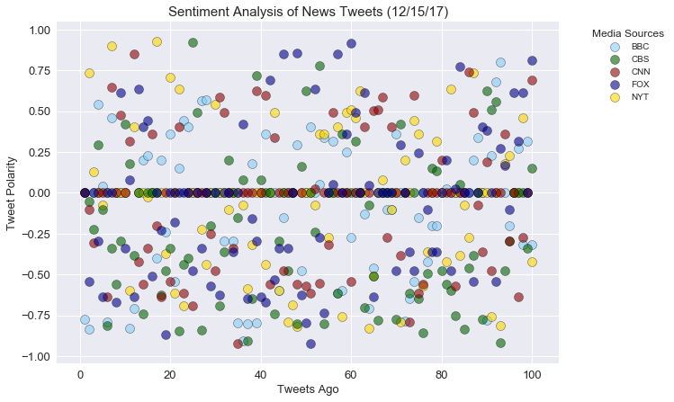

```python
**Analysis**
#1 Based on the compound analysis of each news organization, their tweets seem to be fairly distributed between positive 
#and negative polarity.  On the surface, it does seem that there are more negative than positive tweets.

#2 Approximately a third of all the posts have a neutral score at 0.00. This is partially why in the next chart the average compound #score per news outlet is not too far from 0.

#3In the Overall compound sentiment for Friday evening (Dec 15), all of the news outlets tend towards negative polarity.  CBS is the #most negative (-.18) then BBC (-.07), followed by CNN and Fox (-.46) and then the New York Times (-.025).

```


```python
# Dependencies
import tweepy
import json
import numpy as np
import pandas as pd

# Import and Initialize Sentiment Analyzer
from vaderSentiment.vaderSentiment import SentimentIntensityAnalyzer
analyzer = SentimentIntensityAnalyzer()

# Twitter API Keys

# Setup Tweepy API Authentication
auth = tweepy.OAuthHandler(consumer_key, consumer_secret)
auth.set_access_token(access_token, access_token_secret)
api = tweepy.API(auth, parser=tweepy.parsers.JSONParser())

```


```python

# Target User Accounts
target_user = ("@BBCNews", "@nytimes", "@CBSNews", "@CNN", "@FoxNews") 

#Counter to display number of tweets
counter = 1

#Array to hold Sentiment
sentiment = []

# Variable for holding the oldest tweet
oldest_tweet = ""

# Loop through each user
for user in target_user:

    # Variables for holding sentiments
    compound_list = []
    positive_list = []
    negative_list = []
    neutral_list = []

    # Loop through 10 pages of tweets (total 200 tweets)
    for x in range(1):
        
        counter = 1
        # Get all tweets from home feed
        public_tweets = api.user_timeline(user, count=100, result_type="recent")
        public_tweets
        
        
        # Loop through all tweets
        for tweet in public_tweets:
            
            # Run Vader Analysis on each tweet
            compound = analyzer.polarity_scores(tweet["text"])["compound"]
            pos = analyzer.polarity_scores(tweet["text"])["pos"]
            neu = analyzer.polarity_scores(tweet["text"])["neu"]
            neg = analyzer.polarity_scores(tweet["text"])["neg"]
            tweets_ago = counter
            
            # Add each value to the appropriate array
            compound_list.append(compound)
            positive_list.append(pos)
            negative_list.append(neg)
            neutral_list.append(neu)
            
              # Add sentiments for each tweet into an array
            sentiment.append({"User": user,
                            "Source": tweet["source"],
                            "Text": tweet["text"],
                            "Date": tweet["created_at"], 
                            "Compound": compound,
                            "Positive": pos,
                            "Negative": neu,
                            "Neutral": neg,
                            "Tweets Ago": counter})
     
            counter = counter +1
            


    # Print the Sentiments
    print(sentiment)
    print("")    

```

    [{'User': '@BBCNews', 'Source': '<a href="http://www.socialflow.com" rel="nofollow">SocialFlow</a>', 'Text': 'Ex-teacher Peter Webb jailed for Horsham pupil sex assaults https://t.co/hLvA22IWuC', 'Date': 'Fri Dec 15 19:42:18 +0000 2017', 'Compound': -0.7717, 'Positive': 0.0, 'Negative': 0.544, 'Neutral': 0.456, 'Tweets Ago': 1}, {'User': '@BBCNews', 'Source': '<a href="http://www.socialflow.com" rel="nofollow">SocialFlow</a>', 'Text': "Student Liam Allan 'betrayed' after rape trial collapse https://t.co/erHaOhiUBK", 'Date': 'Fri Dec 15 19:02:38 +0000 2017', 'Compound': -0.836, 'Positive': 0.0, 'Negative': 0.47, 'Neutral': 0.53, 'Tweets Ago': 2}, {'User': '@BBCNews', 'Source': '<a href="http://www.socialflow.com" rel="nofollow">SocialFlow</a>', 'Text': '4-year-old boy left on bus attempts three-mile journey home\nhttps://t.co/q6tCG3pHwa', 'Date': 'Fri Dec 15 18:53:58 +0000 2017', 'Compound': 0.0, 'Positive': 0.0, 'Negative': 1.0, 'Neutral': 0.0, 'Tweets Ago': 3}, {'User': '@BBCNews', 'Source': '<a href="https://about.twitter.com/products/tweetdeck" rel="nofollow">TweetDeck</a>', 'Text': 'RT @BBCScotlandNews: We spent a night with the Glasgow street pastors, as some people were merry on their Christmas night out. https://t.co…', 'Date': 'Fri Dec 15 18:48:32 +0000 2017', 'Compound': 0.5423, 'Positive': 0.149, 'Negative': 0.851, 'Neutral': 0.0, 'Tweets Ago': 4}, {'User': '@BBCNews', 'Source': '<a href="http://www.socialflow.com" rel="nofollow">SocialFlow</a>', 'Text': "Walkden fire deaths family 'won't be broken' https://t.co/X37RljMsAR", 'Date': 'Fri Dec 15 18:28:48 +0000 2017', 'Compound': 0.0397, 'Positive': 0.233, 'Negative': 0.548, 'Neutral': 0.219, 'Tweets Ago': 5}, {'User': '@BBCNews', 'Source': '<a href="https://about.twitter.com/products/tweetdeck" rel="nofollow">TweetDeck</a>', 'Text': "RT @BBCNewsbeat: The Simpsons predicted President Trump, Greece's economic crisis, the FIFA corruption scandal and Disney's takeover of Fox…", 'Date': 'Fri Dec 15 17:57:09 +0000 2017', 'Compound': -0.7906, 'Positive': 0.0, 'Negative': 0.708, 'Neutral': 0.292, 'Tweets Ago': 6}, {'User': '@BBCNews', 'Source': '<a href="https://about.twitter.com/products/tweetdeck" rel="nofollow">TweetDeck</a>', 'Text': "RT @BBC_HaveYourSay: You know it's Christmas Jumper Day, right? Get festive, why not.\nhttps://t.co/yU8s8OxVGB", 'Date': 'Fri Dec 15 17:41:45 +0000 2017', 'Compound': 0.4588, 'Positive': 0.188, 'Negative': 0.812, 'Neutral': 0.0, 'Tweets Ago': 7}, {'User': '@BBCNews', 'Source': '<a href="http://www.socialflow.com" rel="nofollow">SocialFlow</a>', 'Text': 'Ceredigion Herald newspaper ends print run after two years https://t.co/YgGQoluSo4', 'Date': 'Fri Dec 15 17:33:06 +0000 2017', 'Compound': 0.0, 'Positive': 0.0, 'Negative': 1.0, 'Neutral': 0.0, 'Tweets Ago': 8}, {'User': '@BBCNews', 'Source': '<a href="https://about.twitter.com/products/tweetdeck" rel="nofollow">TweetDeck</a>', 'Text': '🤗 https://t.co/0sGCtOMqs6', 'Date': 'Fri Dec 15 17:16:21 +0000 2017', 'Compound': 0.0, 'Positive': 0.0, 'Negative': 1.0, 'Neutral': 0.0, 'Tweets Ago': 9}, {'User': '@BBCNews', 'Source': '<a href="http://www.socialflow.com" rel="nofollow">SocialFlow</a>', 'Text': 'Britvic confirms Norwich factory closure https://t.co/UXZAWzlyx1', 'Date': 'Fri Dec 15 17:11:05 +0000 2017', 'Compound': 0.0, 'Positive': 0.0, 'Negative': 1.0, 'Neutral': 0.0, 'Tweets Ago': 10}, {'User': '@BBCNews', 'Source': '<a href="https://about.twitter.com/products/tweetdeck" rel="nofollow">TweetDeck</a>', 'Text': 'RT @bbclaurak: Back in SW1, amendment put down this afternoon that might kill off govt defeat on Brexit date next week - v likely govt will…', 'Date': 'Fri Dec 15 16:47:40 +0000 2017', 'Compound': -0.8271, 'Positive': 0.0, 'Negative': 0.741, 'Neutral': 0.259, 'Tweets Ago': 11}, {'User': '@BBCNews', 'Source': '<a href="https://about.twitter.com/products/tweetdeck" rel="nofollow">TweetDeck</a>', 'Text': "RT @BBCArchive: Shoddy Santas, grotty grottos and terrifying toys - here's a quick look through the BBC archive on what to avoid this Chris…", 'Date': 'Fri Dec 15 15:49:45 +0000 2017', 'Compound': -0.7096, 'Positive': 0.0, 'Negative': 0.772, 'Neutral': 0.228, 'Tweets Ago': 12}, {'User': '@BBCNews', 'Source': '<a href="http://www.socialflow.com" rel="nofollow">SocialFlow</a>', 'Text': "#RoyalWedding: Why Prince Harry and Meghan Markle's choice of wedding date marks a break with tradition… https://t.co/IMgplXsQIB", 'Date': 'Fri Dec 15 15:37:02 +0000 2017', 'Compound': 0.0, 'Positive': 0.0, 'Negative': 1.0, 'Neutral': 0.0, 'Tweets Ago': 13}, {'User': '@BBCNews', 'Source': '<a href="https://about.twitter.com/products/tweetdeck" rel="nofollow">TweetDeck</a>', 'Text': 'RT @BBCPolitics: Treasury wants to regulate virtual currency Bitcoin https://t.co/GTkygxREiS', 'Date': 'Fri Dec 15 15:28:56 +0000 2017', 'Compound': 0.2023, 'Positive': 0.167, 'Negative': 0.833, 'Neutral': 0.0, 'Tweets Ago': 14}, {'User': '@BBCNews', 'Source': '<a href="http://snappytv.com" rel="nofollow">SnappyTV.com</a>', 'Text': 'Talks about "future relationship" between UK and EU will begin "straight away", says Prime Minister Theresa May… https://t.co/kzKmmi3SRX', 'Date': 'Fri Dec 15 15:25:38 +0000 2017', 'Compound': 0.2263, 'Positive': 0.101, 'Negative': 0.899, 'Neutral': 0.0, 'Tweets Ago': 15}, {'User': '@BBCNews', 'Source': '<a href="https://about.twitter.com/products/tweetdeck" rel="nofollow">TweetDeck</a>', 'Text': 'RT @richard_conway: FA statement on Royal wedding / Cup final date clash. https://t.co/jSiDXUSEoO', 'Date': 'Fri Dec 15 15:01:27 +0000 2017', 'Compound': 0.0, 'Positive': 0.0, 'Negative': 1.0, 'Neutral': 0.0, 'Tweets Ago': 16}, {'User': '@BBCNews', 'Source': '<a href="http://www.socialflow.com" rel="nofollow">SocialFlow</a>', 'Text': 'Driver dies after school bus crash in Aberdeenshire https://t.co/gpmzNw2eTC', 'Date': 'Fri Dec 15 14:26:25 +0000 2017', 'Compound': -0.4019, 'Positive': 0.0, 'Negative': 0.748, 'Neutral': 0.252, 'Tweets Ago': 17}, {'User': '@BBCNews', 'Source': '<a href="https://about.twitter.com/products/tweetdeck" rel="nofollow">TweetDeck</a>', 'Text': 'Theresa May: moving to second phase of #Brexit talks is "important step" towards "smooth and orderly" exit from EU https://t.co/znsXkEr7FS', 'Date': 'Fri Dec 15 14:26:14 +0000 2017', 'Compound': 0.2023, 'Positive': 0.087, 'Negative': 0.913, 'Neutral': 0.0, 'Tweets Ago': 18}, {'User': '@BBCNews', 'Source': '<a href="https://about.twitter.com/products/tweetdeck" rel="nofollow">TweetDeck</a>', 'Text': "RT @BBC_HaveYourSay: Don't let me entertain you \nhttps://t.co/UZM6hsVn4r", 'Date': 'Fri Dec 15 14:20:27 +0000 2017', 'Compound': -0.2411, 'Positive': 0.0, 'Negative': 0.781, 'Neutral': 0.219, 'Tweets Ago': 19}, {'User': '@BBCNews', 'Source': '<a href="http://www.socialflow.com" rel="nofollow">SocialFlow</a>', 'Text': 'Corrie Mckeague: Reward to find missing airman doubles https://t.co/UCD60JaxN1', 'Date': 'Fri Dec 15 14:19:50 +0000 2017', 'Compound': 0.3612, 'Positive': 0.287, 'Negative': 0.543, 'Neutral': 0.171, 'Tweets Ago': 20}, {'User': '@BBCNews', 'Source': '<a href="http://www.socialflow.com" rel="nofollow">SocialFlow</a>', 'Text': "Schools told not to dismiss sexual harassment 'as banter' https://t.co/a6ybL1wULZ", 'Date': 'Fri Dec 15 13:53:27 +0000 2017', 'Compound': -0.5423, 'Positive': 0.0, 'Negative': 0.72, 'Neutral': 0.28, 'Tweets Ago': 21}, {'User': '@BBCNews', 'Source': '<a href="http://www.socialflow.com" rel="nofollow">SocialFlow</a>', 'Text': 'Hillsborough officer not charged over horse burn claims https://t.co/FLxBl7K7gB', 'Date': 'Fri Dec 15 13:53:26 +0000 2017', 'Compound': 0.1511, 'Positive': 0.166, 'Negative': 0.834, 'Neutral': 0.0, 'Tweets Ago': 22}, {'User': '@BBCNews', 'Source': '<a href="https://about.twitter.com/products/tweetdeck" rel="nofollow">TweetDeck</a>', 'Text': 'RT @BBCBusiness: How easy is it to spot a narwhal in a sea of money? 🇨🇦 Find out with our A-Z guide to the creatures you spot in the financ…', 'Date': 'Fri Dec 15 13:51:25 +0000 2017', 'Compound': 0.4404, 'Positive': 0.097, 'Negative': 0.903, 'Neutral': 0.0, 'Tweets Ago': 23}, {'User': '@BBCNews', 'Source': '<a href="https://about.twitter.com/products/tweetdeck" rel="nofollow">TweetDeck</a>', 'Text': 'RT @ChrisMasonBBC: Jean Claude Juncker, the President of the European Commission, describes the Prime Minister as a "tough, smart, polite a…', 'Date': 'Fri Dec 15 13:40:50 +0000 2017', 'Compound': 0.4019, 'Positive': 0.124, 'Negative': 0.876, 'Neutral': 0.0, 'Tweets Ago': 24}, {'User': '@BBCNews', 'Source': '<a href="https://about.twitter.com/products/tweetdeck" rel="nofollow">TweetDeck</a>', 'Text': 'RT @BBC_HaveYourSay: Are you getting married on 19 May 2018? What wedding tips would you give Prince Harry and Meghan Markle? \nhttps://t.co…', 'Date': 'Fri Dec 15 13:39:41 +0000 2017', 'Compound': 0.0, 'Positive': 0.0, 'Negative': 1.0, 'Neutral': 0.0, 'Tweets Ago': 25}, {'User': '@BBCNews', 'Source': '<a href="http://www.socialflow.com" rel="nofollow">SocialFlow</a>', 'Text': 'Harry and Meghan to marry on 19 May 2018 https://t.co/5qL2QuOfmA', 'Date': 'Fri Dec 15 13:09:15 +0000 2017', 'Compound': 0.0, 'Positive': 0.0, 'Negative': 1.0, 'Neutral': 0.0, 'Tweets Ago': 26}, {'User': '@BBCNews', 'Source': '<a href="https://about.twitter.com/products/tweetdeck" rel="nofollow">TweetDeck</a>', 'Text': 'RT @BBCWorld: "Quite significant progress made" but next phase of EU-UK talks "even tougher" - German Chancellor Angela Merkel on #Brexit h…', 'Date': 'Fri Dec 15 12:59:40 +0000 2017', 'Compound': 0.5626, 'Positive': 0.238, 'Negative': 0.762, 'Neutral': 0.0, 'Tweets Ago': 27}, {'User': '@BBCNews', 'Source': '<a href="https://about.twitter.com/products/tweetdeck" rel="nofollow">TweetDeck</a>', 'Text': 'RT @BBCSport: Pint-sized #Ashes: Australia strike back on day two at the WACA 🏏\n\nHere are the best moments from the @bbctms coverage 👉 http…', 'Date': 'Fri Dec 15 12:36:07 +0000 2017', 'Compound': 0.5719, 'Positive': 0.157, 'Negative': 0.787, 'Neutral': 0.056, 'Tweets Ago': 28}, {'User': '@BBCNews', 'Source': '<a href="https://about.twitter.com/products/tweetdeck" rel="nofollow">TweetDeck</a>', 'Text': 'RT @BBCSport: How do I vote? 🤔\nWhen is the ceremony? 🤔\nWho are the #SPOTY nominees? 🤔\n\nEverything you need to know about BBC Sports Persona…', 'Date': 'Fri Dec 15 12:02:39 +0000 2017', 'Compound': 0.0, 'Positive': 0.0, 'Negative': 1.0, 'Neutral': 0.0, 'Tweets Ago': 29}, {'User': '@BBCNews', 'Source': '<a href="http://www.socialflow.com" rel="nofollow">SocialFlow</a>', 'Text': 'Boy, four, who slept on school bus tried to walk home https://t.co/0PnPbkT2kL', 'Date': 'Fri Dec 15 11:59:26 +0000 2017', 'Compound': 0.0, 'Positive': 0.0, 'Negative': 1.0, 'Neutral': 0.0, 'Tweets Ago': 30}, {'User': '@BBCNews', 'Source': '<a href="https://about.twitter.com/products/tweetdeck" rel="nofollow">TweetDeck</a>', 'Text': 'RT @bbclaurak: Phew  https://t.co/hgYq1GUEaX', 'Date': 'Fri Dec 15 11:58:41 +0000 2017', 'Compound': 0.0, 'Positive': 0.0, 'Negative': 1.0, 'Neutral': 0.0, 'Tweets Ago': 31}, {'User': '@BBCNews', 'Source': '<a href="http://www.socialflow.com" rel="nofollow">SocialFlow</a>', 'Text': "Backlash over 'stay with abuser' posts shared by Essex Police https://t.co/ZoSaP8ZnMz", 'Date': 'Fri Dec 15 11:41:23 +0000 2017', 'Compound': -0.296, 'Positive': 0.16, 'Negative': 0.6, 'Neutral': 0.24, 'Tweets Ago': 32}, {'User': '@BBCNews', 'Source': '<a href="http://www.socialflow.com" rel="nofollow">SocialFlow</a>', 'Text': "Brexit talks 'can move to next stage' https://t.co/pndpSr7vt9", 'Date': 'Fri Dec 15 11:38:01 +0000 2017', 'Compound': 0.0, 'Positive': 0.0, 'Negative': 1.0, 'Neutral': 0.0, 'Tweets Ago': 33}, {'User': '@BBCNews', 'Source': '<a href="https://about.twitter.com/products/tweetdeck" rel="nofollow">TweetDeck</a>', 'Text': 'RT @bbcweather: New #ice warnings issued by the Met Office. Details of where and when here: https://t.co/DucwfOVcwR Jo https://t.co/MZWdgHM…', 'Date': 'Fri Dec 15 11:20:57 +0000 2017', 'Compound': -0.296, 'Positive': 0.0, 'Negative': 0.891, 'Neutral': 0.109, 'Tweets Ago': 34}, {'User': '@BBCNews', 'Source': '<a href="https://about.twitter.com/products/tweetdeck" rel="nofollow">TweetDeck</a>', 'Text': 'RT @bbclaurak: No 10 says no plans to remove date from the Brexit bill next week to avert possible defeat (yet)', 'Date': 'Fri Dec 15 11:18:33 +0000 2017', 'Compound': -0.7964, 'Positive': 0.0, 'Negative': 0.651, 'Neutral': 0.349, 'Tweets Ago': 35}, {'User': '@BBCNews', 'Source': '<a href="http://www.socialflow.com" rel="nofollow">SocialFlow</a>', 'Text': 'Salford fatal fire: Three in court charged with murder https://t.co/ooac6KPhnR', 'Date': 'Fri Dec 15 11:17:10 +0000 2017', 'Compound': -0.9081, 'Positive': 0.0, 'Negative': 0.326, 'Neutral': 0.674, 'Tweets Ago': 36}, {'User': '@BBCNews', 'Source': '<a href="https://about.twitter.com/products/tweetdeck" rel="nofollow">TweetDeck</a>', 'Text': 'RT @BBC_HaveYourSay: Loneliness is as bad for you as smoking 15 cigarettes a day, says a cross-party commission, and isn’t limited to Chris…', 'Date': 'Fri Dec 15 11:16:52 +0000 2017', 'Compound': -0.802, 'Positive': 0.0, 'Negative': 0.687, 'Neutral': 0.313, 'Tweets Ago': 37}, {'User': '@BBCNews', 'Source': '<a href="https://about.twitter.com/products/tweetdeck" rel="nofollow">TweetDeck</a>', 'Text': 'RT @BBCSport: "Sorry everyone for my emotional comments and insults."\n\nSir Bradley Wiggins\' wife has deleted her post and apologised for co…', 'Date': 'Fri Dec 15 10:52:57 +0000 2017', 'Compound': 0.1779, 'Positive': 0.129, 'Negative': 0.815, 'Neutral': 0.056, 'Tweets Ago': 38}, {'User': '@BBCNews', 'Source': '<a href="http://www.socialflow.com" rel="nofollow">SocialFlow</a>', 'Text': 'Met Police to conduct urgent review after rape trial collapse https://t.co/mlsFNiPD0Y', 'Date': 'Fri Dec 15 10:39:22 +0000 2017', 'Compound': -0.7964, 'Positive': 0.102, 'Negative': 0.452, 'Neutral': 0.446, 'Tweets Ago': 39}, {'User': '@BBCNews', 'Source': '<a href="http://www.socialflow.com" rel="nofollow">SocialFlow</a>', 'Text': 'Tulse Hill hit-and-run: Police release CCTV images https://t.co/nh5BV9wdbz', 'Date': 'Fri Dec 15 10:28:50 +0000 2017', 'Compound': 0.0, 'Positive': 0.0, 'Negative': 1.0, 'Neutral': 0.0, 'Tweets Ago': 40}, {'User': '@BBCNews', 'Source': '<a href="http://www.socialflow.com" rel="nofollow">SocialFlow</a>', 'Text': 'Ever seen a lift that works like this? 🔃\n\nhttps://t.co/aRh41AXYF1 https://t.co/4cdLdEqHcv', 'Date': 'Fri Dec 15 09:44:50 +0000 2017', 'Compound': 0.3612, 'Positive': 0.238, 'Negative': 0.762, 'Neutral': 0.0, 'Tweets Ago': 41}, {'User': '@BBCNews', 'Source': '<a href="http://www.socialflow.com" rel="nofollow">SocialFlow</a>', 'Text': 'BBC appoints Fran Unsworth as new head of news https://t.co/pvBVEEJYWK', 'Date': 'Fri Dec 15 09:15:33 +0000 2017', 'Compound': 0.0, 'Positive': 0.0, 'Negative': 1.0, 'Neutral': 0.0, 'Tweets Ago': 42}, {'User': '@BBCNews', 'Source': '<a href="http://www.socialflow.com" rel="nofollow">SocialFlow</a>', 'Text': "Booze calculator: What's your drinking nationality? https://t.co/amNdhk2LmX https://t.co/J3GpKFKaBp", 'Date': 'Fri Dec 15 08:42:25 +0000 2017', 'Compound': 0.0, 'Positive': 0.0, 'Negative': 1.0, 'Neutral': 0.0, 'Tweets Ago': 43}, {'User': '@BBCNews', 'Source': '<a href="https://about.twitter.com/products/tweetdeck" rel="nofollow">TweetDeck</a>', 'Text': "RT @BBCEngland: No police were stationed inside V Festival's Chelmsford site this year because of a dispute over money, @VictoriaLIVE under…", 'Date': 'Fri Dec 15 08:35:59 +0000 2017', 'Compound': -0.5994, 'Positive': 0.0, 'Negative': 0.776, 'Neutral': 0.224, 'Tweets Ago': 44}, {'User': '@BBCNews', 'Source': '<a href="https://about.twitter.com/products/tweetdeck" rel="nofollow">TweetDeck</a>', 'Text': 'The office #ChristmasParty: Good idea or bad idea? And is it right that banks are reining in spending on the Decemb… https://t.co/Uzl4ArIgoe', 'Date': 'Fri Dec 15 08:34:12 +0000 2017', 'Compound': -0.1531, 'Positive': 0.11, 'Negative': 0.758, 'Neutral': 0.133, 'Tweets Ago': 45}, {'User': '@BBCNews', 'Source': '<a href="https://about.twitter.com/products/tweetdeck" rel="nofollow">TweetDeck</a>', 'Text': 'RT @BBCBusiness: Ryanair moves towards recognising unions https://t.co/BzVfoAabIt', 'Date': 'Fri Dec 15 08:30:38 +0000 2017', 'Compound': 0.0, 'Positive': 0.0, 'Negative': 1.0, 'Neutral': 0.0, 'Tweets Ago': 46}, {'User': '@BBCNews', 'Source': '<a href="https://about.twitter.com/products/tweetdeck" rel="nofollow">TweetDeck</a>', 'Text': 'RT @bbcweather: Rain has turned to #snow in places on the back (northern) edge of this front moving across southeast England. Shoeburyness…', 'Date': 'Fri Dec 15 08:15:56 +0000 2017', 'Compound': 0.0, 'Positive': 0.0, 'Negative': 1.0, 'Neutral': 0.0, 'Tweets Ago': 47}, {'User': '@BBCNews', 'Source': '<a href="http://www.socialflow.com" rel="nofollow">SocialFlow</a>', 'Text': 'Sky and BT sign deal to share each others channels https://t.co/dDjgS6Owta', 'Date': 'Fri Dec 15 08:08:20 +0000 2017', 'Compound': 0.296, 'Positive': 0.18, 'Negative': 0.82, 'Neutral': 0.0, 'Tweets Ago': 48}, {'User': '@BBCNews', 'Source': '<a href="https://about.twitter.com/products/tweetdeck" rel="nofollow">TweetDeck</a>', 'Text': "RT @bbctms: Anderson is on the attack. Smith's half century is in sight.\n\nAnyone wanting Overton to come back on? \n\nAustralia 124/2\n\nKhawaj…", 'Date': 'Fri Dec 15 08:07:33 +0000 2017', 'Compound': -0.4767, 'Positive': 0.0, 'Negative': 0.876, 'Neutral': 0.124, 'Tweets Ago': 49}, {'User': '@BBCNews', 'Source': '<a href="https://about.twitter.com/products/tweetdeck" rel="nofollow">TweetDeck</a>', 'Text': "RT @BBCNewsbeat: 'Youthquake' is the word of 2017, by Oxford Dictionaries.\n\nBecause young people made the biggest impact this year. 💪\n\nhttp…", 'Date': 'Fri Dec 15 08:01:39 +0000 2017', 'Compound': 0.0, 'Positive': 0.0, 'Negative': 1.0, 'Neutral': 0.0, 'Tweets Ago': 50}, {'User': '@BBCNews', 'Source': '<a href="https://about.twitter.com/products/tweetdeck" rel="nofollow">TweetDeck</a>', 'Text': "RT @BBCPolitics: 'The Brexit wing of the Tory party are very, very on edge' - @ShippersUnbound tells #Brexitcast. 🎧 Listen to podcast: http…", 'Date': 'Fri Dec 15 07:50:34 +0000 2017', 'Compound': 0.4019, 'Positive': 0.119, 'Negative': 0.881, 'Neutral': 0.0, 'Tweets Ago': 51}, {'User': '@BBCNews', 'Source': '<a href="http://www.socialflow.com" rel="nofollow">SocialFlow</a>', 'Text': "Almost half of under 25s 'never use a condom with a new partner' https://t.co/xbxY6spmGb", 'Date': 'Fri Dec 15 07:19:11 +0000 2017', 'Compound': 0.0, 'Positive': 0.0, 'Negative': 1.0, 'Neutral': 0.0, 'Tweets Ago': 52}, {'User': '@BBCNews', 'Source': '<a href="https://about.twitter.com/products/tweetdeck" rel="nofollow">TweetDeck</a>', 'Text': 'Your morning briefing: #Brexit talks, Russian ‘threat’ to UK cables, Church’s apology and what drinking nationality… https://t.co/HXWWqM25nP', 'Date': 'Fri Dec 15 07:13:39 +0000 2017', 'Compound': 0.0516, 'Positive': 0.07, 'Negative': 0.93, 'Neutral': 0.0, 'Tweets Ago': 53}, {'User': '@BBCNews', 'Source': '<a href="http://www.socialflow.com" rel="nofollow">SocialFlow</a>', 'Text': 'Parents giving children alcohol too young, researchers say https://t.co/VkCIG4DVmz', 'Date': 'Fri Dec 15 05:33:28 +0000 2017', 'Compound': 0.34, 'Positive': 0.231, 'Negative': 0.769, 'Neutral': 0.0, 'Tweets Ago': 54}, {'User': '@BBCNews', 'Source': '<a href="http://www.socialflow.com" rel="nofollow">SocialFlow</a>', 'Text': 'Brexit vote: EU leaders set to move talks on to next stage https://t.co/iHegbB8CNE', 'Date': 'Fri Dec 15 04:41:34 +0000 2017', 'Compound': 0.0, 'Positive': 0.0, 'Negative': 1.0, 'Neutral': 0.0, 'Tweets Ago': 55}, {'User': '@BBCNews', 'Source': '<a href="https://about.twitter.com/products/tweetdeck" rel="nofollow">TweetDeck</a>', 'Text': 'RT @bbcdavideades: Introducing your children to alcohol before they turn 14: responsible parenting or driving your kids to alcohol? Latest…', 'Date': 'Fri Dec 15 04:30:38 +0000 2017', 'Compound': 0.3182, 'Positive': 0.108, 'Negative': 0.892, 'Neutral': 0.0, 'Tweets Ago': 56}, {'User': '@BBCNews', 'Source': '<a href="http://www.socialflow.com" rel="nofollow">SocialFlow</a>', 'Text': 'Church apology over Bishop George Bell abuse inquiry https://t.co/LwpV1PFEI1', 'Date': 'Fri Dec 15 02:47:21 +0000 2017', 'Compound': -0.6124, 'Positive': 0.097, 'Negative': 0.565, 'Neutral': 0.339, 'Tweets Ago': 57}, {'User': '@BBCNews', 'Source': '<a href="https://about.twitter.com/products/tweetdeck" rel="nofollow">TweetDeck</a>', 'Text': 'RT @BBCWorld: A landmark royal commission in Australia has uncovered harrowing evidence of child sexual abuse within institutions, includin…', 'Date': 'Fri Dec 15 02:35:35 +0000 2017', 'Compound': -0.5994, 'Positive': 0.06, 'Negative': 0.744, 'Neutral': 0.195, 'Tweets Ago': 58}, {'User': '@BBCNews', 'Source': '<a href="http://www.socialflow.com" rel="nofollow">SocialFlow</a>', 'Text': "V Festival: 'No police stationed' at 2017 event https://t.co/uFsMcyBiXI", 'Date': 'Fri Dec 15 02:18:16 +0000 2017', 'Compound': 0.25, 'Positive': 0.281, 'Negative': 0.526, 'Neutral': 0.193, 'Tweets Ago': 59}, {'User': '@BBCNews', 'Source': '<a href="http://www.socialflow.com" rel="nofollow">SocialFlow</a>', 'Text': 'Schools warned over hackable heating systems https://t.co/uthXD3dRe5', 'Date': 'Fri Dec 15 02:18:16 +0000 2017', 'Compound': -0.2732, 'Positive': 0.0, 'Negative': 0.741, 'Neutral': 0.259, 'Tweets Ago': 60}, {'User': '@BBCNews', 'Source': '<a href="http://www.socialflow.com" rel="nofollow">SocialFlow</a>', 'Text': "Russia a 'risk' to undersea cables, defence chief warns https://t.co/ghm5imQaSd", 'Date': 'Fri Dec 15 02:18:15 +0000 2017', 'Compound': 0.0, 'Positive': 0.143, 'Negative': 0.714, 'Neutral': 0.143, 'Tweets Ago': 61}, {'User': '@BBCNews', 'Source': '<a href="http://www.socialflow.com" rel="nofollow">SocialFlow</a>', 'Text': "'Youthquake' declared word of the year by Oxford Dictionaries https://t.co/xOKlQa7ce4", 'Date': 'Fri Dec 15 02:18:15 +0000 2017', 'Compound': 0.0, 'Positive': 0.0, 'Negative': 1.0, 'Neutral': 0.0, 'Tweets Ago': 62}, {'User': '@BBCNews', 'Source': '<a href="http://www.socialflow.com" rel="nofollow">SocialFlow</a>', 'Text': 'Virgin Trains staff to hold 24-hour strike https://t.co/5EMIwdTKNi', 'Date': 'Fri Dec 15 02:18:14 +0000 2017', 'Compound': -0.128, 'Positive': 0.0, 'Negative': 0.824, 'Neutral': 0.176, 'Tweets Ago': 63}, {'User': '@BBCNews', 'Source': '<a href="http://www.socialflow.com" rel="nofollow">SocialFlow</a>', 'Text': "HS2 redundancy pay 'shocking waste' of taxpayer cash https://t.co/M7Wmt7NOqr", 'Date': 'Fri Dec 15 00:09:15 +0000 2017', 'Compound': -0.7096, 'Positive': 0.0, 'Negative': 0.465, 'Neutral': 0.535, 'Tweets Ago': 64}, {'User': '@BBCNews', 'Source': '<a href="http://www.socialflow.com" rel="nofollow">SocialFlow</a>', 'Text': 'What Question Time made of Brexit vote defeat https://t.co/Zp01xBi4ho', 'Date': 'Thu Dec 14 23:42:10 +0000 2017', 'Compound': -0.4588, 'Positive': 0.0, 'Negative': 0.727, 'Neutral': 0.273, 'Tweets Ago': 65}, {'User': '@BBCNews', 'Source': '<a href="http://www.socialflow.com" rel="nofollow">SocialFlow</a>', 'Text': 'Friday\'s Guardian: "Sale to Disney marks end of era for Murdoch" #tomorrowspaperstoday #bbcpapers (via… https://t.co/yUWGygH0EY', 'Date': 'Thu Dec 14 22:44:53 +0000 2017', 'Compound': 0.0, 'Positive': 0.0, 'Negative': 1.0, 'Neutral': 0.0, 'Tweets Ago': 66}, {'User': '@BBCNews', 'Source': '<a href="http://www.socialflow.com" rel="nofollow">SocialFlow</a>', 'Text': 'Friday\'s Daily Mail: "Another human rights fiasco!" #tomorrowspaperstoday #bbcpapers (via @BBCHelenaLee) https://t.co/RJCXeQAtmK', 'Date': 'Thu Dec 14 22:44:53 +0000 2017', 'Compound': 0.0, 'Positive': 0.0, 'Negative': 1.0, 'Neutral': 0.0, 'Tweets Ago': 67}, {'User': '@BBCNews', 'Source': '<a href="http://www.socialflow.com" rel="nofollow">SocialFlow</a>', 'Text': 'Friday\'s Daily Telegraph: "A million Scots to pay more tax" #tomorrowspaperstoday #bbcpapers (via @BBCHelenaLee) https://t.co/252iZHbDvW', 'Date': 'Thu Dec 14 22:21:31 +0000 2017', 'Compound': -0.1027, 'Positive': 0.0, 'Negative': 0.909, 'Neutral': 0.091, 'Tweets Ago': 68}, {'User': '@BBCNews', 'Source': '<a href="http://www.socialflow.com" rel="nofollow">SocialFlow</a>', 'Text': 'Friday\'s Sun: "Yule pay" #tomorrowspaperstoday #bbcpapers (via @BBCHelenaLee) https://t.co/7CwZKliQ3S', 'Date': 'Thu Dec 14 22:21:25 +0000 2017', 'Compound': -0.1027, 'Positive': 0.0, 'Negative': 0.851, 'Neutral': 0.149, 'Tweets Ago': 69}, {'User': '@BBCNews', 'Source': '<a href="http://www.socialflow.com" rel="nofollow">SocialFlow</a>', 'Text': 'Friday\'s Financial Times: "Disney agrees $66bn deal to buy Murdoch\'s 21st Century Fox assets" #tomorrowspaperstoday… https://t.co/T90kyGRMAn', 'Date': 'Thu Dec 14 22:21:17 +0000 2017', 'Compound': 0.3612, 'Positive': 0.2, 'Negative': 0.8, 'Neutral': 0.0, 'Tweets Ago': 70}, {'User': '@BBCNews', 'Source': '<a href="http://www.socialflow.com" rel="nofollow">SocialFlow</a>', 'Text': 'Friday\'s Metro: "Homeless up by 65% in 7 years" #tomorrowspaperstoday #bbcpapers (via @BBCHelenaLee) https://t.co/NIP3351s28', 'Date': 'Thu Dec 14 22:21:03 +0000 2017', 'Compound': 0.0, 'Positive': 0.0, 'Negative': 1.0, 'Neutral': 0.0, 'Tweets Ago': 71}, {'User': '@BBCNews', 'Source': '<a href="http://www.socialflow.com" rel="nofollow">SocialFlow</a>', 'Text': 'Friday\'s Daily Star: "Killer Aussie flu KOs Chrimbo" #tomorrowspaperstoday #bbcpapers (via @BBCHelenaLee) https://t.co/nbOILLmhgv', 'Date': 'Thu Dec 14 22:20:58 +0000 2017', 'Compound': -0.7845, 'Positive': 0.0, 'Negative': 0.615, 'Neutral': 0.385, 'Tweets Ago': 72}, {'User': '@BBCNews', 'Source': '<a href="http://www.socialflow.com" rel="nofollow">SocialFlow</a>', 'Text': 'Friday\'s Times: "Judge slams police after man cleared in rape trial" #tomorrowspaperstoday #bbcpapers (via… https://t.co/XV8Oh66xS1', 'Date': 'Thu Dec 14 22:20:56 +0000 2017', 'Compound': -0.6486, 'Positive': 0.073, 'Negative': 0.681, 'Neutral': 0.246, 'Tweets Ago': 73}, {'User': '@BBCNews', 'Source': '<a href="http://www.socialflow.com" rel="nofollow">SocialFlow</a>', 'Text': 'Friday\'s i: "Another defeat looming for May" #tomorrowspaperstoday #bbcpapers (via @BBCHelenaLee) https://t.co/xEyFCmM2id', 'Date': 'Thu Dec 14 22:20:37 +0000 2017', 'Compound': -0.5423, 'Positive': 0.0, 'Negative': 0.69, 'Neutral': 0.31, 'Tweets Ago': 74}, {'User': '@BBCNews', 'Source': '<a href="http://www.socialflow.com" rel="nofollow">SocialFlow</a>', 'Text': 'Friday\'s Daily Express: "\'Sack\' rebel MPs and get on with Brexit" #tomorrowspaperstoday #bbcpapers (via… https://t.co/y475CjNrdJ', 'Date': 'Thu Dec 14 22:20:34 +0000 2017', 'Compound': -0.1531, 'Positive': 0.0, 'Negative': 0.897, 'Neutral': 0.103, 'Tweets Ago': 75}, {'User': '@BBCNews', 'Source': '<a href="http://www.socialflow.com" rel="nofollow">SocialFlow</a>', 'Text': 'Friday\'s Daily Mirror: "Mayday!" #tomorrowspaperstoday #bbcpapers (via @BBCHelenaLee) https://t.co/6hNacAg7TG', 'Date': 'Thu Dec 14 22:20:32 +0000 2017', 'Compound': 0.0, 'Positive': 0.0, 'Negative': 1.0, 'Neutral': 0.0, 'Tweets Ago': 76}, {'User': '@BBCNews', 'Source': '<a href="http://www.socialflow.com" rel="nofollow">SocialFlow</a>', 'Text': 'UK must tackle loneliness, says Jo Cox Commission report https://t.co/G01WzO9Uh3', 'Date': 'Thu Dec 14 22:04:03 +0000 2017', 'Compound': -0.4215, 'Positive': 0.0, 'Negative': 0.763, 'Neutral': 0.237, 'Tweets Ago': 77}, {'User': '@BBCNews', 'Source': '<a href="http://www.socialflow.com" rel="nofollow">SocialFlow</a>', 'Text': "Far-right Britain First's leaders charged over Belfast incidents\nhttps://t.co/wHzgbwYzo8", 'Date': 'Thu Dec 14 21:16:46 +0000 2017', 'Compound': -0.2023, 'Positive': 0.0, 'Negative': 0.816, 'Neutral': 0.184, 'Tweets Ago': 78}, {'User': '@BBCNews', 'Source': '<a href="http://www.socialflow.com" rel="nofollow">SocialFlow</a>', 'Text': "Britain First's Paul Golding and Jayda Fransen charged https://t.co/WvNlgbXMCU", 'Date': 'Thu Dec 14 21:07:43 +0000 2017', 'Compound': -0.2023, 'Positive': 0.0, 'Negative': 0.816, 'Neutral': 0.184, 'Tweets Ago': 79}, {'User': '@BBCNews', 'Source': '<a href="http://www.socialflow.com" rel="nofollow">SocialFlow</a>', 'Text': 'Brexit: UK in Erasmus student scheme until at least 2020 https://t.co/6sQbgpjxvo', 'Date': 'Thu Dec 14 21:07:43 +0000 2017', 'Compound': 0.0, 'Positive': 0.0, 'Negative': 1.0, 'Neutral': 0.0, 'Tweets Ago': 80}, {'User': '@BBCNews', 'Source': '<a href="https://about.twitter.com/products/tweetdeck" rel="nofollow">TweetDeck</a>', 'Text': 'RT @BBCWorld: #NetNeutrality: What is it, and why does it matter? https://t.co/tABVoaZKAL', 'Date': 'Thu Dec 14 20:23:49 +0000 2017', 'Compound': 0.0258, 'Positive': 0.091, 'Negative': 0.909, 'Neutral': 0.0, 'Tweets Ago': 81}, {'User': '@BBCNews', 'Source': '<a href="https://about.twitter.com/products/tweetdeck" rel="nofollow">TweetDeck</a>', 'Text': 'RT @BBCPolitics: 🚨 NEW #BREXITCAST! @ShippersUnbound joins us with all the goss from Westminster and @bbclaurak &amp; @adamfleming are having t…', 'Date': 'Thu Dec 14 20:10:04 +0000 2017', 'Compound': 0.0, 'Positive': 0.0, 'Negative': 1.0, 'Neutral': 0.0, 'Tweets Ago': 82}, {'User': '@BBCNews', 'Source': '<a href="https://about.twitter.com/products/tweetdeck" rel="nofollow">TweetDeck</a>', 'Text': "RT @amolrajanBBC: My blog on Disney-Fox coming soon. Meantime:\n1/ This is the most humble day of Rupert's life!.\n2/ This deal ain't done. M…", 'Date': 'Thu Dec 14 19:38:37 +0000 2017', 'Compound': 0.0, 'Positive': 0.0, 'Negative': 1.0, 'Neutral': 0.0, 'Tweets Ago': 83}, {'User': '@BBCNews', 'Source': '<a href="http://www.socialflow.com" rel="nofollow">SocialFlow</a>', 'Text': "Twin babies' ashes recovered after Richmond burglary https://t.co/OklmTOydEJ", 'Date': 'Thu Dec 14 18:21:13 +0000 2017', 'Compound': 0.0, 'Positive': 0.0, 'Negative': 1.0, 'Neutral': 0.0, 'Tweets Ago': 84}, {'User': '@BBCNews', 'Source': '<a href="https://about.twitter.com/products/tweetdeck" rel="nofollow">TweetDeck</a>', 'Text': "RT @BBCSport: Sleeping on the job?\n\nRonnie O'Sullivan power-napped his way to victory at the Scottish Open😴👉 https://t.co/ncBlS3OMkL https:…", 'Date': 'Thu Dec 14 17:23:07 +0000 2017', 'Compound': 0.0, 'Positive': 0.0, 'Negative': 1.0, 'Neutral': 0.0, 'Tweets Ago': 85}, {'User': '@BBCNews', 'Source': '<a href="https://about.twitter.com/products/tweetdeck" rel="nofollow">TweetDeck</a>', 'Text': "RT @BBCNewsGraphics: What's Walt Disney getting for its $52bn? https://t.co/I1TCrjzUJ8 https://t.co/2MmSvbggAx", 'Date': 'Thu Dec 14 16:58:19 +0000 2017', 'Compound': 0.0, 'Positive': 0.0, 'Negative': 1.0, 'Neutral': 0.0, 'Tweets Ago': 86}, {'User': '@BBCNews', 'Source': '<a href="http://www.socialflow.com" rel="nofollow">SocialFlow</a>', 'Text': 'Is size important when it comes to wine glasses? https://t.co/vepaNqM1dr', 'Date': 'Thu Dec 14 16:52:11 +0000 2017', 'Compound': 0.2023, 'Positive': 0.167, 'Negative': 0.833, 'Neutral': 0.0, 'Tweets Ago': 87}, {'User': '@BBCNews', 'Source': '<a href="https://about.twitter.com/products/tweetdeck" rel="nofollow">TweetDeck</a>', 'Text': "RT @BBCSport: Four-time world time trial champion Tony Martin says the handling of Chris Froome's adverse drugs test by cycling authorities…", 'Date': 'Thu Dec 14 16:44:20 +0000 2017', 'Compound': 0.34, 'Positive': 0.154, 'Negative': 0.748, 'Neutral': 0.098, 'Tweets Ago': 88}, {'User': '@BBCNews', 'Source': '<a href="http://www.socialflow.com" rel="nofollow">SocialFlow</a>', 'Text': 'What a story \nhttps://t.co/2Bc3ySA37l', 'Date': 'Thu Dec 14 15:56:44 +0000 2017', 'Compound': 0.0, 'Positive': 0.0, 'Negative': 1.0, 'Neutral': 0.0, 'Tweets Ago': 89}, {'User': '@BBCNews', 'Source': '<a href="http://www.socialflow.com" rel="nofollow">SocialFlow</a>', 'Text': 'Son murdered mother and set her on fire https://t.co/pqRw1DZbD4', 'Date': 'Thu Dec 14 15:48:07 +0000 2017', 'Compound': -0.7783, 'Positive': 0.0, 'Negative': 0.507, 'Neutral': 0.493, 'Tweets Ago': 90}, {'User': '@BBCNews', 'Source': '<a href="http://www.socialflow.com" rel="nofollow">SocialFlow</a>', 'Text': "Iraqis win damages for 'ill-treatment' by British soldiers https://t.co/5iLH4i5FOU", 'Date': 'Thu Dec 14 15:26:30 +0000 2017', 'Compound': 0.2263, 'Positive': 0.277, 'Negative': 0.511, 'Neutral': 0.212, 'Tweets Ago': 91}, {'User': '@BBCNews', 'Source': '<a href="http://www.socialflow.com" rel="nofollow">SocialFlow</a>', 'Text': 'Four Seasons Health Care gains breathing space https://t.co/oSBLpe5H6t', 'Date': 'Thu Dec 14 14:53:18 +0000 2017', 'Compound': 0.6808, 'Positive': 0.483, 'Negative': 0.517, 'Neutral': 0.0, 'Tweets Ago': 92}, {'User': '@BBCNews', 'Source': '<a href="http://snappytv.com" rel="nofollow">SnappyTV.com</a>', 'Text': 'Theresa May says government is "making good progress" with #Brexit preparations despite Commons defeat on EU Withdr… https://t.co/GQnC3TE1YL', 'Date': 'Thu Dec 14 14:51:25 +0000 2017', 'Compound': 0.8009, 'Positive': 0.353, 'Negative': 0.647, 'Neutral': 0.0, 'Tweets Ago': 93}, {'User': '@BBCNews', 'Source': '<a href="http://www.socialflow.com" rel="nofollow">SocialFlow</a>', 'Text': 'Scottish income tax changes unveiled https://t.co/suoItjQRCt', 'Date': 'Thu Dec 14 14:49:15 +0000 2017', 'Compound': 0.0, 'Positive': 0.0, 'Negative': 1.0, 'Neutral': 0.0, 'Tweets Ago': 94}, {'User': '@BBCNews', 'Source': '<a href="https://about.twitter.com/products/tweetdeck" rel="nofollow">TweetDeck</a>', 'Text': 'RT @BBCDouglasF: "For the majority of tax payers, the lowest taxed part of the UK"\nWhile top earners paying more than in rest of UK.\n#ScotB…', 'Date': 'Thu Dec 14 14:35:36 +0000 2017', 'Compound': -0.2023, 'Positive': 0.063, 'Negative': 0.845, 'Neutral': 0.092, 'Tweets Ago': 95}, {'User': '@BBCNews', 'Source': '<a href="https://about.twitter.com/products/tweetdeck" rel="nofollow">TweetDeck</a>', 'Text': 'RT @BBCDouglasF: Income Tax system to be reformed\n\nStarter rate: £11,850 - £13,850: 19p \nBasic rate frozen at 20p\nIntermediate rate £24,000…', 'Date': 'Thu Dec 14 14:35:33 +0000 2017', 'Compound': 0.0, 'Positive': 0.0, 'Negative': 1.0, 'Neutral': 0.0, 'Tweets Ago': 96}, {'User': '@BBCNews', 'Source': '<a href="https://about.twitter.com/products/tweetdeck" rel="nofollow">TweetDeck</a>', 'Text': 'RT @ChrisMasonBBC: Income tax in Scotland is being increased to 21p for those earning over #24,000\na year, Scottish Finance Secretary Derek…', 'Date': 'Thu Dec 14 14:35:01 +0000 2017', 'Compound': 0.2732, 'Positive': 0.095, 'Negative': 0.905, 'Neutral': 0.0, 'Tweets Ago': 97}, {'User': '@BBCNews', 'Source': '<a href="http://www.socialflow.com" rel="nofollow">SocialFlow</a>', 'Text': "Dick Whittington panto jokes 'too smutty' for children https://t.co/QgH93vW0uf", 'Date': 'Thu Dec 14 14:27:22 +0000 2017', 'Compound': -0.3182, 'Positive': 0.163, 'Negative': 0.569, 'Neutral': 0.268, 'Tweets Ago': 98}, {'User': '@BBCNews', 'Source': '<a href="https://about.twitter.com/products/tweetdeck" rel="nofollow">TweetDeck</a>', 'Text': "RT @BBC_HaveYourSay: Are you under 25 and sleeping on a friend’s sofa because you don't have anywhere else to go? Please @ reply your exper…", 'Date': 'Thu Dec 14 13:41:26 +0000 2017', 'Compound': 0.3182, 'Positive': 0.095, 'Negative': 0.905, 'Neutral': 0.0, 'Tweets Ago': 99}, {'User': '@BBCNews', 'Source': '<a href="http://www.socialflow.com" rel="nofollow">SocialFlow</a>', 'Text': 'Primary league tables: Special-needs pupils struggle with new tests https://t.co/j0d98VZLTw', 'Date': 'Thu Dec 14 13:32:45 +0000 2017', 'Compound': -0.3182, 'Positive': 0.0, 'Negative': 0.796, 'Neutral': 0.204, 'Tweets Ago': 100}]
    
    [{'User': '@BBCNews', 'Source': '<a href="http://www.socialflow.com" rel="nofollow">SocialFlow</a>', 'Text': 'Ex-teacher Peter Webb jailed for Horsham pupil sex assaults https://t.co/hLvA22IWuC', 'Date': 'Fri Dec 15 19:42:18 +0000 2017', 'Compound': -0.7717, 'Positive': 0.0, 'Negative': 0.544, 'Neutral': 0.456, 'Tweets Ago': 1}, {'User': '@BBCNews', 'Source': '<a href="http://www.socialflow.com" rel="nofollow">SocialFlow</a>', 'Text': "Student Liam Allan 'betrayed' after rape trial collapse https://t.co/erHaOhiUBK", 'Date': 'Fri Dec 15 19:02:38 +0000 2017', 'Compound': -0.836, 'Positive': 0.0, 'Negative': 0.47, 'Neutral': 0.53, 'Tweets Ago': 2}, {'User': '@BBCNews', 'Source': '<a href="http://www.socialflow.com" rel="nofollow">SocialFlow</a>', 'Text': '4-year-old boy left on bus attempts three-mile journey home\nhttps://t.co/q6tCG3pHwa', 'Date': 'Fri Dec 15 18:53:58 +0000 2017', 'Compound': 0.0, 'Positive': 0.0, 'Negative': 1.0, 'Neutral': 0.0, 'Tweets Ago': 3}, {'User': '@BBCNews', 'Source': '<a href="https://about.twitter.com/products/tweetdeck" rel="nofollow">TweetDeck</a>', 'Text': 'RT @BBCScotlandNews: We spent a night with the Glasgow street pastors, as some people were merry on their Christmas night out. https://t.co…', 'Date': 'Fri Dec 15 18:48:32 +0000 2017', 'Compound': 0.5423, 'Positive': 0.149, 'Negative': 0.851, 'Neutral': 0.0, 'Tweets Ago': 4}, {'User': '@BBCNews', 'Source': '<a href="http://www.socialflow.com" rel="nofollow">SocialFlow</a>', 'Text': "Walkden fire deaths family 'won't be broken' https://t.co/X37RljMsAR", 'Date': 'Fri Dec 15 18:28:48 +0000 2017', 'Compound': 0.0397, 'Positive': 0.233, 'Negative': 0.548, 'Neutral': 0.219, 'Tweets Ago': 5}, {'User': '@BBCNews', 'Source': '<a href="https://about.twitter.com/products/tweetdeck" rel="nofollow">TweetDeck</a>', 'Text': "RT @BBCNewsbeat: The Simpsons predicted President Trump, Greece's economic crisis, the FIFA corruption scandal and Disney's takeover of Fox…", 'Date': 'Fri Dec 15 17:57:09 +0000 2017', 'Compound': -0.7906, 'Positive': 0.0, 'Negative': 0.708, 'Neutral': 0.292, 'Tweets Ago': 6}, {'User': '@BBCNews', 'Source': '<a href="https://about.twitter.com/products/tweetdeck" rel="nofollow">TweetDeck</a>', 'Text': "RT @BBC_HaveYourSay: You know it's Christmas Jumper Day, right? Get festive, why not.\nhttps://t.co/yU8s8OxVGB", 'Date': 'Fri Dec 15 17:41:45 +0000 2017', 'Compound': 0.4588, 'Positive': 0.188, 'Negative': 0.812, 'Neutral': 0.0, 'Tweets Ago': 7}, {'User': '@BBCNews', 'Source': '<a href="http://www.socialflow.com" rel="nofollow">SocialFlow</a>', 'Text': 'Ceredigion Herald newspaper ends print run after two years https://t.co/YgGQoluSo4', 'Date': 'Fri Dec 15 17:33:06 +0000 2017', 'Compound': 0.0, 'Positive': 0.0, 'Negative': 1.0, 'Neutral': 0.0, 'Tweets Ago': 8}, {'User': '@BBCNews', 'Source': '<a href="https://about.twitter.com/products/tweetdeck" rel="nofollow">TweetDeck</a>', 'Text': '🤗 https://t.co/0sGCtOMqs6', 'Date': 'Fri Dec 15 17:16:21 +0000 2017', 'Compound': 0.0, 'Positive': 0.0, 'Negative': 1.0, 'Neutral': 0.0, 'Tweets Ago': 9}, {'User': '@BBCNews', 'Source': '<a href="http://www.socialflow.com" rel="nofollow">SocialFlow</a>', 'Text': 'Britvic confirms Norwich factory closure https://t.co/UXZAWzlyx1', 'Date': 'Fri Dec 15 17:11:05 +0000 2017', 'Compound': 0.0, 'Positive': 0.0, 'Negative': 1.0, 'Neutral': 0.0, 'Tweets Ago': 10}, {'User': '@BBCNews', 'Source': '<a href="https://about.twitter.com/products/tweetdeck" rel="nofollow">TweetDeck</a>', 'Text': 'RT @bbclaurak: Back in SW1, amendment put down this afternoon that might kill off govt defeat on Brexit date next week - v likely govt will…', 'Date': 'Fri Dec 15 16:47:40 +0000 2017', 'Compound': -0.8271, 'Positive': 0.0, 'Negative': 0.741, 'Neutral': 0.259, 'Tweets Ago': 11}, {'User': '@BBCNews', 'Source': '<a href="https://about.twitter.com/products/tweetdeck" rel="nofollow">TweetDeck</a>', 'Text': "RT @BBCArchive: Shoddy Santas, grotty grottos and terrifying toys - here's a quick look through the BBC archive on what to avoid this Chris…", 'Date': 'Fri Dec 15 15:49:45 +0000 2017', 'Compound': -0.7096, 'Positive': 0.0, 'Negative': 0.772, 'Neutral': 0.228, 'Tweets Ago': 12}, {'User': '@BBCNews', 'Source': '<a href="http://www.socialflow.com" rel="nofollow">SocialFlow</a>', 'Text': "#RoyalWedding: Why Prince Harry and Meghan Markle's choice of wedding date marks a break with tradition… https://t.co/IMgplXsQIB", 'Date': 'Fri Dec 15 15:37:02 +0000 2017', 'Compound': 0.0, 'Positive': 0.0, 'Negative': 1.0, 'Neutral': 0.0, 'Tweets Ago': 13}, {'User': '@BBCNews', 'Source': '<a href="https://about.twitter.com/products/tweetdeck" rel="nofollow">TweetDeck</a>', 'Text': 'RT @BBCPolitics: Treasury wants to regulate virtual currency Bitcoin https://t.co/GTkygxREiS', 'Date': 'Fri Dec 15 15:28:56 +0000 2017', 'Compound': 0.2023, 'Positive': 0.167, 'Negative': 0.833, 'Neutral': 0.0, 'Tweets Ago': 14}, {'User': '@BBCNews', 'Source': '<a href="http://snappytv.com" rel="nofollow">SnappyTV.com</a>', 'Text': 'Talks about "future relationship" between UK and EU will begin "straight away", says Prime Minister Theresa May… https://t.co/kzKmmi3SRX', 'Date': 'Fri Dec 15 15:25:38 +0000 2017', 'Compound': 0.2263, 'Positive': 0.101, 'Negative': 0.899, 'Neutral': 0.0, 'Tweets Ago': 15}, {'User': '@BBCNews', 'Source': '<a href="https://about.twitter.com/products/tweetdeck" rel="nofollow">TweetDeck</a>', 'Text': 'RT @richard_conway: FA statement on Royal wedding / Cup final date clash. https://t.co/jSiDXUSEoO', 'Date': 'Fri Dec 15 15:01:27 +0000 2017', 'Compound': 0.0, 'Positive': 0.0, 'Negative': 1.0, 'Neutral': 0.0, 'Tweets Ago': 16}, {'User': '@BBCNews', 'Source': '<a href="http://www.socialflow.com" rel="nofollow">SocialFlow</a>', 'Text': 'Driver dies after school bus crash in Aberdeenshire https://t.co/gpmzNw2eTC', 'Date': 'Fri Dec 15 14:26:25 +0000 2017', 'Compound': -0.4019, 'Positive': 0.0, 'Negative': 0.748, 'Neutral': 0.252, 'Tweets Ago': 17}, {'User': '@BBCNews', 'Source': '<a href="https://about.twitter.com/products/tweetdeck" rel="nofollow">TweetDeck</a>', 'Text': 'Theresa May: moving to second phase of #Brexit talks is "important step" towards "smooth and orderly" exit from EU https://t.co/znsXkEr7FS', 'Date': 'Fri Dec 15 14:26:14 +0000 2017', 'Compound': 0.2023, 'Positive': 0.087, 'Negative': 0.913, 'Neutral': 0.0, 'Tweets Ago': 18}, {'User': '@BBCNews', 'Source': '<a href="https://about.twitter.com/products/tweetdeck" rel="nofollow">TweetDeck</a>', 'Text': "RT @BBC_HaveYourSay: Don't let me entertain you \nhttps://t.co/UZM6hsVn4r", 'Date': 'Fri Dec 15 14:20:27 +0000 2017', 'Compound': -0.2411, 'Positive': 0.0, 'Negative': 0.781, 'Neutral': 0.219, 'Tweets Ago': 19}, {'User': '@BBCNews', 'Source': '<a href="http://www.socialflow.com" rel="nofollow">SocialFlow</a>', 'Text': 'Corrie Mckeague: Reward to find missing airman doubles https://t.co/UCD60JaxN1', 'Date': 'Fri Dec 15 14:19:50 +0000 2017', 'Compound': 0.3612, 'Positive': 0.287, 'Negative': 0.543, 'Neutral': 0.171, 'Tweets Ago': 20}, {'User': '@BBCNews', 'Source': '<a href="http://www.socialflow.com" rel="nofollow">SocialFlow</a>', 'Text': "Schools told not to dismiss sexual harassment 'as banter' https://t.co/a6ybL1wULZ", 'Date': 'Fri Dec 15 13:53:27 +0000 2017', 'Compound': -0.5423, 'Positive': 0.0, 'Negative': 0.72, 'Neutral': 0.28, 'Tweets Ago': 21}, {'User': '@BBCNews', 'Source': '<a href="http://www.socialflow.com" rel="nofollow">SocialFlow</a>', 'Text': 'Hillsborough officer not charged over horse burn claims https://t.co/FLxBl7K7gB', 'Date': 'Fri Dec 15 13:53:26 +0000 2017', 'Compound': 0.1511, 'Positive': 0.166, 'Negative': 0.834, 'Neutral': 0.0, 'Tweets Ago': 22}, {'User': '@BBCNews', 'Source': '<a href="https://about.twitter.com/products/tweetdeck" rel="nofollow">TweetDeck</a>', 'Text': 'RT @BBCBusiness: How easy is it to spot a narwhal in a sea of money? 🇨🇦 Find out with our A-Z guide to the creatures you spot in the financ…', 'Date': 'Fri Dec 15 13:51:25 +0000 2017', 'Compound': 0.4404, 'Positive': 0.097, 'Negative': 0.903, 'Neutral': 0.0, 'Tweets Ago': 23}, {'User': '@BBCNews', 'Source': '<a href="https://about.twitter.com/products/tweetdeck" rel="nofollow">TweetDeck</a>', 'Text': 'RT @ChrisMasonBBC: Jean Claude Juncker, the President of the European Commission, describes the Prime Minister as a "tough, smart, polite a…', 'Date': 'Fri Dec 15 13:40:50 +0000 2017', 'Compound': 0.4019, 'Positive': 0.124, 'Negative': 0.876, 'Neutral': 0.0, 'Tweets Ago': 24}, {'User': '@BBCNews', 'Source': '<a href="https://about.twitter.com/products/tweetdeck" rel="nofollow">TweetDeck</a>', 'Text': 'RT @BBC_HaveYourSay: Are you getting married on 19 May 2018? What wedding tips would you give Prince Harry and Meghan Markle? \nhttps://t.co…', 'Date': 'Fri Dec 15 13:39:41 +0000 2017', 'Compound': 0.0, 'Positive': 0.0, 'Negative': 1.0, 'Neutral': 0.0, 'Tweets Ago': 25}, {'User': '@BBCNews', 'Source': '<a href="http://www.socialflow.com" rel="nofollow">SocialFlow</a>', 'Text': 'Harry and Meghan to marry on 19 May 2018 https://t.co/5qL2QuOfmA', 'Date': 'Fri Dec 15 13:09:15 +0000 2017', 'Compound': 0.0, 'Positive': 0.0, 'Negative': 1.0, 'Neutral': 0.0, 'Tweets Ago': 26}, {'User': '@BBCNews', 'Source': '<a href="https://about.twitter.com/products/tweetdeck" rel="nofollow">TweetDeck</a>', 'Text': 'RT @BBCWorld: "Quite significant progress made" but next phase of EU-UK talks "even tougher" - German Chancellor Angela Merkel on #Brexit h…', 'Date': 'Fri Dec 15 12:59:40 +0000 2017', 'Compound': 0.5626, 'Positive': 0.238, 'Negative': 0.762, 'Neutral': 0.0, 'Tweets Ago': 27}, {'User': '@BBCNews', 'Source': '<a href="https://about.twitter.com/products/tweetdeck" rel="nofollow">TweetDeck</a>', 'Text': 'RT @BBCSport: Pint-sized #Ashes: Australia strike back on day two at the WACA 🏏\n\nHere are the best moments from the @bbctms coverage 👉 http…', 'Date': 'Fri Dec 15 12:36:07 +0000 2017', 'Compound': 0.5719, 'Positive': 0.157, 'Negative': 0.787, 'Neutral': 0.056, 'Tweets Ago': 28}, {'User': '@BBCNews', 'Source': '<a href="https://about.twitter.com/products/tweetdeck" rel="nofollow">TweetDeck</a>', 'Text': 'RT @BBCSport: How do I vote? 🤔\nWhen is the ceremony? 🤔\nWho are the #SPOTY nominees? 🤔\n\nEverything you need to know about BBC Sports Persona…', 'Date': 'Fri Dec 15 12:02:39 +0000 2017', 'Compound': 0.0, 'Positive': 0.0, 'Negative': 1.0, 'Neutral': 0.0, 'Tweets Ago': 29}, {'User': '@BBCNews', 'Source': '<a href="http://www.socialflow.com" rel="nofollow">SocialFlow</a>', 'Text': 'Boy, four, who slept on school bus tried to walk home https://t.co/0PnPbkT2kL', 'Date': 'Fri Dec 15 11:59:26 +0000 2017', 'Compound': 0.0, 'Positive': 0.0, 'Negative': 1.0, 'Neutral': 0.0, 'Tweets Ago': 30}, {'User': '@BBCNews', 'Source': '<a href="https://about.twitter.com/products/tweetdeck" rel="nofollow">TweetDeck</a>', 'Text': 'RT @bbclaurak: Phew  https://t.co/hgYq1GUEaX', 'Date': 'Fri Dec 15 11:58:41 +0000 2017', 'Compound': 0.0, 'Positive': 0.0, 'Negative': 1.0, 'Neutral': 0.0, 'Tweets Ago': 31}, {'User': '@BBCNews', 'Source': '<a href="http://www.socialflow.com" rel="nofollow">SocialFlow</a>', 'Text': "Backlash over 'stay with abuser' posts shared by Essex Police https://t.co/ZoSaP8ZnMz", 'Date': 'Fri Dec 15 11:41:23 +0000 2017', 'Compound': -0.296, 'Positive': 0.16, 'Negative': 0.6, 'Neutral': 0.24, 'Tweets Ago': 32}, {'User': '@BBCNews', 'Source': '<a href="http://www.socialflow.com" rel="nofollow">SocialFlow</a>', 'Text': "Brexit talks 'can move to next stage' https://t.co/pndpSr7vt9", 'Date': 'Fri Dec 15 11:38:01 +0000 2017', 'Compound': 0.0, 'Positive': 0.0, 'Negative': 1.0, 'Neutral': 0.0, 'Tweets Ago': 33}, {'User': '@BBCNews', 'Source': '<a href="https://about.twitter.com/products/tweetdeck" rel="nofollow">TweetDeck</a>', 'Text': 'RT @bbcweather: New #ice warnings issued by the Met Office. Details of where and when here: https://t.co/DucwfOVcwR Jo https://t.co/MZWdgHM…', 'Date': 'Fri Dec 15 11:20:57 +0000 2017', 'Compound': -0.296, 'Positive': 0.0, 'Negative': 0.891, 'Neutral': 0.109, 'Tweets Ago': 34}, {'User': '@BBCNews', 'Source': '<a href="https://about.twitter.com/products/tweetdeck" rel="nofollow">TweetDeck</a>', 'Text': 'RT @bbclaurak: No 10 says no plans to remove date from the Brexit bill next week to avert possible defeat (yet)', 'Date': 'Fri Dec 15 11:18:33 +0000 2017', 'Compound': -0.7964, 'Positive': 0.0, 'Negative': 0.651, 'Neutral': 0.349, 'Tweets Ago': 35}, {'User': '@BBCNews', 'Source': '<a href="http://www.socialflow.com" rel="nofollow">SocialFlow</a>', 'Text': 'Salford fatal fire: Three in court charged with murder https://t.co/ooac6KPhnR', 'Date': 'Fri Dec 15 11:17:10 +0000 2017', 'Compound': -0.9081, 'Positive': 0.0, 'Negative': 0.326, 'Neutral': 0.674, 'Tweets Ago': 36}, {'User': '@BBCNews', 'Source': '<a href="https://about.twitter.com/products/tweetdeck" rel="nofollow">TweetDeck</a>', 'Text': 'RT @BBC_HaveYourSay: Loneliness is as bad for you as smoking 15 cigarettes a day, says a cross-party commission, and isn’t limited to Chris…', 'Date': 'Fri Dec 15 11:16:52 +0000 2017', 'Compound': -0.802, 'Positive': 0.0, 'Negative': 0.687, 'Neutral': 0.313, 'Tweets Ago': 37}, {'User': '@BBCNews', 'Source': '<a href="https://about.twitter.com/products/tweetdeck" rel="nofollow">TweetDeck</a>', 'Text': 'RT @BBCSport: "Sorry everyone for my emotional comments and insults."\n\nSir Bradley Wiggins\' wife has deleted her post and apologised for co…', 'Date': 'Fri Dec 15 10:52:57 +0000 2017', 'Compound': 0.1779, 'Positive': 0.129, 'Negative': 0.815, 'Neutral': 0.056, 'Tweets Ago': 38}, {'User': '@BBCNews', 'Source': '<a href="http://www.socialflow.com" rel="nofollow">SocialFlow</a>', 'Text': 'Met Police to conduct urgent review after rape trial collapse https://t.co/mlsFNiPD0Y', 'Date': 'Fri Dec 15 10:39:22 +0000 2017', 'Compound': -0.7964, 'Positive': 0.102, 'Negative': 0.452, 'Neutral': 0.446, 'Tweets Ago': 39}, {'User': '@BBCNews', 'Source': '<a href="http://www.socialflow.com" rel="nofollow">SocialFlow</a>', 'Text': 'Tulse Hill hit-and-run: Police release CCTV images https://t.co/nh5BV9wdbz', 'Date': 'Fri Dec 15 10:28:50 +0000 2017', 'Compound': 0.0, 'Positive': 0.0, 'Negative': 1.0, 'Neutral': 0.0, 'Tweets Ago': 40}, {'User': '@BBCNews', 'Source': '<a href="http://www.socialflow.com" rel="nofollow">SocialFlow</a>', 'Text': 'Ever seen a lift that works like this? 🔃\n\nhttps://t.co/aRh41AXYF1 https://t.co/4cdLdEqHcv', 'Date': 'Fri Dec 15 09:44:50 +0000 2017', 'Compound': 0.3612, 'Positive': 0.238, 'Negative': 0.762, 'Neutral': 0.0, 'Tweets Ago': 41}, {'User': '@BBCNews', 'Source': '<a href="http://www.socialflow.com" rel="nofollow">SocialFlow</a>', 'Text': 'BBC appoints Fran Unsworth as new head of news https://t.co/pvBVEEJYWK', 'Date': 'Fri Dec 15 09:15:33 +0000 2017', 'Compound': 0.0, 'Positive': 0.0, 'Negative': 1.0, 'Neutral': 0.0, 'Tweets Ago': 42}, {'User': '@BBCNews', 'Source': '<a href="http://www.socialflow.com" rel="nofollow">SocialFlow</a>', 'Text': "Booze calculator: What's your drinking nationality? https://t.co/amNdhk2LmX https://t.co/J3GpKFKaBp", 'Date': 'Fri Dec 15 08:42:25 +0000 2017', 'Compound': 0.0, 'Positive': 0.0, 'Negative': 1.0, 'Neutral': 0.0, 'Tweets Ago': 43}, {'User': '@BBCNews', 'Source': '<a href="https://about.twitter.com/products/tweetdeck" rel="nofollow">TweetDeck</a>', 'Text': "RT @BBCEngland: No police were stationed inside V Festival's Chelmsford site this year because of a dispute over money, @VictoriaLIVE under…", 'Date': 'Fri Dec 15 08:35:59 +0000 2017', 'Compound': -0.5994, 'Positive': 0.0, 'Negative': 0.776, 'Neutral': 0.224, 'Tweets Ago': 44}, {'User': '@BBCNews', 'Source': '<a href="https://about.twitter.com/products/tweetdeck" rel="nofollow">TweetDeck</a>', 'Text': 'The office #ChristmasParty: Good idea or bad idea? And is it right that banks are reining in spending on the Decemb… https://t.co/Uzl4ArIgoe', 'Date': 'Fri Dec 15 08:34:12 +0000 2017', 'Compound': -0.1531, 'Positive': 0.11, 'Negative': 0.758, 'Neutral': 0.133, 'Tweets Ago': 45}, {'User': '@BBCNews', 'Source': '<a href="https://about.twitter.com/products/tweetdeck" rel="nofollow">TweetDeck</a>', 'Text': 'RT @BBCBusiness: Ryanair moves towards recognising unions https://t.co/BzVfoAabIt', 'Date': 'Fri Dec 15 08:30:38 +0000 2017', 'Compound': 0.0, 'Positive': 0.0, 'Negative': 1.0, 'Neutral': 0.0, 'Tweets Ago': 46}, {'User': '@BBCNews', 'Source': '<a href="https://about.twitter.com/products/tweetdeck" rel="nofollow">TweetDeck</a>', 'Text': 'RT @bbcweather: Rain has turned to #snow in places on the back (northern) edge of this front moving across southeast England. Shoeburyness…', 'Date': 'Fri Dec 15 08:15:56 +0000 2017', 'Compound': 0.0, 'Positive': 0.0, 'Negative': 1.0, 'Neutral': 0.0, 'Tweets Ago': 47}, {'User': '@BBCNews', 'Source': '<a href="http://www.socialflow.com" rel="nofollow">SocialFlow</a>', 'Text': 'Sky and BT sign deal to share each others channels https://t.co/dDjgS6Owta', 'Date': 'Fri Dec 15 08:08:20 +0000 2017', 'Compound': 0.296, 'Positive': 0.18, 'Negative': 0.82, 'Neutral': 0.0, 'Tweets Ago': 48}, {'User': '@BBCNews', 'Source': '<a href="https://about.twitter.com/products/tweetdeck" rel="nofollow">TweetDeck</a>', 'Text': "RT @bbctms: Anderson is on the attack. Smith's half century is in sight.\n\nAnyone wanting Overton to come back on? \n\nAustralia 124/2\n\nKhawaj…", 'Date': 'Fri Dec 15 08:07:33 +0000 2017', 'Compound': -0.4767, 'Positive': 0.0, 'Negative': 0.876, 'Neutral': 0.124, 'Tweets Ago': 49}, {'User': '@BBCNews', 'Source': '<a href="https://about.twitter.com/products/tweetdeck" rel="nofollow">TweetDeck</a>', 'Text': "RT @BBCNewsbeat: 'Youthquake' is the word of 2017, by Oxford Dictionaries.\n\nBecause young people made the biggest impact this year. 💪\n\nhttp…", 'Date': 'Fri Dec 15 08:01:39 +0000 2017', 'Compound': 0.0, 'Positive': 0.0, 'Negative': 1.0, 'Neutral': 0.0, 'Tweets Ago': 50}, {'User': '@BBCNews', 'Source': '<a href="https://about.twitter.com/products/tweetdeck" rel="nofollow">TweetDeck</a>', 'Text': "RT @BBCPolitics: 'The Brexit wing of the Tory party are very, very on edge' - @ShippersUnbound tells #Brexitcast. 🎧 Listen to podcast: http…", 'Date': 'Fri Dec 15 07:50:34 +0000 2017', 'Compound': 0.4019, 'Positive': 0.119, 'Negative': 0.881, 'Neutral': 0.0, 'Tweets Ago': 51}, {'User': '@BBCNews', 'Source': '<a href="http://www.socialflow.com" rel="nofollow">SocialFlow</a>', 'Text': "Almost half of under 25s 'never use a condom with a new partner' https://t.co/xbxY6spmGb", 'Date': 'Fri Dec 15 07:19:11 +0000 2017', 'Compound': 0.0, 'Positive': 0.0, 'Negative': 1.0, 'Neutral': 0.0, 'Tweets Ago': 52}, {'User': '@BBCNews', 'Source': '<a href="https://about.twitter.com/products/tweetdeck" rel="nofollow">TweetDeck</a>', 'Text': 'Your morning briefing: #Brexit talks, Russian ‘threat’ to UK cables, Church’s apology and what drinking nationality… https://t.co/HXWWqM25nP', 'Date': 'Fri Dec 15 07:13:39 +0000 2017', 'Compound': 0.0516, 'Positive': 0.07, 'Negative': 0.93, 'Neutral': 0.0, 'Tweets Ago': 53}, {'User': '@BBCNews', 'Source': '<a href="http://www.socialflow.com" rel="nofollow">SocialFlow</a>', 'Text': 'Parents giving children alcohol too young, researchers say https://t.co/VkCIG4DVmz', 'Date': 'Fri Dec 15 05:33:28 +0000 2017', 'Compound': 0.34, 'Positive': 0.231, 'Negative': 0.769, 'Neutral': 0.0, 'Tweets Ago': 54}, {'User': '@BBCNews', 'Source': '<a href="http://www.socialflow.com" rel="nofollow">SocialFlow</a>', 'Text': 'Brexit vote: EU leaders set to move talks on to next stage https://t.co/iHegbB8CNE', 'Date': 'Fri Dec 15 04:41:34 +0000 2017', 'Compound': 0.0, 'Positive': 0.0, 'Negative': 1.0, 'Neutral': 0.0, 'Tweets Ago': 55}, {'User': '@BBCNews', 'Source': '<a href="https://about.twitter.com/products/tweetdeck" rel="nofollow">TweetDeck</a>', 'Text': 'RT @bbcdavideades: Introducing your children to alcohol before they turn 14: responsible parenting or driving your kids to alcohol? Latest…', 'Date': 'Fri Dec 15 04:30:38 +0000 2017', 'Compound': 0.3182, 'Positive': 0.108, 'Negative': 0.892, 'Neutral': 0.0, 'Tweets Ago': 56}, {'User': '@BBCNews', 'Source': '<a href="http://www.socialflow.com" rel="nofollow">SocialFlow</a>', 'Text': 'Church apology over Bishop George Bell abuse inquiry https://t.co/LwpV1PFEI1', 'Date': 'Fri Dec 15 02:47:21 +0000 2017', 'Compound': -0.6124, 'Positive': 0.097, 'Negative': 0.565, 'Neutral': 0.339, 'Tweets Ago': 57}, {'User': '@BBCNews', 'Source': '<a href="https://about.twitter.com/products/tweetdeck" rel="nofollow">TweetDeck</a>', 'Text': 'RT @BBCWorld: A landmark royal commission in Australia has uncovered harrowing evidence of child sexual abuse within institutions, includin…', 'Date': 'Fri Dec 15 02:35:35 +0000 2017', 'Compound': -0.5994, 'Positive': 0.06, 'Negative': 0.744, 'Neutral': 0.195, 'Tweets Ago': 58}, {'User': '@BBCNews', 'Source': '<a href="http://www.socialflow.com" rel="nofollow">SocialFlow</a>', 'Text': "V Festival: 'No police stationed' at 2017 event https://t.co/uFsMcyBiXI", 'Date': 'Fri Dec 15 02:18:16 +0000 2017', 'Compound': 0.25, 'Positive': 0.281, 'Negative': 0.526, 'Neutral': 0.193, 'Tweets Ago': 59}, {'User': '@BBCNews', 'Source': '<a href="http://www.socialflow.com" rel="nofollow">SocialFlow</a>', 'Text': 'Schools warned over hackable heating systems https://t.co/uthXD3dRe5', 'Date': 'Fri Dec 15 02:18:16 +0000 2017', 'Compound': -0.2732, 'Positive': 0.0, 'Negative': 0.741, 'Neutral': 0.259, 'Tweets Ago': 60}, {'User': '@BBCNews', 'Source': '<a href="http://www.socialflow.com" rel="nofollow">SocialFlow</a>', 'Text': "Russia a 'risk' to undersea cables, defence chief warns https://t.co/ghm5imQaSd", 'Date': 'Fri Dec 15 02:18:15 +0000 2017', 'Compound': 0.0, 'Positive': 0.143, 'Negative': 0.714, 'Neutral': 0.143, 'Tweets Ago': 61}, {'User': '@BBCNews', 'Source': '<a href="http://www.socialflow.com" rel="nofollow">SocialFlow</a>', 'Text': "'Youthquake' declared word of the year by Oxford Dictionaries https://t.co/xOKlQa7ce4", 'Date': 'Fri Dec 15 02:18:15 +0000 2017', 'Compound': 0.0, 'Positive': 0.0, 'Negative': 1.0, 'Neutral': 0.0, 'Tweets Ago': 62}, {'User': '@BBCNews', 'Source': '<a href="http://www.socialflow.com" rel="nofollow">SocialFlow</a>', 'Text': 'Virgin Trains staff to hold 24-hour strike https://t.co/5EMIwdTKNi', 'Date': 'Fri Dec 15 02:18:14 +0000 2017', 'Compound': -0.128, 'Positive': 0.0, 'Negative': 0.824, 'Neutral': 0.176, 'Tweets Ago': 63}, {'User': '@BBCNews', 'Source': '<a href="http://www.socialflow.com" rel="nofollow">SocialFlow</a>', 'Text': "HS2 redundancy pay 'shocking waste' of taxpayer cash https://t.co/M7Wmt7NOqr", 'Date': 'Fri Dec 15 00:09:15 +0000 2017', 'Compound': -0.7096, 'Positive': 0.0, 'Negative': 0.465, 'Neutral': 0.535, 'Tweets Ago': 64}, {'User': '@BBCNews', 'Source': '<a href="http://www.socialflow.com" rel="nofollow">SocialFlow</a>', 'Text': 'What Question Time made of Brexit vote defeat https://t.co/Zp01xBi4ho', 'Date': 'Thu Dec 14 23:42:10 +0000 2017', 'Compound': -0.4588, 'Positive': 0.0, 'Negative': 0.727, 'Neutral': 0.273, 'Tweets Ago': 65}, {'User': '@BBCNews', 'Source': '<a href="http://www.socialflow.com" rel="nofollow">SocialFlow</a>', 'Text': 'Friday\'s Guardian: "Sale to Disney marks end of era for Murdoch" #tomorrowspaperstoday #bbcpapers (via… https://t.co/yUWGygH0EY', 'Date': 'Thu Dec 14 22:44:53 +0000 2017', 'Compound': 0.0, 'Positive': 0.0, 'Negative': 1.0, 'Neutral': 0.0, 'Tweets Ago': 66}, {'User': '@BBCNews', 'Source': '<a href="http://www.socialflow.com" rel="nofollow">SocialFlow</a>', 'Text': 'Friday\'s Daily Mail: "Another human rights fiasco!" #tomorrowspaperstoday #bbcpapers (via @BBCHelenaLee) https://t.co/RJCXeQAtmK', 'Date': 'Thu Dec 14 22:44:53 +0000 2017', 'Compound': 0.0, 'Positive': 0.0, 'Negative': 1.0, 'Neutral': 0.0, 'Tweets Ago': 67}, {'User': '@BBCNews', 'Source': '<a href="http://www.socialflow.com" rel="nofollow">SocialFlow</a>', 'Text': 'Friday\'s Daily Telegraph: "A million Scots to pay more tax" #tomorrowspaperstoday #bbcpapers (via @BBCHelenaLee) https://t.co/252iZHbDvW', 'Date': 'Thu Dec 14 22:21:31 +0000 2017', 'Compound': -0.1027, 'Positive': 0.0, 'Negative': 0.909, 'Neutral': 0.091, 'Tweets Ago': 68}, {'User': '@BBCNews', 'Source': '<a href="http://www.socialflow.com" rel="nofollow">SocialFlow</a>', 'Text': 'Friday\'s Sun: "Yule pay" #tomorrowspaperstoday #bbcpapers (via @BBCHelenaLee) https://t.co/7CwZKliQ3S', 'Date': 'Thu Dec 14 22:21:25 +0000 2017', 'Compound': -0.1027, 'Positive': 0.0, 'Negative': 0.851, 'Neutral': 0.149, 'Tweets Ago': 69}, {'User': '@BBCNews', 'Source': '<a href="http://www.socialflow.com" rel="nofollow">SocialFlow</a>', 'Text': 'Friday\'s Financial Times: "Disney agrees $66bn deal to buy Murdoch\'s 21st Century Fox assets" #tomorrowspaperstoday… https://t.co/T90kyGRMAn', 'Date': 'Thu Dec 14 22:21:17 +0000 2017', 'Compound': 0.3612, 'Positive': 0.2, 'Negative': 0.8, 'Neutral': 0.0, 'Tweets Ago': 70}, {'User': '@BBCNews', 'Source': '<a href="http://www.socialflow.com" rel="nofollow">SocialFlow</a>', 'Text': 'Friday\'s Metro: "Homeless up by 65% in 7 years" #tomorrowspaperstoday #bbcpapers (via @BBCHelenaLee) https://t.co/NIP3351s28', 'Date': 'Thu Dec 14 22:21:03 +0000 2017', 'Compound': 0.0, 'Positive': 0.0, 'Negative': 1.0, 'Neutral': 0.0, 'Tweets Ago': 71}, {'User': '@BBCNews', 'Source': '<a href="http://www.socialflow.com" rel="nofollow">SocialFlow</a>', 'Text': 'Friday\'s Daily Star: "Killer Aussie flu KOs Chrimbo" #tomorrowspaperstoday #bbcpapers (via @BBCHelenaLee) https://t.co/nbOILLmhgv', 'Date': 'Thu Dec 14 22:20:58 +0000 2017', 'Compound': -0.7845, 'Positive': 0.0, 'Negative': 0.615, 'Neutral': 0.385, 'Tweets Ago': 72}, {'User': '@BBCNews', 'Source': '<a href="http://www.socialflow.com" rel="nofollow">SocialFlow</a>', 'Text': 'Friday\'s Times: "Judge slams police after man cleared in rape trial" #tomorrowspaperstoday #bbcpapers (via… https://t.co/XV8Oh66xS1', 'Date': 'Thu Dec 14 22:20:56 +0000 2017', 'Compound': -0.6486, 'Positive': 0.073, 'Negative': 0.681, 'Neutral': 0.246, 'Tweets Ago': 73}, {'User': '@BBCNews', 'Source': '<a href="http://www.socialflow.com" rel="nofollow">SocialFlow</a>', 'Text': 'Friday\'s i: "Another defeat looming for May" #tomorrowspaperstoday #bbcpapers (via @BBCHelenaLee) https://t.co/xEyFCmM2id', 'Date': 'Thu Dec 14 22:20:37 +0000 2017', 'Compound': -0.5423, 'Positive': 0.0, 'Negative': 0.69, 'Neutral': 0.31, 'Tweets Ago': 74}, {'User': '@BBCNews', 'Source': '<a href="http://www.socialflow.com" rel="nofollow">SocialFlow</a>', 'Text': 'Friday\'s Daily Express: "\'Sack\' rebel MPs and get on with Brexit" #tomorrowspaperstoday #bbcpapers (via… https://t.co/y475CjNrdJ', 'Date': 'Thu Dec 14 22:20:34 +0000 2017', 'Compound': -0.1531, 'Positive': 0.0, 'Negative': 0.897, 'Neutral': 0.103, 'Tweets Ago': 75}, {'User': '@BBCNews', 'Source': '<a href="http://www.socialflow.com" rel="nofollow">SocialFlow</a>', 'Text': 'Friday\'s Daily Mirror: "Mayday!" #tomorrowspaperstoday #bbcpapers (via @BBCHelenaLee) https://t.co/6hNacAg7TG', 'Date': 'Thu Dec 14 22:20:32 +0000 2017', 'Compound': 0.0, 'Positive': 0.0, 'Negative': 1.0, 'Neutral': 0.0, 'Tweets Ago': 76}, {'User': '@BBCNews', 'Source': '<a href="http://www.socialflow.com" rel="nofollow">SocialFlow</a>', 'Text': 'UK must tackle loneliness, says Jo Cox Commission report https://t.co/G01WzO9Uh3', 'Date': 'Thu Dec 14 22:04:03 +0000 2017', 'Compound': -0.4215, 'Positive': 0.0, 'Negative': 0.763, 'Neutral': 0.237, 'Tweets Ago': 77}, {'User': '@BBCNews', 'Source': '<a href="http://www.socialflow.com" rel="nofollow">SocialFlow</a>', 'Text': "Far-right Britain First's leaders charged over Belfast incidents\nhttps://t.co/wHzgbwYzo8", 'Date': 'Thu Dec 14 21:16:46 +0000 2017', 'Compound': -0.2023, 'Positive': 0.0, 'Negative': 0.816, 'Neutral': 0.184, 'Tweets Ago': 78}, {'User': '@BBCNews', 'Source': '<a href="http://www.socialflow.com" rel="nofollow">SocialFlow</a>', 'Text': "Britain First's Paul Golding and Jayda Fransen charged https://t.co/WvNlgbXMCU", 'Date': 'Thu Dec 14 21:07:43 +0000 2017', 'Compound': -0.2023, 'Positive': 0.0, 'Negative': 0.816, 'Neutral': 0.184, 'Tweets Ago': 79}, {'User': '@BBCNews', 'Source': '<a href="http://www.socialflow.com" rel="nofollow">SocialFlow</a>', 'Text': 'Brexit: UK in Erasmus student scheme until at least 2020 https://t.co/6sQbgpjxvo', 'Date': 'Thu Dec 14 21:07:43 +0000 2017', 'Compound': 0.0, 'Positive': 0.0, 'Negative': 1.0, 'Neutral': 0.0, 'Tweets Ago': 80}, {'User': '@BBCNews', 'Source': '<a href="https://about.twitter.com/products/tweetdeck" rel="nofollow">TweetDeck</a>', 'Text': 'RT @BBCWorld: #NetNeutrality: What is it, and why does it matter? https://t.co/tABVoaZKAL', 'Date': 'Thu Dec 14 20:23:49 +0000 2017', 'Compound': 0.0258, 'Positive': 0.091, 'Negative': 0.909, 'Neutral': 0.0, 'Tweets Ago': 81}, {'User': '@BBCNews', 'Source': '<a href="https://about.twitter.com/products/tweetdeck" rel="nofollow">TweetDeck</a>', 'Text': 'RT @BBCPolitics: 🚨 NEW #BREXITCAST! @ShippersUnbound joins us with all the goss from Westminster and @bbclaurak &amp; @adamfleming are having t…', 'Date': 'Thu Dec 14 20:10:04 +0000 2017', 'Compound': 0.0, 'Positive': 0.0, 'Negative': 1.0, 'Neutral': 0.0, 'Tweets Ago': 82}, {'User': '@BBCNews', 'Source': '<a href="https://about.twitter.com/products/tweetdeck" rel="nofollow">TweetDeck</a>', 'Text': "RT @amolrajanBBC: My blog on Disney-Fox coming soon. Meantime:\n1/ This is the most humble day of Rupert's life!.\n2/ This deal ain't done. M…", 'Date': 'Thu Dec 14 19:38:37 +0000 2017', 'Compound': 0.0, 'Positive': 0.0, 'Negative': 1.0, 'Neutral': 0.0, 'Tweets Ago': 83}, {'User': '@BBCNews', 'Source': '<a href="http://www.socialflow.com" rel="nofollow">SocialFlow</a>', 'Text': "Twin babies' ashes recovered after Richmond burglary https://t.co/OklmTOydEJ", 'Date': 'Thu Dec 14 18:21:13 +0000 2017', 'Compound': 0.0, 'Positive': 0.0, 'Negative': 1.0, 'Neutral': 0.0, 'Tweets Ago': 84}, {'User': '@BBCNews', 'Source': '<a href="https://about.twitter.com/products/tweetdeck" rel="nofollow">TweetDeck</a>', 'Text': "RT @BBCSport: Sleeping on the job?\n\nRonnie O'Sullivan power-napped his way to victory at the Scottish Open😴👉 https://t.co/ncBlS3OMkL https:…", 'Date': 'Thu Dec 14 17:23:07 +0000 2017', 'Compound': 0.0, 'Positive': 0.0, 'Negative': 1.0, 'Neutral': 0.0, 'Tweets Ago': 85}, {'User': '@BBCNews', 'Source': '<a href="https://about.twitter.com/products/tweetdeck" rel="nofollow">TweetDeck</a>', 'Text': "RT @BBCNewsGraphics: What's Walt Disney getting for its $52bn? https://t.co/I1TCrjzUJ8 https://t.co/2MmSvbggAx", 'Date': 'Thu Dec 14 16:58:19 +0000 2017', 'Compound': 0.0, 'Positive': 0.0, 'Negative': 1.0, 'Neutral': 0.0, 'Tweets Ago': 86}, {'User': '@BBCNews', 'Source': '<a href="http://www.socialflow.com" rel="nofollow">SocialFlow</a>', 'Text': 'Is size important when it comes to wine glasses? https://t.co/vepaNqM1dr', 'Date': 'Thu Dec 14 16:52:11 +0000 2017', 'Compound': 0.2023, 'Positive': 0.167, 'Negative': 0.833, 'Neutral': 0.0, 'Tweets Ago': 87}, {'User': '@BBCNews', 'Source': '<a href="https://about.twitter.com/products/tweetdeck" rel="nofollow">TweetDeck</a>', 'Text': "RT @BBCSport: Four-time world time trial champion Tony Martin says the handling of Chris Froome's adverse drugs test by cycling authorities…", 'Date': 'Thu Dec 14 16:44:20 +0000 2017', 'Compound': 0.34, 'Positive': 0.154, 'Negative': 0.748, 'Neutral': 0.098, 'Tweets Ago': 88}, {'User': '@BBCNews', 'Source': '<a href="http://www.socialflow.com" rel="nofollow">SocialFlow</a>', 'Text': 'What a story \nhttps://t.co/2Bc3ySA37l', 'Date': 'Thu Dec 14 15:56:44 +0000 2017', 'Compound': 0.0, 'Positive': 0.0, 'Negative': 1.0, 'Neutral': 0.0, 'Tweets Ago': 89}, {'User': '@BBCNews', 'Source': '<a href="http://www.socialflow.com" rel="nofollow">SocialFlow</a>', 'Text': 'Son murdered mother and set her on fire https://t.co/pqRw1DZbD4', 'Date': 'Thu Dec 14 15:48:07 +0000 2017', 'Compound': -0.7783, 'Positive': 0.0, 'Negative': 0.507, 'Neutral': 0.493, 'Tweets Ago': 90}, {'User': '@BBCNews', 'Source': '<a href="http://www.socialflow.com" rel="nofollow">SocialFlow</a>', 'Text': "Iraqis win damages for 'ill-treatment' by British soldiers https://t.co/5iLH4i5FOU", 'Date': 'Thu Dec 14 15:26:30 +0000 2017', 'Compound': 0.2263, 'Positive': 0.277, 'Negative': 0.511, 'Neutral': 0.212, 'Tweets Ago': 91}, {'User': '@BBCNews', 'Source': '<a href="http://www.socialflow.com" rel="nofollow">SocialFlow</a>', 'Text': 'Four Seasons Health Care gains breathing space https://t.co/oSBLpe5H6t', 'Date': 'Thu Dec 14 14:53:18 +0000 2017', 'Compound': 0.6808, 'Positive': 0.483, 'Negative': 0.517, 'Neutral': 0.0, 'Tweets Ago': 92}, {'User': '@BBCNews', 'Source': '<a href="http://snappytv.com" rel="nofollow">SnappyTV.com</a>', 'Text': 'Theresa May says government is "making good progress" with #Brexit preparations despite Commons defeat on EU Withdr… https://t.co/GQnC3TE1YL', 'Date': 'Thu Dec 14 14:51:25 +0000 2017', 'Compound': 0.8009, 'Positive': 0.353, 'Negative': 0.647, 'Neutral': 0.0, 'Tweets Ago': 93}, {'User': '@BBCNews', 'Source': '<a href="http://www.socialflow.com" rel="nofollow">SocialFlow</a>', 'Text': 'Scottish income tax changes unveiled https://t.co/suoItjQRCt', 'Date': 'Thu Dec 14 14:49:15 +0000 2017', 'Compound': 0.0, 'Positive': 0.0, 'Negative': 1.0, 'Neutral': 0.0, 'Tweets Ago': 94}, {'User': '@BBCNews', 'Source': '<a href="https://about.twitter.com/products/tweetdeck" rel="nofollow">TweetDeck</a>', 'Text': 'RT @BBCDouglasF: "For the majority of tax payers, the lowest taxed part of the UK"\nWhile top earners paying more than in rest of UK.\n#ScotB…', 'Date': 'Thu Dec 14 14:35:36 +0000 2017', 'Compound': -0.2023, 'Positive': 0.063, 'Negative': 0.845, 'Neutral': 0.092, 'Tweets Ago': 95}, {'User': '@BBCNews', 'Source': '<a href="https://about.twitter.com/products/tweetdeck" rel="nofollow">TweetDeck</a>', 'Text': 'RT @BBCDouglasF: Income Tax system to be reformed\n\nStarter rate: £11,850 - £13,850: 19p \nBasic rate frozen at 20p\nIntermediate rate £24,000…', 'Date': 'Thu Dec 14 14:35:33 +0000 2017', 'Compound': 0.0, 'Positive': 0.0, 'Negative': 1.0, 'Neutral': 0.0, 'Tweets Ago': 96}, {'User': '@BBCNews', 'Source': '<a href="https://about.twitter.com/products/tweetdeck" rel="nofollow">TweetDeck</a>', 'Text': 'RT @ChrisMasonBBC: Income tax in Scotland is being increased to 21p for those earning over #24,000\na year, Scottish Finance Secretary Derek…', 'Date': 'Thu Dec 14 14:35:01 +0000 2017', 'Compound': 0.2732, 'Positive': 0.095, 'Negative': 0.905, 'Neutral': 0.0, 'Tweets Ago': 97}, {'User': '@BBCNews', 'Source': '<a href="http://www.socialflow.com" rel="nofollow">SocialFlow</a>', 'Text': "Dick Whittington panto jokes 'too smutty' for children https://t.co/QgH93vW0uf", 'Date': 'Thu Dec 14 14:27:22 +0000 2017', 'Compound': -0.3182, 'Positive': 0.163, 'Negative': 0.569, 'Neutral': 0.268, 'Tweets Ago': 98}, {'User': '@BBCNews', 'Source': '<a href="https://about.twitter.com/products/tweetdeck" rel="nofollow">TweetDeck</a>', 'Text': "RT @BBC_HaveYourSay: Are you under 25 and sleeping on a friend’s sofa because you don't have anywhere else to go? Please @ reply your exper…", 'Date': 'Thu Dec 14 13:41:26 +0000 2017', 'Compound': 0.3182, 'Positive': 0.095, 'Negative': 0.905, 'Neutral': 0.0, 'Tweets Ago': 99}, {'User': '@BBCNews', 'Source': '<a href="http://www.socialflow.com" rel="nofollow">SocialFlow</a>', 'Text': 'Primary league tables: Special-needs pupils struggle with new tests https://t.co/j0d98VZLTw', 'Date': 'Thu Dec 14 13:32:45 +0000 2017', 'Compound': -0.3182, 'Positive': 0.0, 'Negative': 0.796, 'Neutral': 0.204, 'Tweets Ago': 100}, {'User': '@nytimes', 'Source': '<a href="http://www.socialflow.com" rel="nofollow">SocialFlow</a>', 'Text': 'These are the net neutrality rules that were repealed https://t.co/SIgOiGmMX5 https://t.co/2wR6pUPmfe', 'Date': 'Fri Dec 15 20:34:08 +0000 2017', 'Compound': 0.0, 'Positive': 0.0, 'Negative': 1.0, 'Neutral': 0.0, 'Tweets Ago': 1}, {'User': '@nytimes', 'Source': '<a href="http://www.socialflow.com" rel="nofollow">SocialFlow</a>', 'Text': 'Marco Rubio is now a “yes” on the tax bill after getting a more generous child tax credit https://t.co/gflz8s8V19', 'Date': 'Fri Dec 15 20:19:03 +0000 2017', 'Compound': 0.7346, 'Positive': 0.292, 'Negative': 0.708, 'Neutral': 0.0, 'Tweets Ago': 2}, {'User': '@nytimes', 'Source': '<a href="http://www.socialflow.com" rel="nofollow">SocialFlow</a>', 'Text': "One of Trump's judicial nominees was unable to answer basic legal questions during a Senate hearing https://t.co/oUxZxXnExg", 'Date': 'Fri Dec 15 20:04:06 +0000 2017', 'Compound': 0.128, 'Positive': 0.091, 'Negative': 0.909, 'Neutral': 0.0, 'Tweets Ago': 3}, {'User': '@nytimes', 'Source': '<a href="http://www.socialflow.com" rel="nofollow">SocialFlow</a>', 'Text': "The U.S. had 23 executions this year. That's down from a modern high of 98 in 1999. https://t.co/VYCvPBVruf", 'Date': 'Fri Dec 15 19:49:01 +0000 2017', 'Compound': 0.0, 'Positive': 0.0, 'Negative': 1.0, 'Neutral': 0.0, 'Tweets Ago': 4}, {'User': '@nytimes', 'Source': '<a href="http://www.socialflow.com" rel="nofollow">SocialFlow</a>', 'Text': "Following Roy Moore's loss, Republicans intend to kneecap Steve Bannon before he has the chance to recover https://t.co/tYsptXuUtJ", 'Date': 'Fri Dec 15 19:34:09 +0000 2017', 'Compound': -0.0772, 'Positive': 0.099, 'Negative': 0.788, 'Neutral': 0.113, 'Tweets Ago': 5}, {'User': '@nytimes', 'Source': '<a href="http://www.socialflow.com" rel="nofollow">SocialFlow</a>', 'Text': 'The FCC voted to repeal Obama-era net neutrality rules. Here’s what you need to know. https://t.co/5emKKKM69h', 'Date': 'Fri Dec 15 19:19:06 +0000 2017', 'Compound': 0.0, 'Positive': 0.0, 'Negative': 1.0, 'Neutral': 0.0, 'Tweets Ago': 6}, {'User': '@nytimes', 'Source': '<a href="http://www.socialflow.com" rel="nofollow">SocialFlow</a>', 'Text': 'Modern Love: Nothing like tying the knot on the way to the hospital to make someone believe in love https://t.co/ImLBPi0ABy', 'Date': 'Fri Dec 15 19:04:05 +0000 2017', 'Compound': 0.8979, 'Positive': 0.391, 'Negative': 0.609, 'Neutral': 0.0, 'Tweets Ago': 7}, {'User': '@nytimes', 'Source': '<a href="http://www.socialflow.com" rel="nofollow">SocialFlow</a>', 'Text': 'One day after admitting to prior sexual misconduct, Morgan Spurlock stepped down from his production company https://t.co/Gdai1UxMdG', 'Date': 'Fri Dec 15 18:49:05 +0000 2017', 'Compound': 0.0, 'Positive': 0.0, 'Negative': 1.0, 'Neutral': 0.0, 'Tweets Ago': 8}, {'User': '@nytimes', 'Source': '<a href="http://www.socialflow.com" rel="nofollow">SocialFlow</a>', 'Text': 'Here are the details for each environmental policy that the Trump administration has targeted https://t.co/S9MxhvFT2b', 'Date': 'Fri Dec 15 18:34:03 +0000 2017', 'Compound': 0.0, 'Positive': 0.0, 'Negative': 1.0, 'Neutral': 0.0, 'Tweets Ago': 9}, {'User': '@nytimes', 'Source': '<a href="http://www.socialflow.com" rel="nofollow">SocialFlow</a>', 'Text': "Look, Santa's schedule is very busy https://t.co/Yc0yip9tLQ", 'Date': 'Fri Dec 15 18:19:05 +0000 2017', 'Compound': 0.0, 'Positive': 0.0, 'Negative': 1.0, 'Neutral': 0.0, 'Tweets Ago': 10}, {'User': '@nytimes', 'Source': '<a href="http://www.socialflow.com" rel="nofollow">SocialFlow</a>', 'Text': 'The police in New York said they were investigating Russell Simmons following reports of violent sexual misconduct https://t.co/UZM8hOq1en', 'Date': 'Fri Dec 15 18:04:06 +0000 2017', 'Compound': -0.5994, 'Positive': 0.0, 'Negative': 0.813, 'Neutral': 0.187, 'Tweets Ago': 11}, {'User': '@nytimes', 'Source': '<a href="http://www.socialflow.com" rel="nofollow">SocialFlow</a>', 'Text': 'New York City’s next subway chief will consider shutting train lines for long periods to help modernize the system https://t.co/SzstoPofdD', 'Date': 'Fri Dec 15 17:49:01 +0000 2017', 'Compound': 0.4019, 'Positive': 0.124, 'Negative': 0.876, 'Neutral': 0.0, 'Tweets Ago': 12}, {'User': '@nytimes', 'Source': '<a href="http://www.socialflow.com" rel="nofollow">SocialFlow</a>', 'Text': 'There he is, Ajit Pai, the head of the FCC, in a Santa Claus suit, wielding a fidget spinner, wearing eclipse glass… https://t.co/NvmlAVPa2w', 'Date': 'Fri Dec 15 17:34:07 +0000 2017', 'Compound': 0.0, 'Positive': 0.0, 'Negative': 1.0, 'Neutral': 0.0, 'Tweets Ago': 13}, {'User': '@nytimes', 'Source': '<a href="http://www.socialflow.com" rel="nofollow">SocialFlow</a>', 'Text': 'Meet the meme council https://t.co/TLuZtVFq5k', 'Date': 'Fri Dec 15 17:19:04 +0000 2017', 'Compound': 0.0, 'Positive': 0.0, 'Negative': 1.0, 'Neutral': 0.0, 'Tweets Ago': 14}, {'User': '@nytimes', 'Source': '<a href="http://www.socialflow.com" rel="nofollow">SocialFlow</a>', 'Text': 'A police chief criticized his officers for handcuffing an innocent 11-year-old girl at gunpoint. “We do have a prob… https://t.co/PodiAEh5Ly', 'Date': 'Fri Dec 15 17:04:02 +0000 2017', 'Compound': -0.0258, 'Positive': 0.115, 'Negative': 0.766, 'Neutral': 0.12, 'Tweets Ago': 15}, {'User': '@nytimes', 'Source': '<a href="http://www.socialflow.com" rel="nofollow">SocialFlow</a>', 'Text': 'Prince Harry and Meghan Markle have set a wedding date: May 19, 2018 https://t.co/J07aKqg7VT', 'Date': 'Fri Dec 15 16:49:02 +0000 2017', 'Compound': 0.0, 'Positive': 0.0, 'Negative': 1.0, 'Neutral': 0.0, 'Tweets Ago': 16}, {'User': '@nytimes', 'Source': '<a href="http://www.socialflow.com" rel="nofollow">SocialFlow</a>', 'Text': "Republicans will expand the child care tax credit, a move intended to win back Marco Rubio's support for the tax bi… https://t.co/x92QiwLJQE", 'Date': 'Fri Dec 15 16:34:06 +0000 2017', 'Compound': 0.9274, 'Positive': 0.477, 'Negative': 0.523, 'Neutral': 0.0, 'Tweets Ago': 17}, {'User': '@nytimes', 'Source': '<a href="http://www.socialflow.com" rel="nofollow">SocialFlow</a>', 'Text': 'Dying has its own biology and symptoms. It’s a diagnosis in itself. https://t.co/MR4m9OPSU2\n\nThis was one of our mo… https://t.co/AfqXm0yxkA', 'Date': 'Fri Dec 15 16:19:30 +0000 2017', 'Compound': 0.0, 'Positive': 0.0, 'Negative': 1.0, 'Neutral': 0.0, 'Tweets Ago': 18}, {'User': '@nytimes', 'Source': '<a href="http://www.socialflow.com" rel="nofollow">SocialFlow</a>', 'Text': 'Beer, wine, cider. No shots. The new fraternity normal? Or wishful thinking? https://t.co/BiXMQhIZPY', 'Date': 'Fri Dec 15 15:59:08 +0000 2017', 'Compound': -0.3736, 'Positive': 0.0, 'Negative': 0.824, 'Neutral': 0.176, 'Tweets Ago': 19}, {'User': '@nytimes', 'Source': '<a href="http://www.socialflow.com" rel="nofollow">SocialFlow</a>', 'Text': 'Hawaii launched the Kupuna Caregivers Program to help support working family caregivers https://t.co/NZi28kpbFt #Daily360', 'Date': 'Fri Dec 15 15:44:05 +0000 2017', 'Compound': 0.7096, 'Positive': 0.385, 'Negative': 0.615, 'Neutral': 0.0, 'Tweets Ago': 20}, {'User': '@nytimes', 'Source': '<a href="http://www.socialflow.com" rel="nofollow">SocialFlow</a>', 'Text': 'His death exemplified the internet obsession of inviting millions of strangers to witness a life, in all its perils… https://t.co/flGU9AQH9e', 'Date': 'Fri Dec 15 15:29:03 +0000 2017', 'Compound': -0.6124, 'Positive': 0.093, 'Negative': 0.65, 'Neutral': 0.256, 'Tweets Ago': 21}, {'User': '@nytimes', 'Source': '<a href="http://www.socialflow.com" rel="nofollow">SocialFlow</a>', 'Text': 'The best performances of 2017, as chosen by @Wesley_Morris: https://t.co/O8CfvHhsWk', 'Date': 'Fri Dec 15 15:21:06 +0000 2017', 'Compound': 0.6369, 'Positive': 0.318, 'Negative': 0.682, 'Neutral': 0.0, 'Tweets Ago': 22}, {'User': '@nytimes', 'Source': '<a href="http://www.socialflow.com" rel="nofollow">SocialFlow</a>', 'Text': 'The police are investigating rape claims against Russell Simmons https://t.co/ALbmo8zeyW', 'Date': 'Fri Dec 15 15:10:06 +0000 2017', 'Compound': -0.6908, 'Positive': 0.0, 'Negative': 0.657, 'Neutral': 0.343, 'Tweets Ago': 23}, {'User': '@nytimes', 'Source': '<a href="http://www.socialflow.com" rel="nofollow">SocialFlow</a>', 'Text': "Morning\xa0Briefing: Here's what you need to know to start your day https://t.co/iTeRMBczuZ https://t.co/xw6e5mfxY3", 'Date': 'Fri Dec 15 15:00:25 +0000 2017', 'Compound': 0.0, 'Positive': 0.0, 'Negative': 1.0, 'Neutral': 0.0, 'Tweets Ago': 24}, {'User': '@nytimes', 'Source': '<a href="http://www.socialflow.com" rel="nofollow">SocialFlow</a>', 'Text': 'The rapid pace of the tax bill moving through Congress left lobbyists with little time and few lawmakers to press f… https://t.co/VXBGZAGqlF', 'Date': 'Fri Dec 15 14:50:08 +0000 2017', 'Compound': 0.0, 'Positive': 0.0, 'Negative': 1.0, 'Neutral': 0.0, 'Tweets Ago': 25}, {'User': '@nytimes', 'Source': '<a href="http://www.socialflow.com" rel="nofollow">SocialFlow</a>', 'Text': "The streaming landscape after Disney's deal https://t.co/JnBVD0x7Fw", 'Date': 'Fri Dec 15 14:40:13 +0000 2017', 'Compound': 0.0, 'Positive': 0.0, 'Negative': 1.0, 'Neutral': 0.0, 'Tweets Ago': 26}, {'User': '@nytimes', 'Source': '<a href="http://www.socialflow.com" rel="nofollow">SocialFlow</a>', 'Text': '"More aggressive redistribution through taxes and transfers has spared Europe from the acute disparities that Ameri… https://t.co/ntG8gYYnUZ', 'Date': 'Fri Dec 15 14:30:21 +0000 2017', 'Compound': -0.2247, 'Positive': 0.0, 'Negative': 0.894, 'Neutral': 0.106, 'Tweets Ago': 27}, {'User': '@nytimes', 'Source': '<a href="http://www.socialflow.com" rel="nofollow">SocialFlow</a>', 'Text': 'Trevor Noah took a look at the scandal unfolding around an FBI agent who sent anti-Trump messages. Late-night round… https://t.co/d5OFM4CPxA', 'Date': 'Fri Dec 15 14:20:09 +0000 2017', 'Compound': -0.4404, 'Positive': 0.0, 'Negative': 0.861, 'Neutral': 0.139, 'Tweets Ago': 28}, {'User': '@nytimes', 'Source': '<a href="http://www.socialflow.com" rel="nofollow">SocialFlow</a>', 'Text': 'These are the net neutrality rules that were repealed https://t.co/e7kNhV0hJV https://t.co/3oavG9xVMp', 'Date': 'Fri Dec 15 14:11:04 +0000 2017', 'Compound': 0.0, 'Positive': 0.0, 'Negative': 1.0, 'Neutral': 0.0, 'Tweets Ago': 29}, {'User': '@nytimes', 'Source': '<a href="http://www.socialflow.com" rel="nofollow">SocialFlow</a>', 'Text': 'Opinion: The glory of democracy https://t.co/xEY8gYqoLo', 'Date': 'Fri Dec 15 14:01:07 +0000 2017', 'Compound': 0.5423, 'Positive': 0.412, 'Negative': 0.588, 'Neutral': 0.0, 'Tweets Ago': 30}, {'User': '@nytimes', 'Source': '<a href="http://www.socialflow.com" rel="nofollow">SocialFlow</a>', 'Text': '"Riding in an old manual elevator makes you realize how boringly quiet today\'s elevators are" https://t.co/7qCxYvpa5a', 'Date': 'Fri Dec 15 13:45:06 +0000 2017', 'Compound': 0.0, 'Positive': 0.0, 'Negative': 1.0, 'Neutral': 0.0, 'Tweets Ago': 31}, {'User': '@nytimes', 'Source': '<a href="http://www.socialflow.com" rel="nofollow">SocialFlow</a>', 'Text': 'They are known by nicknames such as the "nuclear duo" and the "missile quartet." A look at the team building North… https://t.co/HCSf6yjJWI', 'Date': 'Fri Dec 15 13:31:03 +0000 2017', 'Compound': 0.0, 'Positive': 0.0, 'Negative': 1.0, 'Neutral': 0.0, 'Tweets Ago': 32}, {'User': '@nytimes', 'Source': '<a href="http://www.socialflow.com" rel="nofollow">SocialFlow</a>', 'Text': "Opinion: There's a thin line, in the minds of many, between the poor who deserve help and those who should get off… https://t.co/CWJKXyY61f", 'Date': 'Fri Dec 15 13:15:04 +0000 2017', 'Compound': -0.1027, 'Positive': 0.105, 'Negative': 0.775, 'Neutral': 0.12, 'Tweets Ago': 33}, {'User': '@nytimes', 'Source': '<a href="http://www.socialflow.com" rel="nofollow">SocialFlow</a>', 'Text': "Morning\xa0Briefing: Here's what you need to know to start your day https://t.co/TGtsIY1G6z https://t.co/5DtPXs1UDZ", 'Date': 'Fri Dec 15 13:00:20 +0000 2017', 'Compound': 0.0, 'Positive': 0.0, 'Negative': 1.0, 'Neutral': 0.0, 'Tweets Ago': 34}, {'User': '@nytimes', 'Source': '<a href="http://www.socialflow.com" rel="nofollow">SocialFlow</a>', 'Text': '"Are you normal?" Vladimir Putin asked members of the U.S. Congress in his annual national news conference https://t.co/yYG6VTrMtm', 'Date': 'Fri Dec 15 12:44:04 +0000 2017', 'Compound': 0.0, 'Positive': 0.0, 'Negative': 1.0, 'Neutral': 0.0, 'Tweets Ago': 35}, {'User': '@nytimes', 'Source': '<a href="http://www.socialflow.com" rel="nofollow">SocialFlow</a>', 'Text': 'The GOP is still hunting for ways to pay for huge tax cuts https://t.co/0OHIoJJyPR', 'Date': 'Fri Dec 15 12:31:10 +0000 2017', 'Compound': -0.0772, 'Positive': 0.136, 'Negative': 0.651, 'Neutral': 0.213, 'Tweets Ago': 36}, {'User': '@nytimes', 'Source': '<a href="http://www.socialflow.com" rel="nofollow">SocialFlow</a>', 'Text': '"Theresa May has been hemmed in by stereotypes — first criticized as a humorless headmistress, not human enough to… https://t.co/K3uNjmIKD1', 'Date': 'Fri Dec 15 12:15:13 +0000 2017', 'Compound': -0.5859, 'Positive': 0.0, 'Negative': 0.769, 'Neutral': 0.231, 'Tweets Ago': 37}, {'User': '@nytimes', 'Source': '<a href="http://www.socialflow.com" rel="nofollow">SocialFlow</a>', 'Text': 'Twenty states suspend the professional or driver’s licenses of people who fall behind on loan payments, a Times inv… https://t.co/LPu1OknNrS', 'Date': 'Fri Dec 15 12:00:15 +0000 2017', 'Compound': -0.3182, 'Positive': 0.0, 'Negative': 0.887, 'Neutral': 0.113, 'Tweets Ago': 38}, {'User': '@nytimes', 'Source': '<a href="http://www.socialflow.com" rel="nofollow">SocialFlow</a>', 'Text': 'These are the net neutrality rules that were repealed https://t.co/2zTZn73et4 https://t.co/xGF2Zlc9zK', 'Date': 'Fri Dec 15 11:45:05 +0000 2017', 'Compound': 0.0, 'Positive': 0.0, 'Negative': 1.0, 'Neutral': 0.0, 'Tweets Ago': 39}, {'User': '@nytimes', 'Source': '<a href="http://www.socialflow.com" rel="nofollow">SocialFlow</a>', 'Text': "Morning\xa0Briefing: Here's what you need to know to start your day https://t.co/F9ZTAow3kJ https://t.co/B2XFkOVDMM", 'Date': 'Fri Dec 15 11:30:15 +0000 2017', 'Compound': 0.0, 'Positive': 0.0, 'Negative': 1.0, 'Neutral': 0.0, 'Tweets Ago': 40}, {'User': '@nytimes', 'Source': '<a href="http://www.socialflow.com" rel="nofollow">SocialFlow</a>', 'Text': "A top aide to Texas' attorney general resigned after mocking the #MeToo movement https://t.co/GRpI9ASpee", 'Date': 'Fri Dec 15 11:15:06 +0000 2017', 'Compound': -0.4404, 'Positive': 0.109, 'Negative': 0.606, 'Neutral': 0.285, 'Tweets Ago': 41}, {'User': '@nytimes', 'Source': '<a href="http://www.socialflow.com" rel="nofollow">SocialFlow</a>', 'Text': 'Leaders of a British ultranationalist group, which had posted anti-Muslim videos that President Trump retweeted, we… https://t.co/6fy2BmEsva', 'Date': 'Fri Dec 15 11:00:12 +0000 2017', 'Compound': 0.0, 'Positive': 0.0, 'Negative': 1.0, 'Neutral': 0.0, 'Tweets Ago': 42}, {'User': '@nytimes', 'Source': '<a href="http://www.socialflow.com" rel="nofollow">SocialFlow</a>', 'Text': 'Italy passed a law allowing adults to decide, in concordance with their doctors, their end-of-life medical care https://t.co/srHxq2QTB9', 'Date': 'Fri Dec 15 10:30:09 +0000 2017', 'Compound': 0.4939, 'Positive': 0.167, 'Negative': 0.833, 'Neutral': 0.0, 'Tweets Ago': 43}, {'User': '@nytimes', 'Source': '<a href="http://www.socialflow.com" rel="nofollow">SocialFlow</a>', 'Text': 'RT @nytimesworld: Doctors Without Borders says at least 6,700 Rohingya met violent deaths in the first month of a military crackdown, addin…', 'Date': 'Fri Dec 15 10:15:06 +0000 2017', 'Compound': -0.5994, 'Positive': 0.0, 'Negative': 0.837, 'Neutral': 0.163, 'Tweets Ago': 44}, {'User': '@nytimes', 'Source': '<a href="http://www.socialflow.com" rel="nofollow">SocialFlow</a>', 'Text': 'The FCC voted to repeal net neutrality rules, which required internet service providers to offer equal access to al… https://t.co/lTmaywyX4p', 'Date': 'Fri Dec 15 10:00:12 +0000 2017', 'Compound': 0.0, 'Positive': 0.0, 'Negative': 1.0, 'Neutral': 0.0, 'Tweets Ago': 45}, {'User': '@nytimes', 'Source': '<a href="http://www.socialflow.com" rel="nofollow">SocialFlow</a>', 'Text': '"Maybe as inmates, we don\'t even know what prison is really like. The real punishment of prison is not for us. It\'s… https://t.co/gHXbFeIyMR', 'Date': 'Fri Dec 15 09:45:05 +0000 2017', 'Compound': -0.791, 'Positive': 0.088, 'Negative': 0.601, 'Neutral': 0.31, 'Tweets Ago': 46}, {'User': '@nytimes', 'Source': '<a href="http://www.socialflow.com" rel="nofollow">SocialFlow</a>', 'Text': 'RT @nytimesworld: “Tens of thousands of children have been sexually abused in many Australian institutions. We will never know the true num…', 'Date': 'Fri Dec 15 09:31:03 +0000 2017', 'Compound': -0.684, 'Positive': 0.0, 'Negative': 0.78, 'Neutral': 0.22, 'Tweets Ago': 47}, {'User': '@nytimes', 'Source': '<a href="http://www.socialflow.com" rel="nofollow">SocialFlow</a>', 'Text': 'The white nationalist who is accused of driving his car into protesters in Charlottesville, killing Heather Heyer,… https://t.co/iDES48sVTq', 'Date': 'Fri Dec 15 09:16:03 +0000 2017', 'Compound': -0.8176, 'Positive': 0.0, 'Negative': 0.638, 'Neutral': 0.362, 'Tweets Ago': 48}, {'User': '@nytimes', 'Source': '<a href="http://www.socialflow.com" rel="nofollow">SocialFlow</a>', 'Text': "Our photojournalist took a 3-month, 12,000-mile journey through Australia’s outback. Here's what he saw.… https://t.co/us28SjEBxC", 'Date': 'Fri Dec 15 09:02:05 +0000 2017', 'Compound': 0.0, 'Positive': 0.0, 'Negative': 1.0, 'Neutral': 0.0, 'Tweets Ago': 49}, {'User': '@nytimes', 'Source': '<a href="http://www.socialflow.com" rel="nofollow">SocialFlow</a>', 'Text': 'This is not the sort of place you expect to be a hub of the high-tech digital world https://t.co/NjbzHLbFrZ', 'Date': 'Fri Dec 15 08:47:05 +0000 2017', 'Compound': 0.0, 'Positive': 0.0, 'Negative': 1.0, 'Neutral': 0.0, 'Tweets Ago': 50}, {'User': '@nytimes', 'Source': '<a href="http://www.socialflow.com" rel="nofollow">SocialFlow</a>', 'Text': '“America is life. If I were not in America, I would be dead.” https://t.co/HrOikhYni4', 'Date': 'Fri Dec 15 08:32:04 +0000 2017', 'Compound': 0.0, 'Positive': 0.0, 'Negative': 1.0, 'Neutral': 0.0, 'Tweets Ago': 51}, {'User': '@nytimes', 'Source': '<a href="http://www.socialflow.com" rel="nofollow">SocialFlow</a>', 'Text': 'How much is the Arctic warming? Enough to confuse a computer. https://t.co/A14IUGi3Zi', 'Date': 'Fri Dec 15 08:17:03 +0000 2017', 'Compound': -0.0772, 'Positive': 0.128, 'Negative': 0.72, 'Neutral': 0.152, 'Tweets Ago': 52}, {'User': '@nytimes', 'Source': '<a href="http://www.socialflow.com" rel="nofollow">SocialFlow</a>', 'Text': 'Editors’ Choice: 10 New Books We Recommend This Week https://t.co/a5ASe1PhWO', 'Date': 'Fri Dec 15 08:15:35 +0000 2017', 'Compound': 0.3612, 'Positive': 0.217, 'Negative': 0.783, 'Neutral': 0.0, 'Tweets Ago': 53}, {'User': '@nytimes', 'Source': '<a href="http://www.socialflow.com" rel="nofollow">SocialFlow</a>', 'Text': 'RT @nytimestravel: When in Rome (or Paris or Tokyo or London or Mexico City), how to drink like a local. https://t.co/27FOvzPzj4', 'Date': 'Fri Dec 15 08:02:00 +0000 2017', 'Compound': 0.3612, 'Positive': 0.116, 'Negative': 0.884, 'Neutral': 0.0, 'Tweets Ago': 54}, {'User': '@nytimes', 'Source': '<a href="http://www.socialflow.com" rel="nofollow">SocialFlow</a>', 'Text': "The share of the world's income going to the top 1 percent has shrunk since the financial crisis. Here's why that m… https://t.co/LANeLq4FcF", 'Date': 'Fri Dec 15 07:33:56 +0000 2017', 'Compound': -0.2732, 'Positive': 0.148, 'Negative': 0.701, 'Neutral': 0.151, 'Tweets Ago': 55}, {'User': '@nytimes', 'Source': '<a href="http://www.socialflow.com" rel="nofollow">SocialFlow</a>', 'Text': 'The FCC voted to repeal Obama-era net neutrality rules. Here’s what you need to know. https://t.co/sz9pMKhNfz', 'Date': 'Fri Dec 15 07:15:20 +0000 2017', 'Compound': 0.0, 'Positive': 0.0, 'Negative': 1.0, 'Neutral': 0.0, 'Tweets Ago': 56}, {'User': '@nytimes', 'Source': '<a href="http://www.socialflow.com" rel="nofollow">SocialFlow</a>', 'Text': 'Across the U.S. many brides and grooms are forgoing tradition by appointing mixed-gender wedding parties https://t.co/5x1Eglq1xk', 'Date': 'Fri Dec 15 06:59:16 +0000 2017', 'Compound': 0.4019, 'Positive': 0.153, 'Negative': 0.847, 'Neutral': 0.0, 'Tweets Ago': 57}, {'User': '@nytimes', 'Source': '<a href="http://www.socialflow.com" rel="nofollow">SocialFlow</a>', 'Text': 'Doctors have found a new way to treat heart arrhythmias leading to sudden death, a leading killer in the U.S. https://t.co/QmSJiCDRrg', 'Date': 'Fri Dec 15 06:43:06 +0000 2017', 'Compound': -0.7579, 'Positive': 0.1, 'Negative': 0.595, 'Neutral': 0.305, 'Tweets Ago': 58}, {'User': '@nytimes', 'Source': '<a href="http://www.socialflow.com" rel="nofollow">SocialFlow</a>', 'Text': 'Bars on the Windows, Laughter Between the Lines https://t.co/cafCf7cZzF', 'Date': 'Fri Dec 15 06:25:59 +0000 2017', 'Compound': 0.4939, 'Positive': 0.286, 'Negative': 0.714, 'Neutral': 0.0, 'Tweets Ago': 59}, {'User': '@nytimes', 'Source': '<a href="http://www.socialflow.com" rel="nofollow">SocialFlow</a>', 'Text': 'RT @nytopinion: As usual, Republicans seek to afflict the afflicted and comfort the comfortable, writes @paulkrugman https://t.co/qJiqcICFlC', 'Date': 'Fri Dec 15 06:17:06 +0000 2017', 'Compound': 0.5106, 'Positive': 0.26, 'Negative': 0.628, 'Neutral': 0.112, 'Tweets Ago': 60}, {'User': '@nytimes', 'Source': '<a href="http://www.socialflow.com" rel="nofollow">SocialFlow</a>', 'Text': 'Don’t overlook Ireland’s second city, which is well worth a full weekend of its own https://t.co/TVQLmzWmGQ', 'Date': 'Fri Dec 15 06:02:04 +0000 2017', 'Compound': 0.4588, 'Positive': 0.235, 'Negative': 0.765, 'Neutral': 0.0, 'Tweets Ago': 61}, {'User': '@nytimes', 'Source': '<a href="http://www.socialflow.com" rel="nofollow">SocialFlow</a>', 'Text': 'No one book could hope to capture the social justice movements that have defined and transformed the U.S. But singl… https://t.co/BnfEEboiel', 'Date': 'Fri Dec 15 05:47:06 +0000 2017', 'Compound': 0.6249, 'Positive': 0.238, 'Negative': 0.679, 'Neutral': 0.083, 'Tweets Ago': 62}, {'User': '@nytimes', 'Source': '<a href="http://www.socialflow.com" rel="nofollow">SocialFlow</a>', 'Text': 'More than a thousand children are counting on Nora Sándigo to become their guardian if their parents are deported https://t.co/NG4E48q0CV', 'Date': 'Fri Dec 15 05:32:02 +0000 2017', 'Compound': 0.0, 'Positive': 0.0, 'Negative': 1.0, 'Neutral': 0.0, 'Tweets Ago': 63}, {'User': '@nytimes', 'Source': '<a href="http://www.socialflow.com" rel="nofollow">SocialFlow</a>', 'Text': 'RT @NYTNational: “Aren’t you also tired of all the pathetic ‘me too’ victim claims?” Andrew Leonie wrote on Wednesday. “If every woman is a…', 'Date': 'Fri Dec 15 05:17:01 +0000 2017', 'Compound': -0.8271, 'Positive': 0.0, 'Negative': 0.707, 'Neutral': 0.293, 'Tweets Ago': 64}, {'User': '@nytimes', 'Source': '<a href="http://www.socialflow.com" rel="nofollow">SocialFlow</a>', 'Text': 'Tens of thousands of Australian children have been sexually abused in the country’s institutions since 1980, a comm… https://t.co/1nC45VULku', 'Date': 'Fri Dec 15 05:02:10 +0000 2017', 'Compound': -0.5106, 'Positive': 0.0, 'Negative': 0.837, 'Neutral': 0.163, 'Tweets Ago': 65}, {'User': '@nytimes', 'Source': '<a href="http://www.socialflow.com" rel="nofollow">SocialFlow</a>', 'Text': 'Bulletin Board: NYT Needle Returns to the Spotlight. The Internet Notices. https://t.co/IyAxITTWof', 'Date': 'Fri Dec 15 04:50:38 +0000 2017', 'Compound': 0.0, 'Positive': 0.0, 'Negative': 1.0, 'Neutral': 0.0, 'Tweets Ago': 66}, {'User': '@nytimes', 'Source': '<a href="http://www.socialflow.com" rel="nofollow">SocialFlow</a>', 'Text': 'RT @nytopinion: Obama uttered 18 demonstrable falsehoods over eight years in the Oval Office. Trump hit that number after less than three w…', 'Date': 'Fri Dec 15 04:47:02 +0000 2017', 'Compound': 0.0772, 'Positive': 0.056, 'Negative': 0.944, 'Neutral': 0.0, 'Tweets Ago': 67}, {'User': '@nytimes', 'Source': '<a href="http://www.socialflow.com" rel="nofollow">SocialFlow</a>', 'Text': 'Through his dizzying lens, he became a celebrity for his high-altitude stunts. But then, suddenly, his online posts… https://t.co/pxTHiBYBHn', 'Date': 'Fri Dec 15 04:32:06 +0000 2017', 'Compound': 0.0, 'Positive': 0.0, 'Negative': 1.0, 'Neutral': 0.0, 'Tweets Ago': 68}, {'User': '@nytimes', 'Source': '<a href="http://www.socialflow.com" rel="nofollow">SocialFlow</a>', 'Text': '10 new books recommended by critics and editors at The New York Times https://t.co/dDY3tBS0DP', 'Date': 'Fri Dec 15 04:17:01 +0000 2017', 'Compound': -0.1027, 'Positive': 0.113, 'Negative': 0.75, 'Neutral': 0.138, 'Tweets Ago': 69}, {'User': '@nytimes', 'Source': '<a href="http://www.socialflow.com" rel="nofollow">SocialFlow</a>', 'Text': '‘Not a Day Goes by That I Don’t Think About Jerusalem’ https://t.co/r7gc7Zkvx3', 'Date': 'Fri Dec 15 04:04:05 +0000 2017', 'Compound': 0.0, 'Positive': 0.0, 'Negative': 1.0, 'Neutral': 0.0, 'Tweets Ago': 70}, {'User': '@nytimes', 'Source': '<a href="http://www.socialflow.com" rel="nofollow">SocialFlow</a>', 'Text': 'How one harasser can rob a generation of women\nhttps://t.co/TsRIkc1nnU', 'Date': 'Fri Dec 15 04:02:03 +0000 2017', 'Compound': -0.7906, 'Positive': 0.0, 'Negative': 0.5, 'Neutral': 0.5, 'Tweets Ago': 71}, {'User': '@nytimes', 'Source': '<a href="http://www.socialflow.com" rel="nofollow">SocialFlow</a>', 'Text': 'Our tracking needle, both loved and loathed, returned for Alabama’s Senate vote. Our editors tell its story. https://t.co/K7tjQzKkfV', 'Date': 'Fri Dec 15 03:47:07 +0000 2017', 'Compound': 0.2023, 'Positive': 0.17, 'Negative': 0.696, 'Neutral': 0.135, 'Tweets Ago': 72}, {'User': '@nytimes', 'Source': '<a href="http://www.socialflow.com" rel="nofollow">SocialFlow</a>', 'Text': "Our photojournalist took a 3-month, 12,000-mile journey through Australia’s outback. Here's what he saw.… https://t.co/aBA8AAv5yO", 'Date': 'Fri Dec 15 03:32:03 +0000 2017', 'Compound': 0.0, 'Positive': 0.0, 'Negative': 1.0, 'Neutral': 0.0, 'Tweets Ago': 73}, {'User': '@nytimes', 'Source': '<a href="http://www.socialflow.com" rel="nofollow">SocialFlow</a>', 'Text': 'Larry David will make a tenth season of "Curb Your Enthusiasm" https://t.co/ZDO7oTbzK8', 'Date': 'Fri Dec 15 03:17:05 +0000 2017', 'Compound': 0.4404, 'Positive': 0.225, 'Negative': 0.775, 'Neutral': 0.0, 'Tweets Ago': 74}, {'User': '@nytimes', 'Source': '<a href="http://www.socialflow.com" rel="nofollow">SocialFlow</a>', 'Text': 'They will never know how much his parents loved him. To these men, a 10-month-old boy was just one more victim of m… https://t.co/OgFIFMrsXV', 'Date': 'Fri Dec 15 03:02:05 +0000 2017', 'Compound': 0.3626, 'Positive': 0.143, 'Negative': 0.769, 'Neutral': 0.088, 'Tweets Ago': 75}, {'User': '@nytimes', 'Source': '<a href="http://www.socialflow.com" rel="nofollow">SocialFlow</a>', 'Text': 'Nearly 5 million children could be at risk of losing health insurance next month https://t.co/QKyPYiOCmk', 'Date': 'Fri Dec 15 02:47:06 +0000 2017', 'Compound': -0.5719, 'Positive': 0.0, 'Negative': 0.719, 'Neutral': 0.281, 'Tweets Ago': 76}, {'User': '@nytimes', 'Source': '<a href="http://www.socialflow.com" rel="nofollow">SocialFlow</a>', 'Text': 'How Luke Skywalker inherited his lonely Jedi responsibility https://t.co/bZrhlnJb7h https://t.co/tkPATb5CKR', 'Date': 'Fri Dec 15 02:32:08 +0000 2017', 'Compound': -0.3612, 'Positive': 0.0, 'Negative': 0.783, 'Neutral': 0.217, 'Tweets Ago': 77}, {'User': '@nytimes', 'Source': '<a href="http://www.socialflow.com" rel="nofollow">SocialFlow</a>', 'Text': "Evening Briefing: Here's what you need to know at the end of the day https://t.co/ZPzEL5gCoi", 'Date': 'Fri Dec 15 02:17:03 +0000 2017', 'Compound': 0.0, 'Positive': 0.0, 'Negative': 1.0, 'Neutral': 0.0, 'Tweets Ago': 78}, {'User': '@nytimes', 'Source': '<a href="http://www.socialflow.com" rel="nofollow">SocialFlow</a>', 'Text': "For some, a sheriff's broad authority is a defense of liberty. Others worry that it allows them to act above the la… https://t.co/fBxV3b9dtd", 'Date': 'Fri Dec 15 02:05:03 +0000 2017', 'Compound': 0.3182, 'Positive': 0.238, 'Negative': 0.651, 'Neutral': 0.111, 'Tweets Ago': 79}, {'User': '@nytimes', 'Source': '<a href="http://www.socialflow.com" rel="nofollow">SocialFlow</a>', 'Text': '"How old would Ben be?"\n\n"Eleven." \n\nBen Wheeler would be a sixth-grader now. https://t.co/YUlEMaGQbZ https://t.co/m1orGuCyCM', 'Date': 'Fri Dec 15 01:55:12 +0000 2017', 'Compound': 0.0, 'Positive': 0.0, 'Negative': 1.0, 'Neutral': 0.0, 'Tweets Ago': 80}, {'User': '@nytimes', 'Source': '<a href="http://www.socialflow.com" rel="nofollow">SocialFlow</a>', 'Text': 'RT @nytpolitics: "They\'re lying to you," an activist told Senator Susan Collins in an emotional plea for her to vote against the tax bill.…', 'Date': 'Fri Dec 15 01:47:03 +0000 2017', 'Compound': -0.4215, 'Positive': 0.059, 'Negative': 0.815, 'Neutral': 0.126, 'Tweets Ago': 81}, {'User': '@nytimes', 'Source': '<a href="http://www.socialflow.com" rel="nofollow">SocialFlow</a>', 'Text': 'The best dance of 2017 https://t.co/afGnvFwqNH', 'Date': 'Fri Dec 15 01:32:04 +0000 2017', 'Compound': 0.6369, 'Positive': 0.457, 'Negative': 0.543, 'Neutral': 0.0, 'Tweets Ago': 82}, {'User': '@nytimes', 'Source': '<a href="http://www.socialflow.com" rel="nofollow">SocialFlow</a>', 'Text': 'The FCC voted to repeal Obama-era net neutrality rules. Here’s what you need to know. https://t.co/HDvU028tkI', 'Date': 'Fri Dec 15 01:17:01 +0000 2017', 'Compound': 0.0, 'Positive': 0.0, 'Negative': 1.0, 'Neutral': 0.0, 'Tweets Ago': 83}, {'User': '@nytimes', 'Source': '<a href="http://www.socialflow.com" rel="nofollow">SocialFlow</a>', 'Text': 'In a blow to workers, the National Labor Relations Board reversed an Obama-era ruling that helped unions fight hote… https://t.co/HxO8b5fiMf', 'Date': 'Fri Dec 15 01:02:06 +0000 2017', 'Compound': -0.3818, 'Positive': 0.0, 'Negative': 0.874, 'Neutral': 0.126, 'Tweets Ago': 84}, {'User': '@nytimes', 'Source': '<a href="http://www.socialflow.com" rel="nofollow">SocialFlow</a>', 'Text': "RT @jennyschuessler: 'Youthquake’ Is Oxford’s Word of the Year. Sorry, Broflake. https://t.co/v0vjGrF7A8", 'Date': 'Fri Dec 15 00:47:02 +0000 2017', 'Compound': -0.0772, 'Positive': 0.0, 'Negative': 0.894, 'Neutral': 0.106, 'Tweets Ago': 85}, {'User': '@nytimes', 'Source': '<a href="http://www.socialflow.com" rel="nofollow">SocialFlow</a>', 'Text': "The share of the world's income going to the top 1 percent has shrunk since the financial crisis. Here's why that m… https://t.co/mKSxGbtB2k", 'Date': 'Fri Dec 15 00:32:04 +0000 2017', 'Compound': -0.2732, 'Positive': 0.148, 'Negative': 0.701, 'Neutral': 0.151, 'Tweets Ago': 86}, {'User': '@nytimes', 'Source': '<a href="http://www.socialflow.com" rel="nofollow">SocialFlow</a>', 'Text': 'The Disney-Fox deal needs U.S. approval but has friends in high places, our columnist @JamesStewartNYT writes https://t.co/mJXzWeA0NF', 'Date': 'Fri Dec 15 00:17:03 +0000 2017', 'Compound': 0.7351, 'Positive': 0.292, 'Negative': 0.708, 'Neutral': 0.0, 'Tweets Ago': 87}, {'User': '@nytimes', 'Source': '<a href="http://www.socialflow.com" rel="nofollow">SocialFlow</a>', 'Text': "Evening Briefing: Here's what you need to know at the end of the day https://t.co/0O1YWE1F4m", 'Date': 'Fri Dec 15 00:02:04 +0000 2017', 'Compound': 0.0, 'Positive': 0.0, 'Negative': 1.0, 'Neutral': 0.0, 'Tweets Ago': 88}, {'User': '@nytimes', 'Source': '<a href="http://www.socialflow.com" rel="nofollow">SocialFlow</a>', 'Text': "An Alabama sheriff's activities raise questions about the broad powers given to these officers, emboldened in the e… https://t.co/I9FYzUn5Zj", 'Date': 'Thu Dec 14 23:45:05 +0000 2017', 'Compound': 0.0, 'Positive': 0.0, 'Negative': 1.0, 'Neutral': 0.0, 'Tweets Ago': 89}, {'User': '@nytimes', 'Source': '<a href="http://www.socialflow.com" rel="nofollow">SocialFlow</a>', 'Text': 'RT @nytopinion: We asked @nytopinion columnists to give each other reading recommendations. Here’s what @PaulKrugman, @MaureenDowd, @NickKr…', 'Date': 'Thu Dec 14 23:36:37 +0000 2017', 'Compound': 0.0, 'Positive': 0.0, 'Negative': 1.0, 'Neutral': 0.0, 'Tweets Ago': 90}, {'User': '@nytimes', 'Source': '<a href="http://www.socialflow.com" rel="nofollow">SocialFlow</a>', 'Text': 'Doctors have found a new way to treat heart arrhythmias leading to sudden death, a leading killer in the U.S. https://t.co/PVGb673wQ6', 'Date': 'Thu Dec 14 23:17:03 +0000 2017', 'Compound': -0.7579, 'Positive': 0.1, 'Negative': 0.595, 'Neutral': 0.305, 'Tweets Ago': 91}, {'User': '@nytimes', 'Source': '<a href="http://www.socialflow.com" rel="nofollow">SocialFlow</a>', 'Text': 'From secret baby to warrior to general, how Princess Leia became one of the most iconic characters in "Star Wars"… https://t.co/NzpcxXDivp', 'Date': 'Thu Dec 14 23:01:47 +0000 2017', 'Compound': 0.0, 'Positive': 0.0, 'Negative': 1.0, 'Neutral': 0.0, 'Tweets Ago': 92}, {'User': '@nytimes', 'Source': '<a href="http://www.socialflow.com" rel="nofollow">SocialFlow</a>', 'Text': 'These videos include graphic scenes of violence and have sparked outrage over police treatment of black people https://t.co/OnlhCw04E1', 'Date': 'Thu Dec 14 22:45:15 +0000 2017', 'Compound': -0.8126, 'Positive': 0.0, 'Negative': 0.684, 'Neutral': 0.316, 'Tweets Ago': 93}, {'User': '@nytimes', 'Source': '<a href="http://www.socialflow.com" rel="nofollow">SocialFlow</a>', 'Text': 'There is no time to linger. That altitude is called the “death zone” for good reason. Climbing Everest is a formida… https://t.co/bO8kppERlg', 'Date': 'Thu Dec 14 22:25:14 +0000 2017', 'Compound': 0.1779, 'Positive': 0.12, 'Negative': 0.788, 'Neutral': 0.091, 'Tweets Ago': 94}, {'User': '@nytimes', 'Source': '<a href="http://www.socialflow.com" rel="nofollow">SocialFlow</a>', 'Text': "Serve it straight out of the oven, when it's at its puffiest https://t.co/9kF3bSEjj1", 'Date': 'Thu Dec 14 22:15:05 +0000 2017', 'Compound': 0.2263, 'Positive': 0.137, 'Negative': 0.863, 'Neutral': 0.0, 'Tweets Ago': 95}, {'User': '@nytimes', 'Source': '<a href="http://www.socialflow.com" rel="nofollow">SocialFlow</a>', 'Text': 'RT @nytvideo: Here’s how net neutrality works: https://t.co/leS8Rzr8GV https://t.co/vhRe9W9AnP', 'Date': 'Thu Dec 14 22:01:05 +0000 2017', 'Compound': 0.0, 'Positive': 0.0, 'Negative': 1.0, 'Neutral': 0.0, 'Tweets Ago': 96}, {'User': '@nytimes', 'Source': '<a href="http://www.socialflow.com" rel="nofollow">SocialFlow</a>', 'Text': 'Opinion: "In his first 10 months in office, Donald J. Trump has told 103 separate untruths, many of them repeatedly… https://t.co/ERRGdTc1YQ', 'Date': 'Thu Dec 14 21:52:40 +0000 2017', 'Compound': 0.0, 'Positive': 0.0, 'Negative': 1.0, 'Neutral': 0.0, 'Tweets Ago': 97}, {'User': '@nytimes', 'Source': '<a href="http://www.socialflow.com" rel="nofollow">SocialFlow</a>', 'Text': 'Don’t overlook Ireland’s second city, which is well worth a full weekend of its own https://t.co/FHYw88vw1b', 'Date': 'Thu Dec 14 21:45:12 +0000 2017', 'Compound': 0.4588, 'Positive': 0.235, 'Negative': 0.765, 'Neutral': 0.0, 'Tweets Ago': 98}, {'User': '@nytimes', 'Source': '<a href="http://www.socialflow.com" rel="nofollow">SocialFlow</a>', 'Text': 'A quick refresher on what happened in the last “Star Wars” movie before you go see the next one… https://t.co/btuHpYBLY0', 'Date': 'Thu Dec 14 21:30:10 +0000 2017', 'Compound': 0.0, 'Positive': 0.0, 'Negative': 1.0, 'Neutral': 0.0, 'Tweets Ago': 99}, {'User': '@nytimes', 'Source': '<a href="http://www.socialflow.com" rel="nofollow">SocialFlow</a>', 'Text': 'Kit Harrington is doing things other than being a sad, pensive panda on Game of Thrones https://t.co/wiepeXqz2w', 'Date': 'Thu Dec 14 21:15:10 +0000 2017', 'Compound': -0.4215, 'Positive': 0.071, 'Negative': 0.761, 'Neutral': 0.168, 'Tweets Ago': 100}]
    
    [{'User': '@BBCNews', 'Source': '<a href="http://www.socialflow.com" rel="nofollow">SocialFlow</a>', 'Text': 'Ex-teacher Peter Webb jailed for Horsham pupil sex assaults https://t.co/hLvA22IWuC', 'Date': 'Fri Dec 15 19:42:18 +0000 2017', 'Compound': -0.7717, 'Positive': 0.0, 'Negative': 0.544, 'Neutral': 0.456, 'Tweets Ago': 1}, {'User': '@BBCNews', 'Source': '<a href="http://www.socialflow.com" rel="nofollow">SocialFlow</a>', 'Text': "Student Liam Allan 'betrayed' after rape trial collapse https://t.co/erHaOhiUBK", 'Date': 'Fri Dec 15 19:02:38 +0000 2017', 'Compound': -0.836, 'Positive': 0.0, 'Negative': 0.47, 'Neutral': 0.53, 'Tweets Ago': 2}, {'User': '@BBCNews', 'Source': '<a href="http://www.socialflow.com" rel="nofollow">SocialFlow</a>', 'Text': '4-year-old boy left on bus attempts three-mile journey home\nhttps://t.co/q6tCG3pHwa', 'Date': 'Fri Dec 15 18:53:58 +0000 2017', 'Compound': 0.0, 'Positive': 0.0, 'Negative': 1.0, 'Neutral': 0.0, 'Tweets Ago': 3}, {'User': '@BBCNews', 'Source': '<a href="https://about.twitter.com/products/tweetdeck" rel="nofollow">TweetDeck</a>', 'Text': 'RT @BBCScotlandNews: We spent a night with the Glasgow street pastors, as some people were merry on their Christmas night out. https://t.co…', 'Date': 'Fri Dec 15 18:48:32 +0000 2017', 'Compound': 0.5423, 'Positive': 0.149, 'Negative': 0.851, 'Neutral': 0.0, 'Tweets Ago': 4}, {'User': '@BBCNews', 'Source': '<a href="http://www.socialflow.com" rel="nofollow">SocialFlow</a>', 'Text': "Walkden fire deaths family 'won't be broken' https://t.co/X37RljMsAR", 'Date': 'Fri Dec 15 18:28:48 +0000 2017', 'Compound': 0.0397, 'Positive': 0.233, 'Negative': 0.548, 'Neutral': 0.219, 'Tweets Ago': 5}, {'User': '@BBCNews', 'Source': '<a href="https://about.twitter.com/products/tweetdeck" rel="nofollow">TweetDeck</a>', 'Text': "RT @BBCNewsbeat: The Simpsons predicted President Trump, Greece's economic crisis, the FIFA corruption scandal and Disney's takeover of Fox…", 'Date': 'Fri Dec 15 17:57:09 +0000 2017', 'Compound': -0.7906, 'Positive': 0.0, 'Negative': 0.708, 'Neutral': 0.292, 'Tweets Ago': 6}, {'User': '@BBCNews', 'Source': '<a href="https://about.twitter.com/products/tweetdeck" rel="nofollow">TweetDeck</a>', 'Text': "RT @BBC_HaveYourSay: You know it's Christmas Jumper Day, right? Get festive, why not.\nhttps://t.co/yU8s8OxVGB", 'Date': 'Fri Dec 15 17:41:45 +0000 2017', 'Compound': 0.4588, 'Positive': 0.188, 'Negative': 0.812, 'Neutral': 0.0, 'Tweets Ago': 7}, {'User': '@BBCNews', 'Source': '<a href="http://www.socialflow.com" rel="nofollow">SocialFlow</a>', 'Text': 'Ceredigion Herald newspaper ends print run after two years https://t.co/YgGQoluSo4', 'Date': 'Fri Dec 15 17:33:06 +0000 2017', 'Compound': 0.0, 'Positive': 0.0, 'Negative': 1.0, 'Neutral': 0.0, 'Tweets Ago': 8}, {'User': '@BBCNews', 'Source': '<a href="https://about.twitter.com/products/tweetdeck" rel="nofollow">TweetDeck</a>', 'Text': '🤗 https://t.co/0sGCtOMqs6', 'Date': 'Fri Dec 15 17:16:21 +0000 2017', 'Compound': 0.0, 'Positive': 0.0, 'Negative': 1.0, 'Neutral': 0.0, 'Tweets Ago': 9}, {'User': '@BBCNews', 'Source': '<a href="http://www.socialflow.com" rel="nofollow">SocialFlow</a>', 'Text': 'Britvic confirms Norwich factory closure https://t.co/UXZAWzlyx1', 'Date': 'Fri Dec 15 17:11:05 +0000 2017', 'Compound': 0.0, 'Positive': 0.0, 'Negative': 1.0, 'Neutral': 0.0, 'Tweets Ago': 10}, {'User': '@BBCNews', 'Source': '<a href="https://about.twitter.com/products/tweetdeck" rel="nofollow">TweetDeck</a>', 'Text': 'RT @bbclaurak: Back in SW1, amendment put down this afternoon that might kill off govt defeat on Brexit date next week - v likely govt will…', 'Date': 'Fri Dec 15 16:47:40 +0000 2017', 'Compound': -0.8271, 'Positive': 0.0, 'Negative': 0.741, 'Neutral': 0.259, 'Tweets Ago': 11}, {'User': '@BBCNews', 'Source': '<a href="https://about.twitter.com/products/tweetdeck" rel="nofollow">TweetDeck</a>', 'Text': "RT @BBCArchive: Shoddy Santas, grotty grottos and terrifying toys - here's a quick look through the BBC archive on what to avoid this Chris…", 'Date': 'Fri Dec 15 15:49:45 +0000 2017', 'Compound': -0.7096, 'Positive': 0.0, 'Negative': 0.772, 'Neutral': 0.228, 'Tweets Ago': 12}, {'User': '@BBCNews', 'Source': '<a href="http://www.socialflow.com" rel="nofollow">SocialFlow</a>', 'Text': "#RoyalWedding: Why Prince Harry and Meghan Markle's choice of wedding date marks a break with tradition… https://t.co/IMgplXsQIB", 'Date': 'Fri Dec 15 15:37:02 +0000 2017', 'Compound': 0.0, 'Positive': 0.0, 'Negative': 1.0, 'Neutral': 0.0, 'Tweets Ago': 13}, {'User': '@BBCNews', 'Source': '<a href="https://about.twitter.com/products/tweetdeck" rel="nofollow">TweetDeck</a>', 'Text': 'RT @BBCPolitics: Treasury wants to regulate virtual currency Bitcoin https://t.co/GTkygxREiS', 'Date': 'Fri Dec 15 15:28:56 +0000 2017', 'Compound': 0.2023, 'Positive': 0.167, 'Negative': 0.833, 'Neutral': 0.0, 'Tweets Ago': 14}, {'User': '@BBCNews', 'Source': '<a href="http://snappytv.com" rel="nofollow">SnappyTV.com</a>', 'Text': 'Talks about "future relationship" between UK and EU will begin "straight away", says Prime Minister Theresa May… https://t.co/kzKmmi3SRX', 'Date': 'Fri Dec 15 15:25:38 +0000 2017', 'Compound': 0.2263, 'Positive': 0.101, 'Negative': 0.899, 'Neutral': 0.0, 'Tweets Ago': 15}, {'User': '@BBCNews', 'Source': '<a href="https://about.twitter.com/products/tweetdeck" rel="nofollow">TweetDeck</a>', 'Text': 'RT @richard_conway: FA statement on Royal wedding / Cup final date clash. https://t.co/jSiDXUSEoO', 'Date': 'Fri Dec 15 15:01:27 +0000 2017', 'Compound': 0.0, 'Positive': 0.0, 'Negative': 1.0, 'Neutral': 0.0, 'Tweets Ago': 16}, {'User': '@BBCNews', 'Source': '<a href="http://www.socialflow.com" rel="nofollow">SocialFlow</a>', 'Text': 'Driver dies after school bus crash in Aberdeenshire https://t.co/gpmzNw2eTC', 'Date': 'Fri Dec 15 14:26:25 +0000 2017', 'Compound': -0.4019, 'Positive': 0.0, 'Negative': 0.748, 'Neutral': 0.252, 'Tweets Ago': 17}, {'User': '@BBCNews', 'Source': '<a href="https://about.twitter.com/products/tweetdeck" rel="nofollow">TweetDeck</a>', 'Text': 'Theresa May: moving to second phase of #Brexit talks is "important step" towards "smooth and orderly" exit from EU https://t.co/znsXkEr7FS', 'Date': 'Fri Dec 15 14:26:14 +0000 2017', 'Compound': 0.2023, 'Positive': 0.087, 'Negative': 0.913, 'Neutral': 0.0, 'Tweets Ago': 18}, {'User': '@BBCNews', 'Source': '<a href="https://about.twitter.com/products/tweetdeck" rel="nofollow">TweetDeck</a>', 'Text': "RT @BBC_HaveYourSay: Don't let me entertain you \nhttps://t.co/UZM6hsVn4r", 'Date': 'Fri Dec 15 14:20:27 +0000 2017', 'Compound': -0.2411, 'Positive': 0.0, 'Negative': 0.781, 'Neutral': 0.219, 'Tweets Ago': 19}, {'User': '@BBCNews', 'Source': '<a href="http://www.socialflow.com" rel="nofollow">SocialFlow</a>', 'Text': 'Corrie Mckeague: Reward to find missing airman doubles https://t.co/UCD60JaxN1', 'Date': 'Fri Dec 15 14:19:50 +0000 2017', 'Compound': 0.3612, 'Positive': 0.287, 'Negative': 0.543, 'Neutral': 0.171, 'Tweets Ago': 20}, {'User': '@BBCNews', 'Source': '<a href="http://www.socialflow.com" rel="nofollow">SocialFlow</a>', 'Text': "Schools told not to dismiss sexual harassment 'as banter' https://t.co/a6ybL1wULZ", 'Date': 'Fri Dec 15 13:53:27 +0000 2017', 'Compound': -0.5423, 'Positive': 0.0, 'Negative': 0.72, 'Neutral': 0.28, 'Tweets Ago': 21}, {'User': '@BBCNews', 'Source': '<a href="http://www.socialflow.com" rel="nofollow">SocialFlow</a>', 'Text': 'Hillsborough officer not charged over horse burn claims https://t.co/FLxBl7K7gB', 'Date': 'Fri Dec 15 13:53:26 +0000 2017', 'Compound': 0.1511, 'Positive': 0.166, 'Negative': 0.834, 'Neutral': 0.0, 'Tweets Ago': 22}, {'User': '@BBCNews', 'Source': '<a href="https://about.twitter.com/products/tweetdeck" rel="nofollow">TweetDeck</a>', 'Text': 'RT @BBCBusiness: How easy is it to spot a narwhal in a sea of money? 🇨🇦 Find out with our A-Z guide to the creatures you spot in the financ…', 'Date': 'Fri Dec 15 13:51:25 +0000 2017', 'Compound': 0.4404, 'Positive': 0.097, 'Negative': 0.903, 'Neutral': 0.0, 'Tweets Ago': 23}, {'User': '@BBCNews', 'Source': '<a href="https://about.twitter.com/products/tweetdeck" rel="nofollow">TweetDeck</a>', 'Text': 'RT @ChrisMasonBBC: Jean Claude Juncker, the President of the European Commission, describes the Prime Minister as a "tough, smart, polite a…', 'Date': 'Fri Dec 15 13:40:50 +0000 2017', 'Compound': 0.4019, 'Positive': 0.124, 'Negative': 0.876, 'Neutral': 0.0, 'Tweets Ago': 24}, {'User': '@BBCNews', 'Source': '<a href="https://about.twitter.com/products/tweetdeck" rel="nofollow">TweetDeck</a>', 'Text': 'RT @BBC_HaveYourSay: Are you getting married on 19 May 2018? What wedding tips would you give Prince Harry and Meghan Markle? \nhttps://t.co…', 'Date': 'Fri Dec 15 13:39:41 +0000 2017', 'Compound': 0.0, 'Positive': 0.0, 'Negative': 1.0, 'Neutral': 0.0, 'Tweets Ago': 25}, {'User': '@BBCNews', 'Source': '<a href="http://www.socialflow.com" rel="nofollow">SocialFlow</a>', 'Text': 'Harry and Meghan to marry on 19 May 2018 https://t.co/5qL2QuOfmA', 'Date': 'Fri Dec 15 13:09:15 +0000 2017', 'Compound': 0.0, 'Positive': 0.0, 'Negative': 1.0, 'Neutral': 0.0, 'Tweets Ago': 26}, {'User': '@BBCNews', 'Source': '<a href="https://about.twitter.com/products/tweetdeck" rel="nofollow">TweetDeck</a>', 'Text': 'RT @BBCWorld: "Quite significant progress made" but next phase of EU-UK talks "even tougher" - German Chancellor Angela Merkel on #Brexit h…', 'Date': 'Fri Dec 15 12:59:40 +0000 2017', 'Compound': 0.5626, 'Positive': 0.238, 'Negative': 0.762, 'Neutral': 0.0, 'Tweets Ago': 27}, {'User': '@BBCNews', 'Source': '<a href="https://about.twitter.com/products/tweetdeck" rel="nofollow">TweetDeck</a>', 'Text': 'RT @BBCSport: Pint-sized #Ashes: Australia strike back on day two at the WACA 🏏\n\nHere are the best moments from the @bbctms coverage 👉 http…', 'Date': 'Fri Dec 15 12:36:07 +0000 2017', 'Compound': 0.5719, 'Positive': 0.157, 'Negative': 0.787, 'Neutral': 0.056, 'Tweets Ago': 28}, {'User': '@BBCNews', 'Source': '<a href="https://about.twitter.com/products/tweetdeck" rel="nofollow">TweetDeck</a>', 'Text': 'RT @BBCSport: How do I vote? 🤔\nWhen is the ceremony? 🤔\nWho are the #SPOTY nominees? 🤔\n\nEverything you need to know about BBC Sports Persona…', 'Date': 'Fri Dec 15 12:02:39 +0000 2017', 'Compound': 0.0, 'Positive': 0.0, 'Negative': 1.0, 'Neutral': 0.0, 'Tweets Ago': 29}, {'User': '@BBCNews', 'Source': '<a href="http://www.socialflow.com" rel="nofollow">SocialFlow</a>', 'Text': 'Boy, four, who slept on school bus tried to walk home https://t.co/0PnPbkT2kL', 'Date': 'Fri Dec 15 11:59:26 +0000 2017', 'Compound': 0.0, 'Positive': 0.0, 'Negative': 1.0, 'Neutral': 0.0, 'Tweets Ago': 30}, {'User': '@BBCNews', 'Source': '<a href="https://about.twitter.com/products/tweetdeck" rel="nofollow">TweetDeck</a>', 'Text': 'RT @bbclaurak: Phew  https://t.co/hgYq1GUEaX', 'Date': 'Fri Dec 15 11:58:41 +0000 2017', 'Compound': 0.0, 'Positive': 0.0, 'Negative': 1.0, 'Neutral': 0.0, 'Tweets Ago': 31}, {'User': '@BBCNews', 'Source': '<a href="http://www.socialflow.com" rel="nofollow">SocialFlow</a>', 'Text': "Backlash over 'stay with abuser' posts shared by Essex Police https://t.co/ZoSaP8ZnMz", 'Date': 'Fri Dec 15 11:41:23 +0000 2017', 'Compound': -0.296, 'Positive': 0.16, 'Negative': 0.6, 'Neutral': 0.24, 'Tweets Ago': 32}, {'User': '@BBCNews', 'Source': '<a href="http://www.socialflow.com" rel="nofollow">SocialFlow</a>', 'Text': "Brexit talks 'can move to next stage' https://t.co/pndpSr7vt9", 'Date': 'Fri Dec 15 11:38:01 +0000 2017', 'Compound': 0.0, 'Positive': 0.0, 'Negative': 1.0, 'Neutral': 0.0, 'Tweets Ago': 33}, {'User': '@BBCNews', 'Source': '<a href="https://about.twitter.com/products/tweetdeck" rel="nofollow">TweetDeck</a>', 'Text': 'RT @bbcweather: New #ice warnings issued by the Met Office. Details of where and when here: https://t.co/DucwfOVcwR Jo https://t.co/MZWdgHM…', 'Date': 'Fri Dec 15 11:20:57 +0000 2017', 'Compound': -0.296, 'Positive': 0.0, 'Negative': 0.891, 'Neutral': 0.109, 'Tweets Ago': 34}, {'User': '@BBCNews', 'Source': '<a href="https://about.twitter.com/products/tweetdeck" rel="nofollow">TweetDeck</a>', 'Text': 'RT @bbclaurak: No 10 says no plans to remove date from the Brexit bill next week to avert possible defeat (yet)', 'Date': 'Fri Dec 15 11:18:33 +0000 2017', 'Compound': -0.7964, 'Positive': 0.0, 'Negative': 0.651, 'Neutral': 0.349, 'Tweets Ago': 35}, {'User': '@BBCNews', 'Source': '<a href="http://www.socialflow.com" rel="nofollow">SocialFlow</a>', 'Text': 'Salford fatal fire: Three in court charged with murder https://t.co/ooac6KPhnR', 'Date': 'Fri Dec 15 11:17:10 +0000 2017', 'Compound': -0.9081, 'Positive': 0.0, 'Negative': 0.326, 'Neutral': 0.674, 'Tweets Ago': 36}, {'User': '@BBCNews', 'Source': '<a href="https://about.twitter.com/products/tweetdeck" rel="nofollow">TweetDeck</a>', 'Text': 'RT @BBC_HaveYourSay: Loneliness is as bad for you as smoking 15 cigarettes a day, says a cross-party commission, and isn’t limited to Chris…', 'Date': 'Fri Dec 15 11:16:52 +0000 2017', 'Compound': -0.802, 'Positive': 0.0, 'Negative': 0.687, 'Neutral': 0.313, 'Tweets Ago': 37}, {'User': '@BBCNews', 'Source': '<a href="https://about.twitter.com/products/tweetdeck" rel="nofollow">TweetDeck</a>', 'Text': 'RT @BBCSport: "Sorry everyone for my emotional comments and insults."\n\nSir Bradley Wiggins\' wife has deleted her post and apologised for co…', 'Date': 'Fri Dec 15 10:52:57 +0000 2017', 'Compound': 0.1779, 'Positive': 0.129, 'Negative': 0.815, 'Neutral': 0.056, 'Tweets Ago': 38}, {'User': '@BBCNews', 'Source': '<a href="http://www.socialflow.com" rel="nofollow">SocialFlow</a>', 'Text': 'Met Police to conduct urgent review after rape trial collapse https://t.co/mlsFNiPD0Y', 'Date': 'Fri Dec 15 10:39:22 +0000 2017', 'Compound': -0.7964, 'Positive': 0.102, 'Negative': 0.452, 'Neutral': 0.446, 'Tweets Ago': 39}, {'User': '@BBCNews', 'Source': '<a href="http://www.socialflow.com" rel="nofollow">SocialFlow</a>', 'Text': 'Tulse Hill hit-and-run: Police release CCTV images https://t.co/nh5BV9wdbz', 'Date': 'Fri Dec 15 10:28:50 +0000 2017', 'Compound': 0.0, 'Positive': 0.0, 'Negative': 1.0, 'Neutral': 0.0, 'Tweets Ago': 40}, {'User': '@BBCNews', 'Source': '<a href="http://www.socialflow.com" rel="nofollow">SocialFlow</a>', 'Text': 'Ever seen a lift that works like this? 🔃\n\nhttps://t.co/aRh41AXYF1 https://t.co/4cdLdEqHcv', 'Date': 'Fri Dec 15 09:44:50 +0000 2017', 'Compound': 0.3612, 'Positive': 0.238, 'Negative': 0.762, 'Neutral': 0.0, 'Tweets Ago': 41}, {'User': '@BBCNews', 'Source': '<a href="http://www.socialflow.com" rel="nofollow">SocialFlow</a>', 'Text': 'BBC appoints Fran Unsworth as new head of news https://t.co/pvBVEEJYWK', 'Date': 'Fri Dec 15 09:15:33 +0000 2017', 'Compound': 0.0, 'Positive': 0.0, 'Negative': 1.0, 'Neutral': 0.0, 'Tweets Ago': 42}, {'User': '@BBCNews', 'Source': '<a href="http://www.socialflow.com" rel="nofollow">SocialFlow</a>', 'Text': "Booze calculator: What's your drinking nationality? https://t.co/amNdhk2LmX https://t.co/J3GpKFKaBp", 'Date': 'Fri Dec 15 08:42:25 +0000 2017', 'Compound': 0.0, 'Positive': 0.0, 'Negative': 1.0, 'Neutral': 0.0, 'Tweets Ago': 43}, {'User': '@BBCNews', 'Source': '<a href="https://about.twitter.com/products/tweetdeck" rel="nofollow">TweetDeck</a>', 'Text': "RT @BBCEngland: No police were stationed inside V Festival's Chelmsford site this year because of a dispute over money, @VictoriaLIVE under…", 'Date': 'Fri Dec 15 08:35:59 +0000 2017', 'Compound': -0.5994, 'Positive': 0.0, 'Negative': 0.776, 'Neutral': 0.224, 'Tweets Ago': 44}, {'User': '@BBCNews', 'Source': '<a href="https://about.twitter.com/products/tweetdeck" rel="nofollow">TweetDeck</a>', 'Text': 'The office #ChristmasParty: Good idea or bad idea? And is it right that banks are reining in spending on the Decemb… https://t.co/Uzl4ArIgoe', 'Date': 'Fri Dec 15 08:34:12 +0000 2017', 'Compound': -0.1531, 'Positive': 0.11, 'Negative': 0.758, 'Neutral': 0.133, 'Tweets Ago': 45}, {'User': '@BBCNews', 'Source': '<a href="https://about.twitter.com/products/tweetdeck" rel="nofollow">TweetDeck</a>', 'Text': 'RT @BBCBusiness: Ryanair moves towards recognising unions https://t.co/BzVfoAabIt', 'Date': 'Fri Dec 15 08:30:38 +0000 2017', 'Compound': 0.0, 'Positive': 0.0, 'Negative': 1.0, 'Neutral': 0.0, 'Tweets Ago': 46}, {'User': '@BBCNews', 'Source': '<a href="https://about.twitter.com/products/tweetdeck" rel="nofollow">TweetDeck</a>', 'Text': 'RT @bbcweather: Rain has turned to #snow in places on the back (northern) edge of this front moving across southeast England. Shoeburyness…', 'Date': 'Fri Dec 15 08:15:56 +0000 2017', 'Compound': 0.0, 'Positive': 0.0, 'Negative': 1.0, 'Neutral': 0.0, 'Tweets Ago': 47}, {'User': '@BBCNews', 'Source': '<a href="http://www.socialflow.com" rel="nofollow">SocialFlow</a>', 'Text': 'Sky and BT sign deal to share each others channels https://t.co/dDjgS6Owta', 'Date': 'Fri Dec 15 08:08:20 +0000 2017', 'Compound': 0.296, 'Positive': 0.18, 'Negative': 0.82, 'Neutral': 0.0, 'Tweets Ago': 48}, {'User': '@BBCNews', 'Source': '<a href="https://about.twitter.com/products/tweetdeck" rel="nofollow">TweetDeck</a>', 'Text': "RT @bbctms: Anderson is on the attack. Smith's half century is in sight.\n\nAnyone wanting Overton to come back on? \n\nAustralia 124/2\n\nKhawaj…", 'Date': 'Fri Dec 15 08:07:33 +0000 2017', 'Compound': -0.4767, 'Positive': 0.0, 'Negative': 0.876, 'Neutral': 0.124, 'Tweets Ago': 49}, {'User': '@BBCNews', 'Source': '<a href="https://about.twitter.com/products/tweetdeck" rel="nofollow">TweetDeck</a>', 'Text': "RT @BBCNewsbeat: 'Youthquake' is the word of 2017, by Oxford Dictionaries.\n\nBecause young people made the biggest impact this year. 💪\n\nhttp…", 'Date': 'Fri Dec 15 08:01:39 +0000 2017', 'Compound': 0.0, 'Positive': 0.0, 'Negative': 1.0, 'Neutral': 0.0, 'Tweets Ago': 50}, {'User': '@BBCNews', 'Source': '<a href="https://about.twitter.com/products/tweetdeck" rel="nofollow">TweetDeck</a>', 'Text': "RT @BBCPolitics: 'The Brexit wing of the Tory party are very, very on edge' - @ShippersUnbound tells #Brexitcast. 🎧 Listen to podcast: http…", 'Date': 'Fri Dec 15 07:50:34 +0000 2017', 'Compound': 0.4019, 'Positive': 0.119, 'Negative': 0.881, 'Neutral': 0.0, 'Tweets Ago': 51}, {'User': '@BBCNews', 'Source': '<a href="http://www.socialflow.com" rel="nofollow">SocialFlow</a>', 'Text': "Almost half of under 25s 'never use a condom with a new partner' https://t.co/xbxY6spmGb", 'Date': 'Fri Dec 15 07:19:11 +0000 2017', 'Compound': 0.0, 'Positive': 0.0, 'Negative': 1.0, 'Neutral': 0.0, 'Tweets Ago': 52}, {'User': '@BBCNews', 'Source': '<a href="https://about.twitter.com/products/tweetdeck" rel="nofollow">TweetDeck</a>', 'Text': 'Your morning briefing: #Brexit talks, Russian ‘threat’ to UK cables, Church’s apology and what drinking nationality… https://t.co/HXWWqM25nP', 'Date': 'Fri Dec 15 07:13:39 +0000 2017', 'Compound': 0.0516, 'Positive': 0.07, 'Negative': 0.93, 'Neutral': 0.0, 'Tweets Ago': 53}, {'User': '@BBCNews', 'Source': '<a href="http://www.socialflow.com" rel="nofollow">SocialFlow</a>', 'Text': 'Parents giving children alcohol too young, researchers say https://t.co/VkCIG4DVmz', 'Date': 'Fri Dec 15 05:33:28 +0000 2017', 'Compound': 0.34, 'Positive': 0.231, 'Negative': 0.769, 'Neutral': 0.0, 'Tweets Ago': 54}, {'User': '@BBCNews', 'Source': '<a href="http://www.socialflow.com" rel="nofollow">SocialFlow</a>', 'Text': 'Brexit vote: EU leaders set to move talks on to next stage https://t.co/iHegbB8CNE', 'Date': 'Fri Dec 15 04:41:34 +0000 2017', 'Compound': 0.0, 'Positive': 0.0, 'Negative': 1.0, 'Neutral': 0.0, 'Tweets Ago': 55}, {'User': '@BBCNews', 'Source': '<a href="https://about.twitter.com/products/tweetdeck" rel="nofollow">TweetDeck</a>', 'Text': 'RT @bbcdavideades: Introducing your children to alcohol before they turn 14: responsible parenting or driving your kids to alcohol? Latest…', 'Date': 'Fri Dec 15 04:30:38 +0000 2017', 'Compound': 0.3182, 'Positive': 0.108, 'Negative': 0.892, 'Neutral': 0.0, 'Tweets Ago': 56}, {'User': '@BBCNews', 'Source': '<a href="http://www.socialflow.com" rel="nofollow">SocialFlow</a>', 'Text': 'Church apology over Bishop George Bell abuse inquiry https://t.co/LwpV1PFEI1', 'Date': 'Fri Dec 15 02:47:21 +0000 2017', 'Compound': -0.6124, 'Positive': 0.097, 'Negative': 0.565, 'Neutral': 0.339, 'Tweets Ago': 57}, {'User': '@BBCNews', 'Source': '<a href="https://about.twitter.com/products/tweetdeck" rel="nofollow">TweetDeck</a>', 'Text': 'RT @BBCWorld: A landmark royal commission in Australia has uncovered harrowing evidence of child sexual abuse within institutions, includin…', 'Date': 'Fri Dec 15 02:35:35 +0000 2017', 'Compound': -0.5994, 'Positive': 0.06, 'Negative': 0.744, 'Neutral': 0.195, 'Tweets Ago': 58}, {'User': '@BBCNews', 'Source': '<a href="http://www.socialflow.com" rel="nofollow">SocialFlow</a>', 'Text': "V Festival: 'No police stationed' at 2017 event https://t.co/uFsMcyBiXI", 'Date': 'Fri Dec 15 02:18:16 +0000 2017', 'Compound': 0.25, 'Positive': 0.281, 'Negative': 0.526, 'Neutral': 0.193, 'Tweets Ago': 59}, {'User': '@BBCNews', 'Source': '<a href="http://www.socialflow.com" rel="nofollow">SocialFlow</a>', 'Text': 'Schools warned over hackable heating systems https://t.co/uthXD3dRe5', 'Date': 'Fri Dec 15 02:18:16 +0000 2017', 'Compound': -0.2732, 'Positive': 0.0, 'Negative': 0.741, 'Neutral': 0.259, 'Tweets Ago': 60}, {'User': '@BBCNews', 'Source': '<a href="http://www.socialflow.com" rel="nofollow">SocialFlow</a>', 'Text': "Russia a 'risk' to undersea cables, defence chief warns https://t.co/ghm5imQaSd", 'Date': 'Fri Dec 15 02:18:15 +0000 2017', 'Compound': 0.0, 'Positive': 0.143, 'Negative': 0.714, 'Neutral': 0.143, 'Tweets Ago': 61}, {'User': '@BBCNews', 'Source': '<a href="http://www.socialflow.com" rel="nofollow">SocialFlow</a>', 'Text': "'Youthquake' declared word of the year by Oxford Dictionaries https://t.co/xOKlQa7ce4", 'Date': 'Fri Dec 15 02:18:15 +0000 2017', 'Compound': 0.0, 'Positive': 0.0, 'Negative': 1.0, 'Neutral': 0.0, 'Tweets Ago': 62}, {'User': '@BBCNews', 'Source': '<a href="http://www.socialflow.com" rel="nofollow">SocialFlow</a>', 'Text': 'Virgin Trains staff to hold 24-hour strike https://t.co/5EMIwdTKNi', 'Date': 'Fri Dec 15 02:18:14 +0000 2017', 'Compound': -0.128, 'Positive': 0.0, 'Negative': 0.824, 'Neutral': 0.176, 'Tweets Ago': 63}, {'User': '@BBCNews', 'Source': '<a href="http://www.socialflow.com" rel="nofollow">SocialFlow</a>', 'Text': "HS2 redundancy pay 'shocking waste' of taxpayer cash https://t.co/M7Wmt7NOqr", 'Date': 'Fri Dec 15 00:09:15 +0000 2017', 'Compound': -0.7096, 'Positive': 0.0, 'Negative': 0.465, 'Neutral': 0.535, 'Tweets Ago': 64}, {'User': '@BBCNews', 'Source': '<a href="http://www.socialflow.com" rel="nofollow">SocialFlow</a>', 'Text': 'What Question Time made of Brexit vote defeat https://t.co/Zp01xBi4ho', 'Date': 'Thu Dec 14 23:42:10 +0000 2017', 'Compound': -0.4588, 'Positive': 0.0, 'Negative': 0.727, 'Neutral': 0.273, 'Tweets Ago': 65}, {'User': '@BBCNews', 'Source': '<a href="http://www.socialflow.com" rel="nofollow">SocialFlow</a>', 'Text': 'Friday\'s Guardian: "Sale to Disney marks end of era for Murdoch" #tomorrowspaperstoday #bbcpapers (via… https://t.co/yUWGygH0EY', 'Date': 'Thu Dec 14 22:44:53 +0000 2017', 'Compound': 0.0, 'Positive': 0.0, 'Negative': 1.0, 'Neutral': 0.0, 'Tweets Ago': 66}, {'User': '@BBCNews', 'Source': '<a href="http://www.socialflow.com" rel="nofollow">SocialFlow</a>', 'Text': 'Friday\'s Daily Mail: "Another human rights fiasco!" #tomorrowspaperstoday #bbcpapers (via @BBCHelenaLee) https://t.co/RJCXeQAtmK', 'Date': 'Thu Dec 14 22:44:53 +0000 2017', 'Compound': 0.0, 'Positive': 0.0, 'Negative': 1.0, 'Neutral': 0.0, 'Tweets Ago': 67}, {'User': '@BBCNews', 'Source': '<a href="http://www.socialflow.com" rel="nofollow">SocialFlow</a>', 'Text': 'Friday\'s Daily Telegraph: "A million Scots to pay more tax" #tomorrowspaperstoday #bbcpapers (via @BBCHelenaLee) https://t.co/252iZHbDvW', 'Date': 'Thu Dec 14 22:21:31 +0000 2017', 'Compound': -0.1027, 'Positive': 0.0, 'Negative': 0.909, 'Neutral': 0.091, 'Tweets Ago': 68}, {'User': '@BBCNews', 'Source': '<a href="http://www.socialflow.com" rel="nofollow">SocialFlow</a>', 'Text': 'Friday\'s Sun: "Yule pay" #tomorrowspaperstoday #bbcpapers (via @BBCHelenaLee) https://t.co/7CwZKliQ3S', 'Date': 'Thu Dec 14 22:21:25 +0000 2017', 'Compound': -0.1027, 'Positive': 0.0, 'Negative': 0.851, 'Neutral': 0.149, 'Tweets Ago': 69}, {'User': '@BBCNews', 'Source': '<a href="http://www.socialflow.com" rel="nofollow">SocialFlow</a>', 'Text': 'Friday\'s Financial Times: "Disney agrees $66bn deal to buy Murdoch\'s 21st Century Fox assets" #tomorrowspaperstoday… https://t.co/T90kyGRMAn', 'Date': 'Thu Dec 14 22:21:17 +0000 2017', 'Compound': 0.3612, 'Positive': 0.2, 'Negative': 0.8, 'Neutral': 0.0, 'Tweets Ago': 70}, {'User': '@BBCNews', 'Source': '<a href="http://www.socialflow.com" rel="nofollow">SocialFlow</a>', 'Text': 'Friday\'s Metro: "Homeless up by 65% in 7 years" #tomorrowspaperstoday #bbcpapers (via @BBCHelenaLee) https://t.co/NIP3351s28', 'Date': 'Thu Dec 14 22:21:03 +0000 2017', 'Compound': 0.0, 'Positive': 0.0, 'Negative': 1.0, 'Neutral': 0.0, 'Tweets Ago': 71}, {'User': '@BBCNews', 'Source': '<a href="http://www.socialflow.com" rel="nofollow">SocialFlow</a>', 'Text': 'Friday\'s Daily Star: "Killer Aussie flu KOs Chrimbo" #tomorrowspaperstoday #bbcpapers (via @BBCHelenaLee) https://t.co/nbOILLmhgv', 'Date': 'Thu Dec 14 22:20:58 +0000 2017', 'Compound': -0.7845, 'Positive': 0.0, 'Negative': 0.615, 'Neutral': 0.385, 'Tweets Ago': 72}, {'User': '@BBCNews', 'Source': '<a href="http://www.socialflow.com" rel="nofollow">SocialFlow</a>', 'Text': 'Friday\'s Times: "Judge slams police after man cleared in rape trial" #tomorrowspaperstoday #bbcpapers (via… https://t.co/XV8Oh66xS1', 'Date': 'Thu Dec 14 22:20:56 +0000 2017', 'Compound': -0.6486, 'Positive': 0.073, 'Negative': 0.681, 'Neutral': 0.246, 'Tweets Ago': 73}, {'User': '@BBCNews', 'Source': '<a href="http://www.socialflow.com" rel="nofollow">SocialFlow</a>', 'Text': 'Friday\'s i: "Another defeat looming for May" #tomorrowspaperstoday #bbcpapers (via @BBCHelenaLee) https://t.co/xEyFCmM2id', 'Date': 'Thu Dec 14 22:20:37 +0000 2017', 'Compound': -0.5423, 'Positive': 0.0, 'Negative': 0.69, 'Neutral': 0.31, 'Tweets Ago': 74}, {'User': '@BBCNews', 'Source': '<a href="http://www.socialflow.com" rel="nofollow">SocialFlow</a>', 'Text': 'Friday\'s Daily Express: "\'Sack\' rebel MPs and get on with Brexit" #tomorrowspaperstoday #bbcpapers (via… https://t.co/y475CjNrdJ', 'Date': 'Thu Dec 14 22:20:34 +0000 2017', 'Compound': -0.1531, 'Positive': 0.0, 'Negative': 0.897, 'Neutral': 0.103, 'Tweets Ago': 75}, {'User': '@BBCNews', 'Source': '<a href="http://www.socialflow.com" rel="nofollow">SocialFlow</a>', 'Text': 'Friday\'s Daily Mirror: "Mayday!" #tomorrowspaperstoday #bbcpapers (via @BBCHelenaLee) https://t.co/6hNacAg7TG', 'Date': 'Thu Dec 14 22:20:32 +0000 2017', 'Compound': 0.0, 'Positive': 0.0, 'Negative': 1.0, 'Neutral': 0.0, 'Tweets Ago': 76}, {'User': '@BBCNews', 'Source': '<a href="http://www.socialflow.com" rel="nofollow">SocialFlow</a>', 'Text': 'UK must tackle loneliness, says Jo Cox Commission report https://t.co/G01WzO9Uh3', 'Date': 'Thu Dec 14 22:04:03 +0000 2017', 'Compound': -0.4215, 'Positive': 0.0, 'Negative': 0.763, 'Neutral': 0.237, 'Tweets Ago': 77}, {'User': '@BBCNews', 'Source': '<a href="http://www.socialflow.com" rel="nofollow">SocialFlow</a>', 'Text': "Far-right Britain First's leaders charged over Belfast incidents\nhttps://t.co/wHzgbwYzo8", 'Date': 'Thu Dec 14 21:16:46 +0000 2017', 'Compound': -0.2023, 'Positive': 0.0, 'Negative': 0.816, 'Neutral': 0.184, 'Tweets Ago': 78}, {'User': '@BBCNews', 'Source': '<a href="http://www.socialflow.com" rel="nofollow">SocialFlow</a>', 'Text': "Britain First's Paul Golding and Jayda Fransen charged https://t.co/WvNlgbXMCU", 'Date': 'Thu Dec 14 21:07:43 +0000 2017', 'Compound': -0.2023, 'Positive': 0.0, 'Negative': 0.816, 'Neutral': 0.184, 'Tweets Ago': 79}, {'User': '@BBCNews', 'Source': '<a href="http://www.socialflow.com" rel="nofollow">SocialFlow</a>', 'Text': 'Brexit: UK in Erasmus student scheme until at least 2020 https://t.co/6sQbgpjxvo', 'Date': 'Thu Dec 14 21:07:43 +0000 2017', 'Compound': 0.0, 'Positive': 0.0, 'Negative': 1.0, 'Neutral': 0.0, 'Tweets Ago': 80}, {'User': '@BBCNews', 'Source': '<a href="https://about.twitter.com/products/tweetdeck" rel="nofollow">TweetDeck</a>', 'Text': 'RT @BBCWorld: #NetNeutrality: What is it, and why does it matter? https://t.co/tABVoaZKAL', 'Date': 'Thu Dec 14 20:23:49 +0000 2017', 'Compound': 0.0258, 'Positive': 0.091, 'Negative': 0.909, 'Neutral': 0.0, 'Tweets Ago': 81}, {'User': '@BBCNews', 'Source': '<a href="https://about.twitter.com/products/tweetdeck" rel="nofollow">TweetDeck</a>', 'Text': 'RT @BBCPolitics: 🚨 NEW #BREXITCAST! @ShippersUnbound joins us with all the goss from Westminster and @bbclaurak &amp; @adamfleming are having t…', 'Date': 'Thu Dec 14 20:10:04 +0000 2017', 'Compound': 0.0, 'Positive': 0.0, 'Negative': 1.0, 'Neutral': 0.0, 'Tweets Ago': 82}, {'User': '@BBCNews', 'Source': '<a href="https://about.twitter.com/products/tweetdeck" rel="nofollow">TweetDeck</a>', 'Text': "RT @amolrajanBBC: My blog on Disney-Fox coming soon. Meantime:\n1/ This is the most humble day of Rupert's life!.\n2/ This deal ain't done. M…", 'Date': 'Thu Dec 14 19:38:37 +0000 2017', 'Compound': 0.0, 'Positive': 0.0, 'Negative': 1.0, 'Neutral': 0.0, 'Tweets Ago': 83}, {'User': '@BBCNews', 'Source': '<a href="http://www.socialflow.com" rel="nofollow">SocialFlow</a>', 'Text': "Twin babies' ashes recovered after Richmond burglary https://t.co/OklmTOydEJ", 'Date': 'Thu Dec 14 18:21:13 +0000 2017', 'Compound': 0.0, 'Positive': 0.0, 'Negative': 1.0, 'Neutral': 0.0, 'Tweets Ago': 84}, {'User': '@BBCNews', 'Source': '<a href="https://about.twitter.com/products/tweetdeck" rel="nofollow">TweetDeck</a>', 'Text': "RT @BBCSport: Sleeping on the job?\n\nRonnie O'Sullivan power-napped his way to victory at the Scottish Open😴👉 https://t.co/ncBlS3OMkL https:…", 'Date': 'Thu Dec 14 17:23:07 +0000 2017', 'Compound': 0.0, 'Positive': 0.0, 'Negative': 1.0, 'Neutral': 0.0, 'Tweets Ago': 85}, {'User': '@BBCNews', 'Source': '<a href="https://about.twitter.com/products/tweetdeck" rel="nofollow">TweetDeck</a>', 'Text': "RT @BBCNewsGraphics: What's Walt Disney getting for its $52bn? https://t.co/I1TCrjzUJ8 https://t.co/2MmSvbggAx", 'Date': 'Thu Dec 14 16:58:19 +0000 2017', 'Compound': 0.0, 'Positive': 0.0, 'Negative': 1.0, 'Neutral': 0.0, 'Tweets Ago': 86}, {'User': '@BBCNews', 'Source': '<a href="http://www.socialflow.com" rel="nofollow">SocialFlow</a>', 'Text': 'Is size important when it comes to wine glasses? https://t.co/vepaNqM1dr', 'Date': 'Thu Dec 14 16:52:11 +0000 2017', 'Compound': 0.2023, 'Positive': 0.167, 'Negative': 0.833, 'Neutral': 0.0, 'Tweets Ago': 87}, {'User': '@BBCNews', 'Source': '<a href="https://about.twitter.com/products/tweetdeck" rel="nofollow">TweetDeck</a>', 'Text': "RT @BBCSport: Four-time world time trial champion Tony Martin says the handling of Chris Froome's adverse drugs test by cycling authorities…", 'Date': 'Thu Dec 14 16:44:20 +0000 2017', 'Compound': 0.34, 'Positive': 0.154, 'Negative': 0.748, 'Neutral': 0.098, 'Tweets Ago': 88}, {'User': '@BBCNews', 'Source': '<a href="http://www.socialflow.com" rel="nofollow">SocialFlow</a>', 'Text': 'What a story \nhttps://t.co/2Bc3ySA37l', 'Date': 'Thu Dec 14 15:56:44 +0000 2017', 'Compound': 0.0, 'Positive': 0.0, 'Negative': 1.0, 'Neutral': 0.0, 'Tweets Ago': 89}, {'User': '@BBCNews', 'Source': '<a href="http://www.socialflow.com" rel="nofollow">SocialFlow</a>', 'Text': 'Son murdered mother and set her on fire https://t.co/pqRw1DZbD4', 'Date': 'Thu Dec 14 15:48:07 +0000 2017', 'Compound': -0.7783, 'Positive': 0.0, 'Negative': 0.507, 'Neutral': 0.493, 'Tweets Ago': 90}, {'User': '@BBCNews', 'Source': '<a href="http://www.socialflow.com" rel="nofollow">SocialFlow</a>', 'Text': "Iraqis win damages for 'ill-treatment' by British soldiers https://t.co/5iLH4i5FOU", 'Date': 'Thu Dec 14 15:26:30 +0000 2017', 'Compound': 0.2263, 'Positive': 0.277, 'Negative': 0.511, 'Neutral': 0.212, 'Tweets Ago': 91}, {'User': '@BBCNews', 'Source': '<a href="http://www.socialflow.com" rel="nofollow">SocialFlow</a>', 'Text': 'Four Seasons Health Care gains breathing space https://t.co/oSBLpe5H6t', 'Date': 'Thu Dec 14 14:53:18 +0000 2017', 'Compound': 0.6808, 'Positive': 0.483, 'Negative': 0.517, 'Neutral': 0.0, 'Tweets Ago': 92}, {'User': '@BBCNews', 'Source': '<a href="http://snappytv.com" rel="nofollow">SnappyTV.com</a>', 'Text': 'Theresa May says government is "making good progress" with #Brexit preparations despite Commons defeat on EU Withdr… https://t.co/GQnC3TE1YL', 'Date': 'Thu Dec 14 14:51:25 +0000 2017', 'Compound': 0.8009, 'Positive': 0.353, 'Negative': 0.647, 'Neutral': 0.0, 'Tweets Ago': 93}, {'User': '@BBCNews', 'Source': '<a href="http://www.socialflow.com" rel="nofollow">SocialFlow</a>', 'Text': 'Scottish income tax changes unveiled https://t.co/suoItjQRCt', 'Date': 'Thu Dec 14 14:49:15 +0000 2017', 'Compound': 0.0, 'Positive': 0.0, 'Negative': 1.0, 'Neutral': 0.0, 'Tweets Ago': 94}, {'User': '@BBCNews', 'Source': '<a href="https://about.twitter.com/products/tweetdeck" rel="nofollow">TweetDeck</a>', 'Text': 'RT @BBCDouglasF: "For the majority of tax payers, the lowest taxed part of the UK"\nWhile top earners paying more than in rest of UK.\n#ScotB…', 'Date': 'Thu Dec 14 14:35:36 +0000 2017', 'Compound': -0.2023, 'Positive': 0.063, 'Negative': 0.845, 'Neutral': 0.092, 'Tweets Ago': 95}, {'User': '@BBCNews', 'Source': '<a href="https://about.twitter.com/products/tweetdeck" rel="nofollow">TweetDeck</a>', 'Text': 'RT @BBCDouglasF: Income Tax system to be reformed\n\nStarter rate: £11,850 - £13,850: 19p \nBasic rate frozen at 20p\nIntermediate rate £24,000…', 'Date': 'Thu Dec 14 14:35:33 +0000 2017', 'Compound': 0.0, 'Positive': 0.0, 'Negative': 1.0, 'Neutral': 0.0, 'Tweets Ago': 96}, {'User': '@BBCNews', 'Source': '<a href="https://about.twitter.com/products/tweetdeck" rel="nofollow">TweetDeck</a>', 'Text': 'RT @ChrisMasonBBC: Income tax in Scotland is being increased to 21p for those earning over #24,000\na year, Scottish Finance Secretary Derek…', 'Date': 'Thu Dec 14 14:35:01 +0000 2017', 'Compound': 0.2732, 'Positive': 0.095, 'Negative': 0.905, 'Neutral': 0.0, 'Tweets Ago': 97}, {'User': '@BBCNews', 'Source': '<a href="http://www.socialflow.com" rel="nofollow">SocialFlow</a>', 'Text': "Dick Whittington panto jokes 'too smutty' for children https://t.co/QgH93vW0uf", 'Date': 'Thu Dec 14 14:27:22 +0000 2017', 'Compound': -0.3182, 'Positive': 0.163, 'Negative': 0.569, 'Neutral': 0.268, 'Tweets Ago': 98}, {'User': '@BBCNews', 'Source': '<a href="https://about.twitter.com/products/tweetdeck" rel="nofollow">TweetDeck</a>', 'Text': "RT @BBC_HaveYourSay: Are you under 25 and sleeping on a friend’s sofa because you don't have anywhere else to go? Please @ reply your exper…", 'Date': 'Thu Dec 14 13:41:26 +0000 2017', 'Compound': 0.3182, 'Positive': 0.095, 'Negative': 0.905, 'Neutral': 0.0, 'Tweets Ago': 99}, {'User': '@BBCNews', 'Source': '<a href="http://www.socialflow.com" rel="nofollow">SocialFlow</a>', 'Text': 'Primary league tables: Special-needs pupils struggle with new tests https://t.co/j0d98VZLTw', 'Date': 'Thu Dec 14 13:32:45 +0000 2017', 'Compound': -0.3182, 'Positive': 0.0, 'Negative': 0.796, 'Neutral': 0.204, 'Tweets Ago': 100}, {'User': '@nytimes', 'Source': '<a href="http://www.socialflow.com" rel="nofollow">SocialFlow</a>', 'Text': 'These are the net neutrality rules that were repealed https://t.co/SIgOiGmMX5 https://t.co/2wR6pUPmfe', 'Date': 'Fri Dec 15 20:34:08 +0000 2017', 'Compound': 0.0, 'Positive': 0.0, 'Negative': 1.0, 'Neutral': 0.0, 'Tweets Ago': 1}, {'User': '@nytimes', 'Source': '<a href="http://www.socialflow.com" rel="nofollow">SocialFlow</a>', 'Text': 'Marco Rubio is now a “yes” on the tax bill after getting a more generous child tax credit https://t.co/gflz8s8V19', 'Date': 'Fri Dec 15 20:19:03 +0000 2017', 'Compound': 0.7346, 'Positive': 0.292, 'Negative': 0.708, 'Neutral': 0.0, 'Tweets Ago': 2}, {'User': '@nytimes', 'Source': '<a href="http://www.socialflow.com" rel="nofollow">SocialFlow</a>', 'Text': "One of Trump's judicial nominees was unable to answer basic legal questions during a Senate hearing https://t.co/oUxZxXnExg", 'Date': 'Fri Dec 15 20:04:06 +0000 2017', 'Compound': 0.128, 'Positive': 0.091, 'Negative': 0.909, 'Neutral': 0.0, 'Tweets Ago': 3}, {'User': '@nytimes', 'Source': '<a href="http://www.socialflow.com" rel="nofollow">SocialFlow</a>', 'Text': "The U.S. had 23 executions this year. That's down from a modern high of 98 in 1999. https://t.co/VYCvPBVruf", 'Date': 'Fri Dec 15 19:49:01 +0000 2017', 'Compound': 0.0, 'Positive': 0.0, 'Negative': 1.0, 'Neutral': 0.0, 'Tweets Ago': 4}, {'User': '@nytimes', 'Source': '<a href="http://www.socialflow.com" rel="nofollow">SocialFlow</a>', 'Text': "Following Roy Moore's loss, Republicans intend to kneecap Steve Bannon before he has the chance to recover https://t.co/tYsptXuUtJ", 'Date': 'Fri Dec 15 19:34:09 +0000 2017', 'Compound': -0.0772, 'Positive': 0.099, 'Negative': 0.788, 'Neutral': 0.113, 'Tweets Ago': 5}, {'User': '@nytimes', 'Source': '<a href="http://www.socialflow.com" rel="nofollow">SocialFlow</a>', 'Text': 'The FCC voted to repeal Obama-era net neutrality rules. Here’s what you need to know. https://t.co/5emKKKM69h', 'Date': 'Fri Dec 15 19:19:06 +0000 2017', 'Compound': 0.0, 'Positive': 0.0, 'Negative': 1.0, 'Neutral': 0.0, 'Tweets Ago': 6}, {'User': '@nytimes', 'Source': '<a href="http://www.socialflow.com" rel="nofollow">SocialFlow</a>', 'Text': 'Modern Love: Nothing like tying the knot on the way to the hospital to make someone believe in love https://t.co/ImLBPi0ABy', 'Date': 'Fri Dec 15 19:04:05 +0000 2017', 'Compound': 0.8979, 'Positive': 0.391, 'Negative': 0.609, 'Neutral': 0.0, 'Tweets Ago': 7}, {'User': '@nytimes', 'Source': '<a href="http://www.socialflow.com" rel="nofollow">SocialFlow</a>', 'Text': 'One day after admitting to prior sexual misconduct, Morgan Spurlock stepped down from his production company https://t.co/Gdai1UxMdG', 'Date': 'Fri Dec 15 18:49:05 +0000 2017', 'Compound': 0.0, 'Positive': 0.0, 'Negative': 1.0, 'Neutral': 0.0, 'Tweets Ago': 8}, {'User': '@nytimes', 'Source': '<a href="http://www.socialflow.com" rel="nofollow">SocialFlow</a>', 'Text': 'Here are the details for each environmental policy that the Trump administration has targeted https://t.co/S9MxhvFT2b', 'Date': 'Fri Dec 15 18:34:03 +0000 2017', 'Compound': 0.0, 'Positive': 0.0, 'Negative': 1.0, 'Neutral': 0.0, 'Tweets Ago': 9}, {'User': '@nytimes', 'Source': '<a href="http://www.socialflow.com" rel="nofollow">SocialFlow</a>', 'Text': "Look, Santa's schedule is very busy https://t.co/Yc0yip9tLQ", 'Date': 'Fri Dec 15 18:19:05 +0000 2017', 'Compound': 0.0, 'Positive': 0.0, 'Negative': 1.0, 'Neutral': 0.0, 'Tweets Ago': 10}, {'User': '@nytimes', 'Source': '<a href="http://www.socialflow.com" rel="nofollow">SocialFlow</a>', 'Text': 'The police in New York said they were investigating Russell Simmons following reports of violent sexual misconduct https://t.co/UZM8hOq1en', 'Date': 'Fri Dec 15 18:04:06 +0000 2017', 'Compound': -0.5994, 'Positive': 0.0, 'Negative': 0.813, 'Neutral': 0.187, 'Tweets Ago': 11}, {'User': '@nytimes', 'Source': '<a href="http://www.socialflow.com" rel="nofollow">SocialFlow</a>', 'Text': 'New York City’s next subway chief will consider shutting train lines for long periods to help modernize the system https://t.co/SzstoPofdD', 'Date': 'Fri Dec 15 17:49:01 +0000 2017', 'Compound': 0.4019, 'Positive': 0.124, 'Negative': 0.876, 'Neutral': 0.0, 'Tweets Ago': 12}, {'User': '@nytimes', 'Source': '<a href="http://www.socialflow.com" rel="nofollow">SocialFlow</a>', 'Text': 'There he is, Ajit Pai, the head of the FCC, in a Santa Claus suit, wielding a fidget spinner, wearing eclipse glass… https://t.co/NvmlAVPa2w', 'Date': 'Fri Dec 15 17:34:07 +0000 2017', 'Compound': 0.0, 'Positive': 0.0, 'Negative': 1.0, 'Neutral': 0.0, 'Tweets Ago': 13}, {'User': '@nytimes', 'Source': '<a href="http://www.socialflow.com" rel="nofollow">SocialFlow</a>', 'Text': 'Meet the meme council https://t.co/TLuZtVFq5k', 'Date': 'Fri Dec 15 17:19:04 +0000 2017', 'Compound': 0.0, 'Positive': 0.0, 'Negative': 1.0, 'Neutral': 0.0, 'Tweets Ago': 14}, {'User': '@nytimes', 'Source': '<a href="http://www.socialflow.com" rel="nofollow">SocialFlow</a>', 'Text': 'A police chief criticized his officers for handcuffing an innocent 11-year-old girl at gunpoint. “We do have a prob… https://t.co/PodiAEh5Ly', 'Date': 'Fri Dec 15 17:04:02 +0000 2017', 'Compound': -0.0258, 'Positive': 0.115, 'Negative': 0.766, 'Neutral': 0.12, 'Tweets Ago': 15}, {'User': '@nytimes', 'Source': '<a href="http://www.socialflow.com" rel="nofollow">SocialFlow</a>', 'Text': 'Prince Harry and Meghan Markle have set a wedding date: May 19, 2018 https://t.co/J07aKqg7VT', 'Date': 'Fri Dec 15 16:49:02 +0000 2017', 'Compound': 0.0, 'Positive': 0.0, 'Negative': 1.0, 'Neutral': 0.0, 'Tweets Ago': 16}, {'User': '@nytimes', 'Source': '<a href="http://www.socialflow.com" rel="nofollow">SocialFlow</a>', 'Text': "Republicans will expand the child care tax credit, a move intended to win back Marco Rubio's support for the tax bi… https://t.co/x92QiwLJQE", 'Date': 'Fri Dec 15 16:34:06 +0000 2017', 'Compound': 0.9274, 'Positive': 0.477, 'Negative': 0.523, 'Neutral': 0.0, 'Tweets Ago': 17}, {'User': '@nytimes', 'Source': '<a href="http://www.socialflow.com" rel="nofollow">SocialFlow</a>', 'Text': 'Dying has its own biology and symptoms. It’s a diagnosis in itself. https://t.co/MR4m9OPSU2\n\nThis was one of our mo… https://t.co/AfqXm0yxkA', 'Date': 'Fri Dec 15 16:19:30 +0000 2017', 'Compound': 0.0, 'Positive': 0.0, 'Negative': 1.0, 'Neutral': 0.0, 'Tweets Ago': 18}, {'User': '@nytimes', 'Source': '<a href="http://www.socialflow.com" rel="nofollow">SocialFlow</a>', 'Text': 'Beer, wine, cider. No shots. The new fraternity normal? Or wishful thinking? https://t.co/BiXMQhIZPY', 'Date': 'Fri Dec 15 15:59:08 +0000 2017', 'Compound': -0.3736, 'Positive': 0.0, 'Negative': 0.824, 'Neutral': 0.176, 'Tweets Ago': 19}, {'User': '@nytimes', 'Source': '<a href="http://www.socialflow.com" rel="nofollow">SocialFlow</a>', 'Text': 'Hawaii launched the Kupuna Caregivers Program to help support working family caregivers https://t.co/NZi28kpbFt #Daily360', 'Date': 'Fri Dec 15 15:44:05 +0000 2017', 'Compound': 0.7096, 'Positive': 0.385, 'Negative': 0.615, 'Neutral': 0.0, 'Tweets Ago': 20}, {'User': '@nytimes', 'Source': '<a href="http://www.socialflow.com" rel="nofollow">SocialFlow</a>', 'Text': 'His death exemplified the internet obsession of inviting millions of strangers to witness a life, in all its perils… https://t.co/flGU9AQH9e', 'Date': 'Fri Dec 15 15:29:03 +0000 2017', 'Compound': -0.6124, 'Positive': 0.093, 'Negative': 0.65, 'Neutral': 0.256, 'Tweets Ago': 21}, {'User': '@nytimes', 'Source': '<a href="http://www.socialflow.com" rel="nofollow">SocialFlow</a>', 'Text': 'The best performances of 2017, as chosen by @Wesley_Morris: https://t.co/O8CfvHhsWk', 'Date': 'Fri Dec 15 15:21:06 +0000 2017', 'Compound': 0.6369, 'Positive': 0.318, 'Negative': 0.682, 'Neutral': 0.0, 'Tweets Ago': 22}, {'User': '@nytimes', 'Source': '<a href="http://www.socialflow.com" rel="nofollow">SocialFlow</a>', 'Text': 'The police are investigating rape claims against Russell Simmons https://t.co/ALbmo8zeyW', 'Date': 'Fri Dec 15 15:10:06 +0000 2017', 'Compound': -0.6908, 'Positive': 0.0, 'Negative': 0.657, 'Neutral': 0.343, 'Tweets Ago': 23}, {'User': '@nytimes', 'Source': '<a href="http://www.socialflow.com" rel="nofollow">SocialFlow</a>', 'Text': "Morning\xa0Briefing: Here's what you need to know to start your day https://t.co/iTeRMBczuZ https://t.co/xw6e5mfxY3", 'Date': 'Fri Dec 15 15:00:25 +0000 2017', 'Compound': 0.0, 'Positive': 0.0, 'Negative': 1.0, 'Neutral': 0.0, 'Tweets Ago': 24}, {'User': '@nytimes', 'Source': '<a href="http://www.socialflow.com" rel="nofollow">SocialFlow</a>', 'Text': 'The rapid pace of the tax bill moving through Congress left lobbyists with little time and few lawmakers to press f… https://t.co/VXBGZAGqlF', 'Date': 'Fri Dec 15 14:50:08 +0000 2017', 'Compound': 0.0, 'Positive': 0.0, 'Negative': 1.0, 'Neutral': 0.0, 'Tweets Ago': 25}, {'User': '@nytimes', 'Source': '<a href="http://www.socialflow.com" rel="nofollow">SocialFlow</a>', 'Text': "The streaming landscape after Disney's deal https://t.co/JnBVD0x7Fw", 'Date': 'Fri Dec 15 14:40:13 +0000 2017', 'Compound': 0.0, 'Positive': 0.0, 'Negative': 1.0, 'Neutral': 0.0, 'Tweets Ago': 26}, {'User': '@nytimes', 'Source': '<a href="http://www.socialflow.com" rel="nofollow">SocialFlow</a>', 'Text': '"More aggressive redistribution through taxes and transfers has spared Europe from the acute disparities that Ameri… https://t.co/ntG8gYYnUZ', 'Date': 'Fri Dec 15 14:30:21 +0000 2017', 'Compound': -0.2247, 'Positive': 0.0, 'Negative': 0.894, 'Neutral': 0.106, 'Tweets Ago': 27}, {'User': '@nytimes', 'Source': '<a href="http://www.socialflow.com" rel="nofollow">SocialFlow</a>', 'Text': 'Trevor Noah took a look at the scandal unfolding around an FBI agent who sent anti-Trump messages. Late-night round… https://t.co/d5OFM4CPxA', 'Date': 'Fri Dec 15 14:20:09 +0000 2017', 'Compound': -0.4404, 'Positive': 0.0, 'Negative': 0.861, 'Neutral': 0.139, 'Tweets Ago': 28}, {'User': '@nytimes', 'Source': '<a href="http://www.socialflow.com" rel="nofollow">SocialFlow</a>', 'Text': 'These are the net neutrality rules that were repealed https://t.co/e7kNhV0hJV https://t.co/3oavG9xVMp', 'Date': 'Fri Dec 15 14:11:04 +0000 2017', 'Compound': 0.0, 'Positive': 0.0, 'Negative': 1.0, 'Neutral': 0.0, 'Tweets Ago': 29}, {'User': '@nytimes', 'Source': '<a href="http://www.socialflow.com" rel="nofollow">SocialFlow</a>', 'Text': 'Opinion: The glory of democracy https://t.co/xEY8gYqoLo', 'Date': 'Fri Dec 15 14:01:07 +0000 2017', 'Compound': 0.5423, 'Positive': 0.412, 'Negative': 0.588, 'Neutral': 0.0, 'Tweets Ago': 30}, {'User': '@nytimes', 'Source': '<a href="http://www.socialflow.com" rel="nofollow">SocialFlow</a>', 'Text': '"Riding in an old manual elevator makes you realize how boringly quiet today\'s elevators are" https://t.co/7qCxYvpa5a', 'Date': 'Fri Dec 15 13:45:06 +0000 2017', 'Compound': 0.0, 'Positive': 0.0, 'Negative': 1.0, 'Neutral': 0.0, 'Tweets Ago': 31}, {'User': '@nytimes', 'Source': '<a href="http://www.socialflow.com" rel="nofollow">SocialFlow</a>', 'Text': 'They are known by nicknames such as the "nuclear duo" and the "missile quartet." A look at the team building North… https://t.co/HCSf6yjJWI', 'Date': 'Fri Dec 15 13:31:03 +0000 2017', 'Compound': 0.0, 'Positive': 0.0, 'Negative': 1.0, 'Neutral': 0.0, 'Tweets Ago': 32}, {'User': '@nytimes', 'Source': '<a href="http://www.socialflow.com" rel="nofollow">SocialFlow</a>', 'Text': "Opinion: There's a thin line, in the minds of many, between the poor who deserve help and those who should get off… https://t.co/CWJKXyY61f", 'Date': 'Fri Dec 15 13:15:04 +0000 2017', 'Compound': -0.1027, 'Positive': 0.105, 'Negative': 0.775, 'Neutral': 0.12, 'Tweets Ago': 33}, {'User': '@nytimes', 'Source': '<a href="http://www.socialflow.com" rel="nofollow">SocialFlow</a>', 'Text': "Morning\xa0Briefing: Here's what you need to know to start your day https://t.co/TGtsIY1G6z https://t.co/5DtPXs1UDZ", 'Date': 'Fri Dec 15 13:00:20 +0000 2017', 'Compound': 0.0, 'Positive': 0.0, 'Negative': 1.0, 'Neutral': 0.0, 'Tweets Ago': 34}, {'User': '@nytimes', 'Source': '<a href="http://www.socialflow.com" rel="nofollow">SocialFlow</a>', 'Text': '"Are you normal?" Vladimir Putin asked members of the U.S. Congress in his annual national news conference https://t.co/yYG6VTrMtm', 'Date': 'Fri Dec 15 12:44:04 +0000 2017', 'Compound': 0.0, 'Positive': 0.0, 'Negative': 1.0, 'Neutral': 0.0, 'Tweets Ago': 35}, {'User': '@nytimes', 'Source': '<a href="http://www.socialflow.com" rel="nofollow">SocialFlow</a>', 'Text': 'The GOP is still hunting for ways to pay for huge tax cuts https://t.co/0OHIoJJyPR', 'Date': 'Fri Dec 15 12:31:10 +0000 2017', 'Compound': -0.0772, 'Positive': 0.136, 'Negative': 0.651, 'Neutral': 0.213, 'Tweets Ago': 36}, {'User': '@nytimes', 'Source': '<a href="http://www.socialflow.com" rel="nofollow">SocialFlow</a>', 'Text': '"Theresa May has been hemmed in by stereotypes — first criticized as a humorless headmistress, not human enough to… https://t.co/K3uNjmIKD1', 'Date': 'Fri Dec 15 12:15:13 +0000 2017', 'Compound': -0.5859, 'Positive': 0.0, 'Negative': 0.769, 'Neutral': 0.231, 'Tweets Ago': 37}, {'User': '@nytimes', 'Source': '<a href="http://www.socialflow.com" rel="nofollow">SocialFlow</a>', 'Text': 'Twenty states suspend the professional or driver’s licenses of people who fall behind on loan payments, a Times inv… https://t.co/LPu1OknNrS', 'Date': 'Fri Dec 15 12:00:15 +0000 2017', 'Compound': -0.3182, 'Positive': 0.0, 'Negative': 0.887, 'Neutral': 0.113, 'Tweets Ago': 38}, {'User': '@nytimes', 'Source': '<a href="http://www.socialflow.com" rel="nofollow">SocialFlow</a>', 'Text': 'These are the net neutrality rules that were repealed https://t.co/2zTZn73et4 https://t.co/xGF2Zlc9zK', 'Date': 'Fri Dec 15 11:45:05 +0000 2017', 'Compound': 0.0, 'Positive': 0.0, 'Negative': 1.0, 'Neutral': 0.0, 'Tweets Ago': 39}, {'User': '@nytimes', 'Source': '<a href="http://www.socialflow.com" rel="nofollow">SocialFlow</a>', 'Text': "Morning\xa0Briefing: Here's what you need to know to start your day https://t.co/F9ZTAow3kJ https://t.co/B2XFkOVDMM", 'Date': 'Fri Dec 15 11:30:15 +0000 2017', 'Compound': 0.0, 'Positive': 0.0, 'Negative': 1.0, 'Neutral': 0.0, 'Tweets Ago': 40}, {'User': '@nytimes', 'Source': '<a href="http://www.socialflow.com" rel="nofollow">SocialFlow</a>', 'Text': "A top aide to Texas' attorney general resigned after mocking the #MeToo movement https://t.co/GRpI9ASpee", 'Date': 'Fri Dec 15 11:15:06 +0000 2017', 'Compound': -0.4404, 'Positive': 0.109, 'Negative': 0.606, 'Neutral': 0.285, 'Tweets Ago': 41}, {'User': '@nytimes', 'Source': '<a href="http://www.socialflow.com" rel="nofollow">SocialFlow</a>', 'Text': 'Leaders of a British ultranationalist group, which had posted anti-Muslim videos that President Trump retweeted, we… https://t.co/6fy2BmEsva', 'Date': 'Fri Dec 15 11:00:12 +0000 2017', 'Compound': 0.0, 'Positive': 0.0, 'Negative': 1.0, 'Neutral': 0.0, 'Tweets Ago': 42}, {'User': '@nytimes', 'Source': '<a href="http://www.socialflow.com" rel="nofollow">SocialFlow</a>', 'Text': 'Italy passed a law allowing adults to decide, in concordance with their doctors, their end-of-life medical care https://t.co/srHxq2QTB9', 'Date': 'Fri Dec 15 10:30:09 +0000 2017', 'Compound': 0.4939, 'Positive': 0.167, 'Negative': 0.833, 'Neutral': 0.0, 'Tweets Ago': 43}, {'User': '@nytimes', 'Source': '<a href="http://www.socialflow.com" rel="nofollow">SocialFlow</a>', 'Text': 'RT @nytimesworld: Doctors Without Borders says at least 6,700 Rohingya met violent deaths in the first month of a military crackdown, addin…', 'Date': 'Fri Dec 15 10:15:06 +0000 2017', 'Compound': -0.5994, 'Positive': 0.0, 'Negative': 0.837, 'Neutral': 0.163, 'Tweets Ago': 44}, {'User': '@nytimes', 'Source': '<a href="http://www.socialflow.com" rel="nofollow">SocialFlow</a>', 'Text': 'The FCC voted to repeal net neutrality rules, which required internet service providers to offer equal access to al… https://t.co/lTmaywyX4p', 'Date': 'Fri Dec 15 10:00:12 +0000 2017', 'Compound': 0.0, 'Positive': 0.0, 'Negative': 1.0, 'Neutral': 0.0, 'Tweets Ago': 45}, {'User': '@nytimes', 'Source': '<a href="http://www.socialflow.com" rel="nofollow">SocialFlow</a>', 'Text': '"Maybe as inmates, we don\'t even know what prison is really like. The real punishment of prison is not for us. It\'s… https://t.co/gHXbFeIyMR', 'Date': 'Fri Dec 15 09:45:05 +0000 2017', 'Compound': -0.791, 'Positive': 0.088, 'Negative': 0.601, 'Neutral': 0.31, 'Tweets Ago': 46}, {'User': '@nytimes', 'Source': '<a href="http://www.socialflow.com" rel="nofollow">SocialFlow</a>', 'Text': 'RT @nytimesworld: “Tens of thousands of children have been sexually abused in many Australian institutions. We will never know the true num…', 'Date': 'Fri Dec 15 09:31:03 +0000 2017', 'Compound': -0.684, 'Positive': 0.0, 'Negative': 0.78, 'Neutral': 0.22, 'Tweets Ago': 47}, {'User': '@nytimes', 'Source': '<a href="http://www.socialflow.com" rel="nofollow">SocialFlow</a>', 'Text': 'The white nationalist who is accused of driving his car into protesters in Charlottesville, killing Heather Heyer,… https://t.co/iDES48sVTq', 'Date': 'Fri Dec 15 09:16:03 +0000 2017', 'Compound': -0.8176, 'Positive': 0.0, 'Negative': 0.638, 'Neutral': 0.362, 'Tweets Ago': 48}, {'User': '@nytimes', 'Source': '<a href="http://www.socialflow.com" rel="nofollow">SocialFlow</a>', 'Text': "Our photojournalist took a 3-month, 12,000-mile journey through Australia’s outback. Here's what he saw.… https://t.co/us28SjEBxC", 'Date': 'Fri Dec 15 09:02:05 +0000 2017', 'Compound': 0.0, 'Positive': 0.0, 'Negative': 1.0, 'Neutral': 0.0, 'Tweets Ago': 49}, {'User': '@nytimes', 'Source': '<a href="http://www.socialflow.com" rel="nofollow">SocialFlow</a>', 'Text': 'This is not the sort of place you expect to be a hub of the high-tech digital world https://t.co/NjbzHLbFrZ', 'Date': 'Fri Dec 15 08:47:05 +0000 2017', 'Compound': 0.0, 'Positive': 0.0, 'Negative': 1.0, 'Neutral': 0.0, 'Tweets Ago': 50}, {'User': '@nytimes', 'Source': '<a href="http://www.socialflow.com" rel="nofollow">SocialFlow</a>', 'Text': '“America is life. If I were not in America, I would be dead.” https://t.co/HrOikhYni4', 'Date': 'Fri Dec 15 08:32:04 +0000 2017', 'Compound': 0.0, 'Positive': 0.0, 'Negative': 1.0, 'Neutral': 0.0, 'Tweets Ago': 51}, {'User': '@nytimes', 'Source': '<a href="http://www.socialflow.com" rel="nofollow">SocialFlow</a>', 'Text': 'How much is the Arctic warming? Enough to confuse a computer. https://t.co/A14IUGi3Zi', 'Date': 'Fri Dec 15 08:17:03 +0000 2017', 'Compound': -0.0772, 'Positive': 0.128, 'Negative': 0.72, 'Neutral': 0.152, 'Tweets Ago': 52}, {'User': '@nytimes', 'Source': '<a href="http://www.socialflow.com" rel="nofollow">SocialFlow</a>', 'Text': 'Editors’ Choice: 10 New Books We Recommend This Week https://t.co/a5ASe1PhWO', 'Date': 'Fri Dec 15 08:15:35 +0000 2017', 'Compound': 0.3612, 'Positive': 0.217, 'Negative': 0.783, 'Neutral': 0.0, 'Tweets Ago': 53}, {'User': '@nytimes', 'Source': '<a href="http://www.socialflow.com" rel="nofollow">SocialFlow</a>', 'Text': 'RT @nytimestravel: When in Rome (or Paris or Tokyo or London or Mexico City), how to drink like a local. https://t.co/27FOvzPzj4', 'Date': 'Fri Dec 15 08:02:00 +0000 2017', 'Compound': 0.3612, 'Positive': 0.116, 'Negative': 0.884, 'Neutral': 0.0, 'Tweets Ago': 54}, {'User': '@nytimes', 'Source': '<a href="http://www.socialflow.com" rel="nofollow">SocialFlow</a>', 'Text': "The share of the world's income going to the top 1 percent has shrunk since the financial crisis. Here's why that m… https://t.co/LANeLq4FcF", 'Date': 'Fri Dec 15 07:33:56 +0000 2017', 'Compound': -0.2732, 'Positive': 0.148, 'Negative': 0.701, 'Neutral': 0.151, 'Tweets Ago': 55}, {'User': '@nytimes', 'Source': '<a href="http://www.socialflow.com" rel="nofollow">SocialFlow</a>', 'Text': 'The FCC voted to repeal Obama-era net neutrality rules. Here’s what you need to know. https://t.co/sz9pMKhNfz', 'Date': 'Fri Dec 15 07:15:20 +0000 2017', 'Compound': 0.0, 'Positive': 0.0, 'Negative': 1.0, 'Neutral': 0.0, 'Tweets Ago': 56}, {'User': '@nytimes', 'Source': '<a href="http://www.socialflow.com" rel="nofollow">SocialFlow</a>', 'Text': 'Across the U.S. many brides and grooms are forgoing tradition by appointing mixed-gender wedding parties https://t.co/5x1Eglq1xk', 'Date': 'Fri Dec 15 06:59:16 +0000 2017', 'Compound': 0.4019, 'Positive': 0.153, 'Negative': 0.847, 'Neutral': 0.0, 'Tweets Ago': 57}, {'User': '@nytimes', 'Source': '<a href="http://www.socialflow.com" rel="nofollow">SocialFlow</a>', 'Text': 'Doctors have found a new way to treat heart arrhythmias leading to sudden death, a leading killer in the U.S. https://t.co/QmSJiCDRrg', 'Date': 'Fri Dec 15 06:43:06 +0000 2017', 'Compound': -0.7579, 'Positive': 0.1, 'Negative': 0.595, 'Neutral': 0.305, 'Tweets Ago': 58}, {'User': '@nytimes', 'Source': '<a href="http://www.socialflow.com" rel="nofollow">SocialFlow</a>', 'Text': 'Bars on the Windows, Laughter Between the Lines https://t.co/cafCf7cZzF', 'Date': 'Fri Dec 15 06:25:59 +0000 2017', 'Compound': 0.4939, 'Positive': 0.286, 'Negative': 0.714, 'Neutral': 0.0, 'Tweets Ago': 59}, {'User': '@nytimes', 'Source': '<a href="http://www.socialflow.com" rel="nofollow">SocialFlow</a>', 'Text': 'RT @nytopinion: As usual, Republicans seek to afflict the afflicted and comfort the comfortable, writes @paulkrugman https://t.co/qJiqcICFlC', 'Date': 'Fri Dec 15 06:17:06 +0000 2017', 'Compound': 0.5106, 'Positive': 0.26, 'Negative': 0.628, 'Neutral': 0.112, 'Tweets Ago': 60}, {'User': '@nytimes', 'Source': '<a href="http://www.socialflow.com" rel="nofollow">SocialFlow</a>', 'Text': 'Don’t overlook Ireland’s second city, which is well worth a full weekend of its own https://t.co/TVQLmzWmGQ', 'Date': 'Fri Dec 15 06:02:04 +0000 2017', 'Compound': 0.4588, 'Positive': 0.235, 'Negative': 0.765, 'Neutral': 0.0, 'Tweets Ago': 61}, {'User': '@nytimes', 'Source': '<a href="http://www.socialflow.com" rel="nofollow">SocialFlow</a>', 'Text': 'No one book could hope to capture the social justice movements that have defined and transformed the U.S. But singl… https://t.co/BnfEEboiel', 'Date': 'Fri Dec 15 05:47:06 +0000 2017', 'Compound': 0.6249, 'Positive': 0.238, 'Negative': 0.679, 'Neutral': 0.083, 'Tweets Ago': 62}, {'User': '@nytimes', 'Source': '<a href="http://www.socialflow.com" rel="nofollow">SocialFlow</a>', 'Text': 'More than a thousand children are counting on Nora Sándigo to become their guardian if their parents are deported https://t.co/NG4E48q0CV', 'Date': 'Fri Dec 15 05:32:02 +0000 2017', 'Compound': 0.0, 'Positive': 0.0, 'Negative': 1.0, 'Neutral': 0.0, 'Tweets Ago': 63}, {'User': '@nytimes', 'Source': '<a href="http://www.socialflow.com" rel="nofollow">SocialFlow</a>', 'Text': 'RT @NYTNational: “Aren’t you also tired of all the pathetic ‘me too’ victim claims?” Andrew Leonie wrote on Wednesday. “If every woman is a…', 'Date': 'Fri Dec 15 05:17:01 +0000 2017', 'Compound': -0.8271, 'Positive': 0.0, 'Negative': 0.707, 'Neutral': 0.293, 'Tweets Ago': 64}, {'User': '@nytimes', 'Source': '<a href="http://www.socialflow.com" rel="nofollow">SocialFlow</a>', 'Text': 'Tens of thousands of Australian children have been sexually abused in the country’s institutions since 1980, a comm… https://t.co/1nC45VULku', 'Date': 'Fri Dec 15 05:02:10 +0000 2017', 'Compound': -0.5106, 'Positive': 0.0, 'Negative': 0.837, 'Neutral': 0.163, 'Tweets Ago': 65}, {'User': '@nytimes', 'Source': '<a href="http://www.socialflow.com" rel="nofollow">SocialFlow</a>', 'Text': 'Bulletin Board: NYT Needle Returns to the Spotlight. The Internet Notices. https://t.co/IyAxITTWof', 'Date': 'Fri Dec 15 04:50:38 +0000 2017', 'Compound': 0.0, 'Positive': 0.0, 'Negative': 1.0, 'Neutral': 0.0, 'Tweets Ago': 66}, {'User': '@nytimes', 'Source': '<a href="http://www.socialflow.com" rel="nofollow">SocialFlow</a>', 'Text': 'RT @nytopinion: Obama uttered 18 demonstrable falsehoods over eight years in the Oval Office. Trump hit that number after less than three w…', 'Date': 'Fri Dec 15 04:47:02 +0000 2017', 'Compound': 0.0772, 'Positive': 0.056, 'Negative': 0.944, 'Neutral': 0.0, 'Tweets Ago': 67}, {'User': '@nytimes', 'Source': '<a href="http://www.socialflow.com" rel="nofollow">SocialFlow</a>', 'Text': 'Through his dizzying lens, he became a celebrity for his high-altitude stunts. But then, suddenly, his online posts… https://t.co/pxTHiBYBHn', 'Date': 'Fri Dec 15 04:32:06 +0000 2017', 'Compound': 0.0, 'Positive': 0.0, 'Negative': 1.0, 'Neutral': 0.0, 'Tweets Ago': 68}, {'User': '@nytimes', 'Source': '<a href="http://www.socialflow.com" rel="nofollow">SocialFlow</a>', 'Text': '10 new books recommended by critics and editors at The New York Times https://t.co/dDY3tBS0DP', 'Date': 'Fri Dec 15 04:17:01 +0000 2017', 'Compound': -0.1027, 'Positive': 0.113, 'Negative': 0.75, 'Neutral': 0.138, 'Tweets Ago': 69}, {'User': '@nytimes', 'Source': '<a href="http://www.socialflow.com" rel="nofollow">SocialFlow</a>', 'Text': '‘Not a Day Goes by That I Don’t Think About Jerusalem’ https://t.co/r7gc7Zkvx3', 'Date': 'Fri Dec 15 04:04:05 +0000 2017', 'Compound': 0.0, 'Positive': 0.0, 'Negative': 1.0, 'Neutral': 0.0, 'Tweets Ago': 70}, {'User': '@nytimes', 'Source': '<a href="http://www.socialflow.com" rel="nofollow">SocialFlow</a>', 'Text': 'How one harasser can rob a generation of women\nhttps://t.co/TsRIkc1nnU', 'Date': 'Fri Dec 15 04:02:03 +0000 2017', 'Compound': -0.7906, 'Positive': 0.0, 'Negative': 0.5, 'Neutral': 0.5, 'Tweets Ago': 71}, {'User': '@nytimes', 'Source': '<a href="http://www.socialflow.com" rel="nofollow">SocialFlow</a>', 'Text': 'Our tracking needle, both loved and loathed, returned for Alabama’s Senate vote. Our editors tell its story. https://t.co/K7tjQzKkfV', 'Date': 'Fri Dec 15 03:47:07 +0000 2017', 'Compound': 0.2023, 'Positive': 0.17, 'Negative': 0.696, 'Neutral': 0.135, 'Tweets Ago': 72}, {'User': '@nytimes', 'Source': '<a href="http://www.socialflow.com" rel="nofollow">SocialFlow</a>', 'Text': "Our photojournalist took a 3-month, 12,000-mile journey through Australia’s outback. Here's what he saw.… https://t.co/aBA8AAv5yO", 'Date': 'Fri Dec 15 03:32:03 +0000 2017', 'Compound': 0.0, 'Positive': 0.0, 'Negative': 1.0, 'Neutral': 0.0, 'Tweets Ago': 73}, {'User': '@nytimes', 'Source': '<a href="http://www.socialflow.com" rel="nofollow">SocialFlow</a>', 'Text': 'Larry David will make a tenth season of "Curb Your Enthusiasm" https://t.co/ZDO7oTbzK8', 'Date': 'Fri Dec 15 03:17:05 +0000 2017', 'Compound': 0.4404, 'Positive': 0.225, 'Negative': 0.775, 'Neutral': 0.0, 'Tweets Ago': 74}, {'User': '@nytimes', 'Source': '<a href="http://www.socialflow.com" rel="nofollow">SocialFlow</a>', 'Text': 'They will never know how much his parents loved him. To these men, a 10-month-old boy was just one more victim of m… https://t.co/OgFIFMrsXV', 'Date': 'Fri Dec 15 03:02:05 +0000 2017', 'Compound': 0.3626, 'Positive': 0.143, 'Negative': 0.769, 'Neutral': 0.088, 'Tweets Ago': 75}, {'User': '@nytimes', 'Source': '<a href="http://www.socialflow.com" rel="nofollow">SocialFlow</a>', 'Text': 'Nearly 5 million children could be at risk of losing health insurance next month https://t.co/QKyPYiOCmk', 'Date': 'Fri Dec 15 02:47:06 +0000 2017', 'Compound': -0.5719, 'Positive': 0.0, 'Negative': 0.719, 'Neutral': 0.281, 'Tweets Ago': 76}, {'User': '@nytimes', 'Source': '<a href="http://www.socialflow.com" rel="nofollow">SocialFlow</a>', 'Text': 'How Luke Skywalker inherited his lonely Jedi responsibility https://t.co/bZrhlnJb7h https://t.co/tkPATb5CKR', 'Date': 'Fri Dec 15 02:32:08 +0000 2017', 'Compound': -0.3612, 'Positive': 0.0, 'Negative': 0.783, 'Neutral': 0.217, 'Tweets Ago': 77}, {'User': '@nytimes', 'Source': '<a href="http://www.socialflow.com" rel="nofollow">SocialFlow</a>', 'Text': "Evening Briefing: Here's what you need to know at the end of the day https://t.co/ZPzEL5gCoi", 'Date': 'Fri Dec 15 02:17:03 +0000 2017', 'Compound': 0.0, 'Positive': 0.0, 'Negative': 1.0, 'Neutral': 0.0, 'Tweets Ago': 78}, {'User': '@nytimes', 'Source': '<a href="http://www.socialflow.com" rel="nofollow">SocialFlow</a>', 'Text': "For some, a sheriff's broad authority is a defense of liberty. Others worry that it allows them to act above the la… https://t.co/fBxV3b9dtd", 'Date': 'Fri Dec 15 02:05:03 +0000 2017', 'Compound': 0.3182, 'Positive': 0.238, 'Negative': 0.651, 'Neutral': 0.111, 'Tweets Ago': 79}, {'User': '@nytimes', 'Source': '<a href="http://www.socialflow.com" rel="nofollow">SocialFlow</a>', 'Text': '"How old would Ben be?"\n\n"Eleven." \n\nBen Wheeler would be a sixth-grader now. https://t.co/YUlEMaGQbZ https://t.co/m1orGuCyCM', 'Date': 'Fri Dec 15 01:55:12 +0000 2017', 'Compound': 0.0, 'Positive': 0.0, 'Negative': 1.0, 'Neutral': 0.0, 'Tweets Ago': 80}, {'User': '@nytimes', 'Source': '<a href="http://www.socialflow.com" rel="nofollow">SocialFlow</a>', 'Text': 'RT @nytpolitics: "They\'re lying to you," an activist told Senator Susan Collins in an emotional plea for her to vote against the tax bill.…', 'Date': 'Fri Dec 15 01:47:03 +0000 2017', 'Compound': -0.4215, 'Positive': 0.059, 'Negative': 0.815, 'Neutral': 0.126, 'Tweets Ago': 81}, {'User': '@nytimes', 'Source': '<a href="http://www.socialflow.com" rel="nofollow">SocialFlow</a>', 'Text': 'The best dance of 2017 https://t.co/afGnvFwqNH', 'Date': 'Fri Dec 15 01:32:04 +0000 2017', 'Compound': 0.6369, 'Positive': 0.457, 'Negative': 0.543, 'Neutral': 0.0, 'Tweets Ago': 82}, {'User': '@nytimes', 'Source': '<a href="http://www.socialflow.com" rel="nofollow">SocialFlow</a>', 'Text': 'The FCC voted to repeal Obama-era net neutrality rules. Here’s what you need to know. https://t.co/HDvU028tkI', 'Date': 'Fri Dec 15 01:17:01 +0000 2017', 'Compound': 0.0, 'Positive': 0.0, 'Negative': 1.0, 'Neutral': 0.0, 'Tweets Ago': 83}, {'User': '@nytimes', 'Source': '<a href="http://www.socialflow.com" rel="nofollow">SocialFlow</a>', 'Text': 'In a blow to workers, the National Labor Relations Board reversed an Obama-era ruling that helped unions fight hote… https://t.co/HxO8b5fiMf', 'Date': 'Fri Dec 15 01:02:06 +0000 2017', 'Compound': -0.3818, 'Positive': 0.0, 'Negative': 0.874, 'Neutral': 0.126, 'Tweets Ago': 84}, {'User': '@nytimes', 'Source': '<a href="http://www.socialflow.com" rel="nofollow">SocialFlow</a>', 'Text': "RT @jennyschuessler: 'Youthquake’ Is Oxford’s Word of the Year. Sorry, Broflake. https://t.co/v0vjGrF7A8", 'Date': 'Fri Dec 15 00:47:02 +0000 2017', 'Compound': -0.0772, 'Positive': 0.0, 'Negative': 0.894, 'Neutral': 0.106, 'Tweets Ago': 85}, {'User': '@nytimes', 'Source': '<a href="http://www.socialflow.com" rel="nofollow">SocialFlow</a>', 'Text': "The share of the world's income going to the top 1 percent has shrunk since the financial crisis. Here's why that m… https://t.co/mKSxGbtB2k", 'Date': 'Fri Dec 15 00:32:04 +0000 2017', 'Compound': -0.2732, 'Positive': 0.148, 'Negative': 0.701, 'Neutral': 0.151, 'Tweets Ago': 86}, {'User': '@nytimes', 'Source': '<a href="http://www.socialflow.com" rel="nofollow">SocialFlow</a>', 'Text': 'The Disney-Fox deal needs U.S. approval but has friends in high places, our columnist @JamesStewartNYT writes https://t.co/mJXzWeA0NF', 'Date': 'Fri Dec 15 00:17:03 +0000 2017', 'Compound': 0.7351, 'Positive': 0.292, 'Negative': 0.708, 'Neutral': 0.0, 'Tweets Ago': 87}, {'User': '@nytimes', 'Source': '<a href="http://www.socialflow.com" rel="nofollow">SocialFlow</a>', 'Text': "Evening Briefing: Here's what you need to know at the end of the day https://t.co/0O1YWE1F4m", 'Date': 'Fri Dec 15 00:02:04 +0000 2017', 'Compound': 0.0, 'Positive': 0.0, 'Negative': 1.0, 'Neutral': 0.0, 'Tweets Ago': 88}, {'User': '@nytimes', 'Source': '<a href="http://www.socialflow.com" rel="nofollow">SocialFlow</a>', 'Text': "An Alabama sheriff's activities raise questions about the broad powers given to these officers, emboldened in the e… https://t.co/I9FYzUn5Zj", 'Date': 'Thu Dec 14 23:45:05 +0000 2017', 'Compound': 0.0, 'Positive': 0.0, 'Negative': 1.0, 'Neutral': 0.0, 'Tweets Ago': 89}, {'User': '@nytimes', 'Source': '<a href="http://www.socialflow.com" rel="nofollow">SocialFlow</a>', 'Text': 'RT @nytopinion: We asked @nytopinion columnists to give each other reading recommendations. Here’s what @PaulKrugman, @MaureenDowd, @NickKr…', 'Date': 'Thu Dec 14 23:36:37 +0000 2017', 'Compound': 0.0, 'Positive': 0.0, 'Negative': 1.0, 'Neutral': 0.0, 'Tweets Ago': 90}, {'User': '@nytimes', 'Source': '<a href="http://www.socialflow.com" rel="nofollow">SocialFlow</a>', 'Text': 'Doctors have found a new way to treat heart arrhythmias leading to sudden death, a leading killer in the U.S. https://t.co/PVGb673wQ6', 'Date': 'Thu Dec 14 23:17:03 +0000 2017', 'Compound': -0.7579, 'Positive': 0.1, 'Negative': 0.595, 'Neutral': 0.305, 'Tweets Ago': 91}, {'User': '@nytimes', 'Source': '<a href="http://www.socialflow.com" rel="nofollow">SocialFlow</a>', 'Text': 'From secret baby to warrior to general, how Princess Leia became one of the most iconic characters in "Star Wars"… https://t.co/NzpcxXDivp', 'Date': 'Thu Dec 14 23:01:47 +0000 2017', 'Compound': 0.0, 'Positive': 0.0, 'Negative': 1.0, 'Neutral': 0.0, 'Tweets Ago': 92}, {'User': '@nytimes', 'Source': '<a href="http://www.socialflow.com" rel="nofollow">SocialFlow</a>', 'Text': 'These videos include graphic scenes of violence and have sparked outrage over police treatment of black people https://t.co/OnlhCw04E1', 'Date': 'Thu Dec 14 22:45:15 +0000 2017', 'Compound': -0.8126, 'Positive': 0.0, 'Negative': 0.684, 'Neutral': 0.316, 'Tweets Ago': 93}, {'User': '@nytimes', 'Source': '<a href="http://www.socialflow.com" rel="nofollow">SocialFlow</a>', 'Text': 'There is no time to linger. That altitude is called the “death zone” for good reason. Climbing Everest is a formida… https://t.co/bO8kppERlg', 'Date': 'Thu Dec 14 22:25:14 +0000 2017', 'Compound': 0.1779, 'Positive': 0.12, 'Negative': 0.788, 'Neutral': 0.091, 'Tweets Ago': 94}, {'User': '@nytimes', 'Source': '<a href="http://www.socialflow.com" rel="nofollow">SocialFlow</a>', 'Text': "Serve it straight out of the oven, when it's at its puffiest https://t.co/9kF3bSEjj1", 'Date': 'Thu Dec 14 22:15:05 +0000 2017', 'Compound': 0.2263, 'Positive': 0.137, 'Negative': 0.863, 'Neutral': 0.0, 'Tweets Ago': 95}, {'User': '@nytimes', 'Source': '<a href="http://www.socialflow.com" rel="nofollow">SocialFlow</a>', 'Text': 'RT @nytvideo: Here’s how net neutrality works: https://t.co/leS8Rzr8GV https://t.co/vhRe9W9AnP', 'Date': 'Thu Dec 14 22:01:05 +0000 2017', 'Compound': 0.0, 'Positive': 0.0, 'Negative': 1.0, 'Neutral': 0.0, 'Tweets Ago': 96}, {'User': '@nytimes', 'Source': '<a href="http://www.socialflow.com" rel="nofollow">SocialFlow</a>', 'Text': 'Opinion: "In his first 10 months in office, Donald J. Trump has told 103 separate untruths, many of them repeatedly… https://t.co/ERRGdTc1YQ', 'Date': 'Thu Dec 14 21:52:40 +0000 2017', 'Compound': 0.0, 'Positive': 0.0, 'Negative': 1.0, 'Neutral': 0.0, 'Tweets Ago': 97}, {'User': '@nytimes', 'Source': '<a href="http://www.socialflow.com" rel="nofollow">SocialFlow</a>', 'Text': 'Don’t overlook Ireland’s second city, which is well worth a full weekend of its own https://t.co/FHYw88vw1b', 'Date': 'Thu Dec 14 21:45:12 +0000 2017', 'Compound': 0.4588, 'Positive': 0.235, 'Negative': 0.765, 'Neutral': 0.0, 'Tweets Ago': 98}, {'User': '@nytimes', 'Source': '<a href="http://www.socialflow.com" rel="nofollow">SocialFlow</a>', 'Text': 'A quick refresher on what happened in the last “Star Wars” movie before you go see the next one… https://t.co/btuHpYBLY0', 'Date': 'Thu Dec 14 21:30:10 +0000 2017', 'Compound': 0.0, 'Positive': 0.0, 'Negative': 1.0, 'Neutral': 0.0, 'Tweets Ago': 99}, {'User': '@nytimes', 'Source': '<a href="http://www.socialflow.com" rel="nofollow">SocialFlow</a>', 'Text': 'Kit Harrington is doing things other than being a sad, pensive panda on Game of Thrones https://t.co/wiepeXqz2w', 'Date': 'Thu Dec 14 21:15:10 +0000 2017', 'Compound': -0.4215, 'Positive': 0.071, 'Negative': 0.761, 'Neutral': 0.168, 'Tweets Ago': 100}, {'User': '@CBSNews', 'Source': '<a href="https://www.sprinklr.com" rel="nofollow">Sprinklr</a>', 'Text': 'For the first time ever, California health officials release guidelines about cellphone radiation and general publi… https://t.co/54adTFySml', 'Date': 'Fri Dec 15 20:35:02 +0000 2017', 'Compound': 0.0, 'Positive': 0.0, 'Negative': 1.0, 'Neutral': 0.0, 'Tweets Ago': 1}, {'User': '@CBSNews', 'Source': '<a href="https://www.sprinklr.com" rel="nofollow">Sprinklr</a>', 'Text': 'Kansas congressional hopeful Andrea Ramsey drops out over 2005 harassment suit https://t.co/RutU2aZbWR https://t.co/5yfc7aCFTD', 'Date': 'Fri Dec 15 20:14:01 +0000 2017', 'Compound': -0.0516, 'Positive': 0.185, 'Negative': 0.618, 'Neutral': 0.197, 'Tweets Ago': 2}, {'User': '@CBSNews', 'Source': '<a href="http://www.snapstream.com" rel="nofollow">SnapStream TV Search</a>', 'Text': '"I don\'t share the view that the FBI is not functioning at a high level all over the country," Attorney General Jef… https://t.co/ZLCbV0YwHZ', 'Date': 'Fri Dec 15 20:02:26 +0000 2017', 'Compound': -0.2235, 'Positive': 0.0, 'Negative': 0.918, 'Neutral': 0.082, 'Tweets Ago': 3}, {'User': '@CBSNews', 'Source': '<a href="http://www.snapstream.com" rel="nofollow">SnapStream TV Search</a>', 'Text': 'Reporter: "The FBI has been in the news lately in terms of bias...do you share the assessment of the president?"\nAG… https://t.co/s9RXirUe7A', 'Date': 'Fri Dec 15 19:56:05 +0000 2017', 'Compound': 0.296, 'Positive': 0.095, 'Negative': 0.905, 'Neutral': 0.0, 'Tweets Ago': 4}, {'User': '@CBSNews', 'Source': '<a href="http://www.snapstream.com" rel="nofollow">SnapStream TV Search</a>', 'Text': 'AG Jeff Sessions: "To the communities that are suffering, hear this: help is on the way. We are marshaling our reso… https://t.co/abDLk1OeD1', 'Date': 'Fri Dec 15 19:47:37 +0000 2017', 'Compound': -0.1027, 'Positive': 0.105, 'Negative': 0.775, 'Neutral': 0.12, 'Tweets Ago': 5}, {'User': '@CBSNews', 'Source': '<a href="http://www.snapstream.com" rel="nofollow">SnapStream TV Search</a>', 'Text': 'WATCH LIVE: Attorney General Jeff Sessions addresses "combating surge in violent crime "https://t.co/6aOe3aCmnW https://t.co/r3SOmIAVPu', 'Date': 'Fri Dec 15 19:40:30 +0000 2017', 'Compound': -0.8126, 'Positive': 0.0, 'Negative': 0.619, 'Neutral': 0.381, 'Tweets Ago': 6}, {'User': '@CBSNews', 'Source': '<a href="https://www.sprinklr.com" rel="nofollow">Sprinklr</a>', 'Text': '"There it is, confirmation that Harvey Weinstein derailed my career."  Ashley Judd, Mira Sorvino respond after dire… https://t.co/NohY52xGgQ', 'Date': 'Fri Dec 15 19:25:01 +0000 2017', 'Compound': -0.34, 'Positive': 0.0, 'Negative': 0.876, 'Neutral': 0.124, 'Tweets Ago': 7}, {'User': '@CBSNews', 'Source': '<a href="https://www.sprinklr.com" rel="nofollow">Sprinklr</a>', 'Text': '"Star Wars: The Last Jedi" rakes in $45 million opening night, earning the second-highest Thursday night opening ev… https://t.co/8bakA3RfGp', 'Date': 'Fri Dec 15 19:12:41 +0000 2017', 'Compound': -0.5574, 'Positive': 0.0, 'Negative': 0.833, 'Neutral': 0.167, 'Tweets Ago': 8}, {'User': '@CBSNews', 'Source': '<a href="https://www.sprinklr.com" rel="nofollow">Sprinklr</a>', 'Text': 'Sen. John Kennedy: Have you ever tried a jury trial?\nPres. Trump\'s judicial nominee: No.\n\n"Hoo-boy," one Democratic… https://t.co/6G2AiB7Xfa', 'Date': 'Fri Dec 15 18:46:23 +0000 2017', 'Compound': -0.296, 'Positive': 0.0, 'Negative': 0.885, 'Neutral': 0.115, 'Tweets Ago': 9}, {'User': '@CBSNews', 'Source': '<a href="https://www.sprinklr.com" rel="nofollow">Sprinklr</a>', 'Text': 'Tracking your spending can be a headache. But these apps can make money management a whole lot easier -- you may ev… https://t.co/KitexvPihD', 'Date': 'Fri Dec 15 18:15:44 +0000 2017', 'Compound': 0.4215, 'Positive': 0.123, 'Negative': 0.877, 'Neutral': 0.0, 'Tweets Ago': 10}, {'User': '@CBSNews', 'Source': '<a href="http://www.snapstream.com" rel="nofollow">SnapStream TV Search</a>', 'Text': '"We hope that this pressure campaign will cause North Korea to alter its course," Secretary of State Rex Tillerson… https://t.co/NWQiY8RAb7', 'Date': 'Fri Dec 15 17:53:08 +0000 2017', 'Compound': 0.1779, 'Positive': 0.126, 'Negative': 0.779, 'Neutral': 0.095, 'Tweets Ago': 11}, {'User': '@CBSNews', 'Source': '<a href="https://www.sprinklr.com" rel="nofollow">Sprinklr</a>', 'Text': 'In the fight to improv our collective health, what medical advances can we anticipate in 2018?… https://t.co/u0Lh5CjJba', 'Date': 'Fri Dec 15 17:49:01 +0000 2017', 'Compound': -0.3818, 'Positive': 0.0, 'Negative': 0.86, 'Neutral': 0.14, 'Tweets Ago': 12}, {'User': '@CBSNews', 'Source': '<a href="https://www.sprinklr.com" rel="nofollow">Sprinklr</a>', 'Text': 'Western Wall would be part of Israel, White House suggests:\nhttps://t.co/ni7HopeZ2H https://t.co/Z17zRCwu4G', 'Date': 'Fri Dec 15 17:20:01 +0000 2017', 'Compound': 0.0, 'Positive': 0.0, 'Negative': 1.0, 'Neutral': 0.0, 'Tweets Ago': 13}, {'User': '@CBSNews', 'Source': '<a href="https://www.sprinklr.com" rel="nofollow">Sprinklr</a>', 'Text': 'Dutch police shoot man armed with knife at Amsterdam airport; suspect has been detained and removed from the scene:… https://t.co/JEYgjQBQKs', 'Date': 'Fri Dec 15 17:12:01 +0000 2017', 'Compound': -0.743, 'Positive': 0.0, 'Negative': 0.7, 'Neutral': 0.3, 'Tweets Ago': 14}, {'User': '@CBSNews', 'Source': '<a href="https://www.sprinklr.com" rel="nofollow">Sprinklr</a>', 'Text': "With the FCC's repeal of net neutrality, here's what you can expect from your internet service providers:… https://t.co/g8uOdVY8z4", 'Date': 'Fri Dec 15 16:50:01 +0000 2017', 'Compound': 0.0, 'Positive': 0.0, 'Negative': 1.0, 'Neutral': 0.0, 'Tweets Ago': 15}, {'User': '@CBSNews', 'Source': '<a href="https://www.sprinklr.com" rel="nofollow">Sprinklr</a>', 'Text': "America's income inequality is on par with Russia's, according to a new report: https://t.co/ML75YZLRZz https://t.co/mvphTTDiEB", 'Date': 'Fri Dec 15 16:35:01 +0000 2017', 'Compound': 0.0, 'Positive': 0.0, 'Negative': 1.0, 'Neutral': 0.0, 'Tweets Ago': 16}, {'User': '@CBSNews', 'Source': '<a href="https://www.sprinklr.com" rel="nofollow">Sprinklr</a>', 'Text': 'SpaceX supply ship, loaded with 4,800 pounds of equipment bound for International Space Station, lifts off from lau… https://t.co/nyFGhegtwr', 'Date': 'Fri Dec 15 16:20:01 +0000 2017', 'Compound': 0.0, 'Positive': 0.0, 'Negative': 1.0, 'Neutral': 0.0, 'Tweets Ago': 17}, {'User': '@CBSNews', 'Source': '<a href="https://www.sprinklr.com" rel="nofollow">Sprinklr</a>', 'Text': 'Penn State officials displayed "a shocking apathy" to dangers from excessive drinking, a new grand jury report says… https://t.co/1etJuz1Zsk', 'Date': 'Fri Dec 15 16:05:40 +0000 2017', 'Compound': -0.6249, 'Positive': 0.12, 'Negative': 0.558, 'Neutral': 0.323, 'Tweets Ago': 18}, {'User': '@CBSNews', 'Source': '<a href="http://www.snapstream.com" rel="nofollow">SnapStream TV Search</a>', 'Text': '"To many other young Americans watching at home, of which there are many, you see, there is the fake news back ther… https://t.co/WKrplHvWS2', 'Date': 'Fri Dec 15 15:57:52 +0000 2017', 'Compound': -0.4767, 'Positive': 0.0, 'Negative': 0.876, 'Neutral': 0.124, 'Tweets Ago': 19}, {'User': '@CBSNews', 'Source': '<a href="http://www.snapstream.com" rel="nofollow">SnapStream TV Search</a>', 'Text': '"To any member of MS-13 listening, I have a message for you: We will find you. We will arrest you. We will jail you… https://t.co/ozQn3lpWuh', 'Date': 'Fri Dec 15 15:54:53 +0000 2017', 'Compound': -0.34, 'Positive': 0.0, 'Negative': 0.902, 'Neutral': 0.098, 'Tweets Ago': 20}, {'User': '@CBSNews', 'Source': '<a href="http://www.snapstream.com" rel="nofollow">SnapStream TV Search</a>', 'Text': 'President Trump on reforming U.S. immigration: "They have a lottery. You pick people. Do you think the country is g… https://t.co/QVUII6eu0j', 'Date': 'Fri Dec 15 15:51:46 +0000 2017', 'Compound': 0.0, 'Positive': 0.0, 'Negative': 1.0, 'Neutral': 0.0, 'Tweets Ago': 21}, {'User': '@CBSNews', 'Source': '<a href="http://www.snapstream.com" rel="nofollow">SnapStream TV Search</a>', 'Text': '"We will protect those who protect us, and we believe criminals who kill police officers should get the death penal… https://t.co/BPODQyLXt0', 'Date': 'Fri Dec 15 15:48:08 +0000 2017', 'Compound': -0.8442, 'Positive': 0.155, 'Negative': 0.478, 'Neutral': 0.367, 'Tweets Ago': 22}, {'User': '@CBSNews', 'Source': '<a href="http://www.snapstream.com" rel="nofollow">SnapStream TV Search</a>', 'Text': '"Instead of holding up our police as role models and mentors, they have been subjected to malicious attacks on thei… https://t.co/KcEeBTki1M', 'Date': 'Fri Dec 15 15:46:46 +0000 2017', 'Compound': -0.4404, 'Positive': 0.0, 'Negative': 0.873, 'Neutral': 0.127, 'Tweets Ago': 23}, {'User': '@CBSNews', 'Source': '<a href="http://www.snapstream.com" rel="nofollow">SnapStream TV Search</a>', 'Text': '“In 2015 and 2016, we witnessed\xa0the steepest two-year\xa0consecutive increase in murders\xa0in nearly half a century,” Pr… https://t.co/0BbLtls0UQ', 'Date': 'Fri Dec 15 15:44:09 +0000 2017', 'Compound': -0.4019, 'Positive': 0.099, 'Negative': 0.73, 'Neutral': 0.172, 'Tweets Ago': 24}, {'User': '@CBSNews', 'Source': '<a href="http://www.snapstream.com" rel="nofollow">SnapStream TV Search</a>', 'Text': '"I want you to know that with me as your president, America\'s police will have a true friend and loyal champion in… https://t.co/zeMaxCSiHr', 'Date': 'Fri Dec 15 15:40:46 +0000 2017', 'Compound': 0.9231, 'Positive': 0.457, 'Negative': 0.543, 'Neutral': 0.0, 'Tweets Ago': 25}, {'User': '@CBSNews', 'Source': '<a href="http://www.snapstream.com" rel="nofollow">SnapStream TV Search</a>', 'Text': '"It is in honor to stand here today with incredible men and women of law enforcement," President Trump says, beginn… https://t.co/gNTYj6tx8B', 'Date': 'Fri Dec 15 15:37:46 +0000 2017', 'Compound': 0.4939, 'Positive': 0.138, 'Negative': 0.862, 'Neutral': 0.0, 'Tweets Ago': 26}, {'User': '@CBSNews', 'Source': '<a href="https://www.sprinklr.com" rel="nofollow">Sprinklr</a>', 'Text': "Texas attorney general's aide resigns after reports surfaced of him disparaging stories of sexually harassed women… https://t.co/FSbJwNA0NU", 'Date': 'Fri Dec 15 15:21:35 +0000 2017', 'Compound': -0.8402, 'Positive': 0.0, 'Negative': 0.609, 'Neutral': 0.391, 'Tweets Ago': 27}, {'User': '@CBSNews', 'Source': '<a href="http://www.snapstream.com" rel="nofollow">SnapStream TV Search</a>', 'Text': 'WATCH LIVE: President Trump participates in FBI National Academy graduation ceremony; his speech comes after he cri… https://t.co/YdLEU280ns', 'Date': 'Fri Dec 15 15:10:04 +0000 2017', 'Compound': 0.0, 'Positive': 0.0, 'Negative': 1.0, 'Neutral': 0.0, 'Tweets Ago': 28}, {'User': '@CBSNews', 'Source': '<a href="https://www.sprinklr.com" rel="nofollow">Sprinklr</a>', 'Text': 'Life expectancy for women in the U.S. has stalled, leaving American females at the bottom of the list of the wealth… https://t.co/0eJUBTOPfV', 'Date': 'Fri Dec 15 15:00:02 +0000 2017', 'Compound': -0.2023, 'Positive': 0.0, 'Negative': 0.921, 'Neutral': 0.079, 'Tweets Ago': 29}, {'User': '@CBSNews', 'Source': '<a href="http://www.snapstream.com" rel="nofollow">SnapStream TV Search</a>', 'Text': 'President Trump on phone call with Russian President Putin: "The primary point was to talk about North Korea, becau… https://t.co/BlbITTQadX', 'Date': 'Fri Dec 15 14:45:55 +0000 2017', 'Compound': 0.0, 'Positive': 0.0, 'Negative': 1.0, 'Neutral': 0.0, 'Tweets Ago': 30}, {'User': '@CBSNews', 'Source': '<a href="https://www.sprinklr.com" rel="nofollow">Sprinklr</a>', 'Text': 'Detectives outside Atlanta are investigating a case of alleged rape involving a 16-year-old girl and an Uber driver… https://t.co/ipLhQMw14E', 'Date': 'Fri Dec 15 14:45:01 +0000 2017', 'Compound': -0.6908, 'Positive': 0.0, 'Negative': 0.773, 'Neutral': 0.227, 'Tweets Ago': 31}, {'User': '@CBSNews', 'Source': '<a href="http://www.snapstream.com" rel="nofollow">SnapStream TV Search</a>', 'Text': '"There is absolutely no\xa0collusion.\xa0I didn\'t make a phone call to\xa0Russia. I have nothing to do with Russia.\xa0Everybod… https://t.co/X97m3W7J4h', 'Date': 'Fri Dec 15 14:43:51 +0000 2017', 'Compound': -0.3597, 'Positive': 0.0, 'Negative': 0.878, 'Neutral': 0.122, 'Tweets Ago': 32}, {'User': '@CBSNews', 'Source': '<a href="http://www.snapstream.com" rel="nofollow">SnapStream TV Search</a>', 'Text': '"Everybody -- the level of anger at what they\'ve been witnessing with respect to the FBI is certainly very sad," Pr… https://t.co/8Gq4wAibwE', 'Date': 'Fri Dec 15 14:41:24 +0000 2017', 'Compound': 0.2023, 'Positive': 0.195, 'Negative': 0.674, 'Neutral': 0.131, 'Tweets Ago': 33}, {'User': '@CBSNews', 'Source': '<a href="http://www.snapstream.com" rel="nofollow">SnapStream TV Search</a>', 'Text': "MOMENTS AGO: President Trump speaks to reporters before departing the White House for a speech at the FBI's trainin… https://t.co/cfuHQIbuFj", 'Date': 'Fri Dec 15 14:39:13 +0000 2017', 'Compound': 0.0, 'Positive': 0.0, 'Negative': 1.0, 'Neutral': 0.0, 'Tweets Ago': 34}, {'User': '@CBSNews', 'Source': '<a href="https://www.sprinklr.com" rel="nofollow">Sprinklr</a>', 'Text': 'Ailing GOP senators John McCain and Thad Cochran missed votes this week, but their presence will be crucial early n… https://t.co/uZhXRtR7Ij', 'Date': 'Fri Dec 15 14:30:01 +0000 2017', 'Compound': -0.1531, 'Positive': 0.0, 'Negative': 0.926, 'Neutral': 0.074, 'Tweets Ago': 35}, {'User': '@CBSNews', 'Source': '<a href="https://www.sprinklr.com" rel="nofollow">Sprinklr</a>', 'Text': 'The European Union clears the way for Brexit talks with Britain to move onto the second stage:… https://t.co/kf0cjI8h0b', 'Date': 'Fri Dec 15 14:15:01 +0000 2017', 'Compound': 0.0772, 'Positive': 0.071, 'Negative': 0.929, 'Neutral': 0.0, 'Tweets Ago': 36}, {'User': '@CBSNews', 'Source': '<a href="https://www.sprinklr.com" rel="nofollow">Sprinklr</a>', 'Text': 'The wife of a Kentucky lawmaker who killed himself calls his death a "high-tech lynching based on lies and half-tru… https://t.co/1TsFGNCxwR', 'Date': 'Fri Dec 15 13:55:00 +0000 2017', 'Compound': -0.9042, 'Positive': 0.0, 'Negative': 0.588, 'Neutral': 0.412, 'Tweets Ago': 37}, {'User': '@CBSNews', 'Source': '<a href="http://www.snapstream.com" rel="nofollow">SnapStream TV Search</a>', 'Text': '“These things all have computers in them, and those computers have vulnerabilities. And over time, criminals unders… https://t.co/xBJstu9dfb', 'Date': 'Fri Dec 15 13:41:42 +0000 2017', 'Compound': -0.6486, 'Positive': 0.0, 'Negative': 0.751, 'Neutral': 0.249, 'Tweets Ago': 38}, {'User': '@CBSNews', 'Source': '<a href="http://www.snapstream.com" rel="nofollow">SnapStream TV Search</a>', 'Text': '“The responsibility of the identity of yourself, your family, your loved ones, is extremely important. We call this… https://t.co/ZNwvkEtpBr', 'Date': 'Fri Dec 15 13:37:31 +0000 2017', 'Compound': 0.7178, 'Positive': 0.261, 'Negative': 0.739, 'Neutral': 0.0, 'Tweets Ago': 39}, {'User': '@CBSNews', 'Source': '<a href="http://www.snapstream.com" rel="nofollow">SnapStream TV Search</a>', 'Text': 'The U.S. has seen a number of massive cyberattacks in 2017, and a recent report says cybercrime is now costing the… https://t.co/z8qK5JhCHL', 'Date': 'Fri Dec 15 13:33:40 +0000 2017', 'Compound': 0.0772, 'Positive': 0.064, 'Negative': 0.936, 'Neutral': 0.0, 'Tweets Ago': 40}, {'User': '@CBSNews', 'Source': '<a href="https://www.sprinklr.com" rel="nofollow">Sprinklr</a>', 'Text': 'Poll: Most Americans think President Trump is trying to obstruct the probe into Russian meddling… https://t.co/Bt00HKDi4z', 'Date': 'Fri Dec 15 13:30:01 +0000 2017', 'Compound': 0.0, 'Positive': 0.0, 'Negative': 1.0, 'Neutral': 0.0, 'Tweets Ago': 41}, {'User': '@CBSNews', 'Source': '<a href="https://www.sprinklr.com" rel="nofollow">Sprinklr</a>', 'Text': "@CBSNews MORE: Prince Harry and Meghan Markle will be wed in St. George's Chapel at Windsor Castle on May 19, 2018… https://t.co/guJcgKIwxN", 'Date': 'Fri Dec 15 13:24:01 +0000 2017', 'Compound': 0.0, 'Positive': 0.0, 'Negative': 1.0, 'Neutral': 0.0, 'Tweets Ago': 42}, {'User': '@CBSNews', 'Source': '<a href="http://www.snapstream.com" rel="nofollow">SnapStream TV Search</a>', 'Text': "In 2017, we've seen new guidelines for blood pressure &amp; the opioid crisis being declared a public health emergency.… https://t.co/nndkrtaqDx", 'Date': 'Fri Dec 15 13:19:02 +0000 2017', 'Compound': -0.743, 'Positive': 0.0, 'Negative': 0.73, 'Neutral': 0.27, 'Tweets Ago': 43}, {'User': '@CBSNews', 'Source': '<a href="http://www.snapstream.com" rel="nofollow">SnapStream TV Search</a>', 'Text': '“But if [President] Trump is correct, he thinks there is no collusion and there is nothing here, he should welcome… https://t.co/0FfDsnVWJq', 'Date': 'Fri Dec 15 13:15:22 +0000 2017', 'Compound': -0.296, 'Positive': 0.0, 'Negative': 0.901, 'Neutral': 0.099, 'Tweets Ago': 44}, {'User': '@CBSNews', 'Source': '<a href="https://www.sprinklr.com" rel="nofollow">Sprinklr</a>', 'Text': 'JUST IN: Prince Harry and Meghan Markle will be married on May 19, 2018, Kensington Palace announces https://t.co/7FflSIkyzd', 'Date': 'Fri Dec 15 13:13:33 +0000 2017', 'Compound': 0.0, 'Positive': 0.0, 'Negative': 1.0, 'Neutral': 0.0, 'Tweets Ago': 45}, {'User': '@CBSNews', 'Source': '<a href="https://www.sprinklr.com" rel="nofollow">Sprinklr</a>', 'Text': 'A new security screening technique -- designed to spot hidden explosives and suicide vests -- is being tested a wee… https://t.co/yG3nLie8jH', 'Date': 'Fri Dec 15 13:10:01 +0000 2017', 'Compound': -0.4767, 'Positive': 0.1, 'Negative': 0.711, 'Neutral': 0.188, 'Tweets Ago': 46}, {'User': '@CBSNews', 'Source': '<a href="http://www.snapstream.com" rel="nofollow">SnapStream TV Search</a>', 'Text': '.@washingtonpost associate editor @realBobWoodward joins @CBSThisMorning to discuss the GOP tax plan: https://t.co/4l8bgz4Lpp', 'Date': 'Fri Dec 15 13:07:59 +0000 2017', 'Compound': 0.0, 'Positive': 0.0, 'Negative': 1.0, 'Neutral': 0.0, 'Tweets Ago': 47}, {'User': '@CBSNews', 'Source': '<a href="https://www.sprinklr.com" rel="nofollow">Sprinklr</a>', 'Text': "A Dallas mother is in jail, accused of faking her 8-year-old son's multiple illnesses. The boy's father is now spea… https://t.co/T4pGBd0m46", 'Date': 'Fri Dec 15 12:50:01 +0000 2017', 'Compound': -0.802, 'Positive': 0.0, 'Negative': 0.675, 'Neutral': 0.325, 'Tweets Ago': 48}, {'User': '@CBSNews', 'Source': '<a href="http://twitter.com" rel="nofollow">Twitter Web Client</a>', 'Text': 'RT @CBSThisMorning: ✔️   Democratic Senator Ron Wyden says the final tax bill will not allow churches to endorse political candidates.\n✔️…', 'Date': 'Fri Dec 15 12:48:32 +0000 2017', 'Compound': 0.1615, 'Positive': 0.1, 'Negative': 0.827, 'Neutral': 0.073, 'Tweets Ago': 49}, {'User': '@CBSNews', 'Source': '<a href="http://www.snapstream.com" rel="nofollow">SnapStream TV Search</a>', 'Text': "A new security screening technology is being tested a week before what's expected to be a record-breaking holiday t… https://t.co/8h7HHUaDKs", 'Date': 'Fri Dec 15 12:45:25 +0000 2017', 'Compound': 0.6249, 'Positive': 0.254, 'Negative': 0.746, 'Neutral': 0.0, 'Tweets Ago': 50}, {'User': '@CBSNews', 'Source': '<a href="http://www.snapstream.com" rel="nofollow">SnapStream TV Search</a>', 'Text': "In a @60Minutes/@washingtonpost investigation, whistleblowers revealed how a new law weakened the DEA's ability to… https://t.co/IR8cVqHNQX", 'Date': 'Fri Dec 15 12:38:34 +0000 2017', 'Compound': 0.0, 'Positive': 0.139, 'Negative': 0.723, 'Neutral': 0.139, 'Tweets Ago': 51}, {'User': '@CBSNews', 'Source': '<a href="https://www.sprinklr.com" rel="nofollow">Sprinklr</a>', 'Text': 'More women are accusing Dustin Hoffman of sexual misconduct, including an incident in which a playwright says the a… https://t.co/thd9oZBgps', 'Date': 'Fri Dec 15 12:30:01 +0000 2017', 'Compound': -0.2415, 'Positive': 0.0, 'Negative': 0.902, 'Neutral': 0.098, 'Tweets Ago': 52}, {'User': '@CBSNews', 'Source': '<a href="http://www.snapstream.com" rel="nofollow">SnapStream TV Search</a>', 'Text': 'NASA is celebrating after groundbreaking artificial intelligence helped discover a new planet. @CBSMMiller reports:… https://t.co/NtmB42yReg', 'Date': 'Fri Dec 15 12:21:09 +0000 2017', 'Compound': 0.7783, 'Positive': 0.362, 'Negative': 0.638, 'Neutral': 0.0, 'Tweets Ago': 53}, {'User': '@CBSNews', 'Source': '<a href="http://www.snapstream.com" rel="nofollow">SnapStream TV Search</a>', 'Text': "A Dallas mother is in jail, accused of faking her 8-year-old son's multiple illnesses. Christopher Bowen reportedly… https://t.co/mKLpl9YaIl", 'Date': 'Fri Dec 15 12:18:30 +0000 2017', 'Compound': -0.802, 'Positive': 0.0, 'Negative': 0.631, 'Neutral': 0.369, 'Tweets Ago': 54}, {'User': '@CBSNews', 'Source': '<a href="http://www.snapstream.com" rel="nofollow">SnapStream TV Search</a>', 'Text': 'Oscar-winning actor Dustin Hoffman is facing new sexual misconduct allegations: https://t.co/ke9EtKRwv2 https://t.co/P72fdoFuAX', 'Date': 'Fri Dec 15 12:17:21 +0000 2017', 'Compound': 0.0, 'Positive': 0.0, 'Negative': 1.0, 'Neutral': 0.0, 'Tweets Ago': 55}, {'User': '@CBSNews', 'Source': '<a href="http://www.snapstream.com" rel="nofollow">SnapStream TV Search</a>', 'Text': 'The NYPD is investigating allegations of sexual misconduct against music mogul Russell Simmons:… https://t.co/QvIw27Kyqj', 'Date': 'Fri Dec 15 12:15:53 +0000 2017', 'Compound': 0.0, 'Positive': 0.0, 'Negative': 1.0, 'Neutral': 0.0, 'Tweets Ago': 56}, {'User': '@CBSNews', 'Source': '<a href="http://www.snapstream.com" rel="nofollow">SnapStream TV Search</a>', 'Text': 'Some states are threatening lawsuits after the Federal Communications Commission removed net neutrality rules on in… https://t.co/w0whhCYfCx', 'Date': 'Fri Dec 15 12:13:59 +0000 2017', 'Compound': -0.6124, 'Positive': 0.0, 'Negative': 0.75, 'Neutral': 0.25, 'Tweets Ago': 57}, {'User': '@CBSNews', 'Source': '<a href="http://www.snapstream.com" rel="nofollow">SnapStream TV Search</a>', 'Text': "President Trump called Russia's president Thursday to say thank you. They spoke after Vladimir Putin's year-end new… https://t.co/i24CRxO6Ip", 'Date': 'Fri Dec 15 12:12:52 +0000 2017', 'Compound': 0.3612, 'Positive': 0.128, 'Negative': 0.872, 'Neutral': 0.0, 'Tweets Ago': 58}, {'User': '@CBSNews', 'Source': '<a href="http://www.snapstream.com" rel="nofollow">SnapStream TV Search</a>', 'Text': "President Trump is expected to give a speech Friday at the FBI's training headquarters in Quantico. His speech to l… https://t.co/J34QOpwVyX", 'Date': 'Fri Dec 15 12:11:21 +0000 2017', 'Compound': 0.0, 'Positive': 0.0, 'Negative': 1.0, 'Neutral': 0.0, 'Tweets Ago': 59}, {'User': '@CBSNews', 'Source': '<a href="https://www.sprinklr.com" rel="nofollow">Sprinklr</a>', 'Text': 'Rep. Pramila Jayapal is calling for a hearing on the sexual misconduct allegations against President Trump:… https://t.co/MwuuQvXXmt', 'Date': 'Fri Dec 15 12:10:01 +0000 2017', 'Compound': 0.0, 'Positive': 0.0, 'Negative': 1.0, 'Neutral': 0.0, 'Tweets Ago': 60}, {'User': '@CBSNews', 'Source': '<a href="http://www.snapstream.com" rel="nofollow">SnapStream TV Search</a>', 'Text': 'Republican leaders made a promise to finish tax reform by Christmas. The clock is ticking, and their plans just hit… https://t.co/I8lMfqQEXm', 'Date': 'Fri Dec 15 12:06:37 +0000 2017', 'Compound': 0.3182, 'Positive': 0.108, 'Negative': 0.892, 'Neutral': 0.0, 'Tweets Ago': 61}, {'User': '@CBSNews', 'Source': '<a href="https://www.sprinklr.com" rel="nofollow">Sprinklr</a>', 'Text': "Can Disney's Fox deal transform Hulu into a Netflix-killer? Once the transaction closes, Disney will have a control… https://t.co/5xCllei3Zt", 'Date': 'Fri Dec 15 11:50:01 +0000 2017', 'Compound': 0.0, 'Positive': 0.0, 'Negative': 1.0, 'Neutral': 0.0, 'Tweets Ago': 62}, {'User': '@CBSNews', 'Source': '<a href="https://www.sprinklr.com" rel="nofollow">Sprinklr</a>', 'Text': '6 people were killed and 8 people are in serious condition after a regional train hit a school bus on a crossing in… https://t.co/tR3aIKat75', 'Date': 'Fri Dec 15 11:30:02 +0000 2017', 'Compound': -0.7003, 'Positive': 0.0, 'Negative': 0.746, 'Neutral': 0.254, 'Tweets Ago': 63}, {'User': '@CBSNews', 'Source': '<a href="https://www.sprinklr.com" rel="nofollow">Sprinklr</a>', 'Text': "A Democratic senator took to Twitter to highlight a Trump judicial nominee's apparent inability to answer basic que… https://t.co/g8lg20lq4C", 'Date': 'Fri Dec 15 11:10:01 +0000 2017', 'Compound': -0.0772, 'Positive': 0.119, 'Negative': 0.746, 'Neutral': 0.134, 'Tweets Ago': 64}, {'User': '@CBSNews', 'Source': '<a href="http://trueanthem.com/" rel="nofollow">trueAnthem</a>', 'Text': 'Fertility doctor who lied about using his own sperm avoids jail time https://t.co/uiLDkiFCfv https://t.co/YOb9eu2lPB', 'Date': 'Fri Dec 15 11:03:04 +0000 2017', 'Compound': -0.5106, 'Positive': 0.0, 'Negative': 0.736, 'Neutral': 0.264, 'Tweets Ago': 65}, {'User': '@CBSNews', 'Source': '<a href="http://trueanthem.com/" rel="nofollow">trueAnthem</a>', 'Text': 'Indonesia court rejects bid to make gay sex illegal https://t.co/BckOBPA6LD https://t.co/7Rp4x2sJP6', 'Date': 'Fri Dec 15 10:48:05 +0000 2017', 'Compound': -0.7783, 'Positive': 0.0, 'Negative': 0.57, 'Neutral': 0.43, 'Tweets Ago': 66}, {'User': '@CBSNews', 'Source': '<a href="http://trueanthem.com/" rel="nofollow">trueAnthem</a>', 'Text': 'How do you airlift a rhinoceros? https://t.co/TqOPOAM3zR https://t.co/9dr6B7VLc0', 'Date': 'Fri Dec 15 10:33:06 +0000 2017', 'Compound': 0.0, 'Positive': 0.0, 'Negative': 1.0, 'Neutral': 0.0, 'Tweets Ago': 67}, {'User': '@CBSNews', 'Source': '<a href="http://trueanthem.com/" rel="nofollow">trueAnthem</a>', 'Text': 'Republicans push final version of tax bill, but holdouts remain https://t.co/CbRa2yfLoc https://t.co/2hbBlpsLOB', 'Date': 'Fri Dec 15 10:18:07 +0000 2017', 'Compound': 0.0, 'Positive': 0.0, 'Negative': 1.0, 'Neutral': 0.0, 'Tweets Ago': 68}, {'User': '@CBSNews', 'Source': '<a href="http://trueanthem.com/" rel="nofollow">trueAnthem</a>', 'Text': 'Chris Long on his "responsibility" to give back, and why he\'s donating an entire season\'s pay… https://t.co/dgCvrTFLi2', 'Date': 'Fri Dec 15 10:03:05 +0000 2017', 'Compound': 0.0, 'Positive': 0.0, 'Negative': 1.0, 'Neutral': 0.0, 'Tweets Ago': 69}, {'User': '@CBSNews', 'Source': '<a href="http://trueanthem.com/" rel="nofollow">trueAnthem</a>', 'Text': 'Texas mother accused of faking son\'s illness; boy had 13 "major" surgeries https://t.co/8b4PuD6dp6 https://t.co/2XJsvVHFbE', 'Date': 'Fri Dec 15 09:48:06 +0000 2017', 'Compound': -0.7717, 'Positive': 0.0, 'Negative': 0.588, 'Neutral': 0.412, 'Tweets Ago': 70}, {'User': '@CBSNews', 'Source': '<a href="http://trueanthem.com/" rel="nofollow">trueAnthem</a>', 'Text': 'The United States of Indebted America https://t.co/2dyaN4bt3W https://t.co/e29MZvwdyQ', 'Date': 'Fri Dec 15 09:33:08 +0000 2017', 'Compound': 0.4215, 'Positive': 0.286, 'Negative': 0.714, 'Neutral': 0.0, 'Tweets Ago': 71}, {'User': '@CBSNews', 'Source': '<a href="http://trueanthem.com/" rel="nofollow">trueAnthem</a>', 'Text': 'Police bust multimillion-dollar weed "fortress" in Southern California https://t.co/kUE1oe7ODc https://t.co/G4NqyxnpZQ', 'Date': 'Fri Dec 15 09:18:12 +0000 2017', 'Compound': 0.0, 'Positive': 0.0, 'Negative': 1.0, 'Neutral': 0.0, 'Tweets Ago': 72}, {'User': '@CBSNews', 'Source': '<a href="http://trueanthem.com/" rel="nofollow">trueAnthem</a>', 'Text': '16 charged in connection with heroin, cocaine delivery service in California https://t.co/KJiIgwbLCZ https://t.co/zzKILNS9m6', 'Date': 'Fri Dec 15 09:03:05 +0000 2017', 'Compound': -0.6124, 'Positive': 0.0, 'Negative': 0.688, 'Neutral': 0.312, 'Tweets Ago': 73}, {'User': '@CBSNews', 'Source': '<a href="http://trueanthem.com/" rel="nofollow">trueAnthem</a>', 'Text': 'GOP senator obtains draft FBI statement on Clinton email investigation https://t.co/qdCOHYG9ot https://t.co/xjndKKvPTe', 'Date': 'Fri Dec 15 08:48:05 +0000 2017', 'Compound': 0.0, 'Positive': 0.0, 'Negative': 1.0, 'Neutral': 0.0, 'Tweets Ago': 74}, {'User': '@CBSNews', 'Source': '<a href="http://trueanthem.com/" rel="nofollow">trueAnthem</a>', 'Text': 'Woman found dead in water off S.F. Bay Trail was Google employee https://t.co/8SXh9mXHvo https://t.co/0fCOHEmYmN', 'Date': 'Fri Dec 15 08:33:04 +0000 2017', 'Compound': -0.6486, 'Positive': 0.0, 'Negative': 0.751, 'Neutral': 0.249, 'Tweets Ago': 75}, {'User': '@CBSNews', 'Source': '<a href="http://trueanthem.com/" rel="nofollow">trueAnthem</a>', 'Text': 'Iowa mom guilty in starving death of teen who weighed 85 pounds https://t.co/sUWKzIJKdP https://t.co/A6GFgDmjJl', 'Date': 'Fri Dec 15 08:18:06 +0000 2017', 'Compound': -0.8591, 'Positive': 0.0, 'Negative': 0.537, 'Neutral': 0.463, 'Tweets Ago': 76}, {'User': '@CBSNews', 'Source': '<a href="http://trueanthem.com/" rel="nofollow">trueAnthem</a>', 'Text': 'What we learned about grief from Sandy Hook parents https://t.co/rIR3ERTkUu https://t.co/YofuZ1rtoi', 'Date': 'Fri Dec 15 08:03:05 +0000 2017', 'Compound': -0.4939, 'Positive': 0.0, 'Negative': 0.758, 'Neutral': 0.242, 'Tweets Ago': 77}, {'User': '@CBSNews', 'Source': '<a href="http://trueanthem.com/" rel="nofollow">trueAnthem</a>', 'Text': 'U.S. fighter jets intercept Russian aircraft over Syria, Pentagon says https://t.co/sVmPn3P69c https://t.co/q0UaoQe4f9', 'Date': 'Fri Dec 15 07:48:05 +0000 2017', 'Compound': 0.1531, 'Positive': 0.127, 'Negative': 0.873, 'Neutral': 0.0, 'Tweets Ago': 78}, {'User': '@CBSNews', 'Source': '<a href="http://trueanthem.com/" rel="nofollow">trueAnthem</a>', 'Text': 'Cousins charged in shooting deaths of 4 Pa. men plead not guilty https://t.co/7Vu64JalFm https://t.co/al9toEjrHj', 'Date': 'Fri Dec 15 07:33:04 +0000 2017', 'Compound': 0.1361, 'Positive': 0.154, 'Negative': 0.727, 'Neutral': 0.119, 'Tweets Ago': 79}, {'User': '@CBSNews', 'Source': '<a href="http://trueanthem.com/" rel="nofollow">trueAnthem</a>', 'Text': 'Ohio teacher seen tackling student in "disturbing" video is suspended https://t.co/s8XYpk9wXH https://t.co/eVavh0vf05', 'Date': 'Fri Dec 15 07:18:10 +0000 2017', 'Compound': -0.4767, 'Positive': 0.0, 'Negative': 0.78, 'Neutral': 0.22, 'Tweets Ago': 80}, {'User': '@CBSNews', 'Source': '<a href="http://trueanthem.com/" rel="nofollow">trueAnthem</a>', 'Text': "Closing arguments scheduled in Jeff Flake son's lawsuit against Joe Arpaio https://t.co/FxjhV4WNRe https://t.co/emtdzgWyHg", 'Date': 'Fri Dec 15 07:03:04 +0000 2017', 'Compound': -0.5574, 'Positive': 0.0, 'Negative': 0.705, 'Neutral': 0.295, 'Tweets Ago': 81}, {'User': '@CBSNews', 'Source': '<a href="http://trueanthem.com/" rel="nofollow">trueAnthem</a>', 'Text': "Mimi O'Donnell opens up on partner Philip Seymour Hoffman's death https://t.co/cbnwwBBVDM https://t.co/wvw5QWbx6t", 'Date': 'Fri Dec 15 06:48:06 +0000 2017', 'Compound': -0.5994, 'Positive': 0.0, 'Negative': 0.738, 'Neutral': 0.262, 'Tweets Ago': 82}, {'User': '@CBSNews', 'Source': '<a href="http://trueanthem.com/" rel="nofollow">trueAnthem</a>', 'Text': 'Charges upgraded for Charlottesville car attack suspect James Fields, Jr. https://t.co/IcMdKFPaQU https://t.co/wX7O0Nlls3', 'Date': 'Fri Dec 15 06:33:05 +0000 2017', 'Compound': -0.7506, 'Positive': 0.0, 'Negative': 0.549, 'Neutral': 0.451, 'Tweets Ago': 83}, {'User': '@CBSNews', 'Source': '<a href="http://trueanthem.com/" rel="nofollow">trueAnthem</a>', 'Text': 'Joe Biden on Anita Hill: "I owe her an apology" https://t.co/aqGlibkz8Z https://t.co/R2D4JFaHIq', 'Date': 'Fri Dec 15 06:18:11 +0000 2017', 'Compound': 0.0516, 'Positive': 0.098, 'Negative': 0.902, 'Neutral': 0.0, 'Tweets Ago': 84}, {'User': '@CBSNews', 'Source': '<a href="http://trueanthem.com/" rel="nofollow">trueAnthem</a>', 'Text': 'Firefighter charged with killing pregnant teen in DUI crash https://t.co/Q9lY2F0IFn https://t.co/Bgcn974Mub', 'Date': 'Fri Dec 15 06:03:06 +0000 2017', 'Compound': -0.836, 'Positive': 0.0, 'Negative': 0.473, 'Neutral': 0.527, 'Tweets Ago': 85}, {'User': '@CBSNews', 'Source': '<a href="http://trueanthem.com/" rel="nofollow">trueAnthem</a>', 'Text': 'Phoenix man forced to eat marijuana by police settles suit https://t.co/eCDxZ3GA9t https://t.co/zf45uNsT16', 'Date': 'Fri Dec 15 05:48:06 +0000 2017', 'Compound': -0.4588, 'Positive': 0.0, 'Negative': 0.786, 'Neutral': 0.214, 'Tweets Ago': 86}, {'User': '@CBSNews', 'Source': '<a href="http://trueanthem.com/" rel="nofollow">trueAnthem</a>', 'Text': 'Marco Rubio threatens to vote "no" on tax bill https://t.co/rZpdozs5Ek https://t.co/PQzkaX0KWR', 'Date': 'Fri Dec 15 05:40:04 +0000 2017', 'Compound': -0.3818, 'Positive': 0.0, 'Negative': 0.794, 'Neutral': 0.206, 'Tweets Ago': 87}, {'User': '@CBSNews', 'Source': '<a href="http://trueanthem.com/" rel="nofollow">trueAnthem</a>', 'Text': 'White House press secretary Sarah Sanders ends #PieGate https://t.co/cen3cq2dcn https://t.co/cQzFqeJfdp', 'Date': 'Fri Dec 15 05:33:06 +0000 2017', 'Compound': 0.0, 'Positive': 0.0, 'Negative': 1.0, 'Neutral': 0.0, 'Tweets Ago': 88}, {'User': '@CBSNews', 'Source': '<a href="http://trueanthem.com/" rel="nofollow">trueAnthem</a>', 'Text': 'Texas mother accused of faking son\'s illness; boy had 13 "major" surgeries https://t.co/HtutFZmGPJ https://t.co/1BUZBaq5v9', 'Date': 'Fri Dec 15 05:18:06 +0000 2017', 'Compound': -0.7717, 'Positive': 0.0, 'Negative': 0.588, 'Neutral': 0.412, 'Tweets Ago': 89}, {'User': '@CBSNews', 'Source': '<a href="http://trueanthem.com/" rel="nofollow">trueAnthem</a>', 'Text': 'ABC severs ties with "Great American Baking Show" judge Johnny Iuzzini https://t.co/nn1OkD9oqv https://t.co/KTKTGxpbYz', 'Date': 'Fri Dec 15 05:10:05 +0000 2017', 'Compound': 0.6249, 'Positive': 0.255, 'Negative': 0.745, 'Neutral': 0.0, 'Tweets Ago': 90}, {'User': '@CBSNews', 'Source': '<a href="http://trueanthem.com/" rel="nofollow">trueAnthem</a>', 'Text': 'Video captures moment ecstatic teen learns he got into Harvard https://t.co/6pRm9Rz0Ee https://t.co/lNgzhzbmyT', 'Date': 'Fri Dec 15 05:03:05 +0000 2017', 'Compound': 0.5106, 'Positive': 0.231, 'Negative': 0.769, 'Neutral': 0.0, 'Tweets Ago': 91}, {'User': '@CBSNews', 'Source': '<a href="http://trueanthem.com/" rel="nofollow">trueAnthem</a>', 'Text': "How one Sandy Hook mom is keeping her 6-year-old daughter's dream alive https://t.co/HGDi0CUhAB https://t.co/pljkV4zAkB", 'Date': 'Fri Dec 15 04:48:05 +0000 2017', 'Compound': 0.5574, 'Positive': 0.277, 'Negative': 0.723, 'Neutral': 0.0, 'Tweets Ago': 92}, {'User': '@CBSNews', 'Source': '<a href="http://trueanthem.com/" rel="nofollow">trueAnthem</a>', 'Text': 'DNA on Coke can leads to arrest in 1989 rape, murder of Washington teen https://t.co/lNe6pPHOKH https://t.co/bxRa0YsqZl', 'Date': 'Fri Dec 15 04:37:57 +0000 2017', 'Compound': -0.9153, 'Positive': 0.0, 'Negative': 0.524, 'Neutral': 0.476, 'Tweets Ago': 93}, {'User': '@CBSNews', 'Source': '<a href="http://trueanthem.com/" rel="nofollow">trueAnthem</a>', 'Text': 'Suspended University of Houston frat indicted for hazing https://t.co/RQUtICT2DW https://t.co/9LO3wFmBmz', 'Date': 'Fri Dec 15 04:30:20 +0000 2017', 'Compound': -0.4767, 'Positive': 0.0, 'Negative': 0.744, 'Neutral': 0.256, 'Tweets Ago': 94}, {'User': '@CBSNews', 'Source': '<a href="https://www.sprinklr.com" rel="nofollow">Sprinklr</a>', 'Text': '#PieGate ends: Press Secretary Sarah Sanders proved her baking skills at the White House today after critics doubte… https://t.co/AQ4Z92pa9j', 'Date': 'Fri Dec 15 04:20:34 +0000 2017', 'Compound': -0.296, 'Positive': 0.0, 'Negative': 0.891, 'Neutral': 0.109, 'Tweets Ago': 95}, {'User': '@CBSNews', 'Source': '<a href="https://www.sprinklr.com" rel="nofollow">Sprinklr</a>', 'Text': 'WATCH NOW: On the anniversary of the Sandy Hook massacre, CBSN examines the aftermath of one of the nation’s deadli… https://t.co/kfy1P1WVjw', 'Date': 'Fri Dec 15 04:00:02 +0000 2017', 'Compound': 0.0, 'Positive': 0.0, 'Negative': 1.0, 'Neutral': 0.0, 'Tweets Ago': 96}, {'User': '@CBSNews', 'Source': '<a href="https://www.sprinklr.com" rel="nofollow">Sprinklr</a>', 'Text': '5 years after Sandy Hook, crucial review of police response remains unreleased https://t.co/90ZYYaRM2g https://t.co/lZwY5CKbZW', 'Date': 'Fri Dec 15 03:41:01 +0000 2017', 'Compound': 0.0, 'Positive': 0.0, 'Negative': 1.0, 'Neutral': 0.0, 'Tweets Ago': 97}, {'User': '@CBSNews', 'Source': '<a href="https://www.sprinklr.com" rel="nofollow">Sprinklr</a>', 'Text': 'In the wake of Sandy Hook, people across the U.S. echoed the words: “Never again.” But in the 5 years since, mass s… https://t.co/lvLEvYSjnh', 'Date': 'Fri Dec 15 03:20:33 +0000 2017', 'Compound': 0.0, 'Positive': 0.0, 'Negative': 1.0, 'Neutral': 0.0, 'Tweets Ago': 98}, {'User': '@CBSNews', 'Source': '<a href="https://www.sprinklr.com" rel="nofollow">Sprinklr</a>', 'Text': '"Recognize the warning signs..." A video depicting a local news broadcast about a school shooting that has yet to o… https://t.co/35tCXxFAvA', 'Date': 'Fri Dec 15 03:01:30 +0000 2017', 'Compound': -0.34, 'Positive': 0.0, 'Negative': 0.876, 'Neutral': 0.124, 'Tweets Ago': 99}, {'User': '@CBSNews', 'Source': '<a href="https://www.sprinklr.com" rel="nofollow">Sprinklr</a>', 'Text': 'School drills have gotten more intense after the 2012 massacre at Sandy Hook. At least 20 states now have specific… https://t.co/Y1jhVAKeFm', 'Date': 'Fri Dec 15 02:40:39 +0000 2017', 'Compound': 0.1513, 'Positive': 0.074, 'Negative': 0.926, 'Neutral': 0.0, 'Tweets Ago': 100}]
    
    [{'User': '@BBCNews', 'Source': '<a href="http://www.socialflow.com" rel="nofollow">SocialFlow</a>', 'Text': 'Ex-teacher Peter Webb jailed for Horsham pupil sex assaults https://t.co/hLvA22IWuC', 'Date': 'Fri Dec 15 19:42:18 +0000 2017', 'Compound': -0.7717, 'Positive': 0.0, 'Negative': 0.544, 'Neutral': 0.456, 'Tweets Ago': 1}, {'User': '@BBCNews', 'Source': '<a href="http://www.socialflow.com" rel="nofollow">SocialFlow</a>', 'Text': "Student Liam Allan 'betrayed' after rape trial collapse https://t.co/erHaOhiUBK", 'Date': 'Fri Dec 15 19:02:38 +0000 2017', 'Compound': -0.836, 'Positive': 0.0, 'Negative': 0.47, 'Neutral': 0.53, 'Tweets Ago': 2}, {'User': '@BBCNews', 'Source': '<a href="http://www.socialflow.com" rel="nofollow">SocialFlow</a>', 'Text': '4-year-old boy left on bus attempts three-mile journey home\nhttps://t.co/q6tCG3pHwa', 'Date': 'Fri Dec 15 18:53:58 +0000 2017', 'Compound': 0.0, 'Positive': 0.0, 'Negative': 1.0, 'Neutral': 0.0, 'Tweets Ago': 3}, {'User': '@BBCNews', 'Source': '<a href="https://about.twitter.com/products/tweetdeck" rel="nofollow">TweetDeck</a>', 'Text': 'RT @BBCScotlandNews: We spent a night with the Glasgow street pastors, as some people were merry on their Christmas night out. https://t.co…', 'Date': 'Fri Dec 15 18:48:32 +0000 2017', 'Compound': 0.5423, 'Positive': 0.149, 'Negative': 0.851, 'Neutral': 0.0, 'Tweets Ago': 4}, {'User': '@BBCNews', 'Source': '<a href="http://www.socialflow.com" rel="nofollow">SocialFlow</a>', 'Text': "Walkden fire deaths family 'won't be broken' https://t.co/X37RljMsAR", 'Date': 'Fri Dec 15 18:28:48 +0000 2017', 'Compound': 0.0397, 'Positive': 0.233, 'Negative': 0.548, 'Neutral': 0.219, 'Tweets Ago': 5}, {'User': '@BBCNews', 'Source': '<a href="https://about.twitter.com/products/tweetdeck" rel="nofollow">TweetDeck</a>', 'Text': "RT @BBCNewsbeat: The Simpsons predicted President Trump, Greece's economic crisis, the FIFA corruption scandal and Disney's takeover of Fox…", 'Date': 'Fri Dec 15 17:57:09 +0000 2017', 'Compound': -0.7906, 'Positive': 0.0, 'Negative': 0.708, 'Neutral': 0.292, 'Tweets Ago': 6}, {'User': '@BBCNews', 'Source': '<a href="https://about.twitter.com/products/tweetdeck" rel="nofollow">TweetDeck</a>', 'Text': "RT @BBC_HaveYourSay: You know it's Christmas Jumper Day, right? Get festive, why not.\nhttps://t.co/yU8s8OxVGB", 'Date': 'Fri Dec 15 17:41:45 +0000 2017', 'Compound': 0.4588, 'Positive': 0.188, 'Negative': 0.812, 'Neutral': 0.0, 'Tweets Ago': 7}, {'User': '@BBCNews', 'Source': '<a href="http://www.socialflow.com" rel="nofollow">SocialFlow</a>', 'Text': 'Ceredigion Herald newspaper ends print run after two years https://t.co/YgGQoluSo4', 'Date': 'Fri Dec 15 17:33:06 +0000 2017', 'Compound': 0.0, 'Positive': 0.0, 'Negative': 1.0, 'Neutral': 0.0, 'Tweets Ago': 8}, {'User': '@BBCNews', 'Source': '<a href="https://about.twitter.com/products/tweetdeck" rel="nofollow">TweetDeck</a>', 'Text': '🤗 https://t.co/0sGCtOMqs6', 'Date': 'Fri Dec 15 17:16:21 +0000 2017', 'Compound': 0.0, 'Positive': 0.0, 'Negative': 1.0, 'Neutral': 0.0, 'Tweets Ago': 9}, {'User': '@BBCNews', 'Source': '<a href="http://www.socialflow.com" rel="nofollow">SocialFlow</a>', 'Text': 'Britvic confirms Norwich factory closure https://t.co/UXZAWzlyx1', 'Date': 'Fri Dec 15 17:11:05 +0000 2017', 'Compound': 0.0, 'Positive': 0.0, 'Negative': 1.0, 'Neutral': 0.0, 'Tweets Ago': 10}, {'User': '@BBCNews', 'Source': '<a href="https://about.twitter.com/products/tweetdeck" rel="nofollow">TweetDeck</a>', 'Text': 'RT @bbclaurak: Back in SW1, amendment put down this afternoon that might kill off govt defeat on Brexit date next week - v likely govt will…', 'Date': 'Fri Dec 15 16:47:40 +0000 2017', 'Compound': -0.8271, 'Positive': 0.0, 'Negative': 0.741, 'Neutral': 0.259, 'Tweets Ago': 11}, {'User': '@BBCNews', 'Source': '<a href="https://about.twitter.com/products/tweetdeck" rel="nofollow">TweetDeck</a>', 'Text': "RT @BBCArchive: Shoddy Santas, grotty grottos and terrifying toys - here's a quick look through the BBC archive on what to avoid this Chris…", 'Date': 'Fri Dec 15 15:49:45 +0000 2017', 'Compound': -0.7096, 'Positive': 0.0, 'Negative': 0.772, 'Neutral': 0.228, 'Tweets Ago': 12}, {'User': '@BBCNews', 'Source': '<a href="http://www.socialflow.com" rel="nofollow">SocialFlow</a>', 'Text': "#RoyalWedding: Why Prince Harry and Meghan Markle's choice of wedding date marks a break with tradition… https://t.co/IMgplXsQIB", 'Date': 'Fri Dec 15 15:37:02 +0000 2017', 'Compound': 0.0, 'Positive': 0.0, 'Negative': 1.0, 'Neutral': 0.0, 'Tweets Ago': 13}, {'User': '@BBCNews', 'Source': '<a href="https://about.twitter.com/products/tweetdeck" rel="nofollow">TweetDeck</a>', 'Text': 'RT @BBCPolitics: Treasury wants to regulate virtual currency Bitcoin https://t.co/GTkygxREiS', 'Date': 'Fri Dec 15 15:28:56 +0000 2017', 'Compound': 0.2023, 'Positive': 0.167, 'Negative': 0.833, 'Neutral': 0.0, 'Tweets Ago': 14}, {'User': '@BBCNews', 'Source': '<a href="http://snappytv.com" rel="nofollow">SnappyTV.com</a>', 'Text': 'Talks about "future relationship" between UK and EU will begin "straight away", says Prime Minister Theresa May… https://t.co/kzKmmi3SRX', 'Date': 'Fri Dec 15 15:25:38 +0000 2017', 'Compound': 0.2263, 'Positive': 0.101, 'Negative': 0.899, 'Neutral': 0.0, 'Tweets Ago': 15}, {'User': '@BBCNews', 'Source': '<a href="https://about.twitter.com/products/tweetdeck" rel="nofollow">TweetDeck</a>', 'Text': 'RT @richard_conway: FA statement on Royal wedding / Cup final date clash. https://t.co/jSiDXUSEoO', 'Date': 'Fri Dec 15 15:01:27 +0000 2017', 'Compound': 0.0, 'Positive': 0.0, 'Negative': 1.0, 'Neutral': 0.0, 'Tweets Ago': 16}, {'User': '@BBCNews', 'Source': '<a href="http://www.socialflow.com" rel="nofollow">SocialFlow</a>', 'Text': 'Driver dies after school bus crash in Aberdeenshire https://t.co/gpmzNw2eTC', 'Date': 'Fri Dec 15 14:26:25 +0000 2017', 'Compound': -0.4019, 'Positive': 0.0, 'Negative': 0.748, 'Neutral': 0.252, 'Tweets Ago': 17}, {'User': '@BBCNews', 'Source': '<a href="https://about.twitter.com/products/tweetdeck" rel="nofollow">TweetDeck</a>', 'Text': 'Theresa May: moving to second phase of #Brexit talks is "important step" towards "smooth and orderly" exit from EU https://t.co/znsXkEr7FS', 'Date': 'Fri Dec 15 14:26:14 +0000 2017', 'Compound': 0.2023, 'Positive': 0.087, 'Negative': 0.913, 'Neutral': 0.0, 'Tweets Ago': 18}, {'User': '@BBCNews', 'Source': '<a href="https://about.twitter.com/products/tweetdeck" rel="nofollow">TweetDeck</a>', 'Text': "RT @BBC_HaveYourSay: Don't let me entertain you \nhttps://t.co/UZM6hsVn4r", 'Date': 'Fri Dec 15 14:20:27 +0000 2017', 'Compound': -0.2411, 'Positive': 0.0, 'Negative': 0.781, 'Neutral': 0.219, 'Tweets Ago': 19}, {'User': '@BBCNews', 'Source': '<a href="http://www.socialflow.com" rel="nofollow">SocialFlow</a>', 'Text': 'Corrie Mckeague: Reward to find missing airman doubles https://t.co/UCD60JaxN1', 'Date': 'Fri Dec 15 14:19:50 +0000 2017', 'Compound': 0.3612, 'Positive': 0.287, 'Negative': 0.543, 'Neutral': 0.171, 'Tweets Ago': 20}, {'User': '@BBCNews', 'Source': '<a href="http://www.socialflow.com" rel="nofollow">SocialFlow</a>', 'Text': "Schools told not to dismiss sexual harassment 'as banter' https://t.co/a6ybL1wULZ", 'Date': 'Fri Dec 15 13:53:27 +0000 2017', 'Compound': -0.5423, 'Positive': 0.0, 'Negative': 0.72, 'Neutral': 0.28, 'Tweets Ago': 21}, {'User': '@BBCNews', 'Source': '<a href="http://www.socialflow.com" rel="nofollow">SocialFlow</a>', 'Text': 'Hillsborough officer not charged over horse burn claims https://t.co/FLxBl7K7gB', 'Date': 'Fri Dec 15 13:53:26 +0000 2017', 'Compound': 0.1511, 'Positive': 0.166, 'Negative': 0.834, 'Neutral': 0.0, 'Tweets Ago': 22}, {'User': '@BBCNews', 'Source': '<a href="https://about.twitter.com/products/tweetdeck" rel="nofollow">TweetDeck</a>', 'Text': 'RT @BBCBusiness: How easy is it to spot a narwhal in a sea of money? 🇨🇦 Find out with our A-Z guide to the creatures you spot in the financ…', 'Date': 'Fri Dec 15 13:51:25 +0000 2017', 'Compound': 0.4404, 'Positive': 0.097, 'Negative': 0.903, 'Neutral': 0.0, 'Tweets Ago': 23}, {'User': '@BBCNews', 'Source': '<a href="https://about.twitter.com/products/tweetdeck" rel="nofollow">TweetDeck</a>', 'Text': 'RT @ChrisMasonBBC: Jean Claude Juncker, the President of the European Commission, describes the Prime Minister as a "tough, smart, polite a…', 'Date': 'Fri Dec 15 13:40:50 +0000 2017', 'Compound': 0.4019, 'Positive': 0.124, 'Negative': 0.876, 'Neutral': 0.0, 'Tweets Ago': 24}, {'User': '@BBCNews', 'Source': '<a href="https://about.twitter.com/products/tweetdeck" rel="nofollow">TweetDeck</a>', 'Text': 'RT @BBC_HaveYourSay: Are you getting married on 19 May 2018? What wedding tips would you give Prince Harry and Meghan Markle? \nhttps://t.co…', 'Date': 'Fri Dec 15 13:39:41 +0000 2017', 'Compound': 0.0, 'Positive': 0.0, 'Negative': 1.0, 'Neutral': 0.0, 'Tweets Ago': 25}, {'User': '@BBCNews', 'Source': '<a href="http://www.socialflow.com" rel="nofollow">SocialFlow</a>', 'Text': 'Harry and Meghan to marry on 19 May 2018 https://t.co/5qL2QuOfmA', 'Date': 'Fri Dec 15 13:09:15 +0000 2017', 'Compound': 0.0, 'Positive': 0.0, 'Negative': 1.0, 'Neutral': 0.0, 'Tweets Ago': 26}, {'User': '@BBCNews', 'Source': '<a href="https://about.twitter.com/products/tweetdeck" rel="nofollow">TweetDeck</a>', 'Text': 'RT @BBCWorld: "Quite significant progress made" but next phase of EU-UK talks "even tougher" - German Chancellor Angela Merkel on #Brexit h…', 'Date': 'Fri Dec 15 12:59:40 +0000 2017', 'Compound': 0.5626, 'Positive': 0.238, 'Negative': 0.762, 'Neutral': 0.0, 'Tweets Ago': 27}, {'User': '@BBCNews', 'Source': '<a href="https://about.twitter.com/products/tweetdeck" rel="nofollow">TweetDeck</a>', 'Text': 'RT @BBCSport: Pint-sized #Ashes: Australia strike back on day two at the WACA 🏏\n\nHere are the best moments from the @bbctms coverage 👉 http…', 'Date': 'Fri Dec 15 12:36:07 +0000 2017', 'Compound': 0.5719, 'Positive': 0.157, 'Negative': 0.787, 'Neutral': 0.056, 'Tweets Ago': 28}, {'User': '@BBCNews', 'Source': '<a href="https://about.twitter.com/products/tweetdeck" rel="nofollow">TweetDeck</a>', 'Text': 'RT @BBCSport: How do I vote? 🤔\nWhen is the ceremony? 🤔\nWho are the #SPOTY nominees? 🤔\n\nEverything you need to know about BBC Sports Persona…', 'Date': 'Fri Dec 15 12:02:39 +0000 2017', 'Compound': 0.0, 'Positive': 0.0, 'Negative': 1.0, 'Neutral': 0.0, 'Tweets Ago': 29}, {'User': '@BBCNews', 'Source': '<a href="http://www.socialflow.com" rel="nofollow">SocialFlow</a>', 'Text': 'Boy, four, who slept on school bus tried to walk home https://t.co/0PnPbkT2kL', 'Date': 'Fri Dec 15 11:59:26 +0000 2017', 'Compound': 0.0, 'Positive': 0.0, 'Negative': 1.0, 'Neutral': 0.0, 'Tweets Ago': 30}, {'User': '@BBCNews', 'Source': '<a href="https://about.twitter.com/products/tweetdeck" rel="nofollow">TweetDeck</a>', 'Text': 'RT @bbclaurak: Phew  https://t.co/hgYq1GUEaX', 'Date': 'Fri Dec 15 11:58:41 +0000 2017', 'Compound': 0.0, 'Positive': 0.0, 'Negative': 1.0, 'Neutral': 0.0, 'Tweets Ago': 31}, {'User': '@BBCNews', 'Source': '<a href="http://www.socialflow.com" rel="nofollow">SocialFlow</a>', 'Text': "Backlash over 'stay with abuser' posts shared by Essex Police https://t.co/ZoSaP8ZnMz", 'Date': 'Fri Dec 15 11:41:23 +0000 2017', 'Compound': -0.296, 'Positive': 0.16, 'Negative': 0.6, 'Neutral': 0.24, 'Tweets Ago': 32}, {'User': '@BBCNews', 'Source': '<a href="http://www.socialflow.com" rel="nofollow">SocialFlow</a>', 'Text': "Brexit talks 'can move to next stage' https://t.co/pndpSr7vt9", 'Date': 'Fri Dec 15 11:38:01 +0000 2017', 'Compound': 0.0, 'Positive': 0.0, 'Negative': 1.0, 'Neutral': 0.0, 'Tweets Ago': 33}, {'User': '@BBCNews', 'Source': '<a href="https://about.twitter.com/products/tweetdeck" rel="nofollow">TweetDeck</a>', 'Text': 'RT @bbcweather: New #ice warnings issued by the Met Office. Details of where and when here: https://t.co/DucwfOVcwR Jo https://t.co/MZWdgHM…', 'Date': 'Fri Dec 15 11:20:57 +0000 2017', 'Compound': -0.296, 'Positive': 0.0, 'Negative': 0.891, 'Neutral': 0.109, 'Tweets Ago': 34}, {'User': '@BBCNews', 'Source': '<a href="https://about.twitter.com/products/tweetdeck" rel="nofollow">TweetDeck</a>', 'Text': 'RT @bbclaurak: No 10 says no plans to remove date from the Brexit bill next week to avert possible defeat (yet)', 'Date': 'Fri Dec 15 11:18:33 +0000 2017', 'Compound': -0.7964, 'Positive': 0.0, 'Negative': 0.651, 'Neutral': 0.349, 'Tweets Ago': 35}, {'User': '@BBCNews', 'Source': '<a href="http://www.socialflow.com" rel="nofollow">SocialFlow</a>', 'Text': 'Salford fatal fire: Three in court charged with murder https://t.co/ooac6KPhnR', 'Date': 'Fri Dec 15 11:17:10 +0000 2017', 'Compound': -0.9081, 'Positive': 0.0, 'Negative': 0.326, 'Neutral': 0.674, 'Tweets Ago': 36}, {'User': '@BBCNews', 'Source': '<a href="https://about.twitter.com/products/tweetdeck" rel="nofollow">TweetDeck</a>', 'Text': 'RT @BBC_HaveYourSay: Loneliness is as bad for you as smoking 15 cigarettes a day, says a cross-party commission, and isn’t limited to Chris…', 'Date': 'Fri Dec 15 11:16:52 +0000 2017', 'Compound': -0.802, 'Positive': 0.0, 'Negative': 0.687, 'Neutral': 0.313, 'Tweets Ago': 37}, {'User': '@BBCNews', 'Source': '<a href="https://about.twitter.com/products/tweetdeck" rel="nofollow">TweetDeck</a>', 'Text': 'RT @BBCSport: "Sorry everyone for my emotional comments and insults."\n\nSir Bradley Wiggins\' wife has deleted her post and apologised for co…', 'Date': 'Fri Dec 15 10:52:57 +0000 2017', 'Compound': 0.1779, 'Positive': 0.129, 'Negative': 0.815, 'Neutral': 0.056, 'Tweets Ago': 38}, {'User': '@BBCNews', 'Source': '<a href="http://www.socialflow.com" rel="nofollow">SocialFlow</a>', 'Text': 'Met Police to conduct urgent review after rape trial collapse https://t.co/mlsFNiPD0Y', 'Date': 'Fri Dec 15 10:39:22 +0000 2017', 'Compound': -0.7964, 'Positive': 0.102, 'Negative': 0.452, 'Neutral': 0.446, 'Tweets Ago': 39}, {'User': '@BBCNews', 'Source': '<a href="http://www.socialflow.com" rel="nofollow">SocialFlow</a>', 'Text': 'Tulse Hill hit-and-run: Police release CCTV images https://t.co/nh5BV9wdbz', 'Date': 'Fri Dec 15 10:28:50 +0000 2017', 'Compound': 0.0, 'Positive': 0.0, 'Negative': 1.0, 'Neutral': 0.0, 'Tweets Ago': 40}, {'User': '@BBCNews', 'Source': '<a href="http://www.socialflow.com" rel="nofollow">SocialFlow</a>', 'Text': 'Ever seen a lift that works like this? 🔃\n\nhttps://t.co/aRh41AXYF1 https://t.co/4cdLdEqHcv', 'Date': 'Fri Dec 15 09:44:50 +0000 2017', 'Compound': 0.3612, 'Positive': 0.238, 'Negative': 0.762, 'Neutral': 0.0, 'Tweets Ago': 41}, {'User': '@BBCNews', 'Source': '<a href="http://www.socialflow.com" rel="nofollow">SocialFlow</a>', 'Text': 'BBC appoints Fran Unsworth as new head of news https://t.co/pvBVEEJYWK', 'Date': 'Fri Dec 15 09:15:33 +0000 2017', 'Compound': 0.0, 'Positive': 0.0, 'Negative': 1.0, 'Neutral': 0.0, 'Tweets Ago': 42}, {'User': '@BBCNews', 'Source': '<a href="http://www.socialflow.com" rel="nofollow">SocialFlow</a>', 'Text': "Booze calculator: What's your drinking nationality? https://t.co/amNdhk2LmX https://t.co/J3GpKFKaBp", 'Date': 'Fri Dec 15 08:42:25 +0000 2017', 'Compound': 0.0, 'Positive': 0.0, 'Negative': 1.0, 'Neutral': 0.0, 'Tweets Ago': 43}, {'User': '@BBCNews', 'Source': '<a href="https://about.twitter.com/products/tweetdeck" rel="nofollow">TweetDeck</a>', 'Text': "RT @BBCEngland: No police were stationed inside V Festival's Chelmsford site this year because of a dispute over money, @VictoriaLIVE under…", 'Date': 'Fri Dec 15 08:35:59 +0000 2017', 'Compound': -0.5994, 'Positive': 0.0, 'Negative': 0.776, 'Neutral': 0.224, 'Tweets Ago': 44}, {'User': '@BBCNews', 'Source': '<a href="https://about.twitter.com/products/tweetdeck" rel="nofollow">TweetDeck</a>', 'Text': 'The office #ChristmasParty: Good idea or bad idea? And is it right that banks are reining in spending on the Decemb… https://t.co/Uzl4ArIgoe', 'Date': 'Fri Dec 15 08:34:12 +0000 2017', 'Compound': -0.1531, 'Positive': 0.11, 'Negative': 0.758, 'Neutral': 0.133, 'Tweets Ago': 45}, {'User': '@BBCNews', 'Source': '<a href="https://about.twitter.com/products/tweetdeck" rel="nofollow">TweetDeck</a>', 'Text': 'RT @BBCBusiness: Ryanair moves towards recognising unions https://t.co/BzVfoAabIt', 'Date': 'Fri Dec 15 08:30:38 +0000 2017', 'Compound': 0.0, 'Positive': 0.0, 'Negative': 1.0, 'Neutral': 0.0, 'Tweets Ago': 46}, {'User': '@BBCNews', 'Source': '<a href="https://about.twitter.com/products/tweetdeck" rel="nofollow">TweetDeck</a>', 'Text': 'RT @bbcweather: Rain has turned to #snow in places on the back (northern) edge of this front moving across southeast England. Shoeburyness…', 'Date': 'Fri Dec 15 08:15:56 +0000 2017', 'Compound': 0.0, 'Positive': 0.0, 'Negative': 1.0, 'Neutral': 0.0, 'Tweets Ago': 47}, {'User': '@BBCNews', 'Source': '<a href="http://www.socialflow.com" rel="nofollow">SocialFlow</a>', 'Text': 'Sky and BT sign deal to share each others channels https://t.co/dDjgS6Owta', 'Date': 'Fri Dec 15 08:08:20 +0000 2017', 'Compound': 0.296, 'Positive': 0.18, 'Negative': 0.82, 'Neutral': 0.0, 'Tweets Ago': 48}, {'User': '@BBCNews', 'Source': '<a href="https://about.twitter.com/products/tweetdeck" rel="nofollow">TweetDeck</a>', 'Text': "RT @bbctms: Anderson is on the attack. Smith's half century is in sight.\n\nAnyone wanting Overton to come back on? \n\nAustralia 124/2\n\nKhawaj…", 'Date': 'Fri Dec 15 08:07:33 +0000 2017', 'Compound': -0.4767, 'Positive': 0.0, 'Negative': 0.876, 'Neutral': 0.124, 'Tweets Ago': 49}, {'User': '@BBCNews', 'Source': '<a href="https://about.twitter.com/products/tweetdeck" rel="nofollow">TweetDeck</a>', 'Text': "RT @BBCNewsbeat: 'Youthquake' is the word of 2017, by Oxford Dictionaries.\n\nBecause young people made the biggest impact this year. 💪\n\nhttp…", 'Date': 'Fri Dec 15 08:01:39 +0000 2017', 'Compound': 0.0, 'Positive': 0.0, 'Negative': 1.0, 'Neutral': 0.0, 'Tweets Ago': 50}, {'User': '@BBCNews', 'Source': '<a href="https://about.twitter.com/products/tweetdeck" rel="nofollow">TweetDeck</a>', 'Text': "RT @BBCPolitics: 'The Brexit wing of the Tory party are very, very on edge' - @ShippersUnbound tells #Brexitcast. 🎧 Listen to podcast: http…", 'Date': 'Fri Dec 15 07:50:34 +0000 2017', 'Compound': 0.4019, 'Positive': 0.119, 'Negative': 0.881, 'Neutral': 0.0, 'Tweets Ago': 51}, {'User': '@BBCNews', 'Source': '<a href="http://www.socialflow.com" rel="nofollow">SocialFlow</a>', 'Text': "Almost half of under 25s 'never use a condom with a new partner' https://t.co/xbxY6spmGb", 'Date': 'Fri Dec 15 07:19:11 +0000 2017', 'Compound': 0.0, 'Positive': 0.0, 'Negative': 1.0, 'Neutral': 0.0, 'Tweets Ago': 52}, {'User': '@BBCNews', 'Source': '<a href="https://about.twitter.com/products/tweetdeck" rel="nofollow">TweetDeck</a>', 'Text': 'Your morning briefing: #Brexit talks, Russian ‘threat’ to UK cables, Church’s apology and what drinking nationality… https://t.co/HXWWqM25nP', 'Date': 'Fri Dec 15 07:13:39 +0000 2017', 'Compound': 0.0516, 'Positive': 0.07, 'Negative': 0.93, 'Neutral': 0.0, 'Tweets Ago': 53}, {'User': '@BBCNews', 'Source': '<a href="http://www.socialflow.com" rel="nofollow">SocialFlow</a>', 'Text': 'Parents giving children alcohol too young, researchers say https://t.co/VkCIG4DVmz', 'Date': 'Fri Dec 15 05:33:28 +0000 2017', 'Compound': 0.34, 'Positive': 0.231, 'Negative': 0.769, 'Neutral': 0.0, 'Tweets Ago': 54}, {'User': '@BBCNews', 'Source': '<a href="http://www.socialflow.com" rel="nofollow">SocialFlow</a>', 'Text': 'Brexit vote: EU leaders set to move talks on to next stage https://t.co/iHegbB8CNE', 'Date': 'Fri Dec 15 04:41:34 +0000 2017', 'Compound': 0.0, 'Positive': 0.0, 'Negative': 1.0, 'Neutral': 0.0, 'Tweets Ago': 55}, {'User': '@BBCNews', 'Source': '<a href="https://about.twitter.com/products/tweetdeck" rel="nofollow">TweetDeck</a>', 'Text': 'RT @bbcdavideades: Introducing your children to alcohol before they turn 14: responsible parenting or driving your kids to alcohol? Latest…', 'Date': 'Fri Dec 15 04:30:38 +0000 2017', 'Compound': 0.3182, 'Positive': 0.108, 'Negative': 0.892, 'Neutral': 0.0, 'Tweets Ago': 56}, {'User': '@BBCNews', 'Source': '<a href="http://www.socialflow.com" rel="nofollow">SocialFlow</a>', 'Text': 'Church apology over Bishop George Bell abuse inquiry https://t.co/LwpV1PFEI1', 'Date': 'Fri Dec 15 02:47:21 +0000 2017', 'Compound': -0.6124, 'Positive': 0.097, 'Negative': 0.565, 'Neutral': 0.339, 'Tweets Ago': 57}, {'User': '@BBCNews', 'Source': '<a href="https://about.twitter.com/products/tweetdeck" rel="nofollow">TweetDeck</a>', 'Text': 'RT @BBCWorld: A landmark royal commission in Australia has uncovered harrowing evidence of child sexual abuse within institutions, includin…', 'Date': 'Fri Dec 15 02:35:35 +0000 2017', 'Compound': -0.5994, 'Positive': 0.06, 'Negative': 0.744, 'Neutral': 0.195, 'Tweets Ago': 58}, {'User': '@BBCNews', 'Source': '<a href="http://www.socialflow.com" rel="nofollow">SocialFlow</a>', 'Text': "V Festival: 'No police stationed' at 2017 event https://t.co/uFsMcyBiXI", 'Date': 'Fri Dec 15 02:18:16 +0000 2017', 'Compound': 0.25, 'Positive': 0.281, 'Negative': 0.526, 'Neutral': 0.193, 'Tweets Ago': 59}, {'User': '@BBCNews', 'Source': '<a href="http://www.socialflow.com" rel="nofollow">SocialFlow</a>', 'Text': 'Schools warned over hackable heating systems https://t.co/uthXD3dRe5', 'Date': 'Fri Dec 15 02:18:16 +0000 2017', 'Compound': -0.2732, 'Positive': 0.0, 'Negative': 0.741, 'Neutral': 0.259, 'Tweets Ago': 60}, {'User': '@BBCNews', 'Source': '<a href="http://www.socialflow.com" rel="nofollow">SocialFlow</a>', 'Text': "Russia a 'risk' to undersea cables, defence chief warns https://t.co/ghm5imQaSd", 'Date': 'Fri Dec 15 02:18:15 +0000 2017', 'Compound': 0.0, 'Positive': 0.143, 'Negative': 0.714, 'Neutral': 0.143, 'Tweets Ago': 61}, {'User': '@BBCNews', 'Source': '<a href="http://www.socialflow.com" rel="nofollow">SocialFlow</a>', 'Text': "'Youthquake' declared word of the year by Oxford Dictionaries https://t.co/xOKlQa7ce4", 'Date': 'Fri Dec 15 02:18:15 +0000 2017', 'Compound': 0.0, 'Positive': 0.0, 'Negative': 1.0, 'Neutral': 0.0, 'Tweets Ago': 62}, {'User': '@BBCNews', 'Source': '<a href="http://www.socialflow.com" rel="nofollow">SocialFlow</a>', 'Text': 'Virgin Trains staff to hold 24-hour strike https://t.co/5EMIwdTKNi', 'Date': 'Fri Dec 15 02:18:14 +0000 2017', 'Compound': -0.128, 'Positive': 0.0, 'Negative': 0.824, 'Neutral': 0.176, 'Tweets Ago': 63}, {'User': '@BBCNews', 'Source': '<a href="http://www.socialflow.com" rel="nofollow">SocialFlow</a>', 'Text': "HS2 redundancy pay 'shocking waste' of taxpayer cash https://t.co/M7Wmt7NOqr", 'Date': 'Fri Dec 15 00:09:15 +0000 2017', 'Compound': -0.7096, 'Positive': 0.0, 'Negative': 0.465, 'Neutral': 0.535, 'Tweets Ago': 64}, {'User': '@BBCNews', 'Source': '<a href="http://www.socialflow.com" rel="nofollow">SocialFlow</a>', 'Text': 'What Question Time made of Brexit vote defeat https://t.co/Zp01xBi4ho', 'Date': 'Thu Dec 14 23:42:10 +0000 2017', 'Compound': -0.4588, 'Positive': 0.0, 'Negative': 0.727, 'Neutral': 0.273, 'Tweets Ago': 65}, {'User': '@BBCNews', 'Source': '<a href="http://www.socialflow.com" rel="nofollow">SocialFlow</a>', 'Text': 'Friday\'s Guardian: "Sale to Disney marks end of era for Murdoch" #tomorrowspaperstoday #bbcpapers (via… https://t.co/yUWGygH0EY', 'Date': 'Thu Dec 14 22:44:53 +0000 2017', 'Compound': 0.0, 'Positive': 0.0, 'Negative': 1.0, 'Neutral': 0.0, 'Tweets Ago': 66}, {'User': '@BBCNews', 'Source': '<a href="http://www.socialflow.com" rel="nofollow">SocialFlow</a>', 'Text': 'Friday\'s Daily Mail: "Another human rights fiasco!" #tomorrowspaperstoday #bbcpapers (via @BBCHelenaLee) https://t.co/RJCXeQAtmK', 'Date': 'Thu Dec 14 22:44:53 +0000 2017', 'Compound': 0.0, 'Positive': 0.0, 'Negative': 1.0, 'Neutral': 0.0, 'Tweets Ago': 67}, {'User': '@BBCNews', 'Source': '<a href="http://www.socialflow.com" rel="nofollow">SocialFlow</a>', 'Text': 'Friday\'s Daily Telegraph: "A million Scots to pay more tax" #tomorrowspaperstoday #bbcpapers (via @BBCHelenaLee) https://t.co/252iZHbDvW', 'Date': 'Thu Dec 14 22:21:31 +0000 2017', 'Compound': -0.1027, 'Positive': 0.0, 'Negative': 0.909, 'Neutral': 0.091, 'Tweets Ago': 68}, {'User': '@BBCNews', 'Source': '<a href="http://www.socialflow.com" rel="nofollow">SocialFlow</a>', 'Text': 'Friday\'s Sun: "Yule pay" #tomorrowspaperstoday #bbcpapers (via @BBCHelenaLee) https://t.co/7CwZKliQ3S', 'Date': 'Thu Dec 14 22:21:25 +0000 2017', 'Compound': -0.1027, 'Positive': 0.0, 'Negative': 0.851, 'Neutral': 0.149, 'Tweets Ago': 69}, {'User': '@BBCNews', 'Source': '<a href="http://www.socialflow.com" rel="nofollow">SocialFlow</a>', 'Text': 'Friday\'s Financial Times: "Disney agrees $66bn deal to buy Murdoch\'s 21st Century Fox assets" #tomorrowspaperstoday… https://t.co/T90kyGRMAn', 'Date': 'Thu Dec 14 22:21:17 +0000 2017', 'Compound': 0.3612, 'Positive': 0.2, 'Negative': 0.8, 'Neutral': 0.0, 'Tweets Ago': 70}, {'User': '@BBCNews', 'Source': '<a href="http://www.socialflow.com" rel="nofollow">SocialFlow</a>', 'Text': 'Friday\'s Metro: "Homeless up by 65% in 7 years" #tomorrowspaperstoday #bbcpapers (via @BBCHelenaLee) https://t.co/NIP3351s28', 'Date': 'Thu Dec 14 22:21:03 +0000 2017', 'Compound': 0.0, 'Positive': 0.0, 'Negative': 1.0, 'Neutral': 0.0, 'Tweets Ago': 71}, {'User': '@BBCNews', 'Source': '<a href="http://www.socialflow.com" rel="nofollow">SocialFlow</a>', 'Text': 'Friday\'s Daily Star: "Killer Aussie flu KOs Chrimbo" #tomorrowspaperstoday #bbcpapers (via @BBCHelenaLee) https://t.co/nbOILLmhgv', 'Date': 'Thu Dec 14 22:20:58 +0000 2017', 'Compound': -0.7845, 'Positive': 0.0, 'Negative': 0.615, 'Neutral': 0.385, 'Tweets Ago': 72}, {'User': '@BBCNews', 'Source': '<a href="http://www.socialflow.com" rel="nofollow">SocialFlow</a>', 'Text': 'Friday\'s Times: "Judge slams police after man cleared in rape trial" #tomorrowspaperstoday #bbcpapers (via… https://t.co/XV8Oh66xS1', 'Date': 'Thu Dec 14 22:20:56 +0000 2017', 'Compound': -0.6486, 'Positive': 0.073, 'Negative': 0.681, 'Neutral': 0.246, 'Tweets Ago': 73}, {'User': '@BBCNews', 'Source': '<a href="http://www.socialflow.com" rel="nofollow">SocialFlow</a>', 'Text': 'Friday\'s i: "Another defeat looming for May" #tomorrowspaperstoday #bbcpapers (via @BBCHelenaLee) https://t.co/xEyFCmM2id', 'Date': 'Thu Dec 14 22:20:37 +0000 2017', 'Compound': -0.5423, 'Positive': 0.0, 'Negative': 0.69, 'Neutral': 0.31, 'Tweets Ago': 74}, {'User': '@BBCNews', 'Source': '<a href="http://www.socialflow.com" rel="nofollow">SocialFlow</a>', 'Text': 'Friday\'s Daily Express: "\'Sack\' rebel MPs and get on with Brexit" #tomorrowspaperstoday #bbcpapers (via… https://t.co/y475CjNrdJ', 'Date': 'Thu Dec 14 22:20:34 +0000 2017', 'Compound': -0.1531, 'Positive': 0.0, 'Negative': 0.897, 'Neutral': 0.103, 'Tweets Ago': 75}, {'User': '@BBCNews', 'Source': '<a href="http://www.socialflow.com" rel="nofollow">SocialFlow</a>', 'Text': 'Friday\'s Daily Mirror: "Mayday!" #tomorrowspaperstoday #bbcpapers (via @BBCHelenaLee) https://t.co/6hNacAg7TG', 'Date': 'Thu Dec 14 22:20:32 +0000 2017', 'Compound': 0.0, 'Positive': 0.0, 'Negative': 1.0, 'Neutral': 0.0, 'Tweets Ago': 76}, {'User': '@BBCNews', 'Source': '<a href="http://www.socialflow.com" rel="nofollow">SocialFlow</a>', 'Text': 'UK must tackle loneliness, says Jo Cox Commission report https://t.co/G01WzO9Uh3', 'Date': 'Thu Dec 14 22:04:03 +0000 2017', 'Compound': -0.4215, 'Positive': 0.0, 'Negative': 0.763, 'Neutral': 0.237, 'Tweets Ago': 77}, {'User': '@BBCNews', 'Source': '<a href="http://www.socialflow.com" rel="nofollow">SocialFlow</a>', 'Text': "Far-right Britain First's leaders charged over Belfast incidents\nhttps://t.co/wHzgbwYzo8", 'Date': 'Thu Dec 14 21:16:46 +0000 2017', 'Compound': -0.2023, 'Positive': 0.0, 'Negative': 0.816, 'Neutral': 0.184, 'Tweets Ago': 78}, {'User': '@BBCNews', 'Source': '<a href="http://www.socialflow.com" rel="nofollow">SocialFlow</a>', 'Text': "Britain First's Paul Golding and Jayda Fransen charged https://t.co/WvNlgbXMCU", 'Date': 'Thu Dec 14 21:07:43 +0000 2017', 'Compound': -0.2023, 'Positive': 0.0, 'Negative': 0.816, 'Neutral': 0.184, 'Tweets Ago': 79}, {'User': '@BBCNews', 'Source': '<a href="http://www.socialflow.com" rel="nofollow">SocialFlow</a>', 'Text': 'Brexit: UK in Erasmus student scheme until at least 2020 https://t.co/6sQbgpjxvo', 'Date': 'Thu Dec 14 21:07:43 +0000 2017', 'Compound': 0.0, 'Positive': 0.0, 'Negative': 1.0, 'Neutral': 0.0, 'Tweets Ago': 80}, {'User': '@BBCNews', 'Source': '<a href="https://about.twitter.com/products/tweetdeck" rel="nofollow">TweetDeck</a>', 'Text': 'RT @BBCWorld: #NetNeutrality: What is it, and why does it matter? https://t.co/tABVoaZKAL', 'Date': 'Thu Dec 14 20:23:49 +0000 2017', 'Compound': 0.0258, 'Positive': 0.091, 'Negative': 0.909, 'Neutral': 0.0, 'Tweets Ago': 81}, {'User': '@BBCNews', 'Source': '<a href="https://about.twitter.com/products/tweetdeck" rel="nofollow">TweetDeck</a>', 'Text': 'RT @BBCPolitics: 🚨 NEW #BREXITCAST! @ShippersUnbound joins us with all the goss from Westminster and @bbclaurak &amp; @adamfleming are having t…', 'Date': 'Thu Dec 14 20:10:04 +0000 2017', 'Compound': 0.0, 'Positive': 0.0, 'Negative': 1.0, 'Neutral': 0.0, 'Tweets Ago': 82}, {'User': '@BBCNews', 'Source': '<a href="https://about.twitter.com/products/tweetdeck" rel="nofollow">TweetDeck</a>', 'Text': "RT @amolrajanBBC: My blog on Disney-Fox coming soon. Meantime:\n1/ This is the most humble day of Rupert's life!.\n2/ This deal ain't done. M…", 'Date': 'Thu Dec 14 19:38:37 +0000 2017', 'Compound': 0.0, 'Positive': 0.0, 'Negative': 1.0, 'Neutral': 0.0, 'Tweets Ago': 83}, {'User': '@BBCNews', 'Source': '<a href="http://www.socialflow.com" rel="nofollow">SocialFlow</a>', 'Text': "Twin babies' ashes recovered after Richmond burglary https://t.co/OklmTOydEJ", 'Date': 'Thu Dec 14 18:21:13 +0000 2017', 'Compound': 0.0, 'Positive': 0.0, 'Negative': 1.0, 'Neutral': 0.0, 'Tweets Ago': 84}, {'User': '@BBCNews', 'Source': '<a href="https://about.twitter.com/products/tweetdeck" rel="nofollow">TweetDeck</a>', 'Text': "RT @BBCSport: Sleeping on the job?\n\nRonnie O'Sullivan power-napped his way to victory at the Scottish Open😴👉 https://t.co/ncBlS3OMkL https:…", 'Date': 'Thu Dec 14 17:23:07 +0000 2017', 'Compound': 0.0, 'Positive': 0.0, 'Negative': 1.0, 'Neutral': 0.0, 'Tweets Ago': 85}, {'User': '@BBCNews', 'Source': '<a href="https://about.twitter.com/products/tweetdeck" rel="nofollow">TweetDeck</a>', 'Text': "RT @BBCNewsGraphics: What's Walt Disney getting for its $52bn? https://t.co/I1TCrjzUJ8 https://t.co/2MmSvbggAx", 'Date': 'Thu Dec 14 16:58:19 +0000 2017', 'Compound': 0.0, 'Positive': 0.0, 'Negative': 1.0, 'Neutral': 0.0, 'Tweets Ago': 86}, {'User': '@BBCNews', 'Source': '<a href="http://www.socialflow.com" rel="nofollow">SocialFlow</a>', 'Text': 'Is size important when it comes to wine glasses? https://t.co/vepaNqM1dr', 'Date': 'Thu Dec 14 16:52:11 +0000 2017', 'Compound': 0.2023, 'Positive': 0.167, 'Negative': 0.833, 'Neutral': 0.0, 'Tweets Ago': 87}, {'User': '@BBCNews', 'Source': '<a href="https://about.twitter.com/products/tweetdeck" rel="nofollow">TweetDeck</a>', 'Text': "RT @BBCSport: Four-time world time trial champion Tony Martin says the handling of Chris Froome's adverse drugs test by cycling authorities…", 'Date': 'Thu Dec 14 16:44:20 +0000 2017', 'Compound': 0.34, 'Positive': 0.154, 'Negative': 0.748, 'Neutral': 0.098, 'Tweets Ago': 88}, {'User': '@BBCNews', 'Source': '<a href="http://www.socialflow.com" rel="nofollow">SocialFlow</a>', 'Text': 'What a story \nhttps://t.co/2Bc3ySA37l', 'Date': 'Thu Dec 14 15:56:44 +0000 2017', 'Compound': 0.0, 'Positive': 0.0, 'Negative': 1.0, 'Neutral': 0.0, 'Tweets Ago': 89}, {'User': '@BBCNews', 'Source': '<a href="http://www.socialflow.com" rel="nofollow">SocialFlow</a>', 'Text': 'Son murdered mother and set her on fire https://t.co/pqRw1DZbD4', 'Date': 'Thu Dec 14 15:48:07 +0000 2017', 'Compound': -0.7783, 'Positive': 0.0, 'Negative': 0.507, 'Neutral': 0.493, 'Tweets Ago': 90}, {'User': '@BBCNews', 'Source': '<a href="http://www.socialflow.com" rel="nofollow">SocialFlow</a>', 'Text': "Iraqis win damages for 'ill-treatment' by British soldiers https://t.co/5iLH4i5FOU", 'Date': 'Thu Dec 14 15:26:30 +0000 2017', 'Compound': 0.2263, 'Positive': 0.277, 'Negative': 0.511, 'Neutral': 0.212, 'Tweets Ago': 91}, {'User': '@BBCNews', 'Source': '<a href="http://www.socialflow.com" rel="nofollow">SocialFlow</a>', 'Text': 'Four Seasons Health Care gains breathing space https://t.co/oSBLpe5H6t', 'Date': 'Thu Dec 14 14:53:18 +0000 2017', 'Compound': 0.6808, 'Positive': 0.483, 'Negative': 0.517, 'Neutral': 0.0, 'Tweets Ago': 92}, {'User': '@BBCNews', 'Source': '<a href="http://snappytv.com" rel="nofollow">SnappyTV.com</a>', 'Text': 'Theresa May says government is "making good progress" with #Brexit preparations despite Commons defeat on EU Withdr… https://t.co/GQnC3TE1YL', 'Date': 'Thu Dec 14 14:51:25 +0000 2017', 'Compound': 0.8009, 'Positive': 0.353, 'Negative': 0.647, 'Neutral': 0.0, 'Tweets Ago': 93}, {'User': '@BBCNews', 'Source': '<a href="http://www.socialflow.com" rel="nofollow">SocialFlow</a>', 'Text': 'Scottish income tax changes unveiled https://t.co/suoItjQRCt', 'Date': 'Thu Dec 14 14:49:15 +0000 2017', 'Compound': 0.0, 'Positive': 0.0, 'Negative': 1.0, 'Neutral': 0.0, 'Tweets Ago': 94}, {'User': '@BBCNews', 'Source': '<a href="https://about.twitter.com/products/tweetdeck" rel="nofollow">TweetDeck</a>', 'Text': 'RT @BBCDouglasF: "For the majority of tax payers, the lowest taxed part of the UK"\nWhile top earners paying more than in rest of UK.\n#ScotB…', 'Date': 'Thu Dec 14 14:35:36 +0000 2017', 'Compound': -0.2023, 'Positive': 0.063, 'Negative': 0.845, 'Neutral': 0.092, 'Tweets Ago': 95}, {'User': '@BBCNews', 'Source': '<a href="https://about.twitter.com/products/tweetdeck" rel="nofollow">TweetDeck</a>', 'Text': 'RT @BBCDouglasF: Income Tax system to be reformed\n\nStarter rate: £11,850 - £13,850: 19p \nBasic rate frozen at 20p\nIntermediate rate £24,000…', 'Date': 'Thu Dec 14 14:35:33 +0000 2017', 'Compound': 0.0, 'Positive': 0.0, 'Negative': 1.0, 'Neutral': 0.0, 'Tweets Ago': 96}, {'User': '@BBCNews', 'Source': '<a href="https://about.twitter.com/products/tweetdeck" rel="nofollow">TweetDeck</a>', 'Text': 'RT @ChrisMasonBBC: Income tax in Scotland is being increased to 21p for those earning over #24,000\na year, Scottish Finance Secretary Derek…', 'Date': 'Thu Dec 14 14:35:01 +0000 2017', 'Compound': 0.2732, 'Positive': 0.095, 'Negative': 0.905, 'Neutral': 0.0, 'Tweets Ago': 97}, {'User': '@BBCNews', 'Source': '<a href="http://www.socialflow.com" rel="nofollow">SocialFlow</a>', 'Text': "Dick Whittington panto jokes 'too smutty' for children https://t.co/QgH93vW0uf", 'Date': 'Thu Dec 14 14:27:22 +0000 2017', 'Compound': -0.3182, 'Positive': 0.163, 'Negative': 0.569, 'Neutral': 0.268, 'Tweets Ago': 98}, {'User': '@BBCNews', 'Source': '<a href="https://about.twitter.com/products/tweetdeck" rel="nofollow">TweetDeck</a>', 'Text': "RT @BBC_HaveYourSay: Are you under 25 and sleeping on a friend’s sofa because you don't have anywhere else to go? Please @ reply your exper…", 'Date': 'Thu Dec 14 13:41:26 +0000 2017', 'Compound': 0.3182, 'Positive': 0.095, 'Negative': 0.905, 'Neutral': 0.0, 'Tweets Ago': 99}, {'User': '@BBCNews', 'Source': '<a href="http://www.socialflow.com" rel="nofollow">SocialFlow</a>', 'Text': 'Primary league tables: Special-needs pupils struggle with new tests https://t.co/j0d98VZLTw', 'Date': 'Thu Dec 14 13:32:45 +0000 2017', 'Compound': -0.3182, 'Positive': 0.0, 'Negative': 0.796, 'Neutral': 0.204, 'Tweets Ago': 100}, {'User': '@nytimes', 'Source': '<a href="http://www.socialflow.com" rel="nofollow">SocialFlow</a>', 'Text': 'These are the net neutrality rules that were repealed https://t.co/SIgOiGmMX5 https://t.co/2wR6pUPmfe', 'Date': 'Fri Dec 15 20:34:08 +0000 2017', 'Compound': 0.0, 'Positive': 0.0, 'Negative': 1.0, 'Neutral': 0.0, 'Tweets Ago': 1}, {'User': '@nytimes', 'Source': '<a href="http://www.socialflow.com" rel="nofollow">SocialFlow</a>', 'Text': 'Marco Rubio is now a “yes” on the tax bill after getting a more generous child tax credit https://t.co/gflz8s8V19', 'Date': 'Fri Dec 15 20:19:03 +0000 2017', 'Compound': 0.7346, 'Positive': 0.292, 'Negative': 0.708, 'Neutral': 0.0, 'Tweets Ago': 2}, {'User': '@nytimes', 'Source': '<a href="http://www.socialflow.com" rel="nofollow">SocialFlow</a>', 'Text': "One of Trump's judicial nominees was unable to answer basic legal questions during a Senate hearing https://t.co/oUxZxXnExg", 'Date': 'Fri Dec 15 20:04:06 +0000 2017', 'Compound': 0.128, 'Positive': 0.091, 'Negative': 0.909, 'Neutral': 0.0, 'Tweets Ago': 3}, {'User': '@nytimes', 'Source': '<a href="http://www.socialflow.com" rel="nofollow">SocialFlow</a>', 'Text': "The U.S. had 23 executions this year. That's down from a modern high of 98 in 1999. https://t.co/VYCvPBVruf", 'Date': 'Fri Dec 15 19:49:01 +0000 2017', 'Compound': 0.0, 'Positive': 0.0, 'Negative': 1.0, 'Neutral': 0.0, 'Tweets Ago': 4}, {'User': '@nytimes', 'Source': '<a href="http://www.socialflow.com" rel="nofollow">SocialFlow</a>', 'Text': "Following Roy Moore's loss, Republicans intend to kneecap Steve Bannon before he has the chance to recover https://t.co/tYsptXuUtJ", 'Date': 'Fri Dec 15 19:34:09 +0000 2017', 'Compound': -0.0772, 'Positive': 0.099, 'Negative': 0.788, 'Neutral': 0.113, 'Tweets Ago': 5}, {'User': '@nytimes', 'Source': '<a href="http://www.socialflow.com" rel="nofollow">SocialFlow</a>', 'Text': 'The FCC voted to repeal Obama-era net neutrality rules. Here’s what you need to know. https://t.co/5emKKKM69h', 'Date': 'Fri Dec 15 19:19:06 +0000 2017', 'Compound': 0.0, 'Positive': 0.0, 'Negative': 1.0, 'Neutral': 0.0, 'Tweets Ago': 6}, {'User': '@nytimes', 'Source': '<a href="http://www.socialflow.com" rel="nofollow">SocialFlow</a>', 'Text': 'Modern Love: Nothing like tying the knot on the way to the hospital to make someone believe in love https://t.co/ImLBPi0ABy', 'Date': 'Fri Dec 15 19:04:05 +0000 2017', 'Compound': 0.8979, 'Positive': 0.391, 'Negative': 0.609, 'Neutral': 0.0, 'Tweets Ago': 7}, {'User': '@nytimes', 'Source': '<a href="http://www.socialflow.com" rel="nofollow">SocialFlow</a>', 'Text': 'One day after admitting to prior sexual misconduct, Morgan Spurlock stepped down from his production company https://t.co/Gdai1UxMdG', 'Date': 'Fri Dec 15 18:49:05 +0000 2017', 'Compound': 0.0, 'Positive': 0.0, 'Negative': 1.0, 'Neutral': 0.0, 'Tweets Ago': 8}, {'User': '@nytimes', 'Source': '<a href="http://www.socialflow.com" rel="nofollow">SocialFlow</a>', 'Text': 'Here are the details for each environmental policy that the Trump administration has targeted https://t.co/S9MxhvFT2b', 'Date': 'Fri Dec 15 18:34:03 +0000 2017', 'Compound': 0.0, 'Positive': 0.0, 'Negative': 1.0, 'Neutral': 0.0, 'Tweets Ago': 9}, {'User': '@nytimes', 'Source': '<a href="http://www.socialflow.com" rel="nofollow">SocialFlow</a>', 'Text': "Look, Santa's schedule is very busy https://t.co/Yc0yip9tLQ", 'Date': 'Fri Dec 15 18:19:05 +0000 2017', 'Compound': 0.0, 'Positive': 0.0, 'Negative': 1.0, 'Neutral': 0.0, 'Tweets Ago': 10}, {'User': '@nytimes', 'Source': '<a href="http://www.socialflow.com" rel="nofollow">SocialFlow</a>', 'Text': 'The police in New York said they were investigating Russell Simmons following reports of violent sexual misconduct https://t.co/UZM8hOq1en', 'Date': 'Fri Dec 15 18:04:06 +0000 2017', 'Compound': -0.5994, 'Positive': 0.0, 'Negative': 0.813, 'Neutral': 0.187, 'Tweets Ago': 11}, {'User': '@nytimes', 'Source': '<a href="http://www.socialflow.com" rel="nofollow">SocialFlow</a>', 'Text': 'New York City’s next subway chief will consider shutting train lines for long periods to help modernize the system https://t.co/SzstoPofdD', 'Date': 'Fri Dec 15 17:49:01 +0000 2017', 'Compound': 0.4019, 'Positive': 0.124, 'Negative': 0.876, 'Neutral': 0.0, 'Tweets Ago': 12}, {'User': '@nytimes', 'Source': '<a href="http://www.socialflow.com" rel="nofollow">SocialFlow</a>', 'Text': 'There he is, Ajit Pai, the head of the FCC, in a Santa Claus suit, wielding a fidget spinner, wearing eclipse glass… https://t.co/NvmlAVPa2w', 'Date': 'Fri Dec 15 17:34:07 +0000 2017', 'Compound': 0.0, 'Positive': 0.0, 'Negative': 1.0, 'Neutral': 0.0, 'Tweets Ago': 13}, {'User': '@nytimes', 'Source': '<a href="http://www.socialflow.com" rel="nofollow">SocialFlow</a>', 'Text': 'Meet the meme council https://t.co/TLuZtVFq5k', 'Date': 'Fri Dec 15 17:19:04 +0000 2017', 'Compound': 0.0, 'Positive': 0.0, 'Negative': 1.0, 'Neutral': 0.0, 'Tweets Ago': 14}, {'User': '@nytimes', 'Source': '<a href="http://www.socialflow.com" rel="nofollow">SocialFlow</a>', 'Text': 'A police chief criticized his officers for handcuffing an innocent 11-year-old girl at gunpoint. “We do have a prob… https://t.co/PodiAEh5Ly', 'Date': 'Fri Dec 15 17:04:02 +0000 2017', 'Compound': -0.0258, 'Positive': 0.115, 'Negative': 0.766, 'Neutral': 0.12, 'Tweets Ago': 15}, {'User': '@nytimes', 'Source': '<a href="http://www.socialflow.com" rel="nofollow">SocialFlow</a>', 'Text': 'Prince Harry and Meghan Markle have set a wedding date: May 19, 2018 https://t.co/J07aKqg7VT', 'Date': 'Fri Dec 15 16:49:02 +0000 2017', 'Compound': 0.0, 'Positive': 0.0, 'Negative': 1.0, 'Neutral': 0.0, 'Tweets Ago': 16}, {'User': '@nytimes', 'Source': '<a href="http://www.socialflow.com" rel="nofollow">SocialFlow</a>', 'Text': "Republicans will expand the child care tax credit, a move intended to win back Marco Rubio's support for the tax bi… https://t.co/x92QiwLJQE", 'Date': 'Fri Dec 15 16:34:06 +0000 2017', 'Compound': 0.9274, 'Positive': 0.477, 'Negative': 0.523, 'Neutral': 0.0, 'Tweets Ago': 17}, {'User': '@nytimes', 'Source': '<a href="http://www.socialflow.com" rel="nofollow">SocialFlow</a>', 'Text': 'Dying has its own biology and symptoms. It’s a diagnosis in itself. https://t.co/MR4m9OPSU2\n\nThis was one of our mo… https://t.co/AfqXm0yxkA', 'Date': 'Fri Dec 15 16:19:30 +0000 2017', 'Compound': 0.0, 'Positive': 0.0, 'Negative': 1.0, 'Neutral': 0.0, 'Tweets Ago': 18}, {'User': '@nytimes', 'Source': '<a href="http://www.socialflow.com" rel="nofollow">SocialFlow</a>', 'Text': 'Beer, wine, cider. No shots. The new fraternity normal? Or wishful thinking? https://t.co/BiXMQhIZPY', 'Date': 'Fri Dec 15 15:59:08 +0000 2017', 'Compound': -0.3736, 'Positive': 0.0, 'Negative': 0.824, 'Neutral': 0.176, 'Tweets Ago': 19}, {'User': '@nytimes', 'Source': '<a href="http://www.socialflow.com" rel="nofollow">SocialFlow</a>', 'Text': 'Hawaii launched the Kupuna Caregivers Program to help support working family caregivers https://t.co/NZi28kpbFt #Daily360', 'Date': 'Fri Dec 15 15:44:05 +0000 2017', 'Compound': 0.7096, 'Positive': 0.385, 'Negative': 0.615, 'Neutral': 0.0, 'Tweets Ago': 20}, {'User': '@nytimes', 'Source': '<a href="http://www.socialflow.com" rel="nofollow">SocialFlow</a>', 'Text': 'His death exemplified the internet obsession of inviting millions of strangers to witness a life, in all its perils… https://t.co/flGU9AQH9e', 'Date': 'Fri Dec 15 15:29:03 +0000 2017', 'Compound': -0.6124, 'Positive': 0.093, 'Negative': 0.65, 'Neutral': 0.256, 'Tweets Ago': 21}, {'User': '@nytimes', 'Source': '<a href="http://www.socialflow.com" rel="nofollow">SocialFlow</a>', 'Text': 'The best performances of 2017, as chosen by @Wesley_Morris: https://t.co/O8CfvHhsWk', 'Date': 'Fri Dec 15 15:21:06 +0000 2017', 'Compound': 0.6369, 'Positive': 0.318, 'Negative': 0.682, 'Neutral': 0.0, 'Tweets Ago': 22}, {'User': '@nytimes', 'Source': '<a href="http://www.socialflow.com" rel="nofollow">SocialFlow</a>', 'Text': 'The police are investigating rape claims against Russell Simmons https://t.co/ALbmo8zeyW', 'Date': 'Fri Dec 15 15:10:06 +0000 2017', 'Compound': -0.6908, 'Positive': 0.0, 'Negative': 0.657, 'Neutral': 0.343, 'Tweets Ago': 23}, {'User': '@nytimes', 'Source': '<a href="http://www.socialflow.com" rel="nofollow">SocialFlow</a>', 'Text': "Morning\xa0Briefing: Here's what you need to know to start your day https://t.co/iTeRMBczuZ https://t.co/xw6e5mfxY3", 'Date': 'Fri Dec 15 15:00:25 +0000 2017', 'Compound': 0.0, 'Positive': 0.0, 'Negative': 1.0, 'Neutral': 0.0, 'Tweets Ago': 24}, {'User': '@nytimes', 'Source': '<a href="http://www.socialflow.com" rel="nofollow">SocialFlow</a>', 'Text': 'The rapid pace of the tax bill moving through Congress left lobbyists with little time and few lawmakers to press f… https://t.co/VXBGZAGqlF', 'Date': 'Fri Dec 15 14:50:08 +0000 2017', 'Compound': 0.0, 'Positive': 0.0, 'Negative': 1.0, 'Neutral': 0.0, 'Tweets Ago': 25}, {'User': '@nytimes', 'Source': '<a href="http://www.socialflow.com" rel="nofollow">SocialFlow</a>', 'Text': "The streaming landscape after Disney's deal https://t.co/JnBVD0x7Fw", 'Date': 'Fri Dec 15 14:40:13 +0000 2017', 'Compound': 0.0, 'Positive': 0.0, 'Negative': 1.0, 'Neutral': 0.0, 'Tweets Ago': 26}, {'User': '@nytimes', 'Source': '<a href="http://www.socialflow.com" rel="nofollow">SocialFlow</a>', 'Text': '"More aggressive redistribution through taxes and transfers has spared Europe from the acute disparities that Ameri… https://t.co/ntG8gYYnUZ', 'Date': 'Fri Dec 15 14:30:21 +0000 2017', 'Compound': -0.2247, 'Positive': 0.0, 'Negative': 0.894, 'Neutral': 0.106, 'Tweets Ago': 27}, {'User': '@nytimes', 'Source': '<a href="http://www.socialflow.com" rel="nofollow">SocialFlow</a>', 'Text': 'Trevor Noah took a look at the scandal unfolding around an FBI agent who sent anti-Trump messages. Late-night round… https://t.co/d5OFM4CPxA', 'Date': 'Fri Dec 15 14:20:09 +0000 2017', 'Compound': -0.4404, 'Positive': 0.0, 'Negative': 0.861, 'Neutral': 0.139, 'Tweets Ago': 28}, {'User': '@nytimes', 'Source': '<a href="http://www.socialflow.com" rel="nofollow">SocialFlow</a>', 'Text': 'These are the net neutrality rules that were repealed https://t.co/e7kNhV0hJV https://t.co/3oavG9xVMp', 'Date': 'Fri Dec 15 14:11:04 +0000 2017', 'Compound': 0.0, 'Positive': 0.0, 'Negative': 1.0, 'Neutral': 0.0, 'Tweets Ago': 29}, {'User': '@nytimes', 'Source': '<a href="http://www.socialflow.com" rel="nofollow">SocialFlow</a>', 'Text': 'Opinion: The glory of democracy https://t.co/xEY8gYqoLo', 'Date': 'Fri Dec 15 14:01:07 +0000 2017', 'Compound': 0.5423, 'Positive': 0.412, 'Negative': 0.588, 'Neutral': 0.0, 'Tweets Ago': 30}, {'User': '@nytimes', 'Source': '<a href="http://www.socialflow.com" rel="nofollow">SocialFlow</a>', 'Text': '"Riding in an old manual elevator makes you realize how boringly quiet today\'s elevators are" https://t.co/7qCxYvpa5a', 'Date': 'Fri Dec 15 13:45:06 +0000 2017', 'Compound': 0.0, 'Positive': 0.0, 'Negative': 1.0, 'Neutral': 0.0, 'Tweets Ago': 31}, {'User': '@nytimes', 'Source': '<a href="http://www.socialflow.com" rel="nofollow">SocialFlow</a>', 'Text': 'They are known by nicknames such as the "nuclear duo" and the "missile quartet." A look at the team building North… https://t.co/HCSf6yjJWI', 'Date': 'Fri Dec 15 13:31:03 +0000 2017', 'Compound': 0.0, 'Positive': 0.0, 'Negative': 1.0, 'Neutral': 0.0, 'Tweets Ago': 32}, {'User': '@nytimes', 'Source': '<a href="http://www.socialflow.com" rel="nofollow">SocialFlow</a>', 'Text': "Opinion: There's a thin line, in the minds of many, between the poor who deserve help and those who should get off… https://t.co/CWJKXyY61f", 'Date': 'Fri Dec 15 13:15:04 +0000 2017', 'Compound': -0.1027, 'Positive': 0.105, 'Negative': 0.775, 'Neutral': 0.12, 'Tweets Ago': 33}, {'User': '@nytimes', 'Source': '<a href="http://www.socialflow.com" rel="nofollow">SocialFlow</a>', 'Text': "Morning\xa0Briefing: Here's what you need to know to start your day https://t.co/TGtsIY1G6z https://t.co/5DtPXs1UDZ", 'Date': 'Fri Dec 15 13:00:20 +0000 2017', 'Compound': 0.0, 'Positive': 0.0, 'Negative': 1.0, 'Neutral': 0.0, 'Tweets Ago': 34}, {'User': '@nytimes', 'Source': '<a href="http://www.socialflow.com" rel="nofollow">SocialFlow</a>', 'Text': '"Are you normal?" Vladimir Putin asked members of the U.S. Congress in his annual national news conference https://t.co/yYG6VTrMtm', 'Date': 'Fri Dec 15 12:44:04 +0000 2017', 'Compound': 0.0, 'Positive': 0.0, 'Negative': 1.0, 'Neutral': 0.0, 'Tweets Ago': 35}, {'User': '@nytimes', 'Source': '<a href="http://www.socialflow.com" rel="nofollow">SocialFlow</a>', 'Text': 'The GOP is still hunting for ways to pay for huge tax cuts https://t.co/0OHIoJJyPR', 'Date': 'Fri Dec 15 12:31:10 +0000 2017', 'Compound': -0.0772, 'Positive': 0.136, 'Negative': 0.651, 'Neutral': 0.213, 'Tweets Ago': 36}, {'User': '@nytimes', 'Source': '<a href="http://www.socialflow.com" rel="nofollow">SocialFlow</a>', 'Text': '"Theresa May has been hemmed in by stereotypes — first criticized as a humorless headmistress, not human enough to… https://t.co/K3uNjmIKD1', 'Date': 'Fri Dec 15 12:15:13 +0000 2017', 'Compound': -0.5859, 'Positive': 0.0, 'Negative': 0.769, 'Neutral': 0.231, 'Tweets Ago': 37}, {'User': '@nytimes', 'Source': '<a href="http://www.socialflow.com" rel="nofollow">SocialFlow</a>', 'Text': 'Twenty states suspend the professional or driver’s licenses of people who fall behind on loan payments, a Times inv… https://t.co/LPu1OknNrS', 'Date': 'Fri Dec 15 12:00:15 +0000 2017', 'Compound': -0.3182, 'Positive': 0.0, 'Negative': 0.887, 'Neutral': 0.113, 'Tweets Ago': 38}, {'User': '@nytimes', 'Source': '<a href="http://www.socialflow.com" rel="nofollow">SocialFlow</a>', 'Text': 'These are the net neutrality rules that were repealed https://t.co/2zTZn73et4 https://t.co/xGF2Zlc9zK', 'Date': 'Fri Dec 15 11:45:05 +0000 2017', 'Compound': 0.0, 'Positive': 0.0, 'Negative': 1.0, 'Neutral': 0.0, 'Tweets Ago': 39}, {'User': '@nytimes', 'Source': '<a href="http://www.socialflow.com" rel="nofollow">SocialFlow</a>', 'Text': "Morning\xa0Briefing: Here's what you need to know to start your day https://t.co/F9ZTAow3kJ https://t.co/B2XFkOVDMM", 'Date': 'Fri Dec 15 11:30:15 +0000 2017', 'Compound': 0.0, 'Positive': 0.0, 'Negative': 1.0, 'Neutral': 0.0, 'Tweets Ago': 40}, {'User': '@nytimes', 'Source': '<a href="http://www.socialflow.com" rel="nofollow">SocialFlow</a>', 'Text': "A top aide to Texas' attorney general resigned after mocking the #MeToo movement https://t.co/GRpI9ASpee", 'Date': 'Fri Dec 15 11:15:06 +0000 2017', 'Compound': -0.4404, 'Positive': 0.109, 'Negative': 0.606, 'Neutral': 0.285, 'Tweets Ago': 41}, {'User': '@nytimes', 'Source': '<a href="http://www.socialflow.com" rel="nofollow">SocialFlow</a>', 'Text': 'Leaders of a British ultranationalist group, which had posted anti-Muslim videos that President Trump retweeted, we… https://t.co/6fy2BmEsva', 'Date': 'Fri Dec 15 11:00:12 +0000 2017', 'Compound': 0.0, 'Positive': 0.0, 'Negative': 1.0, 'Neutral': 0.0, 'Tweets Ago': 42}, {'User': '@nytimes', 'Source': '<a href="http://www.socialflow.com" rel="nofollow">SocialFlow</a>', 'Text': 'Italy passed a law allowing adults to decide, in concordance with their doctors, their end-of-life medical care https://t.co/srHxq2QTB9', 'Date': 'Fri Dec 15 10:30:09 +0000 2017', 'Compound': 0.4939, 'Positive': 0.167, 'Negative': 0.833, 'Neutral': 0.0, 'Tweets Ago': 43}, {'User': '@nytimes', 'Source': '<a href="http://www.socialflow.com" rel="nofollow">SocialFlow</a>', 'Text': 'RT @nytimesworld: Doctors Without Borders says at least 6,700 Rohingya met violent deaths in the first month of a military crackdown, addin…', 'Date': 'Fri Dec 15 10:15:06 +0000 2017', 'Compound': -0.5994, 'Positive': 0.0, 'Negative': 0.837, 'Neutral': 0.163, 'Tweets Ago': 44}, {'User': '@nytimes', 'Source': '<a href="http://www.socialflow.com" rel="nofollow">SocialFlow</a>', 'Text': 'The FCC voted to repeal net neutrality rules, which required internet service providers to offer equal access to al… https://t.co/lTmaywyX4p', 'Date': 'Fri Dec 15 10:00:12 +0000 2017', 'Compound': 0.0, 'Positive': 0.0, 'Negative': 1.0, 'Neutral': 0.0, 'Tweets Ago': 45}, {'User': '@nytimes', 'Source': '<a href="http://www.socialflow.com" rel="nofollow">SocialFlow</a>', 'Text': '"Maybe as inmates, we don\'t even know what prison is really like. The real punishment of prison is not for us. It\'s… https://t.co/gHXbFeIyMR', 'Date': 'Fri Dec 15 09:45:05 +0000 2017', 'Compound': -0.791, 'Positive': 0.088, 'Negative': 0.601, 'Neutral': 0.31, 'Tweets Ago': 46}, {'User': '@nytimes', 'Source': '<a href="http://www.socialflow.com" rel="nofollow">SocialFlow</a>', 'Text': 'RT @nytimesworld: “Tens of thousands of children have been sexually abused in many Australian institutions. We will never know the true num…', 'Date': 'Fri Dec 15 09:31:03 +0000 2017', 'Compound': -0.684, 'Positive': 0.0, 'Negative': 0.78, 'Neutral': 0.22, 'Tweets Ago': 47}, {'User': '@nytimes', 'Source': '<a href="http://www.socialflow.com" rel="nofollow">SocialFlow</a>', 'Text': 'The white nationalist who is accused of driving his car into protesters in Charlottesville, killing Heather Heyer,… https://t.co/iDES48sVTq', 'Date': 'Fri Dec 15 09:16:03 +0000 2017', 'Compound': -0.8176, 'Positive': 0.0, 'Negative': 0.638, 'Neutral': 0.362, 'Tweets Ago': 48}, {'User': '@nytimes', 'Source': '<a href="http://www.socialflow.com" rel="nofollow">SocialFlow</a>', 'Text': "Our photojournalist took a 3-month, 12,000-mile journey through Australia’s outback. Here's what he saw.… https://t.co/us28SjEBxC", 'Date': 'Fri Dec 15 09:02:05 +0000 2017', 'Compound': 0.0, 'Positive': 0.0, 'Negative': 1.0, 'Neutral': 0.0, 'Tweets Ago': 49}, {'User': '@nytimes', 'Source': '<a href="http://www.socialflow.com" rel="nofollow">SocialFlow</a>', 'Text': 'This is not the sort of place you expect to be a hub of the high-tech digital world https://t.co/NjbzHLbFrZ', 'Date': 'Fri Dec 15 08:47:05 +0000 2017', 'Compound': 0.0, 'Positive': 0.0, 'Negative': 1.0, 'Neutral': 0.0, 'Tweets Ago': 50}, {'User': '@nytimes', 'Source': '<a href="http://www.socialflow.com" rel="nofollow">SocialFlow</a>', 'Text': '“America is life. If I were not in America, I would be dead.” https://t.co/HrOikhYni4', 'Date': 'Fri Dec 15 08:32:04 +0000 2017', 'Compound': 0.0, 'Positive': 0.0, 'Negative': 1.0, 'Neutral': 0.0, 'Tweets Ago': 51}, {'User': '@nytimes', 'Source': '<a href="http://www.socialflow.com" rel="nofollow">SocialFlow</a>', 'Text': 'How much is the Arctic warming? Enough to confuse a computer. https://t.co/A14IUGi3Zi', 'Date': 'Fri Dec 15 08:17:03 +0000 2017', 'Compound': -0.0772, 'Positive': 0.128, 'Negative': 0.72, 'Neutral': 0.152, 'Tweets Ago': 52}, {'User': '@nytimes', 'Source': '<a href="http://www.socialflow.com" rel="nofollow">SocialFlow</a>', 'Text': 'Editors’ Choice: 10 New Books We Recommend This Week https://t.co/a5ASe1PhWO', 'Date': 'Fri Dec 15 08:15:35 +0000 2017', 'Compound': 0.3612, 'Positive': 0.217, 'Negative': 0.783, 'Neutral': 0.0, 'Tweets Ago': 53}, {'User': '@nytimes', 'Source': '<a href="http://www.socialflow.com" rel="nofollow">SocialFlow</a>', 'Text': 'RT @nytimestravel: When in Rome (or Paris or Tokyo or London or Mexico City), how to drink like a local. https://t.co/27FOvzPzj4', 'Date': 'Fri Dec 15 08:02:00 +0000 2017', 'Compound': 0.3612, 'Positive': 0.116, 'Negative': 0.884, 'Neutral': 0.0, 'Tweets Ago': 54}, {'User': '@nytimes', 'Source': '<a href="http://www.socialflow.com" rel="nofollow">SocialFlow</a>', 'Text': "The share of the world's income going to the top 1 percent has shrunk since the financial crisis. Here's why that m… https://t.co/LANeLq4FcF", 'Date': 'Fri Dec 15 07:33:56 +0000 2017', 'Compound': -0.2732, 'Positive': 0.148, 'Negative': 0.701, 'Neutral': 0.151, 'Tweets Ago': 55}, {'User': '@nytimes', 'Source': '<a href="http://www.socialflow.com" rel="nofollow">SocialFlow</a>', 'Text': 'The FCC voted to repeal Obama-era net neutrality rules. Here’s what you need to know. https://t.co/sz9pMKhNfz', 'Date': 'Fri Dec 15 07:15:20 +0000 2017', 'Compound': 0.0, 'Positive': 0.0, 'Negative': 1.0, 'Neutral': 0.0, 'Tweets Ago': 56}, {'User': '@nytimes', 'Source': '<a href="http://www.socialflow.com" rel="nofollow">SocialFlow</a>', 'Text': 'Across the U.S. many brides and grooms are forgoing tradition by appointing mixed-gender wedding parties https://t.co/5x1Eglq1xk', 'Date': 'Fri Dec 15 06:59:16 +0000 2017', 'Compound': 0.4019, 'Positive': 0.153, 'Negative': 0.847, 'Neutral': 0.0, 'Tweets Ago': 57}, {'User': '@nytimes', 'Source': '<a href="http://www.socialflow.com" rel="nofollow">SocialFlow</a>', 'Text': 'Doctors have found a new way to treat heart arrhythmias leading to sudden death, a leading killer in the U.S. https://t.co/QmSJiCDRrg', 'Date': 'Fri Dec 15 06:43:06 +0000 2017', 'Compound': -0.7579, 'Positive': 0.1, 'Negative': 0.595, 'Neutral': 0.305, 'Tweets Ago': 58}, {'User': '@nytimes', 'Source': '<a href="http://www.socialflow.com" rel="nofollow">SocialFlow</a>', 'Text': 'Bars on the Windows, Laughter Between the Lines https://t.co/cafCf7cZzF', 'Date': 'Fri Dec 15 06:25:59 +0000 2017', 'Compound': 0.4939, 'Positive': 0.286, 'Negative': 0.714, 'Neutral': 0.0, 'Tweets Ago': 59}, {'User': '@nytimes', 'Source': '<a href="http://www.socialflow.com" rel="nofollow">SocialFlow</a>', 'Text': 'RT @nytopinion: As usual, Republicans seek to afflict the afflicted and comfort the comfortable, writes @paulkrugman https://t.co/qJiqcICFlC', 'Date': 'Fri Dec 15 06:17:06 +0000 2017', 'Compound': 0.5106, 'Positive': 0.26, 'Negative': 0.628, 'Neutral': 0.112, 'Tweets Ago': 60}, {'User': '@nytimes', 'Source': '<a href="http://www.socialflow.com" rel="nofollow">SocialFlow</a>', 'Text': 'Don’t overlook Ireland’s second city, which is well worth a full weekend of its own https://t.co/TVQLmzWmGQ', 'Date': 'Fri Dec 15 06:02:04 +0000 2017', 'Compound': 0.4588, 'Positive': 0.235, 'Negative': 0.765, 'Neutral': 0.0, 'Tweets Ago': 61}, {'User': '@nytimes', 'Source': '<a href="http://www.socialflow.com" rel="nofollow">SocialFlow</a>', 'Text': 'No one book could hope to capture the social justice movements that have defined and transformed the U.S. But singl… https://t.co/BnfEEboiel', 'Date': 'Fri Dec 15 05:47:06 +0000 2017', 'Compound': 0.6249, 'Positive': 0.238, 'Negative': 0.679, 'Neutral': 0.083, 'Tweets Ago': 62}, {'User': '@nytimes', 'Source': '<a href="http://www.socialflow.com" rel="nofollow">SocialFlow</a>', 'Text': 'More than a thousand children are counting on Nora Sándigo to become their guardian if their parents are deported https://t.co/NG4E48q0CV', 'Date': 'Fri Dec 15 05:32:02 +0000 2017', 'Compound': 0.0, 'Positive': 0.0, 'Negative': 1.0, 'Neutral': 0.0, 'Tweets Ago': 63}, {'User': '@nytimes', 'Source': '<a href="http://www.socialflow.com" rel="nofollow">SocialFlow</a>', 'Text': 'RT @NYTNational: “Aren’t you also tired of all the pathetic ‘me too’ victim claims?” Andrew Leonie wrote on Wednesday. “If every woman is a…', 'Date': 'Fri Dec 15 05:17:01 +0000 2017', 'Compound': -0.8271, 'Positive': 0.0, 'Negative': 0.707, 'Neutral': 0.293, 'Tweets Ago': 64}, {'User': '@nytimes', 'Source': '<a href="http://www.socialflow.com" rel="nofollow">SocialFlow</a>', 'Text': 'Tens of thousands of Australian children have been sexually abused in the country’s institutions since 1980, a comm… https://t.co/1nC45VULku', 'Date': 'Fri Dec 15 05:02:10 +0000 2017', 'Compound': -0.5106, 'Positive': 0.0, 'Negative': 0.837, 'Neutral': 0.163, 'Tweets Ago': 65}, {'User': '@nytimes', 'Source': '<a href="http://www.socialflow.com" rel="nofollow">SocialFlow</a>', 'Text': 'Bulletin Board: NYT Needle Returns to the Spotlight. The Internet Notices. https://t.co/IyAxITTWof', 'Date': 'Fri Dec 15 04:50:38 +0000 2017', 'Compound': 0.0, 'Positive': 0.0, 'Negative': 1.0, 'Neutral': 0.0, 'Tweets Ago': 66}, {'User': '@nytimes', 'Source': '<a href="http://www.socialflow.com" rel="nofollow">SocialFlow</a>', 'Text': 'RT @nytopinion: Obama uttered 18 demonstrable falsehoods over eight years in the Oval Office. Trump hit that number after less than three w…', 'Date': 'Fri Dec 15 04:47:02 +0000 2017', 'Compound': 0.0772, 'Positive': 0.056, 'Negative': 0.944, 'Neutral': 0.0, 'Tweets Ago': 67}, {'User': '@nytimes', 'Source': '<a href="http://www.socialflow.com" rel="nofollow">SocialFlow</a>', 'Text': 'Through his dizzying lens, he became a celebrity for his high-altitude stunts. But then, suddenly, his online posts… https://t.co/pxTHiBYBHn', 'Date': 'Fri Dec 15 04:32:06 +0000 2017', 'Compound': 0.0, 'Positive': 0.0, 'Negative': 1.0, 'Neutral': 0.0, 'Tweets Ago': 68}, {'User': '@nytimes', 'Source': '<a href="http://www.socialflow.com" rel="nofollow">SocialFlow</a>', 'Text': '10 new books recommended by critics and editors at The New York Times https://t.co/dDY3tBS0DP', 'Date': 'Fri Dec 15 04:17:01 +0000 2017', 'Compound': -0.1027, 'Positive': 0.113, 'Negative': 0.75, 'Neutral': 0.138, 'Tweets Ago': 69}, {'User': '@nytimes', 'Source': '<a href="http://www.socialflow.com" rel="nofollow">SocialFlow</a>', 'Text': '‘Not a Day Goes by That I Don’t Think About Jerusalem’ https://t.co/r7gc7Zkvx3', 'Date': 'Fri Dec 15 04:04:05 +0000 2017', 'Compound': 0.0, 'Positive': 0.0, 'Negative': 1.0, 'Neutral': 0.0, 'Tweets Ago': 70}, {'User': '@nytimes', 'Source': '<a href="http://www.socialflow.com" rel="nofollow">SocialFlow</a>', 'Text': 'How one harasser can rob a generation of women\nhttps://t.co/TsRIkc1nnU', 'Date': 'Fri Dec 15 04:02:03 +0000 2017', 'Compound': -0.7906, 'Positive': 0.0, 'Negative': 0.5, 'Neutral': 0.5, 'Tweets Ago': 71}, {'User': '@nytimes', 'Source': '<a href="http://www.socialflow.com" rel="nofollow">SocialFlow</a>', 'Text': 'Our tracking needle, both loved and loathed, returned for Alabama’s Senate vote. Our editors tell its story. https://t.co/K7tjQzKkfV', 'Date': 'Fri Dec 15 03:47:07 +0000 2017', 'Compound': 0.2023, 'Positive': 0.17, 'Negative': 0.696, 'Neutral': 0.135, 'Tweets Ago': 72}, {'User': '@nytimes', 'Source': '<a href="http://www.socialflow.com" rel="nofollow">SocialFlow</a>', 'Text': "Our photojournalist took a 3-month, 12,000-mile journey through Australia’s outback. Here's what he saw.… https://t.co/aBA8AAv5yO", 'Date': 'Fri Dec 15 03:32:03 +0000 2017', 'Compound': 0.0, 'Positive': 0.0, 'Negative': 1.0, 'Neutral': 0.0, 'Tweets Ago': 73}, {'User': '@nytimes', 'Source': '<a href="http://www.socialflow.com" rel="nofollow">SocialFlow</a>', 'Text': 'Larry David will make a tenth season of "Curb Your Enthusiasm" https://t.co/ZDO7oTbzK8', 'Date': 'Fri Dec 15 03:17:05 +0000 2017', 'Compound': 0.4404, 'Positive': 0.225, 'Negative': 0.775, 'Neutral': 0.0, 'Tweets Ago': 74}, {'User': '@nytimes', 'Source': '<a href="http://www.socialflow.com" rel="nofollow">SocialFlow</a>', 'Text': 'They will never know how much his parents loved him. To these men, a 10-month-old boy was just one more victim of m… https://t.co/OgFIFMrsXV', 'Date': 'Fri Dec 15 03:02:05 +0000 2017', 'Compound': 0.3626, 'Positive': 0.143, 'Negative': 0.769, 'Neutral': 0.088, 'Tweets Ago': 75}, {'User': '@nytimes', 'Source': '<a href="http://www.socialflow.com" rel="nofollow">SocialFlow</a>', 'Text': 'Nearly 5 million children could be at risk of losing health insurance next month https://t.co/QKyPYiOCmk', 'Date': 'Fri Dec 15 02:47:06 +0000 2017', 'Compound': -0.5719, 'Positive': 0.0, 'Negative': 0.719, 'Neutral': 0.281, 'Tweets Ago': 76}, {'User': '@nytimes', 'Source': '<a href="http://www.socialflow.com" rel="nofollow">SocialFlow</a>', 'Text': 'How Luke Skywalker inherited his lonely Jedi responsibility https://t.co/bZrhlnJb7h https://t.co/tkPATb5CKR', 'Date': 'Fri Dec 15 02:32:08 +0000 2017', 'Compound': -0.3612, 'Positive': 0.0, 'Negative': 0.783, 'Neutral': 0.217, 'Tweets Ago': 77}, {'User': '@nytimes', 'Source': '<a href="http://www.socialflow.com" rel="nofollow">SocialFlow</a>', 'Text': "Evening Briefing: Here's what you need to know at the end of the day https://t.co/ZPzEL5gCoi", 'Date': 'Fri Dec 15 02:17:03 +0000 2017', 'Compound': 0.0, 'Positive': 0.0, 'Negative': 1.0, 'Neutral': 0.0, 'Tweets Ago': 78}, {'User': '@nytimes', 'Source': '<a href="http://www.socialflow.com" rel="nofollow">SocialFlow</a>', 'Text': "For some, a sheriff's broad authority is a defense of liberty. Others worry that it allows them to act above the la… https://t.co/fBxV3b9dtd", 'Date': 'Fri Dec 15 02:05:03 +0000 2017', 'Compound': 0.3182, 'Positive': 0.238, 'Negative': 0.651, 'Neutral': 0.111, 'Tweets Ago': 79}, {'User': '@nytimes', 'Source': '<a href="http://www.socialflow.com" rel="nofollow">SocialFlow</a>', 'Text': '"How old would Ben be?"\n\n"Eleven." \n\nBen Wheeler would be a sixth-grader now. https://t.co/YUlEMaGQbZ https://t.co/m1orGuCyCM', 'Date': 'Fri Dec 15 01:55:12 +0000 2017', 'Compound': 0.0, 'Positive': 0.0, 'Negative': 1.0, 'Neutral': 0.0, 'Tweets Ago': 80}, {'User': '@nytimes', 'Source': '<a href="http://www.socialflow.com" rel="nofollow">SocialFlow</a>', 'Text': 'RT @nytpolitics: "They\'re lying to you," an activist told Senator Susan Collins in an emotional plea for her to vote against the tax bill.…', 'Date': 'Fri Dec 15 01:47:03 +0000 2017', 'Compound': -0.4215, 'Positive': 0.059, 'Negative': 0.815, 'Neutral': 0.126, 'Tweets Ago': 81}, {'User': '@nytimes', 'Source': '<a href="http://www.socialflow.com" rel="nofollow">SocialFlow</a>', 'Text': 'The best dance of 2017 https://t.co/afGnvFwqNH', 'Date': 'Fri Dec 15 01:32:04 +0000 2017', 'Compound': 0.6369, 'Positive': 0.457, 'Negative': 0.543, 'Neutral': 0.0, 'Tweets Ago': 82}, {'User': '@nytimes', 'Source': '<a href="http://www.socialflow.com" rel="nofollow">SocialFlow</a>', 'Text': 'The FCC voted to repeal Obama-era net neutrality rules. Here’s what you need to know. https://t.co/HDvU028tkI', 'Date': 'Fri Dec 15 01:17:01 +0000 2017', 'Compound': 0.0, 'Positive': 0.0, 'Negative': 1.0, 'Neutral': 0.0, 'Tweets Ago': 83}, {'User': '@nytimes', 'Source': '<a href="http://www.socialflow.com" rel="nofollow">SocialFlow</a>', 'Text': 'In a blow to workers, the National Labor Relations Board reversed an Obama-era ruling that helped unions fight hote… https://t.co/HxO8b5fiMf', 'Date': 'Fri Dec 15 01:02:06 +0000 2017', 'Compound': -0.3818, 'Positive': 0.0, 'Negative': 0.874, 'Neutral': 0.126, 'Tweets Ago': 84}, {'User': '@nytimes', 'Source': '<a href="http://www.socialflow.com" rel="nofollow">SocialFlow</a>', 'Text': "RT @jennyschuessler: 'Youthquake’ Is Oxford’s Word of the Year. Sorry, Broflake. https://t.co/v0vjGrF7A8", 'Date': 'Fri Dec 15 00:47:02 +0000 2017', 'Compound': -0.0772, 'Positive': 0.0, 'Negative': 0.894, 'Neutral': 0.106, 'Tweets Ago': 85}, {'User': '@nytimes', 'Source': '<a href="http://www.socialflow.com" rel="nofollow">SocialFlow</a>', 'Text': "The share of the world's income going to the top 1 percent has shrunk since the financial crisis. Here's why that m… https://t.co/mKSxGbtB2k", 'Date': 'Fri Dec 15 00:32:04 +0000 2017', 'Compound': -0.2732, 'Positive': 0.148, 'Negative': 0.701, 'Neutral': 0.151, 'Tweets Ago': 86}, {'User': '@nytimes', 'Source': '<a href="http://www.socialflow.com" rel="nofollow">SocialFlow</a>', 'Text': 'The Disney-Fox deal needs U.S. approval but has friends in high places, our columnist @JamesStewartNYT writes https://t.co/mJXzWeA0NF', 'Date': 'Fri Dec 15 00:17:03 +0000 2017', 'Compound': 0.7351, 'Positive': 0.292, 'Negative': 0.708, 'Neutral': 0.0, 'Tweets Ago': 87}, {'User': '@nytimes', 'Source': '<a href="http://www.socialflow.com" rel="nofollow">SocialFlow</a>', 'Text': "Evening Briefing: Here's what you need to know at the end of the day https://t.co/0O1YWE1F4m", 'Date': 'Fri Dec 15 00:02:04 +0000 2017', 'Compound': 0.0, 'Positive': 0.0, 'Negative': 1.0, 'Neutral': 0.0, 'Tweets Ago': 88}, {'User': '@nytimes', 'Source': '<a href="http://www.socialflow.com" rel="nofollow">SocialFlow</a>', 'Text': "An Alabama sheriff's activities raise questions about the broad powers given to these officers, emboldened in the e… https://t.co/I9FYzUn5Zj", 'Date': 'Thu Dec 14 23:45:05 +0000 2017', 'Compound': 0.0, 'Positive': 0.0, 'Negative': 1.0, 'Neutral': 0.0, 'Tweets Ago': 89}, {'User': '@nytimes', 'Source': '<a href="http://www.socialflow.com" rel="nofollow">SocialFlow</a>', 'Text': 'RT @nytopinion: We asked @nytopinion columnists to give each other reading recommendations. Here’s what @PaulKrugman, @MaureenDowd, @NickKr…', 'Date': 'Thu Dec 14 23:36:37 +0000 2017', 'Compound': 0.0, 'Positive': 0.0, 'Negative': 1.0, 'Neutral': 0.0, 'Tweets Ago': 90}, {'User': '@nytimes', 'Source': '<a href="http://www.socialflow.com" rel="nofollow">SocialFlow</a>', 'Text': 'Doctors have found a new way to treat heart arrhythmias leading to sudden death, a leading killer in the U.S. https://t.co/PVGb673wQ6', 'Date': 'Thu Dec 14 23:17:03 +0000 2017', 'Compound': -0.7579, 'Positive': 0.1, 'Negative': 0.595, 'Neutral': 0.305, 'Tweets Ago': 91}, {'User': '@nytimes', 'Source': '<a href="http://www.socialflow.com" rel="nofollow">SocialFlow</a>', 'Text': 'From secret baby to warrior to general, how Princess Leia became one of the most iconic characters in "Star Wars"… https://t.co/NzpcxXDivp', 'Date': 'Thu Dec 14 23:01:47 +0000 2017', 'Compound': 0.0, 'Positive': 0.0, 'Negative': 1.0, 'Neutral': 0.0, 'Tweets Ago': 92}, {'User': '@nytimes', 'Source': '<a href="http://www.socialflow.com" rel="nofollow">SocialFlow</a>', 'Text': 'These videos include graphic scenes of violence and have sparked outrage over police treatment of black people https://t.co/OnlhCw04E1', 'Date': 'Thu Dec 14 22:45:15 +0000 2017', 'Compound': -0.8126, 'Positive': 0.0, 'Negative': 0.684, 'Neutral': 0.316, 'Tweets Ago': 93}, {'User': '@nytimes', 'Source': '<a href="http://www.socialflow.com" rel="nofollow">SocialFlow</a>', 'Text': 'There is no time to linger. That altitude is called the “death zone” for good reason. Climbing Everest is a formida… https://t.co/bO8kppERlg', 'Date': 'Thu Dec 14 22:25:14 +0000 2017', 'Compound': 0.1779, 'Positive': 0.12, 'Negative': 0.788, 'Neutral': 0.091, 'Tweets Ago': 94}, {'User': '@nytimes', 'Source': '<a href="http://www.socialflow.com" rel="nofollow">SocialFlow</a>', 'Text': "Serve it straight out of the oven, when it's at its puffiest https://t.co/9kF3bSEjj1", 'Date': 'Thu Dec 14 22:15:05 +0000 2017', 'Compound': 0.2263, 'Positive': 0.137, 'Negative': 0.863, 'Neutral': 0.0, 'Tweets Ago': 95}, {'User': '@nytimes', 'Source': '<a href="http://www.socialflow.com" rel="nofollow">SocialFlow</a>', 'Text': 'RT @nytvideo: Here’s how net neutrality works: https://t.co/leS8Rzr8GV https://t.co/vhRe9W9AnP', 'Date': 'Thu Dec 14 22:01:05 +0000 2017', 'Compound': 0.0, 'Positive': 0.0, 'Negative': 1.0, 'Neutral': 0.0, 'Tweets Ago': 96}, {'User': '@nytimes', 'Source': '<a href="http://www.socialflow.com" rel="nofollow">SocialFlow</a>', 'Text': 'Opinion: "In his first 10 months in office, Donald J. Trump has told 103 separate untruths, many of them repeatedly… https://t.co/ERRGdTc1YQ', 'Date': 'Thu Dec 14 21:52:40 +0000 2017', 'Compound': 0.0, 'Positive': 0.0, 'Negative': 1.0, 'Neutral': 0.0, 'Tweets Ago': 97}, {'User': '@nytimes', 'Source': '<a href="http://www.socialflow.com" rel="nofollow">SocialFlow</a>', 'Text': 'Don’t overlook Ireland’s second city, which is well worth a full weekend of its own https://t.co/FHYw88vw1b', 'Date': 'Thu Dec 14 21:45:12 +0000 2017', 'Compound': 0.4588, 'Positive': 0.235, 'Negative': 0.765, 'Neutral': 0.0, 'Tweets Ago': 98}, {'User': '@nytimes', 'Source': '<a href="http://www.socialflow.com" rel="nofollow">SocialFlow</a>', 'Text': 'A quick refresher on what happened in the last “Star Wars” movie before you go see the next one… https://t.co/btuHpYBLY0', 'Date': 'Thu Dec 14 21:30:10 +0000 2017', 'Compound': 0.0, 'Positive': 0.0, 'Negative': 1.0, 'Neutral': 0.0, 'Tweets Ago': 99}, {'User': '@nytimes', 'Source': '<a href="http://www.socialflow.com" rel="nofollow">SocialFlow</a>', 'Text': 'Kit Harrington is doing things other than being a sad, pensive panda on Game of Thrones https://t.co/wiepeXqz2w', 'Date': 'Thu Dec 14 21:15:10 +0000 2017', 'Compound': -0.4215, 'Positive': 0.071, 'Negative': 0.761, 'Neutral': 0.168, 'Tweets Ago': 100}, {'User': '@CBSNews', 'Source': '<a href="https://www.sprinklr.com" rel="nofollow">Sprinklr</a>', 'Text': 'For the first time ever, California health officials release guidelines about cellphone radiation and general publi… https://t.co/54adTFySml', 'Date': 'Fri Dec 15 20:35:02 +0000 2017', 'Compound': 0.0, 'Positive': 0.0, 'Negative': 1.0, 'Neutral': 0.0, 'Tweets Ago': 1}, {'User': '@CBSNews', 'Source': '<a href="https://www.sprinklr.com" rel="nofollow">Sprinklr</a>', 'Text': 'Kansas congressional hopeful Andrea Ramsey drops out over 2005 harassment suit https://t.co/RutU2aZbWR https://t.co/5yfc7aCFTD', 'Date': 'Fri Dec 15 20:14:01 +0000 2017', 'Compound': -0.0516, 'Positive': 0.185, 'Negative': 0.618, 'Neutral': 0.197, 'Tweets Ago': 2}, {'User': '@CBSNews', 'Source': '<a href="http://www.snapstream.com" rel="nofollow">SnapStream TV Search</a>', 'Text': '"I don\'t share the view that the FBI is not functioning at a high level all over the country," Attorney General Jef… https://t.co/ZLCbV0YwHZ', 'Date': 'Fri Dec 15 20:02:26 +0000 2017', 'Compound': -0.2235, 'Positive': 0.0, 'Negative': 0.918, 'Neutral': 0.082, 'Tweets Ago': 3}, {'User': '@CBSNews', 'Source': '<a href="http://www.snapstream.com" rel="nofollow">SnapStream TV Search</a>', 'Text': 'Reporter: "The FBI has been in the news lately in terms of bias...do you share the assessment of the president?"\nAG… https://t.co/s9RXirUe7A', 'Date': 'Fri Dec 15 19:56:05 +0000 2017', 'Compound': 0.296, 'Positive': 0.095, 'Negative': 0.905, 'Neutral': 0.0, 'Tweets Ago': 4}, {'User': '@CBSNews', 'Source': '<a href="http://www.snapstream.com" rel="nofollow">SnapStream TV Search</a>', 'Text': 'AG Jeff Sessions: "To the communities that are suffering, hear this: help is on the way. We are marshaling our reso… https://t.co/abDLk1OeD1', 'Date': 'Fri Dec 15 19:47:37 +0000 2017', 'Compound': -0.1027, 'Positive': 0.105, 'Negative': 0.775, 'Neutral': 0.12, 'Tweets Ago': 5}, {'User': '@CBSNews', 'Source': '<a href="http://www.snapstream.com" rel="nofollow">SnapStream TV Search</a>', 'Text': 'WATCH LIVE: Attorney General Jeff Sessions addresses "combating surge in violent crime "https://t.co/6aOe3aCmnW https://t.co/r3SOmIAVPu', 'Date': 'Fri Dec 15 19:40:30 +0000 2017', 'Compound': -0.8126, 'Positive': 0.0, 'Negative': 0.619, 'Neutral': 0.381, 'Tweets Ago': 6}, {'User': '@CBSNews', 'Source': '<a href="https://www.sprinklr.com" rel="nofollow">Sprinklr</a>', 'Text': '"There it is, confirmation that Harvey Weinstein derailed my career."  Ashley Judd, Mira Sorvino respond after dire… https://t.co/NohY52xGgQ', 'Date': 'Fri Dec 15 19:25:01 +0000 2017', 'Compound': -0.34, 'Positive': 0.0, 'Negative': 0.876, 'Neutral': 0.124, 'Tweets Ago': 7}, {'User': '@CBSNews', 'Source': '<a href="https://www.sprinklr.com" rel="nofollow">Sprinklr</a>', 'Text': '"Star Wars: The Last Jedi" rakes in $45 million opening night, earning the second-highest Thursday night opening ev… https://t.co/8bakA3RfGp', 'Date': 'Fri Dec 15 19:12:41 +0000 2017', 'Compound': -0.5574, 'Positive': 0.0, 'Negative': 0.833, 'Neutral': 0.167, 'Tweets Ago': 8}, {'User': '@CBSNews', 'Source': '<a href="https://www.sprinklr.com" rel="nofollow">Sprinklr</a>', 'Text': 'Sen. John Kennedy: Have you ever tried a jury trial?\nPres. Trump\'s judicial nominee: No.\n\n"Hoo-boy," one Democratic… https://t.co/6G2AiB7Xfa', 'Date': 'Fri Dec 15 18:46:23 +0000 2017', 'Compound': -0.296, 'Positive': 0.0, 'Negative': 0.885, 'Neutral': 0.115, 'Tweets Ago': 9}, {'User': '@CBSNews', 'Source': '<a href="https://www.sprinklr.com" rel="nofollow">Sprinklr</a>', 'Text': 'Tracking your spending can be a headache. But these apps can make money management a whole lot easier -- you may ev… https://t.co/KitexvPihD', 'Date': 'Fri Dec 15 18:15:44 +0000 2017', 'Compound': 0.4215, 'Positive': 0.123, 'Negative': 0.877, 'Neutral': 0.0, 'Tweets Ago': 10}, {'User': '@CBSNews', 'Source': '<a href="http://www.snapstream.com" rel="nofollow">SnapStream TV Search</a>', 'Text': '"We hope that this pressure campaign will cause North Korea to alter its course," Secretary of State Rex Tillerson… https://t.co/NWQiY8RAb7', 'Date': 'Fri Dec 15 17:53:08 +0000 2017', 'Compound': 0.1779, 'Positive': 0.126, 'Negative': 0.779, 'Neutral': 0.095, 'Tweets Ago': 11}, {'User': '@CBSNews', 'Source': '<a href="https://www.sprinklr.com" rel="nofollow">Sprinklr</a>', 'Text': 'In the fight to improv our collective health, what medical advances can we anticipate in 2018?… https://t.co/u0Lh5CjJba', 'Date': 'Fri Dec 15 17:49:01 +0000 2017', 'Compound': -0.3818, 'Positive': 0.0, 'Negative': 0.86, 'Neutral': 0.14, 'Tweets Ago': 12}, {'User': '@CBSNews', 'Source': '<a href="https://www.sprinklr.com" rel="nofollow">Sprinklr</a>', 'Text': 'Western Wall would be part of Israel, White House suggests:\nhttps://t.co/ni7HopeZ2H https://t.co/Z17zRCwu4G', 'Date': 'Fri Dec 15 17:20:01 +0000 2017', 'Compound': 0.0, 'Positive': 0.0, 'Negative': 1.0, 'Neutral': 0.0, 'Tweets Ago': 13}, {'User': '@CBSNews', 'Source': '<a href="https://www.sprinklr.com" rel="nofollow">Sprinklr</a>', 'Text': 'Dutch police shoot man armed with knife at Amsterdam airport; suspect has been detained and removed from the scene:… https://t.co/JEYgjQBQKs', 'Date': 'Fri Dec 15 17:12:01 +0000 2017', 'Compound': -0.743, 'Positive': 0.0, 'Negative': 0.7, 'Neutral': 0.3, 'Tweets Ago': 14}, {'User': '@CBSNews', 'Source': '<a href="https://www.sprinklr.com" rel="nofollow">Sprinklr</a>', 'Text': "With the FCC's repeal of net neutrality, here's what you can expect from your internet service providers:… https://t.co/g8uOdVY8z4", 'Date': 'Fri Dec 15 16:50:01 +0000 2017', 'Compound': 0.0, 'Positive': 0.0, 'Negative': 1.0, 'Neutral': 0.0, 'Tweets Ago': 15}, {'User': '@CBSNews', 'Source': '<a href="https://www.sprinklr.com" rel="nofollow">Sprinklr</a>', 'Text': "America's income inequality is on par with Russia's, according to a new report: https://t.co/ML75YZLRZz https://t.co/mvphTTDiEB", 'Date': 'Fri Dec 15 16:35:01 +0000 2017', 'Compound': 0.0, 'Positive': 0.0, 'Negative': 1.0, 'Neutral': 0.0, 'Tweets Ago': 16}, {'User': '@CBSNews', 'Source': '<a href="https://www.sprinklr.com" rel="nofollow">Sprinklr</a>', 'Text': 'SpaceX supply ship, loaded with 4,800 pounds of equipment bound for International Space Station, lifts off from lau… https://t.co/nyFGhegtwr', 'Date': 'Fri Dec 15 16:20:01 +0000 2017', 'Compound': 0.0, 'Positive': 0.0, 'Negative': 1.0, 'Neutral': 0.0, 'Tweets Ago': 17}, {'User': '@CBSNews', 'Source': '<a href="https://www.sprinklr.com" rel="nofollow">Sprinklr</a>', 'Text': 'Penn State officials displayed "a shocking apathy" to dangers from excessive drinking, a new grand jury report says… https://t.co/1etJuz1Zsk', 'Date': 'Fri Dec 15 16:05:40 +0000 2017', 'Compound': -0.6249, 'Positive': 0.12, 'Negative': 0.558, 'Neutral': 0.323, 'Tweets Ago': 18}, {'User': '@CBSNews', 'Source': '<a href="http://www.snapstream.com" rel="nofollow">SnapStream TV Search</a>', 'Text': '"To many other young Americans watching at home, of which there are many, you see, there is the fake news back ther… https://t.co/WKrplHvWS2', 'Date': 'Fri Dec 15 15:57:52 +0000 2017', 'Compound': -0.4767, 'Positive': 0.0, 'Negative': 0.876, 'Neutral': 0.124, 'Tweets Ago': 19}, {'User': '@CBSNews', 'Source': '<a href="http://www.snapstream.com" rel="nofollow">SnapStream TV Search</a>', 'Text': '"To any member of MS-13 listening, I have a message for you: We will find you. We will arrest you. We will jail you… https://t.co/ozQn3lpWuh', 'Date': 'Fri Dec 15 15:54:53 +0000 2017', 'Compound': -0.34, 'Positive': 0.0, 'Negative': 0.902, 'Neutral': 0.098, 'Tweets Ago': 20}, {'User': '@CBSNews', 'Source': '<a href="http://www.snapstream.com" rel="nofollow">SnapStream TV Search</a>', 'Text': 'President Trump on reforming U.S. immigration: "They have a lottery. You pick people. Do you think the country is g… https://t.co/QVUII6eu0j', 'Date': 'Fri Dec 15 15:51:46 +0000 2017', 'Compound': 0.0, 'Positive': 0.0, 'Negative': 1.0, 'Neutral': 0.0, 'Tweets Ago': 21}, {'User': '@CBSNews', 'Source': '<a href="http://www.snapstream.com" rel="nofollow">SnapStream TV Search</a>', 'Text': '"We will protect those who protect us, and we believe criminals who kill police officers should get the death penal… https://t.co/BPODQyLXt0', 'Date': 'Fri Dec 15 15:48:08 +0000 2017', 'Compound': -0.8442, 'Positive': 0.155, 'Negative': 0.478, 'Neutral': 0.367, 'Tweets Ago': 22}, {'User': '@CBSNews', 'Source': '<a href="http://www.snapstream.com" rel="nofollow">SnapStream TV Search</a>', 'Text': '"Instead of holding up our police as role models and mentors, they have been subjected to malicious attacks on thei… https://t.co/KcEeBTki1M', 'Date': 'Fri Dec 15 15:46:46 +0000 2017', 'Compound': -0.4404, 'Positive': 0.0, 'Negative': 0.873, 'Neutral': 0.127, 'Tweets Ago': 23}, {'User': '@CBSNews', 'Source': '<a href="http://www.snapstream.com" rel="nofollow">SnapStream TV Search</a>', 'Text': '“In 2015 and 2016, we witnessed\xa0the steepest two-year\xa0consecutive increase in murders\xa0in nearly half a century,” Pr… https://t.co/0BbLtls0UQ', 'Date': 'Fri Dec 15 15:44:09 +0000 2017', 'Compound': -0.4019, 'Positive': 0.099, 'Negative': 0.73, 'Neutral': 0.172, 'Tweets Ago': 24}, {'User': '@CBSNews', 'Source': '<a href="http://www.snapstream.com" rel="nofollow">SnapStream TV Search</a>', 'Text': '"I want you to know that with me as your president, America\'s police will have a true friend and loyal champion in… https://t.co/zeMaxCSiHr', 'Date': 'Fri Dec 15 15:40:46 +0000 2017', 'Compound': 0.9231, 'Positive': 0.457, 'Negative': 0.543, 'Neutral': 0.0, 'Tweets Ago': 25}, {'User': '@CBSNews', 'Source': '<a href="http://www.snapstream.com" rel="nofollow">SnapStream TV Search</a>', 'Text': '"It is in honor to stand here today with incredible men and women of law enforcement," President Trump says, beginn… https://t.co/gNTYj6tx8B', 'Date': 'Fri Dec 15 15:37:46 +0000 2017', 'Compound': 0.4939, 'Positive': 0.138, 'Negative': 0.862, 'Neutral': 0.0, 'Tweets Ago': 26}, {'User': '@CBSNews', 'Source': '<a href="https://www.sprinklr.com" rel="nofollow">Sprinklr</a>', 'Text': "Texas attorney general's aide resigns after reports surfaced of him disparaging stories of sexually harassed women… https://t.co/FSbJwNA0NU", 'Date': 'Fri Dec 15 15:21:35 +0000 2017', 'Compound': -0.8402, 'Positive': 0.0, 'Negative': 0.609, 'Neutral': 0.391, 'Tweets Ago': 27}, {'User': '@CBSNews', 'Source': '<a href="http://www.snapstream.com" rel="nofollow">SnapStream TV Search</a>', 'Text': 'WATCH LIVE: President Trump participates in FBI National Academy graduation ceremony; his speech comes after he cri… https://t.co/YdLEU280ns', 'Date': 'Fri Dec 15 15:10:04 +0000 2017', 'Compound': 0.0, 'Positive': 0.0, 'Negative': 1.0, 'Neutral': 0.0, 'Tweets Ago': 28}, {'User': '@CBSNews', 'Source': '<a href="https://www.sprinklr.com" rel="nofollow">Sprinklr</a>', 'Text': 'Life expectancy for women in the U.S. has stalled, leaving American females at the bottom of the list of the wealth… https://t.co/0eJUBTOPfV', 'Date': 'Fri Dec 15 15:00:02 +0000 2017', 'Compound': -0.2023, 'Positive': 0.0, 'Negative': 0.921, 'Neutral': 0.079, 'Tweets Ago': 29}, {'User': '@CBSNews', 'Source': '<a href="http://www.snapstream.com" rel="nofollow">SnapStream TV Search</a>', 'Text': 'President Trump on phone call with Russian President Putin: "The primary point was to talk about North Korea, becau… https://t.co/BlbITTQadX', 'Date': 'Fri Dec 15 14:45:55 +0000 2017', 'Compound': 0.0, 'Positive': 0.0, 'Negative': 1.0, 'Neutral': 0.0, 'Tweets Ago': 30}, {'User': '@CBSNews', 'Source': '<a href="https://www.sprinklr.com" rel="nofollow">Sprinklr</a>', 'Text': 'Detectives outside Atlanta are investigating a case of alleged rape involving a 16-year-old girl and an Uber driver… https://t.co/ipLhQMw14E', 'Date': 'Fri Dec 15 14:45:01 +0000 2017', 'Compound': -0.6908, 'Positive': 0.0, 'Negative': 0.773, 'Neutral': 0.227, 'Tweets Ago': 31}, {'User': '@CBSNews', 'Source': '<a href="http://www.snapstream.com" rel="nofollow">SnapStream TV Search</a>', 'Text': '"There is absolutely no\xa0collusion.\xa0I didn\'t make a phone call to\xa0Russia. I have nothing to do with Russia.\xa0Everybod… https://t.co/X97m3W7J4h', 'Date': 'Fri Dec 15 14:43:51 +0000 2017', 'Compound': -0.3597, 'Positive': 0.0, 'Negative': 0.878, 'Neutral': 0.122, 'Tweets Ago': 32}, {'User': '@CBSNews', 'Source': '<a href="http://www.snapstream.com" rel="nofollow">SnapStream TV Search</a>', 'Text': '"Everybody -- the level of anger at what they\'ve been witnessing with respect to the FBI is certainly very sad," Pr… https://t.co/8Gq4wAibwE', 'Date': 'Fri Dec 15 14:41:24 +0000 2017', 'Compound': 0.2023, 'Positive': 0.195, 'Negative': 0.674, 'Neutral': 0.131, 'Tweets Ago': 33}, {'User': '@CBSNews', 'Source': '<a href="http://www.snapstream.com" rel="nofollow">SnapStream TV Search</a>', 'Text': "MOMENTS AGO: President Trump speaks to reporters before departing the White House for a speech at the FBI's trainin… https://t.co/cfuHQIbuFj", 'Date': 'Fri Dec 15 14:39:13 +0000 2017', 'Compound': 0.0, 'Positive': 0.0, 'Negative': 1.0, 'Neutral': 0.0, 'Tweets Ago': 34}, {'User': '@CBSNews', 'Source': '<a href="https://www.sprinklr.com" rel="nofollow">Sprinklr</a>', 'Text': 'Ailing GOP senators John McCain and Thad Cochran missed votes this week, but their presence will be crucial early n… https://t.co/uZhXRtR7Ij', 'Date': 'Fri Dec 15 14:30:01 +0000 2017', 'Compound': -0.1531, 'Positive': 0.0, 'Negative': 0.926, 'Neutral': 0.074, 'Tweets Ago': 35}, {'User': '@CBSNews', 'Source': '<a href="https://www.sprinklr.com" rel="nofollow">Sprinklr</a>', 'Text': 'The European Union clears the way for Brexit talks with Britain to move onto the second stage:… https://t.co/kf0cjI8h0b', 'Date': 'Fri Dec 15 14:15:01 +0000 2017', 'Compound': 0.0772, 'Positive': 0.071, 'Negative': 0.929, 'Neutral': 0.0, 'Tweets Ago': 36}, {'User': '@CBSNews', 'Source': '<a href="https://www.sprinklr.com" rel="nofollow">Sprinklr</a>', 'Text': 'The wife of a Kentucky lawmaker who killed himself calls his death a "high-tech lynching based on lies and half-tru… https://t.co/1TsFGNCxwR', 'Date': 'Fri Dec 15 13:55:00 +0000 2017', 'Compound': -0.9042, 'Positive': 0.0, 'Negative': 0.588, 'Neutral': 0.412, 'Tweets Ago': 37}, {'User': '@CBSNews', 'Source': '<a href="http://www.snapstream.com" rel="nofollow">SnapStream TV Search</a>', 'Text': '“These things all have computers in them, and those computers have vulnerabilities. And over time, criminals unders… https://t.co/xBJstu9dfb', 'Date': 'Fri Dec 15 13:41:42 +0000 2017', 'Compound': -0.6486, 'Positive': 0.0, 'Negative': 0.751, 'Neutral': 0.249, 'Tweets Ago': 38}, {'User': '@CBSNews', 'Source': '<a href="http://www.snapstream.com" rel="nofollow">SnapStream TV Search</a>', 'Text': '“The responsibility of the identity of yourself, your family, your loved ones, is extremely important. We call this… https://t.co/ZNwvkEtpBr', 'Date': 'Fri Dec 15 13:37:31 +0000 2017', 'Compound': 0.7178, 'Positive': 0.261, 'Negative': 0.739, 'Neutral': 0.0, 'Tweets Ago': 39}, {'User': '@CBSNews', 'Source': '<a href="http://www.snapstream.com" rel="nofollow">SnapStream TV Search</a>', 'Text': 'The U.S. has seen a number of massive cyberattacks in 2017, and a recent report says cybercrime is now costing the… https://t.co/z8qK5JhCHL', 'Date': 'Fri Dec 15 13:33:40 +0000 2017', 'Compound': 0.0772, 'Positive': 0.064, 'Negative': 0.936, 'Neutral': 0.0, 'Tweets Ago': 40}, {'User': '@CBSNews', 'Source': '<a href="https://www.sprinklr.com" rel="nofollow">Sprinklr</a>', 'Text': 'Poll: Most Americans think President Trump is trying to obstruct the probe into Russian meddling… https://t.co/Bt00HKDi4z', 'Date': 'Fri Dec 15 13:30:01 +0000 2017', 'Compound': 0.0, 'Positive': 0.0, 'Negative': 1.0, 'Neutral': 0.0, 'Tweets Ago': 41}, {'User': '@CBSNews', 'Source': '<a href="https://www.sprinklr.com" rel="nofollow">Sprinklr</a>', 'Text': "@CBSNews MORE: Prince Harry and Meghan Markle will be wed in St. George's Chapel at Windsor Castle on May 19, 2018… https://t.co/guJcgKIwxN", 'Date': 'Fri Dec 15 13:24:01 +0000 2017', 'Compound': 0.0, 'Positive': 0.0, 'Negative': 1.0, 'Neutral': 0.0, 'Tweets Ago': 42}, {'User': '@CBSNews', 'Source': '<a href="http://www.snapstream.com" rel="nofollow">SnapStream TV Search</a>', 'Text': "In 2017, we've seen new guidelines for blood pressure &amp; the opioid crisis being declared a public health emergency.… https://t.co/nndkrtaqDx", 'Date': 'Fri Dec 15 13:19:02 +0000 2017', 'Compound': -0.743, 'Positive': 0.0, 'Negative': 0.73, 'Neutral': 0.27, 'Tweets Ago': 43}, {'User': '@CBSNews', 'Source': '<a href="http://www.snapstream.com" rel="nofollow">SnapStream TV Search</a>', 'Text': '“But if [President] Trump is correct, he thinks there is no collusion and there is nothing here, he should welcome… https://t.co/0FfDsnVWJq', 'Date': 'Fri Dec 15 13:15:22 +0000 2017', 'Compound': -0.296, 'Positive': 0.0, 'Negative': 0.901, 'Neutral': 0.099, 'Tweets Ago': 44}, {'User': '@CBSNews', 'Source': '<a href="https://www.sprinklr.com" rel="nofollow">Sprinklr</a>', 'Text': 'JUST IN: Prince Harry and Meghan Markle will be married on May 19, 2018, Kensington Palace announces https://t.co/7FflSIkyzd', 'Date': 'Fri Dec 15 13:13:33 +0000 2017', 'Compound': 0.0, 'Positive': 0.0, 'Negative': 1.0, 'Neutral': 0.0, 'Tweets Ago': 45}, {'User': '@CBSNews', 'Source': '<a href="https://www.sprinklr.com" rel="nofollow">Sprinklr</a>', 'Text': 'A new security screening technique -- designed to spot hidden explosives and suicide vests -- is being tested a wee… https://t.co/yG3nLie8jH', 'Date': 'Fri Dec 15 13:10:01 +0000 2017', 'Compound': -0.4767, 'Positive': 0.1, 'Negative': 0.711, 'Neutral': 0.188, 'Tweets Ago': 46}, {'User': '@CBSNews', 'Source': '<a href="http://www.snapstream.com" rel="nofollow">SnapStream TV Search</a>', 'Text': '.@washingtonpost associate editor @realBobWoodward joins @CBSThisMorning to discuss the GOP tax plan: https://t.co/4l8bgz4Lpp', 'Date': 'Fri Dec 15 13:07:59 +0000 2017', 'Compound': 0.0, 'Positive': 0.0, 'Negative': 1.0, 'Neutral': 0.0, 'Tweets Ago': 47}, {'User': '@CBSNews', 'Source': '<a href="https://www.sprinklr.com" rel="nofollow">Sprinklr</a>', 'Text': "A Dallas mother is in jail, accused of faking her 8-year-old son's multiple illnesses. The boy's father is now spea… https://t.co/T4pGBd0m46", 'Date': 'Fri Dec 15 12:50:01 +0000 2017', 'Compound': -0.802, 'Positive': 0.0, 'Negative': 0.675, 'Neutral': 0.325, 'Tweets Ago': 48}, {'User': '@CBSNews', 'Source': '<a href="http://twitter.com" rel="nofollow">Twitter Web Client</a>', 'Text': 'RT @CBSThisMorning: ✔️   Democratic Senator Ron Wyden says the final tax bill will not allow churches to endorse political candidates.\n✔️…', 'Date': 'Fri Dec 15 12:48:32 +0000 2017', 'Compound': 0.1615, 'Positive': 0.1, 'Negative': 0.827, 'Neutral': 0.073, 'Tweets Ago': 49}, {'User': '@CBSNews', 'Source': '<a href="http://www.snapstream.com" rel="nofollow">SnapStream TV Search</a>', 'Text': "A new security screening technology is being tested a week before what's expected to be a record-breaking holiday t… https://t.co/8h7HHUaDKs", 'Date': 'Fri Dec 15 12:45:25 +0000 2017', 'Compound': 0.6249, 'Positive': 0.254, 'Negative': 0.746, 'Neutral': 0.0, 'Tweets Ago': 50}, {'User': '@CBSNews', 'Source': '<a href="http://www.snapstream.com" rel="nofollow">SnapStream TV Search</a>', 'Text': "In a @60Minutes/@washingtonpost investigation, whistleblowers revealed how a new law weakened the DEA's ability to… https://t.co/IR8cVqHNQX", 'Date': 'Fri Dec 15 12:38:34 +0000 2017', 'Compound': 0.0, 'Positive': 0.139, 'Negative': 0.723, 'Neutral': 0.139, 'Tweets Ago': 51}, {'User': '@CBSNews', 'Source': '<a href="https://www.sprinklr.com" rel="nofollow">Sprinklr</a>', 'Text': 'More women are accusing Dustin Hoffman of sexual misconduct, including an incident in which a playwright says the a… https://t.co/thd9oZBgps', 'Date': 'Fri Dec 15 12:30:01 +0000 2017', 'Compound': -0.2415, 'Positive': 0.0, 'Negative': 0.902, 'Neutral': 0.098, 'Tweets Ago': 52}, {'User': '@CBSNews', 'Source': '<a href="http://www.snapstream.com" rel="nofollow">SnapStream TV Search</a>', 'Text': 'NASA is celebrating after groundbreaking artificial intelligence helped discover a new planet. @CBSMMiller reports:… https://t.co/NtmB42yReg', 'Date': 'Fri Dec 15 12:21:09 +0000 2017', 'Compound': 0.7783, 'Positive': 0.362, 'Negative': 0.638, 'Neutral': 0.0, 'Tweets Ago': 53}, {'User': '@CBSNews', 'Source': '<a href="http://www.snapstream.com" rel="nofollow">SnapStream TV Search</a>', 'Text': "A Dallas mother is in jail, accused of faking her 8-year-old son's multiple illnesses. Christopher Bowen reportedly… https://t.co/mKLpl9YaIl", 'Date': 'Fri Dec 15 12:18:30 +0000 2017', 'Compound': -0.802, 'Positive': 0.0, 'Negative': 0.631, 'Neutral': 0.369, 'Tweets Ago': 54}, {'User': '@CBSNews', 'Source': '<a href="http://www.snapstream.com" rel="nofollow">SnapStream TV Search</a>', 'Text': 'Oscar-winning actor Dustin Hoffman is facing new sexual misconduct allegations: https://t.co/ke9EtKRwv2 https://t.co/P72fdoFuAX', 'Date': 'Fri Dec 15 12:17:21 +0000 2017', 'Compound': 0.0, 'Positive': 0.0, 'Negative': 1.0, 'Neutral': 0.0, 'Tweets Ago': 55}, {'User': '@CBSNews', 'Source': '<a href="http://www.snapstream.com" rel="nofollow">SnapStream TV Search</a>', 'Text': 'The NYPD is investigating allegations of sexual misconduct against music mogul Russell Simmons:… https://t.co/QvIw27Kyqj', 'Date': 'Fri Dec 15 12:15:53 +0000 2017', 'Compound': 0.0, 'Positive': 0.0, 'Negative': 1.0, 'Neutral': 0.0, 'Tweets Ago': 56}, {'User': '@CBSNews', 'Source': '<a href="http://www.snapstream.com" rel="nofollow">SnapStream TV Search</a>', 'Text': 'Some states are threatening lawsuits after the Federal Communications Commission removed net neutrality rules on in… https://t.co/w0whhCYfCx', 'Date': 'Fri Dec 15 12:13:59 +0000 2017', 'Compound': -0.6124, 'Positive': 0.0, 'Negative': 0.75, 'Neutral': 0.25, 'Tweets Ago': 57}, {'User': '@CBSNews', 'Source': '<a href="http://www.snapstream.com" rel="nofollow">SnapStream TV Search</a>', 'Text': "President Trump called Russia's president Thursday to say thank you. They spoke after Vladimir Putin's year-end new… https://t.co/i24CRxO6Ip", 'Date': 'Fri Dec 15 12:12:52 +0000 2017', 'Compound': 0.3612, 'Positive': 0.128, 'Negative': 0.872, 'Neutral': 0.0, 'Tweets Ago': 58}, {'User': '@CBSNews', 'Source': '<a href="http://www.snapstream.com" rel="nofollow">SnapStream TV Search</a>', 'Text': "President Trump is expected to give a speech Friday at the FBI's training headquarters in Quantico. His speech to l… https://t.co/J34QOpwVyX", 'Date': 'Fri Dec 15 12:11:21 +0000 2017', 'Compound': 0.0, 'Positive': 0.0, 'Negative': 1.0, 'Neutral': 0.0, 'Tweets Ago': 59}, {'User': '@CBSNews', 'Source': '<a href="https://www.sprinklr.com" rel="nofollow">Sprinklr</a>', 'Text': 'Rep. Pramila Jayapal is calling for a hearing on the sexual misconduct allegations against President Trump:… https://t.co/MwuuQvXXmt', 'Date': 'Fri Dec 15 12:10:01 +0000 2017', 'Compound': 0.0, 'Positive': 0.0, 'Negative': 1.0, 'Neutral': 0.0, 'Tweets Ago': 60}, {'User': '@CBSNews', 'Source': '<a href="http://www.snapstream.com" rel="nofollow">SnapStream TV Search</a>', 'Text': 'Republican leaders made a promise to finish tax reform by Christmas. The clock is ticking, and their plans just hit… https://t.co/I8lMfqQEXm', 'Date': 'Fri Dec 15 12:06:37 +0000 2017', 'Compound': 0.3182, 'Positive': 0.108, 'Negative': 0.892, 'Neutral': 0.0, 'Tweets Ago': 61}, {'User': '@CBSNews', 'Source': '<a href="https://www.sprinklr.com" rel="nofollow">Sprinklr</a>', 'Text': "Can Disney's Fox deal transform Hulu into a Netflix-killer? Once the transaction closes, Disney will have a control… https://t.co/5xCllei3Zt", 'Date': 'Fri Dec 15 11:50:01 +0000 2017', 'Compound': 0.0, 'Positive': 0.0, 'Negative': 1.0, 'Neutral': 0.0, 'Tweets Ago': 62}, {'User': '@CBSNews', 'Source': '<a href="https://www.sprinklr.com" rel="nofollow">Sprinklr</a>', 'Text': '6 people were killed and 8 people are in serious condition after a regional train hit a school bus on a crossing in… https://t.co/tR3aIKat75', 'Date': 'Fri Dec 15 11:30:02 +0000 2017', 'Compound': -0.7003, 'Positive': 0.0, 'Negative': 0.746, 'Neutral': 0.254, 'Tweets Ago': 63}, {'User': '@CBSNews', 'Source': '<a href="https://www.sprinklr.com" rel="nofollow">Sprinklr</a>', 'Text': "A Democratic senator took to Twitter to highlight a Trump judicial nominee's apparent inability to answer basic que… https://t.co/g8lg20lq4C", 'Date': 'Fri Dec 15 11:10:01 +0000 2017', 'Compound': -0.0772, 'Positive': 0.119, 'Negative': 0.746, 'Neutral': 0.134, 'Tweets Ago': 64}, {'User': '@CBSNews', 'Source': '<a href="http://trueanthem.com/" rel="nofollow">trueAnthem</a>', 'Text': 'Fertility doctor who lied about using his own sperm avoids jail time https://t.co/uiLDkiFCfv https://t.co/YOb9eu2lPB', 'Date': 'Fri Dec 15 11:03:04 +0000 2017', 'Compound': -0.5106, 'Positive': 0.0, 'Negative': 0.736, 'Neutral': 0.264, 'Tweets Ago': 65}, {'User': '@CBSNews', 'Source': '<a href="http://trueanthem.com/" rel="nofollow">trueAnthem</a>', 'Text': 'Indonesia court rejects bid to make gay sex illegal https://t.co/BckOBPA6LD https://t.co/7Rp4x2sJP6', 'Date': 'Fri Dec 15 10:48:05 +0000 2017', 'Compound': -0.7783, 'Positive': 0.0, 'Negative': 0.57, 'Neutral': 0.43, 'Tweets Ago': 66}, {'User': '@CBSNews', 'Source': '<a href="http://trueanthem.com/" rel="nofollow">trueAnthem</a>', 'Text': 'How do you airlift a rhinoceros? https://t.co/TqOPOAM3zR https://t.co/9dr6B7VLc0', 'Date': 'Fri Dec 15 10:33:06 +0000 2017', 'Compound': 0.0, 'Positive': 0.0, 'Negative': 1.0, 'Neutral': 0.0, 'Tweets Ago': 67}, {'User': '@CBSNews', 'Source': '<a href="http://trueanthem.com/" rel="nofollow">trueAnthem</a>', 'Text': 'Republicans push final version of tax bill, but holdouts remain https://t.co/CbRa2yfLoc https://t.co/2hbBlpsLOB', 'Date': 'Fri Dec 15 10:18:07 +0000 2017', 'Compound': 0.0, 'Positive': 0.0, 'Negative': 1.0, 'Neutral': 0.0, 'Tweets Ago': 68}, {'User': '@CBSNews', 'Source': '<a href="http://trueanthem.com/" rel="nofollow">trueAnthem</a>', 'Text': 'Chris Long on his "responsibility" to give back, and why he\'s donating an entire season\'s pay… https://t.co/dgCvrTFLi2', 'Date': 'Fri Dec 15 10:03:05 +0000 2017', 'Compound': 0.0, 'Positive': 0.0, 'Negative': 1.0, 'Neutral': 0.0, 'Tweets Ago': 69}, {'User': '@CBSNews', 'Source': '<a href="http://trueanthem.com/" rel="nofollow">trueAnthem</a>', 'Text': 'Texas mother accused of faking son\'s illness; boy had 13 "major" surgeries https://t.co/8b4PuD6dp6 https://t.co/2XJsvVHFbE', 'Date': 'Fri Dec 15 09:48:06 +0000 2017', 'Compound': -0.7717, 'Positive': 0.0, 'Negative': 0.588, 'Neutral': 0.412, 'Tweets Ago': 70}, {'User': '@CBSNews', 'Source': '<a href="http://trueanthem.com/" rel="nofollow">trueAnthem</a>', 'Text': 'The United States of Indebted America https://t.co/2dyaN4bt3W https://t.co/e29MZvwdyQ', 'Date': 'Fri Dec 15 09:33:08 +0000 2017', 'Compound': 0.4215, 'Positive': 0.286, 'Negative': 0.714, 'Neutral': 0.0, 'Tweets Ago': 71}, {'User': '@CBSNews', 'Source': '<a href="http://trueanthem.com/" rel="nofollow">trueAnthem</a>', 'Text': 'Police bust multimillion-dollar weed "fortress" in Southern California https://t.co/kUE1oe7ODc https://t.co/G4NqyxnpZQ', 'Date': 'Fri Dec 15 09:18:12 +0000 2017', 'Compound': 0.0, 'Positive': 0.0, 'Negative': 1.0, 'Neutral': 0.0, 'Tweets Ago': 72}, {'User': '@CBSNews', 'Source': '<a href="http://trueanthem.com/" rel="nofollow">trueAnthem</a>', 'Text': '16 charged in connection with heroin, cocaine delivery service in California https://t.co/KJiIgwbLCZ https://t.co/zzKILNS9m6', 'Date': 'Fri Dec 15 09:03:05 +0000 2017', 'Compound': -0.6124, 'Positive': 0.0, 'Negative': 0.688, 'Neutral': 0.312, 'Tweets Ago': 73}, {'User': '@CBSNews', 'Source': '<a href="http://trueanthem.com/" rel="nofollow">trueAnthem</a>', 'Text': 'GOP senator obtains draft FBI statement on Clinton email investigation https://t.co/qdCOHYG9ot https://t.co/xjndKKvPTe', 'Date': 'Fri Dec 15 08:48:05 +0000 2017', 'Compound': 0.0, 'Positive': 0.0, 'Negative': 1.0, 'Neutral': 0.0, 'Tweets Ago': 74}, {'User': '@CBSNews', 'Source': '<a href="http://trueanthem.com/" rel="nofollow">trueAnthem</a>', 'Text': 'Woman found dead in water off S.F. Bay Trail was Google employee https://t.co/8SXh9mXHvo https://t.co/0fCOHEmYmN', 'Date': 'Fri Dec 15 08:33:04 +0000 2017', 'Compound': -0.6486, 'Positive': 0.0, 'Negative': 0.751, 'Neutral': 0.249, 'Tweets Ago': 75}, {'User': '@CBSNews', 'Source': '<a href="http://trueanthem.com/" rel="nofollow">trueAnthem</a>', 'Text': 'Iowa mom guilty in starving death of teen who weighed 85 pounds https://t.co/sUWKzIJKdP https://t.co/A6GFgDmjJl', 'Date': 'Fri Dec 15 08:18:06 +0000 2017', 'Compound': -0.8591, 'Positive': 0.0, 'Negative': 0.537, 'Neutral': 0.463, 'Tweets Ago': 76}, {'User': '@CBSNews', 'Source': '<a href="http://trueanthem.com/" rel="nofollow">trueAnthem</a>', 'Text': 'What we learned about grief from Sandy Hook parents https://t.co/rIR3ERTkUu https://t.co/YofuZ1rtoi', 'Date': 'Fri Dec 15 08:03:05 +0000 2017', 'Compound': -0.4939, 'Positive': 0.0, 'Negative': 0.758, 'Neutral': 0.242, 'Tweets Ago': 77}, {'User': '@CBSNews', 'Source': '<a href="http://trueanthem.com/" rel="nofollow">trueAnthem</a>', 'Text': 'U.S. fighter jets intercept Russian aircraft over Syria, Pentagon says https://t.co/sVmPn3P69c https://t.co/q0UaoQe4f9', 'Date': 'Fri Dec 15 07:48:05 +0000 2017', 'Compound': 0.1531, 'Positive': 0.127, 'Negative': 0.873, 'Neutral': 0.0, 'Tweets Ago': 78}, {'User': '@CBSNews', 'Source': '<a href="http://trueanthem.com/" rel="nofollow">trueAnthem</a>', 'Text': 'Cousins charged in shooting deaths of 4 Pa. men plead not guilty https://t.co/7Vu64JalFm https://t.co/al9toEjrHj', 'Date': 'Fri Dec 15 07:33:04 +0000 2017', 'Compound': 0.1361, 'Positive': 0.154, 'Negative': 0.727, 'Neutral': 0.119, 'Tweets Ago': 79}, {'User': '@CBSNews', 'Source': '<a href="http://trueanthem.com/" rel="nofollow">trueAnthem</a>', 'Text': 'Ohio teacher seen tackling student in "disturbing" video is suspended https://t.co/s8XYpk9wXH https://t.co/eVavh0vf05', 'Date': 'Fri Dec 15 07:18:10 +0000 2017', 'Compound': -0.4767, 'Positive': 0.0, 'Negative': 0.78, 'Neutral': 0.22, 'Tweets Ago': 80}, {'User': '@CBSNews', 'Source': '<a href="http://trueanthem.com/" rel="nofollow">trueAnthem</a>', 'Text': "Closing arguments scheduled in Jeff Flake son's lawsuit against Joe Arpaio https://t.co/FxjhV4WNRe https://t.co/emtdzgWyHg", 'Date': 'Fri Dec 15 07:03:04 +0000 2017', 'Compound': -0.5574, 'Positive': 0.0, 'Negative': 0.705, 'Neutral': 0.295, 'Tweets Ago': 81}, {'User': '@CBSNews', 'Source': '<a href="http://trueanthem.com/" rel="nofollow">trueAnthem</a>', 'Text': "Mimi O'Donnell opens up on partner Philip Seymour Hoffman's death https://t.co/cbnwwBBVDM https://t.co/wvw5QWbx6t", 'Date': 'Fri Dec 15 06:48:06 +0000 2017', 'Compound': -0.5994, 'Positive': 0.0, 'Negative': 0.738, 'Neutral': 0.262, 'Tweets Ago': 82}, {'User': '@CBSNews', 'Source': '<a href="http://trueanthem.com/" rel="nofollow">trueAnthem</a>', 'Text': 'Charges upgraded for Charlottesville car attack suspect James Fields, Jr. https://t.co/IcMdKFPaQU https://t.co/wX7O0Nlls3', 'Date': 'Fri Dec 15 06:33:05 +0000 2017', 'Compound': -0.7506, 'Positive': 0.0, 'Negative': 0.549, 'Neutral': 0.451, 'Tweets Ago': 83}, {'User': '@CBSNews', 'Source': '<a href="http://trueanthem.com/" rel="nofollow">trueAnthem</a>', 'Text': 'Joe Biden on Anita Hill: "I owe her an apology" https://t.co/aqGlibkz8Z https://t.co/R2D4JFaHIq', 'Date': 'Fri Dec 15 06:18:11 +0000 2017', 'Compound': 0.0516, 'Positive': 0.098, 'Negative': 0.902, 'Neutral': 0.0, 'Tweets Ago': 84}, {'User': '@CBSNews', 'Source': '<a href="http://trueanthem.com/" rel="nofollow">trueAnthem</a>', 'Text': 'Firefighter charged with killing pregnant teen in DUI crash https://t.co/Q9lY2F0IFn https://t.co/Bgcn974Mub', 'Date': 'Fri Dec 15 06:03:06 +0000 2017', 'Compound': -0.836, 'Positive': 0.0, 'Negative': 0.473, 'Neutral': 0.527, 'Tweets Ago': 85}, {'User': '@CBSNews', 'Source': '<a href="http://trueanthem.com/" rel="nofollow">trueAnthem</a>', 'Text': 'Phoenix man forced to eat marijuana by police settles suit https://t.co/eCDxZ3GA9t https://t.co/zf45uNsT16', 'Date': 'Fri Dec 15 05:48:06 +0000 2017', 'Compound': -0.4588, 'Positive': 0.0, 'Negative': 0.786, 'Neutral': 0.214, 'Tweets Ago': 86}, {'User': '@CBSNews', 'Source': '<a href="http://trueanthem.com/" rel="nofollow">trueAnthem</a>', 'Text': 'Marco Rubio threatens to vote "no" on tax bill https://t.co/rZpdozs5Ek https://t.co/PQzkaX0KWR', 'Date': 'Fri Dec 15 05:40:04 +0000 2017', 'Compound': -0.3818, 'Positive': 0.0, 'Negative': 0.794, 'Neutral': 0.206, 'Tweets Ago': 87}, {'User': '@CBSNews', 'Source': '<a href="http://trueanthem.com/" rel="nofollow">trueAnthem</a>', 'Text': 'White House press secretary Sarah Sanders ends #PieGate https://t.co/cen3cq2dcn https://t.co/cQzFqeJfdp', 'Date': 'Fri Dec 15 05:33:06 +0000 2017', 'Compound': 0.0, 'Positive': 0.0, 'Negative': 1.0, 'Neutral': 0.0, 'Tweets Ago': 88}, {'User': '@CBSNews', 'Source': '<a href="http://trueanthem.com/" rel="nofollow">trueAnthem</a>', 'Text': 'Texas mother accused of faking son\'s illness; boy had 13 "major" surgeries https://t.co/HtutFZmGPJ https://t.co/1BUZBaq5v9', 'Date': 'Fri Dec 15 05:18:06 +0000 2017', 'Compound': -0.7717, 'Positive': 0.0, 'Negative': 0.588, 'Neutral': 0.412, 'Tweets Ago': 89}, {'User': '@CBSNews', 'Source': '<a href="http://trueanthem.com/" rel="nofollow">trueAnthem</a>', 'Text': 'ABC severs ties with "Great American Baking Show" judge Johnny Iuzzini https://t.co/nn1OkD9oqv https://t.co/KTKTGxpbYz', 'Date': 'Fri Dec 15 05:10:05 +0000 2017', 'Compound': 0.6249, 'Positive': 0.255, 'Negative': 0.745, 'Neutral': 0.0, 'Tweets Ago': 90}, {'User': '@CBSNews', 'Source': '<a href="http://trueanthem.com/" rel="nofollow">trueAnthem</a>', 'Text': 'Video captures moment ecstatic teen learns he got into Harvard https://t.co/6pRm9Rz0Ee https://t.co/lNgzhzbmyT', 'Date': 'Fri Dec 15 05:03:05 +0000 2017', 'Compound': 0.5106, 'Positive': 0.231, 'Negative': 0.769, 'Neutral': 0.0, 'Tweets Ago': 91}, {'User': '@CBSNews', 'Source': '<a href="http://trueanthem.com/" rel="nofollow">trueAnthem</a>', 'Text': "How one Sandy Hook mom is keeping her 6-year-old daughter's dream alive https://t.co/HGDi0CUhAB https://t.co/pljkV4zAkB", 'Date': 'Fri Dec 15 04:48:05 +0000 2017', 'Compound': 0.5574, 'Positive': 0.277, 'Negative': 0.723, 'Neutral': 0.0, 'Tweets Ago': 92}, {'User': '@CBSNews', 'Source': '<a href="http://trueanthem.com/" rel="nofollow">trueAnthem</a>', 'Text': 'DNA on Coke can leads to arrest in 1989 rape, murder of Washington teen https://t.co/lNe6pPHOKH https://t.co/bxRa0YsqZl', 'Date': 'Fri Dec 15 04:37:57 +0000 2017', 'Compound': -0.9153, 'Positive': 0.0, 'Negative': 0.524, 'Neutral': 0.476, 'Tweets Ago': 93}, {'User': '@CBSNews', 'Source': '<a href="http://trueanthem.com/" rel="nofollow">trueAnthem</a>', 'Text': 'Suspended University of Houston frat indicted for hazing https://t.co/RQUtICT2DW https://t.co/9LO3wFmBmz', 'Date': 'Fri Dec 15 04:30:20 +0000 2017', 'Compound': -0.4767, 'Positive': 0.0, 'Negative': 0.744, 'Neutral': 0.256, 'Tweets Ago': 94}, {'User': '@CBSNews', 'Source': '<a href="https://www.sprinklr.com" rel="nofollow">Sprinklr</a>', 'Text': '#PieGate ends: Press Secretary Sarah Sanders proved her baking skills at the White House today after critics doubte… https://t.co/AQ4Z92pa9j', 'Date': 'Fri Dec 15 04:20:34 +0000 2017', 'Compound': -0.296, 'Positive': 0.0, 'Negative': 0.891, 'Neutral': 0.109, 'Tweets Ago': 95}, {'User': '@CBSNews', 'Source': '<a href="https://www.sprinklr.com" rel="nofollow">Sprinklr</a>', 'Text': 'WATCH NOW: On the anniversary of the Sandy Hook massacre, CBSN examines the aftermath of one of the nation’s deadli… https://t.co/kfy1P1WVjw', 'Date': 'Fri Dec 15 04:00:02 +0000 2017', 'Compound': 0.0, 'Positive': 0.0, 'Negative': 1.0, 'Neutral': 0.0, 'Tweets Ago': 96}, {'User': '@CBSNews', 'Source': '<a href="https://www.sprinklr.com" rel="nofollow">Sprinklr</a>', 'Text': '5 years after Sandy Hook, crucial review of police response remains unreleased https://t.co/90ZYYaRM2g https://t.co/lZwY5CKbZW', 'Date': 'Fri Dec 15 03:41:01 +0000 2017', 'Compound': 0.0, 'Positive': 0.0, 'Negative': 1.0, 'Neutral': 0.0, 'Tweets Ago': 97}, {'User': '@CBSNews', 'Source': '<a href="https://www.sprinklr.com" rel="nofollow">Sprinklr</a>', 'Text': 'In the wake of Sandy Hook, people across the U.S. echoed the words: “Never again.” But in the 5 years since, mass s… https://t.co/lvLEvYSjnh', 'Date': 'Fri Dec 15 03:20:33 +0000 2017', 'Compound': 0.0, 'Positive': 0.0, 'Negative': 1.0, 'Neutral': 0.0, 'Tweets Ago': 98}, {'User': '@CBSNews', 'Source': '<a href="https://www.sprinklr.com" rel="nofollow">Sprinklr</a>', 'Text': '"Recognize the warning signs..." A video depicting a local news broadcast about a school shooting that has yet to o… https://t.co/35tCXxFAvA', 'Date': 'Fri Dec 15 03:01:30 +0000 2017', 'Compound': -0.34, 'Positive': 0.0, 'Negative': 0.876, 'Neutral': 0.124, 'Tweets Ago': 99}, {'User': '@CBSNews', 'Source': '<a href="https://www.sprinklr.com" rel="nofollow">Sprinklr</a>', 'Text': 'School drills have gotten more intense after the 2012 massacre at Sandy Hook. At least 20 states now have specific… https://t.co/Y1jhVAKeFm', 'Date': 'Fri Dec 15 02:40:39 +0000 2017', 'Compound': 0.1513, 'Positive': 0.074, 'Negative': 0.926, 'Neutral': 0.0, 'Tweets Ago': 100}, {'User': '@CNN', 'Source': '<a href="http://www.socialflow.com" rel="nofollow">SocialFlow</a>', 'Text': 'GOP Sen. Bob Corker, who voted against the tax plan when it initially passed the Senate, says he will back the fina… https://t.co/hVR1pwHIy4', 'Date': 'Fri Dec 15 20:49:15 +0000 2017', 'Compound': 0.0, 'Positive': 0.0, 'Negative': 1.0, 'Neutral': 0.0, 'Tweets Ago': 1}, {'User': '@CNN', 'Source': '<a href="http://www.socialflow.com" rel="nofollow">SocialFlow</a>', 'Text': 'The Star Wars "Porg Invasion" Facebook game is here, and it\'s adorable https://t.co/s8kBi0HdXa https://t.co/gmX4LTRr7u', 'Date': 'Fri Dec 15 20:41:16 +0000 2017', 'Compound': -0.1027, 'Positive': 0.17, 'Negative': 0.638, 'Neutral': 0.191, 'Tweets Ago': 2}, {'User': '@CNN', 'Source': '<a href="http://www.socialflow.com" rel="nofollow">SocialFlow</a>', 'Text': 'Trump judicial nominee Matthew Petersen "may have had a bad day in the Senate, but the conservative cause is otherw… https://t.co/hxNdqeM5iy', 'Date': 'Fri Dec 15 20:29:51 +0000 2017', 'Compound': -0.3071, 'Positive': 0.0, 'Negative': 0.894, 'Neutral': 0.106, 'Tweets Ago': 3}, {'User': '@CNN', 'Source': '<a href="http://www.socialflow.com" rel="nofollow">SocialFlow</a>', 'Text': 'Twitter is soaring as takeover talk resurfaces https://t.co/1B6mExq7dN https://t.co/XsiW6BZDdx', 'Date': 'Fri Dec 15 20:23:26 +0000 2017', 'Compound': 0.0, 'Positive': 0.0, 'Negative': 1.0, 'Neutral': 0.0, 'Tweets Ago': 4}, {'User': '@CNN', 'Source': '<a href="http://www.socialflow.com" rel="nofollow">SocialFlow</a>', 'Text': '"The Simpsons" has been spot-on with several predictions, most recently the pending deal for Disney to buy 21st Cen… https://t.co/5z1hAS7vMY', 'Date': 'Fri Dec 15 20:10:42 +0000 2017', 'Compound': 0.0, 'Positive': 0.0, 'Negative': 1.0, 'Neutral': 0.0, 'Tweets Ago': 5}, {'User': '@CNN', 'Source': '<a href="http://www.socialflow.com" rel="nofollow">SocialFlow</a>', 'Text': 'Two officers’ accounts don’t appear to match video from the day a black teen was fatally shot by police. Watch all… https://t.co/ezux0GYGLu', 'Date': 'Fri Dec 15 20:05:04 +0000 2017', 'Compound': -0.6369, 'Positive': 0.0, 'Negative': 0.826, 'Neutral': 0.174, 'Tweets Ago': 6}, {'User': '@CNN', 'Source': '<a href="http://www.socialflow.com" rel="nofollow">SocialFlow</a>', 'Text': 'Republican Sen. Marco Rubio will vote yes on the final tax bill after changes to the child tax credit, a source clo… https://t.co/YKVR856HGV', 'Date': 'Fri Dec 15 19:58:59 +0000 2017', 'Compound': 0.6486, 'Positive': 0.209, 'Negative': 0.791, 'Neutral': 0.0, 'Tweets Ago': 7}, {'User': '@CNN', 'Source': '<a href="http://www.socialflow.com" rel="nofollow">SocialFlow</a>', 'Text': 'Prince Harry and Meghan Markle will marry on May 19, 2018, Kensington Palace says https://t.co/ulERJbInFr https://t.co/BfEWqv55Xr', 'Date': 'Fri Dec 15 19:55:04 +0000 2017', 'Compound': 0.0, 'Positive': 0.0, 'Negative': 1.0, 'Neutral': 0.0, 'Tweets Ago': 8}, {'User': '@CNN', 'Source': '<a href="http://www.socialflow.com" rel="nofollow">SocialFlow</a>', 'Text': "First lady Melania Trump's popularity continues to climb, according to a new poll https://t.co/xkiOaiUaUk https://t.co/VvOIuGb3ed", 'Date': 'Fri Dec 15 19:45:09 +0000 2017', 'Compound': 0.4767, 'Positive': 0.193, 'Negative': 0.807, 'Neutral': 0.0, 'Tweets Ago': 9}, {'User': '@CNN', 'Source': '<a href="http://www.socialflow.com" rel="nofollow">SocialFlow</a>', 'Text': 'Facebook is rolling out a new 30-day "mute" button for people, pages and groups, which it says will give users more… https://t.co/cPIAGEYtrW', 'Date': 'Fri Dec 15 19:35:04 +0000 2017', 'Compound': 0.0, 'Positive': 0.0, 'Negative': 1.0, 'Neutral': 0.0, 'Tweets Ago': 10}, {'User': '@CNN', 'Source': '<a href="http://www.socialflow.com" rel="nofollow">SocialFlow</a>', 'Text': "SpaceX makes another huge step toward becoming the space industry's king of reusable hardware by launching a used s… https://t.co/x4YhYHiYY1", 'Date': 'Fri Dec 15 19:25:05 +0000 2017', 'Compound': 0.3182, 'Positive': 0.113, 'Negative': 0.887, 'Neutral': 0.0, 'Tweets Ago': 11}, {'User': '@CNN', 'Source': '<a href="http://www.socialflow.com" rel="nofollow">SocialFlow</a>', 'Text': 'AOL Instant Messenger officially shuts down, but its legacy lives on in the services it helped inspire, like Facebo… https://t.co/OWIFb9x7py', 'Date': 'Fri Dec 15 19:15:11 +0000 2017', 'Compound': 0.8519, 'Positive': 0.316, 'Negative': 0.684, 'Neutral': 0.0, 'Tweets Ago': 12}, {'User': '@CNN', 'Source': '<a href="http://www.socialflow.com" rel="nofollow">SocialFlow</a>', 'Text': 'Grand jury slams Penn State for ignoring reports on dangerous hazing https://t.co/zBKUOTnNp1 https://t.co/eNSbQG1EI1', 'Date': 'Fri Dec 15 19:05:07 +0000 2017', 'Compound': -0.4215, 'Positive': 0.16, 'Negative': 0.532, 'Neutral': 0.309, 'Tweets Ago': 13}, {'User': '@CNN', 'Source': '<a href="http://www.socialflow.com" rel="nofollow">SocialFlow</a>', 'Text': '\'The Last Jedi\' hits theaters with $45 million on opening night, second only to its prequel, "Star Wars: The Force… https://t.co/sqDEDkzNSi', 'Date': 'Fri Dec 15 18:55:06 +0000 2017', 'Compound': -0.5574, 'Positive': 0.0, 'Negative': 0.847, 'Neutral': 0.153, 'Tweets Ago': 14}, {'User': '@CNN', 'Source': '<a href="http://www.socialflow.com" rel="nofollow">SocialFlow</a>', 'Text': "Want to fix sexual harassment? Don't hire jerks | via @CNNopinion https://t.co/84OHEBaDj8 https://t.co/2H40RVr0sT", 'Date': 'Fri Dec 15 18:45:03 +0000 2017', 'Compound': -0.3369, 'Positive': 0.199, 'Negative': 0.576, 'Neutral': 0.224, 'Tweets Ago': 15}, {'User': '@CNN', 'Source': '<a href="http://www.socialflow.com" rel="nofollow">SocialFlow</a>', 'Text': 'President Trump says he spoke with Russian President Vladimir Putin to thank him for comments he made about the Pre… https://t.co/RALXb8A7rh', 'Date': 'Fri Dec 15 18:35:07 +0000 2017', 'Compound': 0.3612, 'Positive': 0.111, 'Negative': 0.889, 'Neutral': 0.0, 'Tweets Ago': 16}, {'User': '@CNN', 'Source': '<a href="http://www.socialflow.com" rel="nofollow">SocialFlow</a>', 'Text': 'Why I confronted Jeff Flake on a plane | via @CNNopinion https://t.co/EsPJEKQZNJ https://t.co/VDHcwmvqLk', 'Date': 'Fri Dec 15 18:25:22 +0000 2017', 'Compound': -0.2023, 'Positive': 0.0, 'Negative': 0.833, 'Neutral': 0.167, 'Tweets Ago': 17}, {'User': '@CNN', 'Source': '<a href="http://www.socialflow.com" rel="nofollow">SocialFlow</a>', 'Text': "A mother's questions about her son's death leads to a yearlong investigation, revealing serious questions about the… https://t.co/FJ5soLfmAX", 'Date': 'Fri Dec 15 18:10:07 +0000 2017', 'Compound': -0.6369, 'Positive': 0.0, 'Negative': 0.729, 'Neutral': 0.271, 'Tweets Ago': 18}, {'User': '@CNN', 'Source': '<a href="http://www.socialflow.com" rel="nofollow">SocialFlow</a>', 'Text': 'Take a look back at the photos that shaped 2017 https://t.co/DF8zxVtgho https://t.co/IfjU5On97v', 'Date': 'Fri Dec 15 18:00:25 +0000 2017', 'Compound': 0.0, 'Positive': 0.0, 'Negative': 1.0, 'Neutral': 0.0, 'Tweets Ago': 19}, {'User': '@CNN', 'Source': '<a href="http://www.socialflow.com" rel="nofollow">SocialFlow</a>', 'Text': 'Democratic Sen. Richard Blumenthal says President Trump\'s "rejection of reality" that Russia meddled in the 2016 US… https://t.co/UP7e055VMW', 'Date': 'Fri Dec 15 17:50:05 +0000 2017', 'Compound': -0.5423, 'Positive': 0.0, 'Negative': 0.829, 'Neutral': 0.171, 'Tweets Ago': 20}, {'User': '@CNN', 'Source': '<a href="http://www.socialflow.com" rel="nofollow">SocialFlow</a>', 'Text': 'One year after President Trump flipped Michigan from a blue state to a red one, many voters say they would still ma… https://t.co/cfFJKAd9Zh', 'Date': 'Fri Dec 15 17:40:11 +0000 2017', 'Compound': 0.0, 'Positive': 0.0, 'Negative': 1.0, 'Neutral': 0.0, 'Tweets Ago': 21}, {'User': '@CNN', 'Source': '<a href="http://www.socialflow.com" rel="nofollow">SocialFlow</a>', 'Text': 'From an 8 year old saving the planet to a 12 year old teaching others how to cook healthy meals, meet 5 extraordina… https://t.co/4AH2f2NoNY', 'Date': 'Fri Dec 15 17:30:41 +0000 2017', 'Compound': 0.4019, 'Positive': 0.119, 'Negative': 0.881, 'Neutral': 0.0, 'Tweets Ago': 22}, {'User': '@CNN', 'Source': '<a href="http://www.socialflow.com" rel="nofollow">SocialFlow</a>', 'Text': 'Theresa May might survive nightmare year, but a fresh hell awaits in 2018 | via @CNNopinion  https://t.co/nSAcQZEB8l https://t.co/u3U2bpPFDv', 'Date': 'Fri Dec 15 17:30:16 +0000 2017', 'Compound': -0.6124, 'Positive': 0.185, 'Negative': 0.546, 'Neutral': 0.269, 'Tweets Ago': 23}, {'User': '@CNN', 'Source': '<a href="http://www.socialflow.com" rel="nofollow">SocialFlow</a>', 'Text': 'Both President Trump and his former chief political strategist Steve Bannon are urging Roy Moore to concede. He los… https://t.co/gi0lIlqCRL', 'Date': 'Fri Dec 15 17:20:07 +0000 2017', 'Compound': 0.0, 'Positive': 0.0, 'Negative': 1.0, 'Neutral': 0.0, 'Tweets Ago': 24}, {'User': '@CNN', 'Source': '<a href="http://www.socialflow.com" rel="nofollow">SocialFlow</a>', 'Text': "This story on Trump's Russia paranoia is terrifying | Analysis by @CillizzaCNN https://t.co/cYbNMOBbhL https://t.co/WxuOyqCfPN", 'Date': 'Fri Dec 15 17:10:12 +0000 2017', 'Compound': -0.6908, 'Positive': 0.0, 'Negative': 0.659, 'Neutral': 0.341, 'Tweets Ago': 25}, {'User': '@CNN', 'Source': '<a href="http://www.socialflow.com" rel="nofollow">SocialFlow</a>', 'Text': "Secretary of State Rex Tillerson: 'North Korea must earn its way back to the table' https://t.co/lBmZlDvErg https://t.co/CIlcsIXdn1", 'Date': 'Fri Dec 15 17:00:12 +0000 2017', 'Compound': 0.0, 'Positive': 0.0, 'Negative': 1.0, 'Neutral': 0.0, 'Tweets Ago': 26}, {'User': '@CNN', 'Source': '<a href="http://www.socialflow.com" rel="nofollow">SocialFlow</a>', 'Text': 'Apple has released an iMac Pro with a starting price of $4,999. It could set you back more than $13,000 in its spee… https://t.co/3Fzy6SkSP0', 'Date': 'Fri Dec 15 16:50:05 +0000 2017', 'Compound': 0.0, 'Positive': 0.0, 'Negative': 1.0, 'Neutral': 0.0, 'Tweets Ago': 27}, {'User': '@CNN', 'Source': '<a href="http://www.socialflow.com" rel="nofollow">SocialFlow</a>', 'Text': 'What key Republican senators are saying about voting for the GOP tax plan https://t.co/uBXp0YlQmH https://t.co/UeZamsxOnY', 'Date': 'Fri Dec 15 16:45:22 +0000 2017', 'Compound': 0.0, 'Positive': 0.0, 'Negative': 1.0, 'Neutral': 0.0, 'Tweets Ago': 28}, {'User': '@CNN', 'Source': '<a href="https://studio.twitter.com" rel="nofollow">Media Studio</a>', 'Text': 'Trump nominee struggles to answer legal questions\n\nGOP Sen. Kennedy: "Have you ever tried a jury trial?"\n\nMatthew P… https://t.co/H7g2kiQhvI', 'Date': 'Fri Dec 15 16:37:40 +0000 2017', 'Compound': -0.25, 'Positive': 0.071, 'Negative': 0.81, 'Neutral': 0.119, 'Tweets Ago': 29}, {'User': '@CNN', 'Source': '<a href="http://www.socialflow.com" rel="nofollow">SocialFlow</a>', 'Text': '"Probably the reason why these journalists were arrested is because they were reporting on what they have seen in r… https://t.co/riQDbXw5CA', 'Date': 'Fri Dec 15 16:29:07 +0000 2017', 'Compound': -0.4767, 'Positive': 0.0, 'Negative': 0.866, 'Neutral': 0.134, 'Tweets Ago': 30}, {'User': '@CNN', 'Source': '<a href="http://www.socialflow.com" rel="nofollow">SocialFlow</a>', 'Text': 'Joe Biden sure looks like he is running for president in 2020 | Analysis by @CillizzaCNN https://t.co/Sz7hwytU9t https://t.co/BPOfrjH9EO', 'Date': 'Fri Dec 15 16:20:14 +0000 2017', 'Compound': 0.5859, 'Positive': 0.242, 'Negative': 0.758, 'Neutral': 0.0, 'Tweets Ago': 31}, {'User': '@CNN', 'Source': '<a href="http://www.socialflow.com" rel="nofollow">SocialFlow</a>', 'Text': 'The vote to roll back #netneutrality rules was slammed by tech giants like Amazon, Facebook and Netflix.\n\nIt was ap… https://t.co/fKVsNJHnBT', 'Date': 'Fri Dec 15 16:10:06 +0000 2017', 'Compound': 0.4939, 'Positive': 0.181, 'Negative': 0.819, 'Neutral': 0.0, 'Tweets Ago': 32}, {'User': '@CNN', 'Source': '<a href="http://www.socialflow.com" rel="nofollow">SocialFlow</a>', 'Text': 'Prince Harry and Meghan Markle will marry on May 19, 2018, Kensington Palace says https://t.co/Lwv4tNYgND https://t.co/HwXZXxHIZK', 'Date': 'Fri Dec 15 16:00:20 +0000 2017', 'Compound': 0.0, 'Positive': 0.0, 'Negative': 1.0, 'Neutral': 0.0, 'Tweets Ago': 33}, {'User': '@CNN', 'Source': '<a href="http://www.socialflow.com" rel="nofollow">SocialFlow</a>', 'Text': 'President Trump\'s message for gang members: "To any member of MS-13 listening. We will find you. We will arrest you… https://t.co/lwKBlnlygV', 'Date': 'Fri Dec 15 15:57:04 +0000 2017', 'Compound': -0.34, 'Positive': 0.0, 'Negative': 0.893, 'Neutral': 0.107, 'Tweets Ago': 34}, {'User': '@CNN', 'Source': '<a href="https://about.twitter.com/products/tweetdeck" rel="nofollow">TweetDeck</a>', 'Text': '"We believe criminals who kill police officers should get the death penalty," President Trump says at FBI National… https://t.co/EoW93wELKZ', 'Date': 'Fri Dec 15 15:52:48 +0000 2017', 'Compound': -0.9231, 'Positive': 0.0, 'Negative': 0.565, 'Neutral': 0.435, 'Tweets Ago': 35}, {'User': '@CNN', 'Source': '<a href="http://www.socialflow.com" rel="nofollow">SocialFlow</a>', 'Text': 'What the end of US net neutrality means for the world https://t.co/kfFmz0veuZ https://t.co/d8Le76xKeB', 'Date': 'Fri Dec 15 15:50:05 +0000 2017', 'Compound': 0.0, 'Positive': 0.0, 'Negative': 1.0, 'Neutral': 0.0, 'Tweets Ago': 36}, {'User': '@CNN', 'Source': '<a href="http://www.socialflow.com" rel="nofollow">SocialFlow</a>', 'Text': 'Today is the last day to sign up for Obamacare for 2018 for residents in the 39 states that use the federal exchang… https://t.co/fp80DhLeyb', 'Date': 'Fri Dec 15 15:40:05 +0000 2017', 'Compound': 0.0, 'Positive': 0.0, 'Negative': 1.0, 'Neutral': 0.0, 'Tweets Ago': 37}, {'User': '@CNN', 'Source': '<a href="http://www.socialflow.com" rel="nofollow">SocialFlow</a>', 'Text': 'President Trump is speaking at the FBI National Academy graduation ceremony.\n\nWatch on CNN: https://t.co/UYpqI3w42L… https://t.co/GGDNUIZ5JM', 'Date': 'Fri Dec 15 15:37:11 +0000 2017', 'Compound': 0.0, 'Positive': 0.0, 'Negative': 1.0, 'Neutral': 0.0, 'Tweets Ago': 38}, {'User': '@CNN', 'Source': '<a href="http://www.socialflow.com" rel="nofollow">SocialFlow</a>', 'Text': 'President Trump does not dismiss the idea of pardoning Michael Flynn after the former national security adviser ple… https://t.co/1gmwZyAAhA', 'Date': 'Fri Dec 15 15:30:06 +0000 2017', 'Compound': 0.6249, 'Positive': 0.231, 'Negative': 0.769, 'Neutral': 0.0, 'Tweets Ago': 39}, {'User': '@CNN', 'Source': '<a href="http://www.socialflow.com" rel="nofollow">SocialFlow</a>', 'Text': "Marco Rubio says he's a 'no' vote for now. A handful of other Republicans say they're still evaluating the bill. Wh… https://t.co/dKMRmzOISf", 'Date': 'Fri Dec 15 15:20:06 +0000 2017', 'Compound': 0.0, 'Positive': 0.0, 'Negative': 1.0, 'Neutral': 0.0, 'Tweets Ago': 40}, {'User': '@CNN', 'Source': '<a href="http://www.socialflow.com" rel="nofollow">SocialFlow</a>', 'Text': 'Morgan Spurlock, the filmmaker behind "Super Size Me," is leaving his production company after detailing his own hi… https://t.co/dJukM1MXr9', 'Date': 'Fri Dec 15 15:10:07 +0000 2017', 'Compound': 0.5994, 'Positive': 0.178, 'Negative': 0.822, 'Neutral': 0.0, 'Tweets Ago': 41}, {'User': '@CNN', 'Source': '<a href="http://www.socialflow.com" rel="nofollow">SocialFlow</a>', 'Text': 'The Trump administration plans to make it illegal for the spouses of thousands of immigrant workers to get jobs in… https://t.co/3JkDXDqEFk', 'Date': 'Fri Dec 15 15:00:09 +0000 2017', 'Compound': -0.5574, 'Positive': 0.0, 'Negative': 0.847, 'Neutral': 0.153, 'Tweets Ago': 42}, {'User': '@CNN', 'Source': '<a href="http://snappytv.com" rel="nofollow">SnappyTV.com</a>', 'Text': 'Trump on Roy Moore: “I would certainly say he should” concede the Alabama Senate election to Doug Jones https://t.co/rDQNKWwJTN', 'Date': 'Fri Dec 15 14:51:15 +0000 2017', 'Compound': 0.34, 'Positive': 0.118, 'Negative': 0.882, 'Neutral': 0.0, 'Tweets Ago': 43}, {'User': '@CNN', 'Source': '<a href="http://www.socialflow.com" rel="nofollow">SocialFlow</a>', 'Text': "How Mueller's path was muddied in two weeks https://t.co/3NcaJf5Pcd https://t.co/Qr72gWP23j", 'Date': 'Fri Dec 15 14:50:47 +0000 2017', 'Compound': 0.0, 'Positive': 0.0, 'Negative': 1.0, 'Neutral': 0.0, 'Tweets Ago': 44}, {'User': '@CNN', 'Source': '<a href="http://snappytv.com" rel="nofollow">SnappyTV.com</a>', 'Text': 'President Trump on the FBI: “It’s a shame what’s happened with the FBI. We’re gonna rebuild the FBI. It’ll be bigge… https://t.co/0uXUvXJORJ', 'Date': 'Fri Dec 15 14:46:13 +0000 2017', 'Compound': -0.4767, 'Positive': 0.0, 'Negative': 0.866, 'Neutral': 0.134, 'Tweets Ago': 45}, {'User': '@CNN', 'Source': '<a href="http://www.socialflow.com" rel="nofollow">SocialFlow</a>', 'Text': 'Omarosa Manigault Newman, a senior staffer who recently departed the White House, was the only African-American ear… https://t.co/kpcroZkKk1', 'Date': 'Fri Dec 15 14:35:07 +0000 2017', 'Compound': 0.0, 'Positive': 0.0, 'Negative': 1.0, 'Neutral': 0.0, 'Tweets Ago': 46}, {'User': '@CNN', 'Source': '<a href="https://about.twitter.com/products/tweetdeck" rel="nofollow">TweetDeck</a>', 'Text': "RT @cnni: CNN's @arwaCNN is in Al-Bireh, West Bank, where Israeli forces have been responding to youths throwing rocks with tear gas and ru…", 'Date': 'Fri Dec 15 14:26:19 +0000 2017', 'Compound': 0.0, 'Positive': 0.0, 'Negative': 1.0, 'Neutral': 0.0, 'Tweets Ago': 47}, {'User': '@CNN', 'Source': '<a href="http://www.socialflow.com" rel="nofollow">SocialFlow</a>', 'Text': 'The Trump administration plans to make it illegal for the spouses of thousands of immigrant workers to get jobs in… https://t.co/ecHWHcrdbT', 'Date': 'Fri Dec 15 14:25:03 +0000 2017', 'Compound': -0.5574, 'Positive': 0.0, 'Negative': 0.847, 'Neutral': 0.153, 'Tweets Ago': 48}, {'User': '@CNN', 'Source': '<a href="http://www.socialflow.com" rel="nofollow">SocialFlow</a>', 'Text': "Step inside the world's largest all-glass underwater restaurant, where you can dine with the fishes without getting… https://t.co/hT2e2RrHTU", 'Date': 'Fri Dec 15 14:15:27 +0000 2017', 'Compound': 0.0, 'Positive': 0.0, 'Negative': 1.0, 'Neutral': 0.0, 'Tweets Ago': 49}, {'User': '@CNN', 'Source': '<a href="http://www.socialflow.com" rel="nofollow">SocialFlow</a>', 'Text': "A firefighter was killed in southern California's massive Thomas Fire. A procession was held in his honor on highwa… https://t.co/WV6Pq7r9DA", 'Date': 'Fri Dec 15 14:14:50 +0000 2017', 'Compound': -0.5719, 'Positive': 0.127, 'Negative': 0.598, 'Neutral': 0.275, 'Tweets Ago': 50}, {'User': '@CNN', 'Source': '<a href="http://www.socialflow.com" rel="nofollow">SocialFlow</a>', 'Text': 'An Ohio driver accused of plowing into a crowd protesting a white nationalist rally this summer in Charlottesville,… https://t.co/2XEVbpQr7A', 'Date': 'Fri Dec 15 14:02:02 +0000 2017', 'Compound': -0.6124, 'Positive': 0.0, 'Negative': 0.75, 'Neutral': 0.25, 'Tweets Ago': 51}, {'User': '@CNN', 'Source': '<a href="http://www.socialflow.com" rel="nofollow">SocialFlow</a>', 'Text': "The White House says it's not aware of anything that could have prevented Sandy Hook https://t.co/NansQlL6bi https://t.co/7Mio9l7ofF", 'Date': 'Fri Dec 15 13:58:48 +0000 2017', 'Compound': 0.0258, 'Positive': 0.064, 'Negative': 0.936, 'Neutral': 0.0, 'Tweets Ago': 52}, {'User': '@CNN', 'Source': '<a href="https://about.twitter.com/products/tweetdeck" rel="nofollow">TweetDeck</a>', 'Text': 'RT @NewDay: "It\'s not a party thing. It is a human thing," says Trump voter in response to Roy Moore\'s loss. "I think humans in Alabama vot…', 'Date': 'Fri Dec 15 13:47:58 +0000 2017', 'Compound': -0.5511, 'Positive': 0.0, 'Negative': 0.835, 'Neutral': 0.165, 'Tweets Ago': 53}, {'User': '@CNN', 'Source': '<a href="http://www.socialflow.com" rel="nofollow">SocialFlow</a>', 'Text': 'Starting next year, Facebook will test six-second ads at the beginning of some videos https://t.co/QbjZR2wKlz https://t.co/zgQqisAMSX', 'Date': 'Fri Dec 15 13:44:39 +0000 2017', 'Compound': 0.0, 'Positive': 0.0, 'Negative': 1.0, 'Neutral': 0.0, 'Tweets Ago': 54}, {'User': '@CNN', 'Source': '<a href="http://www.socialflow.com" rel="nofollow">SocialFlow</a>', 'Text': '"Sunday Night Football" takes a big hit as NFL ratings still struggle https://t.co/09GpeRRUhO https://t.co/uRe1nqjWDE', 'Date': 'Fri Dec 15 13:39:19 +0000 2017', 'Compound': -0.3182, 'Positive': 0.0, 'Negative': 0.839, 'Neutral': 0.161, 'Tweets Ago': 55}, {'User': '@CNN', 'Source': '<a href="http://www.socialflow.com" rel="nofollow">SocialFlow</a>', 'Text': 'The vote to roll back #netneutrality rules was slammed by tech giants like Amazon, Facebook and Netflix.\n\nIt was ap… https://t.co/Z14y5sYbc4', 'Date': 'Fri Dec 15 13:27:34 +0000 2017', 'Compound': 0.4939, 'Positive': 0.181, 'Negative': 0.819, 'Neutral': 0.0, 'Tweets Ago': 56}, {'User': '@CNN', 'Source': '<a href="http://www.socialflow.com" rel="nofollow">SocialFlow</a>', 'Text': 'JUST IN: Prince Harry and Meghan Markle will marry on May 19, 2018, Kensington Palace says https://t.co/QDA5WW3F7P https://t.co/ygJFm0J1pF', 'Date': 'Fri Dec 15 13:14:36 +0000 2017', 'Compound': 0.0, 'Positive': 0.0, 'Negative': 1.0, 'Neutral': 0.0, 'Tweets Ago': 57}, {'User': '@CNN', 'Source': '<a href="http://www.socialflow.com" rel="nofollow">SocialFlow</a>', 'Text': 'What the end of US net neutrality means for the world https://t.co/e4j9eBT84y https://t.co/61osEgxbdj', 'Date': 'Fri Dec 15 13:13:05 +0000 2017', 'Compound': 0.0, 'Positive': 0.0, 'Negative': 1.0, 'Neutral': 0.0, 'Tweets Ago': 58}, {'User': '@CNN', 'Source': '<a href="http://www.socialflow.com" rel="nofollow">SocialFlow</a>', 'Text': '"He basically adopted us, too ... He really believes in me"\n\nDrug addict whose baby was adopted by a police officer… https://t.co/FR9as1n0j6', 'Date': 'Fri Dec 15 13:05:06 +0000 2017', 'Compound': 0.0, 'Positive': 0.0, 'Negative': 1.0, 'Neutral': 0.0, 'Tweets Ago': 59}, {'User': '@CNN', 'Source': '<a href="http://www.socialflow.com" rel="nofollow">SocialFlow</a>', 'Text': '5 things for Friday:\n\n- Paul Ryan\n- Tax overhaul\n- Net neutrality\n- Sexual harassment\n- Rohingya crisis… https://t.co/b1itwAvT0W', 'Date': 'Fri Dec 15 13:00:10 +0000 2017', 'Compound': -0.5423, 'Positive': 0.0, 'Negative': 0.788, 'Neutral': 0.212, 'Tweets Ago': 60}, {'User': '@CNN', 'Source': '<a href="http://www.socialflow.com" rel="nofollow">SocialFlow</a>', 'Text': 'For the first time, eight planets have been found orbiting a distant star, Kepler-90, 2,545 light-years from Earth,… https://t.co/I241GXq84m', 'Date': 'Fri Dec 15 12:52:59 +0000 2017', 'Compound': 0.0, 'Positive': 0.0, 'Negative': 1.0, 'Neutral': 0.0, 'Tweets Ago': 61}, {'User': '@CNN', 'Source': '<a href="http://www.socialflow.com" rel="nofollow">SocialFlow</a>', 'Text': 'Today is the last day to sign up for Obamacare for 2018 for residents in the 39 states that use the federal exchang… https://t.co/XAigHNUXpz', 'Date': 'Fri Dec 15 12:40:14 +0000 2017', 'Compound': 0.0, 'Positive': 0.0, 'Negative': 1.0, 'Neutral': 0.0, 'Tweets Ago': 62}, {'User': '@CNN', 'Source': '<a href="http://www.socialflow.com" rel="nofollow">SocialFlow</a>', 'Text': 'From an 8 year old saving the planet to a 12 year old teaching others how to cook healthy meals, meet 5 extraordina… https://t.co/RhshMQh5nD', 'Date': 'Fri Dec 15 12:30:12 +0000 2017', 'Compound': 0.4019, 'Positive': 0.119, 'Negative': 0.881, 'Neutral': 0.0, 'Tweets Ago': 63}, {'User': '@CNN', 'Source': '<a href="http://www.socialflow.com" rel="nofollow">SocialFlow</a>', 'Text': 'Could the next Roy Moore be awaiting Republicans in Arizona, Nevada, Mississippi, Wyoming and Nebraska?… https://t.co/qgd8LPU5MS', 'Date': 'Fri Dec 15 12:25:05 +0000 2017', 'Compound': 0.0, 'Positive': 0.0, 'Negative': 1.0, 'Neutral': 0.0, 'Tweets Ago': 64}, {'User': '@CNN', 'Source': '<a href="http://www.socialflow.com" rel="nofollow">SocialFlow</a>', 'Text': 'The retail apocalypse may be real, but people are still spending like mad... just in different places… https://t.co/05kZTtexaK', 'Date': 'Fri Dec 15 12:15:12 +0000 2017', 'Compound': 0.5023, 'Positive': 0.16, 'Negative': 0.84, 'Neutral': 0.0, 'Tweets Ago': 65}, {'User': '@CNN', 'Source': '<a href="http://www.socialflow.com" rel="nofollow">SocialFlow</a>', 'Text': '"I was a healthy 33-year-old, and I\'m not going to be a healthy 34-year-old": Ady Barkan, who is battling ALS and c… https://t.co/UL6VwRQrMU', 'Date': 'Fri Dec 15 12:07:18 +0000 2017', 'Compound': 0.5106, 'Positive': 0.212, 'Negative': 0.706, 'Neutral': 0.082, 'Tweets Ago': 66}, {'User': '@CNN', 'Source': '<a href="http://www.socialflow.com" rel="nofollow">SocialFlow</a>', 'Text': 'Joe Biden sure looks like he is running for president in 2020 | Analysis by @CillizzaCNN https://t.co/94KvMMN6Ey https://t.co/nxKM9ZWIuk', 'Date': 'Fri Dec 15 11:55:07 +0000 2017', 'Compound': 0.5859, 'Positive': 0.242, 'Negative': 0.758, 'Neutral': 0.0, 'Tweets Ago': 67}, {'User': '@CNN', 'Source': '<a href="http://www.socialflow.com" rel="nofollow">SocialFlow</a>', 'Text': "Bombing exposes vulnerabilities of New York's subway https://t.co/7ZQEZmlzYQ https://t.co/yVCVBUQOzn", 'Date': 'Fri Dec 15 11:45:23 +0000 2017', 'Compound': -0.2732, 'Positive': 0.0, 'Negative': 0.693, 'Neutral': 0.307, 'Tweets Ago': 68}, {'User': '@CNN', 'Source': '<a href="http://www.socialflow.com" rel="nofollow">SocialFlow</a>', 'Text': "Nearly 25% of Americans will definitely not be rockin' around the Christmas tree https://t.co/GPClbYy5UU", 'Date': 'Fri Dec 15 11:35:05 +0000 2017', 'Compound': 0.4019, 'Positive': 0.172, 'Negative': 0.828, 'Neutral': 0.0, 'Tweets Ago': 69}, {'User': '@CNN', 'Source': '<a href="http://www.socialflow.com" rel="nofollow">SocialFlow</a>', 'Text': "Marco Rubio says he's a 'no' vote for now. A handful of other Republicans say they're still evaluating the bill. Wh… https://t.co/bMW4FVhSBs", 'Date': 'Fri Dec 15 11:30:49 +0000 2017', 'Compound': 0.0, 'Positive': 0.0, 'Negative': 1.0, 'Neutral': 0.0, 'Tweets Ago': 70}, {'User': '@CNN', 'Source': '<a href="http://www.socialflow.com" rel="nofollow">SocialFlow</a>', 'Text': 'Could the next Alabama-style election upset be awaiting Republicans in Arizona or Nevada? https://t.co/nCZ9Xy5Qtr https://t.co/maWISAqzgz', 'Date': 'Fri Dec 15 11:20:09 +0000 2017', 'Compound': -0.3818, 'Positive': 0.0, 'Negative': 0.843, 'Neutral': 0.157, 'Tweets Ago': 71}, {'User': '@CNN', 'Source': '<a href="http://www.socialflow.com" rel="nofollow">SocialFlow</a>', 'Text': 'Senator Ron Johnson asks the FBI to answer more questions about its handling of the Hillary Clinton private email s… https://t.co/nfbvqkpiME', 'Date': 'Fri Dec 15 11:10:30 +0000 2017', 'Compound': 0.0, 'Positive': 0.0, 'Negative': 1.0, 'Neutral': 0.0, 'Tweets Ago': 72}, {'User': '@CNN', 'Source': '<a href="http://www.socialflow.com" rel="nofollow">SocialFlow</a>', 'Text': 'Terrorists in West Africa are taking the synthetic opioid tramadol before carrying out attacks, UN officials say -… https://t.co/ilTmRTkgyP', 'Date': 'Fri Dec 15 11:05:55 +0000 2017', 'Compound': -0.7906, 'Positive': 0.0, 'Negative': 0.708, 'Neutral': 0.292, 'Tweets Ago': 73}, {'User': '@CNN', 'Source': '<a href="http://www.socialflow.com" rel="nofollow">SocialFlow</a>', 'Text': 'Morgan Spurlock, the filmmaker behind "Super Size Me," is leaving his production company after detailing his own hi… https://t.co/5gMwjGnJlH', 'Date': 'Fri Dec 15 10:56:51 +0000 2017', 'Compound': 0.5994, 'Positive': 0.178, 'Negative': 0.822, 'Neutral': 0.0, 'Tweets Ago': 74}, {'User': '@CNN', 'Source': '<a href="http://www.socialflow.com" rel="nofollow">SocialFlow</a>', 'Text': 'An Ohio driver accused of plowing into a crowd protesting a white nationalist rally this summer in Charlottesville,… https://t.co/bytlJVN0od', 'Date': 'Fri Dec 15 10:44:07 +0000 2017', 'Compound': -0.6124, 'Positive': 0.0, 'Negative': 0.75, 'Neutral': 0.25, 'Tweets Ago': 75}, {'User': '@CNN', 'Source': '<a href="http://www.socialflow.com" rel="nofollow">SocialFlow</a>', 'Text': 'The Trump administration plans to make it illegal for the spouses of thousands of immigrant workers to get jobs in… https://t.co/evsf5Taqbk', 'Date': 'Fri Dec 15 10:32:37 +0000 2017', 'Compound': -0.5574, 'Positive': 0.0, 'Negative': 0.847, 'Neutral': 0.153, 'Tweets Ago': 76}, {'User': '@CNN', 'Source': '<a href="http://www.socialflow.com" rel="nofollow">SocialFlow</a>', 'Text': "'The Simpsons' predicted Disney would buy Fox in an episode that aired way back in 1998 https://t.co/N6BOueetn0 https://t.co/TN7VuyDdEl", 'Date': 'Fri Dec 15 10:28:06 +0000 2017', 'Compound': 0.0, 'Positive': 0.0, 'Negative': 1.0, 'Neutral': 0.0, 'Tweets Ago': 77}, {'User': '@CNN', 'Source': '<a href="http://www.socialflow.com" rel="nofollow">SocialFlow</a>', 'Text': "Step inside the world's largest all-glass underwater restaurant, where you can dine with the fishes without getting… https://t.co/PXzejLm7WE", 'Date': 'Fri Dec 15 10:15:02 +0000 2017', 'Compound': 0.0, 'Positive': 0.0, 'Negative': 1.0, 'Neutral': 0.0, 'Tweets Ago': 78}, {'User': '@CNN', 'Source': '<a href="http://www.socialflow.com" rel="nofollow">SocialFlow</a>', 'Text': "Russia's next presidential election will be held on March 18, 2018, state-run news agency Tass reports https://t.co/pQjd66jjcV", 'Date': 'Fri Dec 15 10:03:55 +0000 2017', 'Compound': 0.0, 'Positive': 0.0, 'Negative': 1.0, 'Neutral': 0.0, 'Tweets Ago': 79}, {'User': '@CNN', 'Source': '<a href="http://www.socialflow.com" rel="nofollow">SocialFlow</a>', 'Text': 'Cruise control designs could solve traffic jams, a new study suggests https://t.co/4UxcdVxqgW https://t.co/P2RcGfIv35', 'Date': 'Fri Dec 15 09:01:02 +0000 2017', 'Compound': 0.2023, 'Positive': 0.141, 'Negative': 0.859, 'Neutral': 0.0, 'Tweets Ago': 80}, {'User': '@CNN', 'Source': '<a href="http://www.socialflow.com" rel="nofollow">SocialFlow</a>', 'Text': "Step inside the world's largest all-glass underwater restaurant, where you can dine with the fishes without getting… https://t.co/T8MwYupAdi", 'Date': 'Fri Dec 15 08:31:05 +0000 2017', 'Compound': 0.0, 'Positive': 0.0, 'Negative': 1.0, 'Neutral': 0.0, 'Tweets Ago': 81}, {'User': '@CNN', 'Source': '<a href="http://www.socialflow.com" rel="nofollow">SocialFlow</a>', 'Text': "Climate change in the Northern Arctic is happening so quickly it's forcing NOAA and others to rewrite a data-correc… https://t.co/zsyKhaIKln", 'Date': 'Fri Dec 15 08:01:04 +0000 2017', 'Compound': 0.0, 'Positive': 0.0, 'Negative': 1.0, 'Neutral': 0.0, 'Tweets Ago': 82}, {'User': '@CNN', 'Source': '<a href="http://www.socialflow.com" rel="nofollow">SocialFlow</a>', 'Text': "A firefighter was killed in southern California's massive Thomas Fire. A procession was held in his honor on highwa… https://t.co/Fn6mSGq4vb", 'Date': 'Fri Dec 15 07:47:47 +0000 2017', 'Compound': -0.5719, 'Positive': 0.127, 'Negative': 0.598, 'Neutral': 0.275, 'Tweets Ago': 83}, {'User': '@CNN', 'Source': '<a href="http://www.socialflow.com" rel="nofollow">SocialFlow</a>', 'Text': 'Apple has released an iMac Pro with a starting price of $4,999. It could set you back more than $13,000 in its spee… https://t.co/MhM8oksusx', 'Date': 'Fri Dec 15 07:31:07 +0000 2017', 'Compound': 0.0, 'Positive': 0.0, 'Negative': 1.0, 'Neutral': 0.0, 'Tweets Ago': 84}, {'User': '@CNN', 'Source': '<a href="http://www.socialflow.com" rel="nofollow">SocialFlow</a>', 'Text': 'Could the next Roy Moore be awaiting Republicans in Arizona or Nevada?https://t.co/kqRZlIFOhl https://t.co/7Su3VfQzwg', 'Date': 'Fri Dec 15 07:21:58 +0000 2017', 'Compound': 0.0, 'Positive': 0.0, 'Negative': 1.0, 'Neutral': 0.0, 'Tweets Ago': 85}, {'User': '@CNN', 'Source': '<a href="http://www.socialflow.com" rel="nofollow">SocialFlow</a>', 'Text': 'You might need a break after the hectic holidays. Here are five places perfect to visit in January:… https://t.co/b4JSvB3tgy', 'Date': 'Fri Dec 15 07:01:08 +0000 2017', 'Compound': 0.743, 'Positive': 0.283, 'Negative': 0.717, 'Neutral': 0.0, 'Tweets Ago': 86}, {'User': '@CNN', 'Source': '<a href="http://www.socialflow.com" rel="nofollow">SocialFlow</a>', 'Text': 'The vote to roll back #netneutrality rules was slammed by tech giants like Amazon, Facebook and Netflix.\n\nIt was ap… https://t.co/eeR6JMCqJS', 'Date': 'Fri Dec 15 06:46:06 +0000 2017', 'Compound': 0.4939, 'Positive': 0.181, 'Negative': 0.819, 'Neutral': 0.0, 'Tweets Ago': 87}, {'User': '@CNN', 'Source': '<a href="http://www.socialflow.com" rel="nofollow">SocialFlow</a>', 'Text': 'Russian President Vladimir Putin says President Trump has made some "fairly serious achievements" during his first… https://t.co/gmbK0xFgNG', 'Date': 'Fri Dec 15 06:31:06 +0000 2017', 'Compound': -0.0772, 'Positive': 0.0, 'Negative': 0.925, 'Neutral': 0.075, 'Tweets Ago': 88}, {'User': '@CNN', 'Source': '<a href="http://www.socialflow.com" rel="nofollow">SocialFlow</a>', 'Text': '"The political upsets we\'ve seen this year in New Jersey, Virginia and Alabama represent not so much a blue wave as… https://t.co/phKjtdo24x', 'Date': 'Fri Dec 15 06:16:04 +0000 2017', 'Compound': -0.3612, 'Positive': 0.0, 'Negative': 0.889, 'Neutral': 0.111, 'Tweets Ago': 89}, {'User': '@CNN', 'Source': '<a href="http://www.socialflow.com" rel="nofollow">SocialFlow</a>', 'Text': '"How do you make a suit that feels like tracksuit bottoms, but still look the part?"\n\nFive rules for wearing the pe… https://t.co/bnvroKt8BP', 'Date': 'Fri Dec 15 06:15:24 +0000 2017', 'Compound': 0.1901, 'Positive': 0.077, 'Negative': 0.923, 'Neutral': 0.0, 'Tweets Ago': 90}, {'User': '@CNN', 'Source': '<a href="http://www.socialflow.com" rel="nofollow">SocialFlow</a>', 'Text': '"Probably the reason why these journalists were arrested is because they were reporting on what they have seen in r… https://t.co/3nYa1TIIMZ', 'Date': 'Fri Dec 15 06:09:33 +0000 2017', 'Compound': -0.4767, 'Positive': 0.0, 'Negative': 0.866, 'Neutral': 0.134, 'Tweets Ago': 91}, {'User': '@CNN', 'Source': '<a href="http://www.socialflow.com" rel="nofollow">SocialFlow</a>', 'Text': "'The Simpsons' predicted Disney would buy Fox in an episode that aired way back in 1998 https://t.co/25CTKVuWMH https://t.co/NbedTPJKus", 'Date': 'Fri Dec 15 06:01:09 +0000 2017', 'Compound': 0.0, 'Positive': 0.0, 'Negative': 1.0, 'Neutral': 0.0, 'Tweets Ago': 92}, {'User': '@CNN', 'Source': '<a href="http://www.socialflow.com" rel="nofollow">SocialFlow</a>', 'Text': 'Facebook to put ads before (some) videos https://t.co/ubxSCIE6JG https://t.co/LF4LUALy9b', 'Date': 'Fri Dec 15 05:48:37 +0000 2017', 'Compound': 0.0, 'Positive': 0.0, 'Negative': 1.0, 'Neutral': 0.0, 'Tweets Ago': 93}, {'User': '@CNN', 'Source': '<a href="http://www.socialflow.com" rel="nofollow">SocialFlow</a>', 'Text': '"I wasn’t ready for a woman President": 81% of voters in this small Kentucky town voted for Trump, and most are sti… https://t.co/hUbnOZW4Df', 'Date': 'Fri Dec 15 05:47:14 +0000 2017', 'Compound': 0.3612, 'Positive': 0.106, 'Negative': 0.894, 'Neutral': 0.0, 'Tweets Ago': 94}, {'User': '@CNN', 'Source': '<a href="http://www.socialflow.com" rel="nofollow">SocialFlow</a>', 'Text': "DOJ says no wrongdoing in release of FBI agent's texts https://t.co/beXGECyg0x", 'Date': 'Fri Dec 15 05:40:08 +0000 2017', 'Compound': -0.296, 'Positive': 0.0, 'Negative': 0.82, 'Neutral': 0.18, 'Tweets Ago': 95}, {'User': '@CNN', 'Source': '<a href="http://www.socialflow.com" rel="nofollow">SocialFlow</a>', 'Text': 'Two paintings by Renaissance artist Raphael have been discovered at the Vatican - after being hidden for 500 years… https://t.co/5C2pEoMN1F', 'Date': 'Fri Dec 15 05:33:12 +0000 2017', 'Compound': 0.0, 'Positive': 0.0, 'Negative': 1.0, 'Neutral': 0.0, 'Tweets Ago': 96}, {'User': '@CNN', 'Source': '<a href="http://www.socialflow.com" rel="nofollow">SocialFlow</a>', 'Text': 'A wide-reaching investigation into child abuse across Australia has called for sweeping changes to be made, includi… https://t.co/lCfdCE6dEi', 'Date': 'Fri Dec 15 05:21:04 +0000 2017', 'Compound': -0.6369, 'Positive': 0.0, 'Negative': 0.792, 'Neutral': 0.208, 'Tweets Ago': 97}, {'User': '@CNN', 'Source': '<a href="http://www.socialflow.com" rel="nofollow">SocialFlow</a>', 'Text': 'A new report finds that while teen drinking, smoking and drug use overall is fairly low, the percentage of teens us… https://t.co/NNZVRKzb8z', 'Date': 'Fri Dec 15 05:16:05 +0000 2017', 'Compound': -0.2732, 'Positive': 0.0, 'Negative': 0.905, 'Neutral': 0.095, 'Tweets Ago': 98}, {'User': '@CNN', 'Source': '<a href="http://www.socialflow.com" rel="nofollow">SocialFlow</a>', 'Text': 'For the first time, eight planets have been found orbiting a distant star, Kepler-90, 2,545 light-years from Earth,… https://t.co/0p67ytLeE7', 'Date': 'Fri Dec 15 05:01:04 +0000 2017', 'Compound': 0.0, 'Positive': 0.0, 'Negative': 1.0, 'Neutral': 0.0, 'Tweets Ago': 99}, {'User': '@CNN', 'Source': '<a href="http://www.socialflow.com" rel="nofollow">SocialFlow</a>', 'Text': 'The strange and fascinating stories behind your favorite Christmas songs https://t.co/wH3jovlTt9', 'Date': 'Fri Dec 15 04:46:02 +0000 2017', 'Compound': 0.6908, 'Positive': 0.399, 'Negative': 0.491, 'Neutral': 0.11, 'Tweets Ago': 100}]
    
    [{'User': '@BBCNews', 'Source': '<a href="http://www.socialflow.com" rel="nofollow">SocialFlow</a>', 'Text': 'Ex-teacher Peter Webb jailed for Horsham pupil sex assaults https://t.co/hLvA22IWuC', 'Date': 'Fri Dec 15 19:42:18 +0000 2017', 'Compound': -0.7717, 'Positive': 0.0, 'Negative': 0.544, 'Neutral': 0.456, 'Tweets Ago': 1}, {'User': '@BBCNews', 'Source': '<a href="http://www.socialflow.com" rel="nofollow">SocialFlow</a>', 'Text': "Student Liam Allan 'betrayed' after rape trial collapse https://t.co/erHaOhiUBK", 'Date': 'Fri Dec 15 19:02:38 +0000 2017', 'Compound': -0.836, 'Positive': 0.0, 'Negative': 0.47, 'Neutral': 0.53, 'Tweets Ago': 2}, {'User': '@BBCNews', 'Source': '<a href="http://www.socialflow.com" rel="nofollow">SocialFlow</a>', 'Text': '4-year-old boy left on bus attempts three-mile journey home\nhttps://t.co/q6tCG3pHwa', 'Date': 'Fri Dec 15 18:53:58 +0000 2017', 'Compound': 0.0, 'Positive': 0.0, 'Negative': 1.0, 'Neutral': 0.0, 'Tweets Ago': 3}, {'User': '@BBCNews', 'Source': '<a href="https://about.twitter.com/products/tweetdeck" rel="nofollow">TweetDeck</a>', 'Text': 'RT @BBCScotlandNews: We spent a night with the Glasgow street pastors, as some people were merry on their Christmas night out. https://t.co…', 'Date': 'Fri Dec 15 18:48:32 +0000 2017', 'Compound': 0.5423, 'Positive': 0.149, 'Negative': 0.851, 'Neutral': 0.0, 'Tweets Ago': 4}, {'User': '@BBCNews', 'Source': '<a href="http://www.socialflow.com" rel="nofollow">SocialFlow</a>', 'Text': "Walkden fire deaths family 'won't be broken' https://t.co/X37RljMsAR", 'Date': 'Fri Dec 15 18:28:48 +0000 2017', 'Compound': 0.0397, 'Positive': 0.233, 'Negative': 0.548, 'Neutral': 0.219, 'Tweets Ago': 5}, {'User': '@BBCNews', 'Source': '<a href="https://about.twitter.com/products/tweetdeck" rel="nofollow">TweetDeck</a>', 'Text': "RT @BBCNewsbeat: The Simpsons predicted President Trump, Greece's economic crisis, the FIFA corruption scandal and Disney's takeover of Fox…", 'Date': 'Fri Dec 15 17:57:09 +0000 2017', 'Compound': -0.7906, 'Positive': 0.0, 'Negative': 0.708, 'Neutral': 0.292, 'Tweets Ago': 6}, {'User': '@BBCNews', 'Source': '<a href="https://about.twitter.com/products/tweetdeck" rel="nofollow">TweetDeck</a>', 'Text': "RT @BBC_HaveYourSay: You know it's Christmas Jumper Day, right? Get festive, why not.\nhttps://t.co/yU8s8OxVGB", 'Date': 'Fri Dec 15 17:41:45 +0000 2017', 'Compound': 0.4588, 'Positive': 0.188, 'Negative': 0.812, 'Neutral': 0.0, 'Tweets Ago': 7}, {'User': '@BBCNews', 'Source': '<a href="http://www.socialflow.com" rel="nofollow">SocialFlow</a>', 'Text': 'Ceredigion Herald newspaper ends print run after two years https://t.co/YgGQoluSo4', 'Date': 'Fri Dec 15 17:33:06 +0000 2017', 'Compound': 0.0, 'Positive': 0.0, 'Negative': 1.0, 'Neutral': 0.0, 'Tweets Ago': 8}, {'User': '@BBCNews', 'Source': '<a href="https://about.twitter.com/products/tweetdeck" rel="nofollow">TweetDeck</a>', 'Text': '🤗 https://t.co/0sGCtOMqs6', 'Date': 'Fri Dec 15 17:16:21 +0000 2017', 'Compound': 0.0, 'Positive': 0.0, 'Negative': 1.0, 'Neutral': 0.0, 'Tweets Ago': 9}, {'User': '@BBCNews', 'Source': '<a href="http://www.socialflow.com" rel="nofollow">SocialFlow</a>', 'Text': 'Britvic confirms Norwich factory closure https://t.co/UXZAWzlyx1', 'Date': 'Fri Dec 15 17:11:05 +0000 2017', 'Compound': 0.0, 'Positive': 0.0, 'Negative': 1.0, 'Neutral': 0.0, 'Tweets Ago': 10}, {'User': '@BBCNews', 'Source': '<a href="https://about.twitter.com/products/tweetdeck" rel="nofollow">TweetDeck</a>', 'Text': 'RT @bbclaurak: Back in SW1, amendment put down this afternoon that might kill off govt defeat on Brexit date next week - v likely govt will…', 'Date': 'Fri Dec 15 16:47:40 +0000 2017', 'Compound': -0.8271, 'Positive': 0.0, 'Negative': 0.741, 'Neutral': 0.259, 'Tweets Ago': 11}, {'User': '@BBCNews', 'Source': '<a href="https://about.twitter.com/products/tweetdeck" rel="nofollow">TweetDeck</a>', 'Text': "RT @BBCArchive: Shoddy Santas, grotty grottos and terrifying toys - here's a quick look through the BBC archive on what to avoid this Chris…", 'Date': 'Fri Dec 15 15:49:45 +0000 2017', 'Compound': -0.7096, 'Positive': 0.0, 'Negative': 0.772, 'Neutral': 0.228, 'Tweets Ago': 12}, {'User': '@BBCNews', 'Source': '<a href="http://www.socialflow.com" rel="nofollow">SocialFlow</a>', 'Text': "#RoyalWedding: Why Prince Harry and Meghan Markle's choice of wedding date marks a break with tradition… https://t.co/IMgplXsQIB", 'Date': 'Fri Dec 15 15:37:02 +0000 2017', 'Compound': 0.0, 'Positive': 0.0, 'Negative': 1.0, 'Neutral': 0.0, 'Tweets Ago': 13}, {'User': '@BBCNews', 'Source': '<a href="https://about.twitter.com/products/tweetdeck" rel="nofollow">TweetDeck</a>', 'Text': 'RT @BBCPolitics: Treasury wants to regulate virtual currency Bitcoin https://t.co/GTkygxREiS', 'Date': 'Fri Dec 15 15:28:56 +0000 2017', 'Compound': 0.2023, 'Positive': 0.167, 'Negative': 0.833, 'Neutral': 0.0, 'Tweets Ago': 14}, {'User': '@BBCNews', 'Source': '<a href="http://snappytv.com" rel="nofollow">SnappyTV.com</a>', 'Text': 'Talks about "future relationship" between UK and EU will begin "straight away", says Prime Minister Theresa May… https://t.co/kzKmmi3SRX', 'Date': 'Fri Dec 15 15:25:38 +0000 2017', 'Compound': 0.2263, 'Positive': 0.101, 'Negative': 0.899, 'Neutral': 0.0, 'Tweets Ago': 15}, {'User': '@BBCNews', 'Source': '<a href="https://about.twitter.com/products/tweetdeck" rel="nofollow">TweetDeck</a>', 'Text': 'RT @richard_conway: FA statement on Royal wedding / Cup final date clash. https://t.co/jSiDXUSEoO', 'Date': 'Fri Dec 15 15:01:27 +0000 2017', 'Compound': 0.0, 'Positive': 0.0, 'Negative': 1.0, 'Neutral': 0.0, 'Tweets Ago': 16}, {'User': '@BBCNews', 'Source': '<a href="http://www.socialflow.com" rel="nofollow">SocialFlow</a>', 'Text': 'Driver dies after school bus crash in Aberdeenshire https://t.co/gpmzNw2eTC', 'Date': 'Fri Dec 15 14:26:25 +0000 2017', 'Compound': -0.4019, 'Positive': 0.0, 'Negative': 0.748, 'Neutral': 0.252, 'Tweets Ago': 17}, {'User': '@BBCNews', 'Source': '<a href="https://about.twitter.com/products/tweetdeck" rel="nofollow">TweetDeck</a>', 'Text': 'Theresa May: moving to second phase of #Brexit talks is "important step" towards "smooth and orderly" exit from EU https://t.co/znsXkEr7FS', 'Date': 'Fri Dec 15 14:26:14 +0000 2017', 'Compound': 0.2023, 'Positive': 0.087, 'Negative': 0.913, 'Neutral': 0.0, 'Tweets Ago': 18}, {'User': '@BBCNews', 'Source': '<a href="https://about.twitter.com/products/tweetdeck" rel="nofollow">TweetDeck</a>', 'Text': "RT @BBC_HaveYourSay: Don't let me entertain you \nhttps://t.co/UZM6hsVn4r", 'Date': 'Fri Dec 15 14:20:27 +0000 2017', 'Compound': -0.2411, 'Positive': 0.0, 'Negative': 0.781, 'Neutral': 0.219, 'Tweets Ago': 19}, {'User': '@BBCNews', 'Source': '<a href="http://www.socialflow.com" rel="nofollow">SocialFlow</a>', 'Text': 'Corrie Mckeague: Reward to find missing airman doubles https://t.co/UCD60JaxN1', 'Date': 'Fri Dec 15 14:19:50 +0000 2017', 'Compound': 0.3612, 'Positive': 0.287, 'Negative': 0.543, 'Neutral': 0.171, 'Tweets Ago': 20}, {'User': '@BBCNews', 'Source': '<a href="http://www.socialflow.com" rel="nofollow">SocialFlow</a>', 'Text': "Schools told not to dismiss sexual harassment 'as banter' https://t.co/a6ybL1wULZ", 'Date': 'Fri Dec 15 13:53:27 +0000 2017', 'Compound': -0.5423, 'Positive': 0.0, 'Negative': 0.72, 'Neutral': 0.28, 'Tweets Ago': 21}, {'User': '@BBCNews', 'Source': '<a href="http://www.socialflow.com" rel="nofollow">SocialFlow</a>', 'Text': 'Hillsborough officer not charged over horse burn claims https://t.co/FLxBl7K7gB', 'Date': 'Fri Dec 15 13:53:26 +0000 2017', 'Compound': 0.1511, 'Positive': 0.166, 'Negative': 0.834, 'Neutral': 0.0, 'Tweets Ago': 22}, {'User': '@BBCNews', 'Source': '<a href="https://about.twitter.com/products/tweetdeck" rel="nofollow">TweetDeck</a>', 'Text': 'RT @BBCBusiness: How easy is it to spot a narwhal in a sea of money? 🇨🇦 Find out with our A-Z guide to the creatures you spot in the financ…', 'Date': 'Fri Dec 15 13:51:25 +0000 2017', 'Compound': 0.4404, 'Positive': 0.097, 'Negative': 0.903, 'Neutral': 0.0, 'Tweets Ago': 23}, {'User': '@BBCNews', 'Source': '<a href="https://about.twitter.com/products/tweetdeck" rel="nofollow">TweetDeck</a>', 'Text': 'RT @ChrisMasonBBC: Jean Claude Juncker, the President of the European Commission, describes the Prime Minister as a "tough, smart, polite a…', 'Date': 'Fri Dec 15 13:40:50 +0000 2017', 'Compound': 0.4019, 'Positive': 0.124, 'Negative': 0.876, 'Neutral': 0.0, 'Tweets Ago': 24}, {'User': '@BBCNews', 'Source': '<a href="https://about.twitter.com/products/tweetdeck" rel="nofollow">TweetDeck</a>', 'Text': 'RT @BBC_HaveYourSay: Are you getting married on 19 May 2018? What wedding tips would you give Prince Harry and Meghan Markle? \nhttps://t.co…', 'Date': 'Fri Dec 15 13:39:41 +0000 2017', 'Compound': 0.0, 'Positive': 0.0, 'Negative': 1.0, 'Neutral': 0.0, 'Tweets Ago': 25}, {'User': '@BBCNews', 'Source': '<a href="http://www.socialflow.com" rel="nofollow">SocialFlow</a>', 'Text': 'Harry and Meghan to marry on 19 May 2018 https://t.co/5qL2QuOfmA', 'Date': 'Fri Dec 15 13:09:15 +0000 2017', 'Compound': 0.0, 'Positive': 0.0, 'Negative': 1.0, 'Neutral': 0.0, 'Tweets Ago': 26}, {'User': '@BBCNews', 'Source': '<a href="https://about.twitter.com/products/tweetdeck" rel="nofollow">TweetDeck</a>', 'Text': 'RT @BBCWorld: "Quite significant progress made" but next phase of EU-UK talks "even tougher" - German Chancellor Angela Merkel on #Brexit h…', 'Date': 'Fri Dec 15 12:59:40 +0000 2017', 'Compound': 0.5626, 'Positive': 0.238, 'Negative': 0.762, 'Neutral': 0.0, 'Tweets Ago': 27}, {'User': '@BBCNews', 'Source': '<a href="https://about.twitter.com/products/tweetdeck" rel="nofollow">TweetDeck</a>', 'Text': 'RT @BBCSport: Pint-sized #Ashes: Australia strike back on day two at the WACA 🏏\n\nHere are the best moments from the @bbctms coverage 👉 http…', 'Date': 'Fri Dec 15 12:36:07 +0000 2017', 'Compound': 0.5719, 'Positive': 0.157, 'Negative': 0.787, 'Neutral': 0.056, 'Tweets Ago': 28}, {'User': '@BBCNews', 'Source': '<a href="https://about.twitter.com/products/tweetdeck" rel="nofollow">TweetDeck</a>', 'Text': 'RT @BBCSport: How do I vote? 🤔\nWhen is the ceremony? 🤔\nWho are the #SPOTY nominees? 🤔\n\nEverything you need to know about BBC Sports Persona…', 'Date': 'Fri Dec 15 12:02:39 +0000 2017', 'Compound': 0.0, 'Positive': 0.0, 'Negative': 1.0, 'Neutral': 0.0, 'Tweets Ago': 29}, {'User': '@BBCNews', 'Source': '<a href="http://www.socialflow.com" rel="nofollow">SocialFlow</a>', 'Text': 'Boy, four, who slept on school bus tried to walk home https://t.co/0PnPbkT2kL', 'Date': 'Fri Dec 15 11:59:26 +0000 2017', 'Compound': 0.0, 'Positive': 0.0, 'Negative': 1.0, 'Neutral': 0.0, 'Tweets Ago': 30}, {'User': '@BBCNews', 'Source': '<a href="https://about.twitter.com/products/tweetdeck" rel="nofollow">TweetDeck</a>', 'Text': 'RT @bbclaurak: Phew  https://t.co/hgYq1GUEaX', 'Date': 'Fri Dec 15 11:58:41 +0000 2017', 'Compound': 0.0, 'Positive': 0.0, 'Negative': 1.0, 'Neutral': 0.0, 'Tweets Ago': 31}, {'User': '@BBCNews', 'Source': '<a href="http://www.socialflow.com" rel="nofollow">SocialFlow</a>', 'Text': "Backlash over 'stay with abuser' posts shared by Essex Police https://t.co/ZoSaP8ZnMz", 'Date': 'Fri Dec 15 11:41:23 +0000 2017', 'Compound': -0.296, 'Positive': 0.16, 'Negative': 0.6, 'Neutral': 0.24, 'Tweets Ago': 32}, {'User': '@BBCNews', 'Source': '<a href="http://www.socialflow.com" rel="nofollow">SocialFlow</a>', 'Text': "Brexit talks 'can move to next stage' https://t.co/pndpSr7vt9", 'Date': 'Fri Dec 15 11:38:01 +0000 2017', 'Compound': 0.0, 'Positive': 0.0, 'Negative': 1.0, 'Neutral': 0.0, 'Tweets Ago': 33}, {'User': '@BBCNews', 'Source': '<a href="https://about.twitter.com/products/tweetdeck" rel="nofollow">TweetDeck</a>', 'Text': 'RT @bbcweather: New #ice warnings issued by the Met Office. Details of where and when here: https://t.co/DucwfOVcwR Jo https://t.co/MZWdgHM…', 'Date': 'Fri Dec 15 11:20:57 +0000 2017', 'Compound': -0.296, 'Positive': 0.0, 'Negative': 0.891, 'Neutral': 0.109, 'Tweets Ago': 34}, {'User': '@BBCNews', 'Source': '<a href="https://about.twitter.com/products/tweetdeck" rel="nofollow">TweetDeck</a>', 'Text': 'RT @bbclaurak: No 10 says no plans to remove date from the Brexit bill next week to avert possible defeat (yet)', 'Date': 'Fri Dec 15 11:18:33 +0000 2017', 'Compound': -0.7964, 'Positive': 0.0, 'Negative': 0.651, 'Neutral': 0.349, 'Tweets Ago': 35}, {'User': '@BBCNews', 'Source': '<a href="http://www.socialflow.com" rel="nofollow">SocialFlow</a>', 'Text': 'Salford fatal fire: Three in court charged with murder https://t.co/ooac6KPhnR', 'Date': 'Fri Dec 15 11:17:10 +0000 2017', 'Compound': -0.9081, 'Positive': 0.0, 'Negative': 0.326, 'Neutral': 0.674, 'Tweets Ago': 36}, {'User': '@BBCNews', 'Source': '<a href="https://about.twitter.com/products/tweetdeck" rel="nofollow">TweetDeck</a>', 'Text': 'RT @BBC_HaveYourSay: Loneliness is as bad for you as smoking 15 cigarettes a day, says a cross-party commission, and isn’t limited to Chris…', 'Date': 'Fri Dec 15 11:16:52 +0000 2017', 'Compound': -0.802, 'Positive': 0.0, 'Negative': 0.687, 'Neutral': 0.313, 'Tweets Ago': 37}, {'User': '@BBCNews', 'Source': '<a href="https://about.twitter.com/products/tweetdeck" rel="nofollow">TweetDeck</a>', 'Text': 'RT @BBCSport: "Sorry everyone for my emotional comments and insults."\n\nSir Bradley Wiggins\' wife has deleted her post and apologised for co…', 'Date': 'Fri Dec 15 10:52:57 +0000 2017', 'Compound': 0.1779, 'Positive': 0.129, 'Negative': 0.815, 'Neutral': 0.056, 'Tweets Ago': 38}, {'User': '@BBCNews', 'Source': '<a href="http://www.socialflow.com" rel="nofollow">SocialFlow</a>', 'Text': 'Met Police to conduct urgent review after rape trial collapse https://t.co/mlsFNiPD0Y', 'Date': 'Fri Dec 15 10:39:22 +0000 2017', 'Compound': -0.7964, 'Positive': 0.102, 'Negative': 0.452, 'Neutral': 0.446, 'Tweets Ago': 39}, {'User': '@BBCNews', 'Source': '<a href="http://www.socialflow.com" rel="nofollow">SocialFlow</a>', 'Text': 'Tulse Hill hit-and-run: Police release CCTV images https://t.co/nh5BV9wdbz', 'Date': 'Fri Dec 15 10:28:50 +0000 2017', 'Compound': 0.0, 'Positive': 0.0, 'Negative': 1.0, 'Neutral': 0.0, 'Tweets Ago': 40}, {'User': '@BBCNews', 'Source': '<a href="http://www.socialflow.com" rel="nofollow">SocialFlow</a>', 'Text': 'Ever seen a lift that works like this? 🔃\n\nhttps://t.co/aRh41AXYF1 https://t.co/4cdLdEqHcv', 'Date': 'Fri Dec 15 09:44:50 +0000 2017', 'Compound': 0.3612, 'Positive': 0.238, 'Negative': 0.762, 'Neutral': 0.0, 'Tweets Ago': 41}, {'User': '@BBCNews', 'Source': '<a href="http://www.socialflow.com" rel="nofollow">SocialFlow</a>', 'Text': 'BBC appoints Fran Unsworth as new head of news https://t.co/pvBVEEJYWK', 'Date': 'Fri Dec 15 09:15:33 +0000 2017', 'Compound': 0.0, 'Positive': 0.0, 'Negative': 1.0, 'Neutral': 0.0, 'Tweets Ago': 42}, {'User': '@BBCNews', 'Source': '<a href="http://www.socialflow.com" rel="nofollow">SocialFlow</a>', 'Text': "Booze calculator: What's your drinking nationality? https://t.co/amNdhk2LmX https://t.co/J3GpKFKaBp", 'Date': 'Fri Dec 15 08:42:25 +0000 2017', 'Compound': 0.0, 'Positive': 0.0, 'Negative': 1.0, 'Neutral': 0.0, 'Tweets Ago': 43}, {'User': '@BBCNews', 'Source': '<a href="https://about.twitter.com/products/tweetdeck" rel="nofollow">TweetDeck</a>', 'Text': "RT @BBCEngland: No police were stationed inside V Festival's Chelmsford site this year because of a dispute over money, @VictoriaLIVE under…", 'Date': 'Fri Dec 15 08:35:59 +0000 2017', 'Compound': -0.5994, 'Positive': 0.0, 'Negative': 0.776, 'Neutral': 0.224, 'Tweets Ago': 44}, {'User': '@BBCNews', 'Source': '<a href="https://about.twitter.com/products/tweetdeck" rel="nofollow">TweetDeck</a>', 'Text': 'The office #ChristmasParty: Good idea or bad idea? And is it right that banks are reining in spending on the Decemb… https://t.co/Uzl4ArIgoe', 'Date': 'Fri Dec 15 08:34:12 +0000 2017', 'Compound': -0.1531, 'Positive': 0.11, 'Negative': 0.758, 'Neutral': 0.133, 'Tweets Ago': 45}, {'User': '@BBCNews', 'Source': '<a href="https://about.twitter.com/products/tweetdeck" rel="nofollow">TweetDeck</a>', 'Text': 'RT @BBCBusiness: Ryanair moves towards recognising unions https://t.co/BzVfoAabIt', 'Date': 'Fri Dec 15 08:30:38 +0000 2017', 'Compound': 0.0, 'Positive': 0.0, 'Negative': 1.0, 'Neutral': 0.0, 'Tweets Ago': 46}, {'User': '@BBCNews', 'Source': '<a href="https://about.twitter.com/products/tweetdeck" rel="nofollow">TweetDeck</a>', 'Text': 'RT @bbcweather: Rain has turned to #snow in places on the back (northern) edge of this front moving across southeast England. Shoeburyness…', 'Date': 'Fri Dec 15 08:15:56 +0000 2017', 'Compound': 0.0, 'Positive': 0.0, 'Negative': 1.0, 'Neutral': 0.0, 'Tweets Ago': 47}, {'User': '@BBCNews', 'Source': '<a href="http://www.socialflow.com" rel="nofollow">SocialFlow</a>', 'Text': 'Sky and BT sign deal to share each others channels https://t.co/dDjgS6Owta', 'Date': 'Fri Dec 15 08:08:20 +0000 2017', 'Compound': 0.296, 'Positive': 0.18, 'Negative': 0.82, 'Neutral': 0.0, 'Tweets Ago': 48}, {'User': '@BBCNews', 'Source': '<a href="https://about.twitter.com/products/tweetdeck" rel="nofollow">TweetDeck</a>', 'Text': "RT @bbctms: Anderson is on the attack. Smith's half century is in sight.\n\nAnyone wanting Overton to come back on? \n\nAustralia 124/2\n\nKhawaj…", 'Date': 'Fri Dec 15 08:07:33 +0000 2017', 'Compound': -0.4767, 'Positive': 0.0, 'Negative': 0.876, 'Neutral': 0.124, 'Tweets Ago': 49}, {'User': '@BBCNews', 'Source': '<a href="https://about.twitter.com/products/tweetdeck" rel="nofollow">TweetDeck</a>', 'Text': "RT @BBCNewsbeat: 'Youthquake' is the word of 2017, by Oxford Dictionaries.\n\nBecause young people made the biggest impact this year. 💪\n\nhttp…", 'Date': 'Fri Dec 15 08:01:39 +0000 2017', 'Compound': 0.0, 'Positive': 0.0, 'Negative': 1.0, 'Neutral': 0.0, 'Tweets Ago': 50}, {'User': '@BBCNews', 'Source': '<a href="https://about.twitter.com/products/tweetdeck" rel="nofollow">TweetDeck</a>', 'Text': "RT @BBCPolitics: 'The Brexit wing of the Tory party are very, very on edge' - @ShippersUnbound tells #Brexitcast. 🎧 Listen to podcast: http…", 'Date': 'Fri Dec 15 07:50:34 +0000 2017', 'Compound': 0.4019, 'Positive': 0.119, 'Negative': 0.881, 'Neutral': 0.0, 'Tweets Ago': 51}, {'User': '@BBCNews', 'Source': '<a href="http://www.socialflow.com" rel="nofollow">SocialFlow</a>', 'Text': "Almost half of under 25s 'never use a condom with a new partner' https://t.co/xbxY6spmGb", 'Date': 'Fri Dec 15 07:19:11 +0000 2017', 'Compound': 0.0, 'Positive': 0.0, 'Negative': 1.0, 'Neutral': 0.0, 'Tweets Ago': 52}, {'User': '@BBCNews', 'Source': '<a href="https://about.twitter.com/products/tweetdeck" rel="nofollow">TweetDeck</a>', 'Text': 'Your morning briefing: #Brexit talks, Russian ‘threat’ to UK cables, Church’s apology and what drinking nationality… https://t.co/HXWWqM25nP', 'Date': 'Fri Dec 15 07:13:39 +0000 2017', 'Compound': 0.0516, 'Positive': 0.07, 'Negative': 0.93, 'Neutral': 0.0, 'Tweets Ago': 53}, {'User': '@BBCNews', 'Source': '<a href="http://www.socialflow.com" rel="nofollow">SocialFlow</a>', 'Text': 'Parents giving children alcohol too young, researchers say https://t.co/VkCIG4DVmz', 'Date': 'Fri Dec 15 05:33:28 +0000 2017', 'Compound': 0.34, 'Positive': 0.231, 'Negative': 0.769, 'Neutral': 0.0, 'Tweets Ago': 54}, {'User': '@BBCNews', 'Source': '<a href="http://www.socialflow.com" rel="nofollow">SocialFlow</a>', 'Text': 'Brexit vote: EU leaders set to move talks on to next stage https://t.co/iHegbB8CNE', 'Date': 'Fri Dec 15 04:41:34 +0000 2017', 'Compound': 0.0, 'Positive': 0.0, 'Negative': 1.0, 'Neutral': 0.0, 'Tweets Ago': 55}, {'User': '@BBCNews', 'Source': '<a href="https://about.twitter.com/products/tweetdeck" rel="nofollow">TweetDeck</a>', 'Text': 'RT @bbcdavideades: Introducing your children to alcohol before they turn 14: responsible parenting or driving your kids to alcohol? Latest…', 'Date': 'Fri Dec 15 04:30:38 +0000 2017', 'Compound': 0.3182, 'Positive': 0.108, 'Negative': 0.892, 'Neutral': 0.0, 'Tweets Ago': 56}, {'User': '@BBCNews', 'Source': '<a href="http://www.socialflow.com" rel="nofollow">SocialFlow</a>', 'Text': 'Church apology over Bishop George Bell abuse inquiry https://t.co/LwpV1PFEI1', 'Date': 'Fri Dec 15 02:47:21 +0000 2017', 'Compound': -0.6124, 'Positive': 0.097, 'Negative': 0.565, 'Neutral': 0.339, 'Tweets Ago': 57}, {'User': '@BBCNews', 'Source': '<a href="https://about.twitter.com/products/tweetdeck" rel="nofollow">TweetDeck</a>', 'Text': 'RT @BBCWorld: A landmark royal commission in Australia has uncovered harrowing evidence of child sexual abuse within institutions, includin…', 'Date': 'Fri Dec 15 02:35:35 +0000 2017', 'Compound': -0.5994, 'Positive': 0.06, 'Negative': 0.744, 'Neutral': 0.195, 'Tweets Ago': 58}, {'User': '@BBCNews', 'Source': '<a href="http://www.socialflow.com" rel="nofollow">SocialFlow</a>', 'Text': "V Festival: 'No police stationed' at 2017 event https://t.co/uFsMcyBiXI", 'Date': 'Fri Dec 15 02:18:16 +0000 2017', 'Compound': 0.25, 'Positive': 0.281, 'Negative': 0.526, 'Neutral': 0.193, 'Tweets Ago': 59}, {'User': '@BBCNews', 'Source': '<a href="http://www.socialflow.com" rel="nofollow">SocialFlow</a>', 'Text': 'Schools warned over hackable heating systems https://t.co/uthXD3dRe5', 'Date': 'Fri Dec 15 02:18:16 +0000 2017', 'Compound': -0.2732, 'Positive': 0.0, 'Negative': 0.741, 'Neutral': 0.259, 'Tweets Ago': 60}, {'User': '@BBCNews', 'Source': '<a href="http://www.socialflow.com" rel="nofollow">SocialFlow</a>', 'Text': "Russia a 'risk' to undersea cables, defence chief warns https://t.co/ghm5imQaSd", 'Date': 'Fri Dec 15 02:18:15 +0000 2017', 'Compound': 0.0, 'Positive': 0.143, 'Negative': 0.714, 'Neutral': 0.143, 'Tweets Ago': 61}, {'User': '@BBCNews', 'Source': '<a href="http://www.socialflow.com" rel="nofollow">SocialFlow</a>', 'Text': "'Youthquake' declared word of the year by Oxford Dictionaries https://t.co/xOKlQa7ce4", 'Date': 'Fri Dec 15 02:18:15 +0000 2017', 'Compound': 0.0, 'Positive': 0.0, 'Negative': 1.0, 'Neutral': 0.0, 'Tweets Ago': 62}, {'User': '@BBCNews', 'Source': '<a href="http://www.socialflow.com" rel="nofollow">SocialFlow</a>', 'Text': 'Virgin Trains staff to hold 24-hour strike https://t.co/5EMIwdTKNi', 'Date': 'Fri Dec 15 02:18:14 +0000 2017', 'Compound': -0.128, 'Positive': 0.0, 'Negative': 0.824, 'Neutral': 0.176, 'Tweets Ago': 63}, {'User': '@BBCNews', 'Source': '<a href="http://www.socialflow.com" rel="nofollow">SocialFlow</a>', 'Text': "HS2 redundancy pay 'shocking waste' of taxpayer cash https://t.co/M7Wmt7NOqr", 'Date': 'Fri Dec 15 00:09:15 +0000 2017', 'Compound': -0.7096, 'Positive': 0.0, 'Negative': 0.465, 'Neutral': 0.535, 'Tweets Ago': 64}, {'User': '@BBCNews', 'Source': '<a href="http://www.socialflow.com" rel="nofollow">SocialFlow</a>', 'Text': 'What Question Time made of Brexit vote defeat https://t.co/Zp01xBi4ho', 'Date': 'Thu Dec 14 23:42:10 +0000 2017', 'Compound': -0.4588, 'Positive': 0.0, 'Negative': 0.727, 'Neutral': 0.273, 'Tweets Ago': 65}, {'User': '@BBCNews', 'Source': '<a href="http://www.socialflow.com" rel="nofollow">SocialFlow</a>', 'Text': 'Friday\'s Guardian: "Sale to Disney marks end of era for Murdoch" #tomorrowspaperstoday #bbcpapers (via… https://t.co/yUWGygH0EY', 'Date': 'Thu Dec 14 22:44:53 +0000 2017', 'Compound': 0.0, 'Positive': 0.0, 'Negative': 1.0, 'Neutral': 0.0, 'Tweets Ago': 66}, {'User': '@BBCNews', 'Source': '<a href="http://www.socialflow.com" rel="nofollow">SocialFlow</a>', 'Text': 'Friday\'s Daily Mail: "Another human rights fiasco!" #tomorrowspaperstoday #bbcpapers (via @BBCHelenaLee) https://t.co/RJCXeQAtmK', 'Date': 'Thu Dec 14 22:44:53 +0000 2017', 'Compound': 0.0, 'Positive': 0.0, 'Negative': 1.0, 'Neutral': 0.0, 'Tweets Ago': 67}, {'User': '@BBCNews', 'Source': '<a href="http://www.socialflow.com" rel="nofollow">SocialFlow</a>', 'Text': 'Friday\'s Daily Telegraph: "A million Scots to pay more tax" #tomorrowspaperstoday #bbcpapers (via @BBCHelenaLee) https://t.co/252iZHbDvW', 'Date': 'Thu Dec 14 22:21:31 +0000 2017', 'Compound': -0.1027, 'Positive': 0.0, 'Negative': 0.909, 'Neutral': 0.091, 'Tweets Ago': 68}, {'User': '@BBCNews', 'Source': '<a href="http://www.socialflow.com" rel="nofollow">SocialFlow</a>', 'Text': 'Friday\'s Sun: "Yule pay" #tomorrowspaperstoday #bbcpapers (via @BBCHelenaLee) https://t.co/7CwZKliQ3S', 'Date': 'Thu Dec 14 22:21:25 +0000 2017', 'Compound': -0.1027, 'Positive': 0.0, 'Negative': 0.851, 'Neutral': 0.149, 'Tweets Ago': 69}, {'User': '@BBCNews', 'Source': '<a href="http://www.socialflow.com" rel="nofollow">SocialFlow</a>', 'Text': 'Friday\'s Financial Times: "Disney agrees $66bn deal to buy Murdoch\'s 21st Century Fox assets" #tomorrowspaperstoday… https://t.co/T90kyGRMAn', 'Date': 'Thu Dec 14 22:21:17 +0000 2017', 'Compound': 0.3612, 'Positive': 0.2, 'Negative': 0.8, 'Neutral': 0.0, 'Tweets Ago': 70}, {'User': '@BBCNews', 'Source': '<a href="http://www.socialflow.com" rel="nofollow">SocialFlow</a>', 'Text': 'Friday\'s Metro: "Homeless up by 65% in 7 years" #tomorrowspaperstoday #bbcpapers (via @BBCHelenaLee) https://t.co/NIP3351s28', 'Date': 'Thu Dec 14 22:21:03 +0000 2017', 'Compound': 0.0, 'Positive': 0.0, 'Negative': 1.0, 'Neutral': 0.0, 'Tweets Ago': 71}, {'User': '@BBCNews', 'Source': '<a href="http://www.socialflow.com" rel="nofollow">SocialFlow</a>', 'Text': 'Friday\'s Daily Star: "Killer Aussie flu KOs Chrimbo" #tomorrowspaperstoday #bbcpapers (via @BBCHelenaLee) https://t.co/nbOILLmhgv', 'Date': 'Thu Dec 14 22:20:58 +0000 2017', 'Compound': -0.7845, 'Positive': 0.0, 'Negative': 0.615, 'Neutral': 0.385, 'Tweets Ago': 72}, {'User': '@BBCNews', 'Source': '<a href="http://www.socialflow.com" rel="nofollow">SocialFlow</a>', 'Text': 'Friday\'s Times: "Judge slams police after man cleared in rape trial" #tomorrowspaperstoday #bbcpapers (via… https://t.co/XV8Oh66xS1', 'Date': 'Thu Dec 14 22:20:56 +0000 2017', 'Compound': -0.6486, 'Positive': 0.073, 'Negative': 0.681, 'Neutral': 0.246, 'Tweets Ago': 73}, {'User': '@BBCNews', 'Source': '<a href="http://www.socialflow.com" rel="nofollow">SocialFlow</a>', 'Text': 'Friday\'s i: "Another defeat looming for May" #tomorrowspaperstoday #bbcpapers (via @BBCHelenaLee) https://t.co/xEyFCmM2id', 'Date': 'Thu Dec 14 22:20:37 +0000 2017', 'Compound': -0.5423, 'Positive': 0.0, 'Negative': 0.69, 'Neutral': 0.31, 'Tweets Ago': 74}, {'User': '@BBCNews', 'Source': '<a href="http://www.socialflow.com" rel="nofollow">SocialFlow</a>', 'Text': 'Friday\'s Daily Express: "\'Sack\' rebel MPs and get on with Brexit" #tomorrowspaperstoday #bbcpapers (via… https://t.co/y475CjNrdJ', 'Date': 'Thu Dec 14 22:20:34 +0000 2017', 'Compound': -0.1531, 'Positive': 0.0, 'Negative': 0.897, 'Neutral': 0.103, 'Tweets Ago': 75}, {'User': '@BBCNews', 'Source': '<a href="http://www.socialflow.com" rel="nofollow">SocialFlow</a>', 'Text': 'Friday\'s Daily Mirror: "Mayday!" #tomorrowspaperstoday #bbcpapers (via @BBCHelenaLee) https://t.co/6hNacAg7TG', 'Date': 'Thu Dec 14 22:20:32 +0000 2017', 'Compound': 0.0, 'Positive': 0.0, 'Negative': 1.0, 'Neutral': 0.0, 'Tweets Ago': 76}, {'User': '@BBCNews', 'Source': '<a href="http://www.socialflow.com" rel="nofollow">SocialFlow</a>', 'Text': 'UK must tackle loneliness, says Jo Cox Commission report https://t.co/G01WzO9Uh3', 'Date': 'Thu Dec 14 22:04:03 +0000 2017', 'Compound': -0.4215, 'Positive': 0.0, 'Negative': 0.763, 'Neutral': 0.237, 'Tweets Ago': 77}, {'User': '@BBCNews', 'Source': '<a href="http://www.socialflow.com" rel="nofollow">SocialFlow</a>', 'Text': "Far-right Britain First's leaders charged over Belfast incidents\nhttps://t.co/wHzgbwYzo8", 'Date': 'Thu Dec 14 21:16:46 +0000 2017', 'Compound': -0.2023, 'Positive': 0.0, 'Negative': 0.816, 'Neutral': 0.184, 'Tweets Ago': 78}, {'User': '@BBCNews', 'Source': '<a href="http://www.socialflow.com" rel="nofollow">SocialFlow</a>', 'Text': "Britain First's Paul Golding and Jayda Fransen charged https://t.co/WvNlgbXMCU", 'Date': 'Thu Dec 14 21:07:43 +0000 2017', 'Compound': -0.2023, 'Positive': 0.0, 'Negative': 0.816, 'Neutral': 0.184, 'Tweets Ago': 79}, {'User': '@BBCNews', 'Source': '<a href="http://www.socialflow.com" rel="nofollow">SocialFlow</a>', 'Text': 'Brexit: UK in Erasmus student scheme until at least 2020 https://t.co/6sQbgpjxvo', 'Date': 'Thu Dec 14 21:07:43 +0000 2017', 'Compound': 0.0, 'Positive': 0.0, 'Negative': 1.0, 'Neutral': 0.0, 'Tweets Ago': 80}, {'User': '@BBCNews', 'Source': '<a href="https://about.twitter.com/products/tweetdeck" rel="nofollow">TweetDeck</a>', 'Text': 'RT @BBCWorld: #NetNeutrality: What is it, and why does it matter? https://t.co/tABVoaZKAL', 'Date': 'Thu Dec 14 20:23:49 +0000 2017', 'Compound': 0.0258, 'Positive': 0.091, 'Negative': 0.909, 'Neutral': 0.0, 'Tweets Ago': 81}, {'User': '@BBCNews', 'Source': '<a href="https://about.twitter.com/products/tweetdeck" rel="nofollow">TweetDeck</a>', 'Text': 'RT @BBCPolitics: 🚨 NEW #BREXITCAST! @ShippersUnbound joins us with all the goss from Westminster and @bbclaurak &amp; @adamfleming are having t…', 'Date': 'Thu Dec 14 20:10:04 +0000 2017', 'Compound': 0.0, 'Positive': 0.0, 'Negative': 1.0, 'Neutral': 0.0, 'Tweets Ago': 82}, {'User': '@BBCNews', 'Source': '<a href="https://about.twitter.com/products/tweetdeck" rel="nofollow">TweetDeck</a>', 'Text': "RT @amolrajanBBC: My blog on Disney-Fox coming soon. Meantime:\n1/ This is the most humble day of Rupert's life!.\n2/ This deal ain't done. M…", 'Date': 'Thu Dec 14 19:38:37 +0000 2017', 'Compound': 0.0, 'Positive': 0.0, 'Negative': 1.0, 'Neutral': 0.0, 'Tweets Ago': 83}, {'User': '@BBCNews', 'Source': '<a href="http://www.socialflow.com" rel="nofollow">SocialFlow</a>', 'Text': "Twin babies' ashes recovered after Richmond burglary https://t.co/OklmTOydEJ", 'Date': 'Thu Dec 14 18:21:13 +0000 2017', 'Compound': 0.0, 'Positive': 0.0, 'Negative': 1.0, 'Neutral': 0.0, 'Tweets Ago': 84}, {'User': '@BBCNews', 'Source': '<a href="https://about.twitter.com/products/tweetdeck" rel="nofollow">TweetDeck</a>', 'Text': "RT @BBCSport: Sleeping on the job?\n\nRonnie O'Sullivan power-napped his way to victory at the Scottish Open😴👉 https://t.co/ncBlS3OMkL https:…", 'Date': 'Thu Dec 14 17:23:07 +0000 2017', 'Compound': 0.0, 'Positive': 0.0, 'Negative': 1.0, 'Neutral': 0.0, 'Tweets Ago': 85}, {'User': '@BBCNews', 'Source': '<a href="https://about.twitter.com/products/tweetdeck" rel="nofollow">TweetDeck</a>', 'Text': "RT @BBCNewsGraphics: What's Walt Disney getting for its $52bn? https://t.co/I1TCrjzUJ8 https://t.co/2MmSvbggAx", 'Date': 'Thu Dec 14 16:58:19 +0000 2017', 'Compound': 0.0, 'Positive': 0.0, 'Negative': 1.0, 'Neutral': 0.0, 'Tweets Ago': 86}, {'User': '@BBCNews', 'Source': '<a href="http://www.socialflow.com" rel="nofollow">SocialFlow</a>', 'Text': 'Is size important when it comes to wine glasses? https://t.co/vepaNqM1dr', 'Date': 'Thu Dec 14 16:52:11 +0000 2017', 'Compound': 0.2023, 'Positive': 0.167, 'Negative': 0.833, 'Neutral': 0.0, 'Tweets Ago': 87}, {'User': '@BBCNews', 'Source': '<a href="https://about.twitter.com/products/tweetdeck" rel="nofollow">TweetDeck</a>', 'Text': "RT @BBCSport: Four-time world time trial champion Tony Martin says the handling of Chris Froome's adverse drugs test by cycling authorities…", 'Date': 'Thu Dec 14 16:44:20 +0000 2017', 'Compound': 0.34, 'Positive': 0.154, 'Negative': 0.748, 'Neutral': 0.098, 'Tweets Ago': 88}, {'User': '@BBCNews', 'Source': '<a href="http://www.socialflow.com" rel="nofollow">SocialFlow</a>', 'Text': 'What a story \nhttps://t.co/2Bc3ySA37l', 'Date': 'Thu Dec 14 15:56:44 +0000 2017', 'Compound': 0.0, 'Positive': 0.0, 'Negative': 1.0, 'Neutral': 0.0, 'Tweets Ago': 89}, {'User': '@BBCNews', 'Source': '<a href="http://www.socialflow.com" rel="nofollow">SocialFlow</a>', 'Text': 'Son murdered mother and set her on fire https://t.co/pqRw1DZbD4', 'Date': 'Thu Dec 14 15:48:07 +0000 2017', 'Compound': -0.7783, 'Positive': 0.0, 'Negative': 0.507, 'Neutral': 0.493, 'Tweets Ago': 90}, {'User': '@BBCNews', 'Source': '<a href="http://www.socialflow.com" rel="nofollow">SocialFlow</a>', 'Text': "Iraqis win damages for 'ill-treatment' by British soldiers https://t.co/5iLH4i5FOU", 'Date': 'Thu Dec 14 15:26:30 +0000 2017', 'Compound': 0.2263, 'Positive': 0.277, 'Negative': 0.511, 'Neutral': 0.212, 'Tweets Ago': 91}, {'User': '@BBCNews', 'Source': '<a href="http://www.socialflow.com" rel="nofollow">SocialFlow</a>', 'Text': 'Four Seasons Health Care gains breathing space https://t.co/oSBLpe5H6t', 'Date': 'Thu Dec 14 14:53:18 +0000 2017', 'Compound': 0.6808, 'Positive': 0.483, 'Negative': 0.517, 'Neutral': 0.0, 'Tweets Ago': 92}, {'User': '@BBCNews', 'Source': '<a href="http://snappytv.com" rel="nofollow">SnappyTV.com</a>', 'Text': 'Theresa May says government is "making good progress" with #Brexit preparations despite Commons defeat on EU Withdr… https://t.co/GQnC3TE1YL', 'Date': 'Thu Dec 14 14:51:25 +0000 2017', 'Compound': 0.8009, 'Positive': 0.353, 'Negative': 0.647, 'Neutral': 0.0, 'Tweets Ago': 93}, {'User': '@BBCNews', 'Source': '<a href="http://www.socialflow.com" rel="nofollow">SocialFlow</a>', 'Text': 'Scottish income tax changes unveiled https://t.co/suoItjQRCt', 'Date': 'Thu Dec 14 14:49:15 +0000 2017', 'Compound': 0.0, 'Positive': 0.0, 'Negative': 1.0, 'Neutral': 0.0, 'Tweets Ago': 94}, {'User': '@BBCNews', 'Source': '<a href="https://about.twitter.com/products/tweetdeck" rel="nofollow">TweetDeck</a>', 'Text': 'RT @BBCDouglasF: "For the majority of tax payers, the lowest taxed part of the UK"\nWhile top earners paying more than in rest of UK.\n#ScotB…', 'Date': 'Thu Dec 14 14:35:36 +0000 2017', 'Compound': -0.2023, 'Positive': 0.063, 'Negative': 0.845, 'Neutral': 0.092, 'Tweets Ago': 95}, {'User': '@BBCNews', 'Source': '<a href="https://about.twitter.com/products/tweetdeck" rel="nofollow">TweetDeck</a>', 'Text': 'RT @BBCDouglasF: Income Tax system to be reformed\n\nStarter rate: £11,850 - £13,850: 19p \nBasic rate frozen at 20p\nIntermediate rate £24,000…', 'Date': 'Thu Dec 14 14:35:33 +0000 2017', 'Compound': 0.0, 'Positive': 0.0, 'Negative': 1.0, 'Neutral': 0.0, 'Tweets Ago': 96}, {'User': '@BBCNews', 'Source': '<a href="https://about.twitter.com/products/tweetdeck" rel="nofollow">TweetDeck</a>', 'Text': 'RT @ChrisMasonBBC: Income tax in Scotland is being increased to 21p for those earning over #24,000\na year, Scottish Finance Secretary Derek…', 'Date': 'Thu Dec 14 14:35:01 +0000 2017', 'Compound': 0.2732, 'Positive': 0.095, 'Negative': 0.905, 'Neutral': 0.0, 'Tweets Ago': 97}, {'User': '@BBCNews', 'Source': '<a href="http://www.socialflow.com" rel="nofollow">SocialFlow</a>', 'Text': "Dick Whittington panto jokes 'too smutty' for children https://t.co/QgH93vW0uf", 'Date': 'Thu Dec 14 14:27:22 +0000 2017', 'Compound': -0.3182, 'Positive': 0.163, 'Negative': 0.569, 'Neutral': 0.268, 'Tweets Ago': 98}, {'User': '@BBCNews', 'Source': '<a href="https://about.twitter.com/products/tweetdeck" rel="nofollow">TweetDeck</a>', 'Text': "RT @BBC_HaveYourSay: Are you under 25 and sleeping on a friend’s sofa because you don't have anywhere else to go? Please @ reply your exper…", 'Date': 'Thu Dec 14 13:41:26 +0000 2017', 'Compound': 0.3182, 'Positive': 0.095, 'Negative': 0.905, 'Neutral': 0.0, 'Tweets Ago': 99}, {'User': '@BBCNews', 'Source': '<a href="http://www.socialflow.com" rel="nofollow">SocialFlow</a>', 'Text': 'Primary league tables: Special-needs pupils struggle with new tests https://t.co/j0d98VZLTw', 'Date': 'Thu Dec 14 13:32:45 +0000 2017', 'Compound': -0.3182, 'Positive': 0.0, 'Negative': 0.796, 'Neutral': 0.204, 'Tweets Ago': 100}, {'User': '@nytimes', 'Source': '<a href="http://www.socialflow.com" rel="nofollow">SocialFlow</a>', 'Text': 'These are the net neutrality rules that were repealed https://t.co/SIgOiGmMX5 https://t.co/2wR6pUPmfe', 'Date': 'Fri Dec 15 20:34:08 +0000 2017', 'Compound': 0.0, 'Positive': 0.0, 'Negative': 1.0, 'Neutral': 0.0, 'Tweets Ago': 1}, {'User': '@nytimes', 'Source': '<a href="http://www.socialflow.com" rel="nofollow">SocialFlow</a>', 'Text': 'Marco Rubio is now a “yes” on the tax bill after getting a more generous child tax credit https://t.co/gflz8s8V19', 'Date': 'Fri Dec 15 20:19:03 +0000 2017', 'Compound': 0.7346, 'Positive': 0.292, 'Negative': 0.708, 'Neutral': 0.0, 'Tweets Ago': 2}, {'User': '@nytimes', 'Source': '<a href="http://www.socialflow.com" rel="nofollow">SocialFlow</a>', 'Text': "One of Trump's judicial nominees was unable to answer basic legal questions during a Senate hearing https://t.co/oUxZxXnExg", 'Date': 'Fri Dec 15 20:04:06 +0000 2017', 'Compound': 0.128, 'Positive': 0.091, 'Negative': 0.909, 'Neutral': 0.0, 'Tweets Ago': 3}, {'User': '@nytimes', 'Source': '<a href="http://www.socialflow.com" rel="nofollow">SocialFlow</a>', 'Text': "The U.S. had 23 executions this year. That's down from a modern high of 98 in 1999. https://t.co/VYCvPBVruf", 'Date': 'Fri Dec 15 19:49:01 +0000 2017', 'Compound': 0.0, 'Positive': 0.0, 'Negative': 1.0, 'Neutral': 0.0, 'Tweets Ago': 4}, {'User': '@nytimes', 'Source': '<a href="http://www.socialflow.com" rel="nofollow">SocialFlow</a>', 'Text': "Following Roy Moore's loss, Republicans intend to kneecap Steve Bannon before he has the chance to recover https://t.co/tYsptXuUtJ", 'Date': 'Fri Dec 15 19:34:09 +0000 2017', 'Compound': -0.0772, 'Positive': 0.099, 'Negative': 0.788, 'Neutral': 0.113, 'Tweets Ago': 5}, {'User': '@nytimes', 'Source': '<a href="http://www.socialflow.com" rel="nofollow">SocialFlow</a>', 'Text': 'The FCC voted to repeal Obama-era net neutrality rules. Here’s what you need to know. https://t.co/5emKKKM69h', 'Date': 'Fri Dec 15 19:19:06 +0000 2017', 'Compound': 0.0, 'Positive': 0.0, 'Negative': 1.0, 'Neutral': 0.0, 'Tweets Ago': 6}, {'User': '@nytimes', 'Source': '<a href="http://www.socialflow.com" rel="nofollow">SocialFlow</a>', 'Text': 'Modern Love: Nothing like tying the knot on the way to the hospital to make someone believe in love https://t.co/ImLBPi0ABy', 'Date': 'Fri Dec 15 19:04:05 +0000 2017', 'Compound': 0.8979, 'Positive': 0.391, 'Negative': 0.609, 'Neutral': 0.0, 'Tweets Ago': 7}, {'User': '@nytimes', 'Source': '<a href="http://www.socialflow.com" rel="nofollow">SocialFlow</a>', 'Text': 'One day after admitting to prior sexual misconduct, Morgan Spurlock stepped down from his production company https://t.co/Gdai1UxMdG', 'Date': 'Fri Dec 15 18:49:05 +0000 2017', 'Compound': 0.0, 'Positive': 0.0, 'Negative': 1.0, 'Neutral': 0.0, 'Tweets Ago': 8}, {'User': '@nytimes', 'Source': '<a href="http://www.socialflow.com" rel="nofollow">SocialFlow</a>', 'Text': 'Here are the details for each environmental policy that the Trump administration has targeted https://t.co/S9MxhvFT2b', 'Date': 'Fri Dec 15 18:34:03 +0000 2017', 'Compound': 0.0, 'Positive': 0.0, 'Negative': 1.0, 'Neutral': 0.0, 'Tweets Ago': 9}, {'User': '@nytimes', 'Source': '<a href="http://www.socialflow.com" rel="nofollow">SocialFlow</a>', 'Text': "Look, Santa's schedule is very busy https://t.co/Yc0yip9tLQ", 'Date': 'Fri Dec 15 18:19:05 +0000 2017', 'Compound': 0.0, 'Positive': 0.0, 'Negative': 1.0, 'Neutral': 0.0, 'Tweets Ago': 10}, {'User': '@nytimes', 'Source': '<a href="http://www.socialflow.com" rel="nofollow">SocialFlow</a>', 'Text': 'The police in New York said they were investigating Russell Simmons following reports of violent sexual misconduct https://t.co/UZM8hOq1en', 'Date': 'Fri Dec 15 18:04:06 +0000 2017', 'Compound': -0.5994, 'Positive': 0.0, 'Negative': 0.813, 'Neutral': 0.187, 'Tweets Ago': 11}, {'User': '@nytimes', 'Source': '<a href="http://www.socialflow.com" rel="nofollow">SocialFlow</a>', 'Text': 'New York City’s next subway chief will consider shutting train lines for long periods to help modernize the system https://t.co/SzstoPofdD', 'Date': 'Fri Dec 15 17:49:01 +0000 2017', 'Compound': 0.4019, 'Positive': 0.124, 'Negative': 0.876, 'Neutral': 0.0, 'Tweets Ago': 12}, {'User': '@nytimes', 'Source': '<a href="http://www.socialflow.com" rel="nofollow">SocialFlow</a>', 'Text': 'There he is, Ajit Pai, the head of the FCC, in a Santa Claus suit, wielding a fidget spinner, wearing eclipse glass… https://t.co/NvmlAVPa2w', 'Date': 'Fri Dec 15 17:34:07 +0000 2017', 'Compound': 0.0, 'Positive': 0.0, 'Negative': 1.0, 'Neutral': 0.0, 'Tweets Ago': 13}, {'User': '@nytimes', 'Source': '<a href="http://www.socialflow.com" rel="nofollow">SocialFlow</a>', 'Text': 'Meet the meme council https://t.co/TLuZtVFq5k', 'Date': 'Fri Dec 15 17:19:04 +0000 2017', 'Compound': 0.0, 'Positive': 0.0, 'Negative': 1.0, 'Neutral': 0.0, 'Tweets Ago': 14}, {'User': '@nytimes', 'Source': '<a href="http://www.socialflow.com" rel="nofollow">SocialFlow</a>', 'Text': 'A police chief criticized his officers for handcuffing an innocent 11-year-old girl at gunpoint. “We do have a prob… https://t.co/PodiAEh5Ly', 'Date': 'Fri Dec 15 17:04:02 +0000 2017', 'Compound': -0.0258, 'Positive': 0.115, 'Negative': 0.766, 'Neutral': 0.12, 'Tweets Ago': 15}, {'User': '@nytimes', 'Source': '<a href="http://www.socialflow.com" rel="nofollow">SocialFlow</a>', 'Text': 'Prince Harry and Meghan Markle have set a wedding date: May 19, 2018 https://t.co/J07aKqg7VT', 'Date': 'Fri Dec 15 16:49:02 +0000 2017', 'Compound': 0.0, 'Positive': 0.0, 'Negative': 1.0, 'Neutral': 0.0, 'Tweets Ago': 16}, {'User': '@nytimes', 'Source': '<a href="http://www.socialflow.com" rel="nofollow">SocialFlow</a>', 'Text': "Republicans will expand the child care tax credit, a move intended to win back Marco Rubio's support for the tax bi… https://t.co/x92QiwLJQE", 'Date': 'Fri Dec 15 16:34:06 +0000 2017', 'Compound': 0.9274, 'Positive': 0.477, 'Negative': 0.523, 'Neutral': 0.0, 'Tweets Ago': 17}, {'User': '@nytimes', 'Source': '<a href="http://www.socialflow.com" rel="nofollow">SocialFlow</a>', 'Text': 'Dying has its own biology and symptoms. It’s a diagnosis in itself. https://t.co/MR4m9OPSU2\n\nThis was one of our mo… https://t.co/AfqXm0yxkA', 'Date': 'Fri Dec 15 16:19:30 +0000 2017', 'Compound': 0.0, 'Positive': 0.0, 'Negative': 1.0, 'Neutral': 0.0, 'Tweets Ago': 18}, {'User': '@nytimes', 'Source': '<a href="http://www.socialflow.com" rel="nofollow">SocialFlow</a>', 'Text': 'Beer, wine, cider. No shots. The new fraternity normal? Or wishful thinking? https://t.co/BiXMQhIZPY', 'Date': 'Fri Dec 15 15:59:08 +0000 2017', 'Compound': -0.3736, 'Positive': 0.0, 'Negative': 0.824, 'Neutral': 0.176, 'Tweets Ago': 19}, {'User': '@nytimes', 'Source': '<a href="http://www.socialflow.com" rel="nofollow">SocialFlow</a>', 'Text': 'Hawaii launched the Kupuna Caregivers Program to help support working family caregivers https://t.co/NZi28kpbFt #Daily360', 'Date': 'Fri Dec 15 15:44:05 +0000 2017', 'Compound': 0.7096, 'Positive': 0.385, 'Negative': 0.615, 'Neutral': 0.0, 'Tweets Ago': 20}, {'User': '@nytimes', 'Source': '<a href="http://www.socialflow.com" rel="nofollow">SocialFlow</a>', 'Text': 'His death exemplified the internet obsession of inviting millions of strangers to witness a life, in all its perils… https://t.co/flGU9AQH9e', 'Date': 'Fri Dec 15 15:29:03 +0000 2017', 'Compound': -0.6124, 'Positive': 0.093, 'Negative': 0.65, 'Neutral': 0.256, 'Tweets Ago': 21}, {'User': '@nytimes', 'Source': '<a href="http://www.socialflow.com" rel="nofollow">SocialFlow</a>', 'Text': 'The best performances of 2017, as chosen by @Wesley_Morris: https://t.co/O8CfvHhsWk', 'Date': 'Fri Dec 15 15:21:06 +0000 2017', 'Compound': 0.6369, 'Positive': 0.318, 'Negative': 0.682, 'Neutral': 0.0, 'Tweets Ago': 22}, {'User': '@nytimes', 'Source': '<a href="http://www.socialflow.com" rel="nofollow">SocialFlow</a>', 'Text': 'The police are investigating rape claims against Russell Simmons https://t.co/ALbmo8zeyW', 'Date': 'Fri Dec 15 15:10:06 +0000 2017', 'Compound': -0.6908, 'Positive': 0.0, 'Negative': 0.657, 'Neutral': 0.343, 'Tweets Ago': 23}, {'User': '@nytimes', 'Source': '<a href="http://www.socialflow.com" rel="nofollow">SocialFlow</a>', 'Text': "Morning\xa0Briefing: Here's what you need to know to start your day https://t.co/iTeRMBczuZ https://t.co/xw6e5mfxY3", 'Date': 'Fri Dec 15 15:00:25 +0000 2017', 'Compound': 0.0, 'Positive': 0.0, 'Negative': 1.0, 'Neutral': 0.0, 'Tweets Ago': 24}, {'User': '@nytimes', 'Source': '<a href="http://www.socialflow.com" rel="nofollow">SocialFlow</a>', 'Text': 'The rapid pace of the tax bill moving through Congress left lobbyists with little time and few lawmakers to press f… https://t.co/VXBGZAGqlF', 'Date': 'Fri Dec 15 14:50:08 +0000 2017', 'Compound': 0.0, 'Positive': 0.0, 'Negative': 1.0, 'Neutral': 0.0, 'Tweets Ago': 25}, {'User': '@nytimes', 'Source': '<a href="http://www.socialflow.com" rel="nofollow">SocialFlow</a>', 'Text': "The streaming landscape after Disney's deal https://t.co/JnBVD0x7Fw", 'Date': 'Fri Dec 15 14:40:13 +0000 2017', 'Compound': 0.0, 'Positive': 0.0, 'Negative': 1.0, 'Neutral': 0.0, 'Tweets Ago': 26}, {'User': '@nytimes', 'Source': '<a href="http://www.socialflow.com" rel="nofollow">SocialFlow</a>', 'Text': '"More aggressive redistribution through taxes and transfers has spared Europe from the acute disparities that Ameri… https://t.co/ntG8gYYnUZ', 'Date': 'Fri Dec 15 14:30:21 +0000 2017', 'Compound': -0.2247, 'Positive': 0.0, 'Negative': 0.894, 'Neutral': 0.106, 'Tweets Ago': 27}, {'User': '@nytimes', 'Source': '<a href="http://www.socialflow.com" rel="nofollow">SocialFlow</a>', 'Text': 'Trevor Noah took a look at the scandal unfolding around an FBI agent who sent anti-Trump messages. Late-night round… https://t.co/d5OFM4CPxA', 'Date': 'Fri Dec 15 14:20:09 +0000 2017', 'Compound': -0.4404, 'Positive': 0.0, 'Negative': 0.861, 'Neutral': 0.139, 'Tweets Ago': 28}, {'User': '@nytimes', 'Source': '<a href="http://www.socialflow.com" rel="nofollow">SocialFlow</a>', 'Text': 'These are the net neutrality rules that were repealed https://t.co/e7kNhV0hJV https://t.co/3oavG9xVMp', 'Date': 'Fri Dec 15 14:11:04 +0000 2017', 'Compound': 0.0, 'Positive': 0.0, 'Negative': 1.0, 'Neutral': 0.0, 'Tweets Ago': 29}, {'User': '@nytimes', 'Source': '<a href="http://www.socialflow.com" rel="nofollow">SocialFlow</a>', 'Text': 'Opinion: The glory of democracy https://t.co/xEY8gYqoLo', 'Date': 'Fri Dec 15 14:01:07 +0000 2017', 'Compound': 0.5423, 'Positive': 0.412, 'Negative': 0.588, 'Neutral': 0.0, 'Tweets Ago': 30}, {'User': '@nytimes', 'Source': '<a href="http://www.socialflow.com" rel="nofollow">SocialFlow</a>', 'Text': '"Riding in an old manual elevator makes you realize how boringly quiet today\'s elevators are" https://t.co/7qCxYvpa5a', 'Date': 'Fri Dec 15 13:45:06 +0000 2017', 'Compound': 0.0, 'Positive': 0.0, 'Negative': 1.0, 'Neutral': 0.0, 'Tweets Ago': 31}, {'User': '@nytimes', 'Source': '<a href="http://www.socialflow.com" rel="nofollow">SocialFlow</a>', 'Text': 'They are known by nicknames such as the "nuclear duo" and the "missile quartet." A look at the team building North… https://t.co/HCSf6yjJWI', 'Date': 'Fri Dec 15 13:31:03 +0000 2017', 'Compound': 0.0, 'Positive': 0.0, 'Negative': 1.0, 'Neutral': 0.0, 'Tweets Ago': 32}, {'User': '@nytimes', 'Source': '<a href="http://www.socialflow.com" rel="nofollow">SocialFlow</a>', 'Text': "Opinion: There's a thin line, in the minds of many, between the poor who deserve help and those who should get off… https://t.co/CWJKXyY61f", 'Date': 'Fri Dec 15 13:15:04 +0000 2017', 'Compound': -0.1027, 'Positive': 0.105, 'Negative': 0.775, 'Neutral': 0.12, 'Tweets Ago': 33}, {'User': '@nytimes', 'Source': '<a href="http://www.socialflow.com" rel="nofollow">SocialFlow</a>', 'Text': "Morning\xa0Briefing: Here's what you need to know to start your day https://t.co/TGtsIY1G6z https://t.co/5DtPXs1UDZ", 'Date': 'Fri Dec 15 13:00:20 +0000 2017', 'Compound': 0.0, 'Positive': 0.0, 'Negative': 1.0, 'Neutral': 0.0, 'Tweets Ago': 34}, {'User': '@nytimes', 'Source': '<a href="http://www.socialflow.com" rel="nofollow">SocialFlow</a>', 'Text': '"Are you normal?" Vladimir Putin asked members of the U.S. Congress in his annual national news conference https://t.co/yYG6VTrMtm', 'Date': 'Fri Dec 15 12:44:04 +0000 2017', 'Compound': 0.0, 'Positive': 0.0, 'Negative': 1.0, 'Neutral': 0.0, 'Tweets Ago': 35}, {'User': '@nytimes', 'Source': '<a href="http://www.socialflow.com" rel="nofollow">SocialFlow</a>', 'Text': 'The GOP is still hunting for ways to pay for huge tax cuts https://t.co/0OHIoJJyPR', 'Date': 'Fri Dec 15 12:31:10 +0000 2017', 'Compound': -0.0772, 'Positive': 0.136, 'Negative': 0.651, 'Neutral': 0.213, 'Tweets Ago': 36}, {'User': '@nytimes', 'Source': '<a href="http://www.socialflow.com" rel="nofollow">SocialFlow</a>', 'Text': '"Theresa May has been hemmed in by stereotypes — first criticized as a humorless headmistress, not human enough to… https://t.co/K3uNjmIKD1', 'Date': 'Fri Dec 15 12:15:13 +0000 2017', 'Compound': -0.5859, 'Positive': 0.0, 'Negative': 0.769, 'Neutral': 0.231, 'Tweets Ago': 37}, {'User': '@nytimes', 'Source': '<a href="http://www.socialflow.com" rel="nofollow">SocialFlow</a>', 'Text': 'Twenty states suspend the professional or driver’s licenses of people who fall behind on loan payments, a Times inv… https://t.co/LPu1OknNrS', 'Date': 'Fri Dec 15 12:00:15 +0000 2017', 'Compound': -0.3182, 'Positive': 0.0, 'Negative': 0.887, 'Neutral': 0.113, 'Tweets Ago': 38}, {'User': '@nytimes', 'Source': '<a href="http://www.socialflow.com" rel="nofollow">SocialFlow</a>', 'Text': 'These are the net neutrality rules that were repealed https://t.co/2zTZn73et4 https://t.co/xGF2Zlc9zK', 'Date': 'Fri Dec 15 11:45:05 +0000 2017', 'Compound': 0.0, 'Positive': 0.0, 'Negative': 1.0, 'Neutral': 0.0, 'Tweets Ago': 39}, {'User': '@nytimes', 'Source': '<a href="http://www.socialflow.com" rel="nofollow">SocialFlow</a>', 'Text': "Morning\xa0Briefing: Here's what you need to know to start your day https://t.co/F9ZTAow3kJ https://t.co/B2XFkOVDMM", 'Date': 'Fri Dec 15 11:30:15 +0000 2017', 'Compound': 0.0, 'Positive': 0.0, 'Negative': 1.0, 'Neutral': 0.0, 'Tweets Ago': 40}, {'User': '@nytimes', 'Source': '<a href="http://www.socialflow.com" rel="nofollow">SocialFlow</a>', 'Text': "A top aide to Texas' attorney general resigned after mocking the #MeToo movement https://t.co/GRpI9ASpee", 'Date': 'Fri Dec 15 11:15:06 +0000 2017', 'Compound': -0.4404, 'Positive': 0.109, 'Negative': 0.606, 'Neutral': 0.285, 'Tweets Ago': 41}, {'User': '@nytimes', 'Source': '<a href="http://www.socialflow.com" rel="nofollow">SocialFlow</a>', 'Text': 'Leaders of a British ultranationalist group, which had posted anti-Muslim videos that President Trump retweeted, we… https://t.co/6fy2BmEsva', 'Date': 'Fri Dec 15 11:00:12 +0000 2017', 'Compound': 0.0, 'Positive': 0.0, 'Negative': 1.0, 'Neutral': 0.0, 'Tweets Ago': 42}, {'User': '@nytimes', 'Source': '<a href="http://www.socialflow.com" rel="nofollow">SocialFlow</a>', 'Text': 'Italy passed a law allowing adults to decide, in concordance with their doctors, their end-of-life medical care https://t.co/srHxq2QTB9', 'Date': 'Fri Dec 15 10:30:09 +0000 2017', 'Compound': 0.4939, 'Positive': 0.167, 'Negative': 0.833, 'Neutral': 0.0, 'Tweets Ago': 43}, {'User': '@nytimes', 'Source': '<a href="http://www.socialflow.com" rel="nofollow">SocialFlow</a>', 'Text': 'RT @nytimesworld: Doctors Without Borders says at least 6,700 Rohingya met violent deaths in the first month of a military crackdown, addin…', 'Date': 'Fri Dec 15 10:15:06 +0000 2017', 'Compound': -0.5994, 'Positive': 0.0, 'Negative': 0.837, 'Neutral': 0.163, 'Tweets Ago': 44}, {'User': '@nytimes', 'Source': '<a href="http://www.socialflow.com" rel="nofollow">SocialFlow</a>', 'Text': 'The FCC voted to repeal net neutrality rules, which required internet service providers to offer equal access to al… https://t.co/lTmaywyX4p', 'Date': 'Fri Dec 15 10:00:12 +0000 2017', 'Compound': 0.0, 'Positive': 0.0, 'Negative': 1.0, 'Neutral': 0.0, 'Tweets Ago': 45}, {'User': '@nytimes', 'Source': '<a href="http://www.socialflow.com" rel="nofollow">SocialFlow</a>', 'Text': '"Maybe as inmates, we don\'t even know what prison is really like. The real punishment of prison is not for us. It\'s… https://t.co/gHXbFeIyMR', 'Date': 'Fri Dec 15 09:45:05 +0000 2017', 'Compound': -0.791, 'Positive': 0.088, 'Negative': 0.601, 'Neutral': 0.31, 'Tweets Ago': 46}, {'User': '@nytimes', 'Source': '<a href="http://www.socialflow.com" rel="nofollow">SocialFlow</a>', 'Text': 'RT @nytimesworld: “Tens of thousands of children have been sexually abused in many Australian institutions. We will never know the true num…', 'Date': 'Fri Dec 15 09:31:03 +0000 2017', 'Compound': -0.684, 'Positive': 0.0, 'Negative': 0.78, 'Neutral': 0.22, 'Tweets Ago': 47}, {'User': '@nytimes', 'Source': '<a href="http://www.socialflow.com" rel="nofollow">SocialFlow</a>', 'Text': 'The white nationalist who is accused of driving his car into protesters in Charlottesville, killing Heather Heyer,… https://t.co/iDES48sVTq', 'Date': 'Fri Dec 15 09:16:03 +0000 2017', 'Compound': -0.8176, 'Positive': 0.0, 'Negative': 0.638, 'Neutral': 0.362, 'Tweets Ago': 48}, {'User': '@nytimes', 'Source': '<a href="http://www.socialflow.com" rel="nofollow">SocialFlow</a>', 'Text': "Our photojournalist took a 3-month, 12,000-mile journey through Australia’s outback. Here's what he saw.… https://t.co/us28SjEBxC", 'Date': 'Fri Dec 15 09:02:05 +0000 2017', 'Compound': 0.0, 'Positive': 0.0, 'Negative': 1.0, 'Neutral': 0.0, 'Tweets Ago': 49}, {'User': '@nytimes', 'Source': '<a href="http://www.socialflow.com" rel="nofollow">SocialFlow</a>', 'Text': 'This is not the sort of place you expect to be a hub of the high-tech digital world https://t.co/NjbzHLbFrZ', 'Date': 'Fri Dec 15 08:47:05 +0000 2017', 'Compound': 0.0, 'Positive': 0.0, 'Negative': 1.0, 'Neutral': 0.0, 'Tweets Ago': 50}, {'User': '@nytimes', 'Source': '<a href="http://www.socialflow.com" rel="nofollow">SocialFlow</a>', 'Text': '“America is life. If I were not in America, I would be dead.” https://t.co/HrOikhYni4', 'Date': 'Fri Dec 15 08:32:04 +0000 2017', 'Compound': 0.0, 'Positive': 0.0, 'Negative': 1.0, 'Neutral': 0.0, 'Tweets Ago': 51}, {'User': '@nytimes', 'Source': '<a href="http://www.socialflow.com" rel="nofollow">SocialFlow</a>', 'Text': 'How much is the Arctic warming? Enough to confuse a computer. https://t.co/A14IUGi3Zi', 'Date': 'Fri Dec 15 08:17:03 +0000 2017', 'Compound': -0.0772, 'Positive': 0.128, 'Negative': 0.72, 'Neutral': 0.152, 'Tweets Ago': 52}, {'User': '@nytimes', 'Source': '<a href="http://www.socialflow.com" rel="nofollow">SocialFlow</a>', 'Text': 'Editors’ Choice: 10 New Books We Recommend This Week https://t.co/a5ASe1PhWO', 'Date': 'Fri Dec 15 08:15:35 +0000 2017', 'Compound': 0.3612, 'Positive': 0.217, 'Negative': 0.783, 'Neutral': 0.0, 'Tweets Ago': 53}, {'User': '@nytimes', 'Source': '<a href="http://www.socialflow.com" rel="nofollow">SocialFlow</a>', 'Text': 'RT @nytimestravel: When in Rome (or Paris or Tokyo or London or Mexico City), how to drink like a local. https://t.co/27FOvzPzj4', 'Date': 'Fri Dec 15 08:02:00 +0000 2017', 'Compound': 0.3612, 'Positive': 0.116, 'Negative': 0.884, 'Neutral': 0.0, 'Tweets Ago': 54}, {'User': '@nytimes', 'Source': '<a href="http://www.socialflow.com" rel="nofollow">SocialFlow</a>', 'Text': "The share of the world's income going to the top 1 percent has shrunk since the financial crisis. Here's why that m… https://t.co/LANeLq4FcF", 'Date': 'Fri Dec 15 07:33:56 +0000 2017', 'Compound': -0.2732, 'Positive': 0.148, 'Negative': 0.701, 'Neutral': 0.151, 'Tweets Ago': 55}, {'User': '@nytimes', 'Source': '<a href="http://www.socialflow.com" rel="nofollow">SocialFlow</a>', 'Text': 'The FCC voted to repeal Obama-era net neutrality rules. Here’s what you need to know. https://t.co/sz9pMKhNfz', 'Date': 'Fri Dec 15 07:15:20 +0000 2017', 'Compound': 0.0, 'Positive': 0.0, 'Negative': 1.0, 'Neutral': 0.0, 'Tweets Ago': 56}, {'User': '@nytimes', 'Source': '<a href="http://www.socialflow.com" rel="nofollow">SocialFlow</a>', 'Text': 'Across the U.S. many brides and grooms are forgoing tradition by appointing mixed-gender wedding parties https://t.co/5x1Eglq1xk', 'Date': 'Fri Dec 15 06:59:16 +0000 2017', 'Compound': 0.4019, 'Positive': 0.153, 'Negative': 0.847, 'Neutral': 0.0, 'Tweets Ago': 57}, {'User': '@nytimes', 'Source': '<a href="http://www.socialflow.com" rel="nofollow">SocialFlow</a>', 'Text': 'Doctors have found a new way to treat heart arrhythmias leading to sudden death, a leading killer in the U.S. https://t.co/QmSJiCDRrg', 'Date': 'Fri Dec 15 06:43:06 +0000 2017', 'Compound': -0.7579, 'Positive': 0.1, 'Negative': 0.595, 'Neutral': 0.305, 'Tweets Ago': 58}, {'User': '@nytimes', 'Source': '<a href="http://www.socialflow.com" rel="nofollow">SocialFlow</a>', 'Text': 'Bars on the Windows, Laughter Between the Lines https://t.co/cafCf7cZzF', 'Date': 'Fri Dec 15 06:25:59 +0000 2017', 'Compound': 0.4939, 'Positive': 0.286, 'Negative': 0.714, 'Neutral': 0.0, 'Tweets Ago': 59}, {'User': '@nytimes', 'Source': '<a href="http://www.socialflow.com" rel="nofollow">SocialFlow</a>', 'Text': 'RT @nytopinion: As usual, Republicans seek to afflict the afflicted and comfort the comfortable, writes @paulkrugman https://t.co/qJiqcICFlC', 'Date': 'Fri Dec 15 06:17:06 +0000 2017', 'Compound': 0.5106, 'Positive': 0.26, 'Negative': 0.628, 'Neutral': 0.112, 'Tweets Ago': 60}, {'User': '@nytimes', 'Source': '<a href="http://www.socialflow.com" rel="nofollow">SocialFlow</a>', 'Text': 'Don’t overlook Ireland’s second city, which is well worth a full weekend of its own https://t.co/TVQLmzWmGQ', 'Date': 'Fri Dec 15 06:02:04 +0000 2017', 'Compound': 0.4588, 'Positive': 0.235, 'Negative': 0.765, 'Neutral': 0.0, 'Tweets Ago': 61}, {'User': '@nytimes', 'Source': '<a href="http://www.socialflow.com" rel="nofollow">SocialFlow</a>', 'Text': 'No one book could hope to capture the social justice movements that have defined and transformed the U.S. But singl… https://t.co/BnfEEboiel', 'Date': 'Fri Dec 15 05:47:06 +0000 2017', 'Compound': 0.6249, 'Positive': 0.238, 'Negative': 0.679, 'Neutral': 0.083, 'Tweets Ago': 62}, {'User': '@nytimes', 'Source': '<a href="http://www.socialflow.com" rel="nofollow">SocialFlow</a>', 'Text': 'More than a thousand children are counting on Nora Sándigo to become their guardian if their parents are deported https://t.co/NG4E48q0CV', 'Date': 'Fri Dec 15 05:32:02 +0000 2017', 'Compound': 0.0, 'Positive': 0.0, 'Negative': 1.0, 'Neutral': 0.0, 'Tweets Ago': 63}, {'User': '@nytimes', 'Source': '<a href="http://www.socialflow.com" rel="nofollow">SocialFlow</a>', 'Text': 'RT @NYTNational: “Aren’t you also tired of all the pathetic ‘me too’ victim claims?” Andrew Leonie wrote on Wednesday. “If every woman is a…', 'Date': 'Fri Dec 15 05:17:01 +0000 2017', 'Compound': -0.8271, 'Positive': 0.0, 'Negative': 0.707, 'Neutral': 0.293, 'Tweets Ago': 64}, {'User': '@nytimes', 'Source': '<a href="http://www.socialflow.com" rel="nofollow">SocialFlow</a>', 'Text': 'Tens of thousands of Australian children have been sexually abused in the country’s institutions since 1980, a comm… https://t.co/1nC45VULku', 'Date': 'Fri Dec 15 05:02:10 +0000 2017', 'Compound': -0.5106, 'Positive': 0.0, 'Negative': 0.837, 'Neutral': 0.163, 'Tweets Ago': 65}, {'User': '@nytimes', 'Source': '<a href="http://www.socialflow.com" rel="nofollow">SocialFlow</a>', 'Text': 'Bulletin Board: NYT Needle Returns to the Spotlight. The Internet Notices. https://t.co/IyAxITTWof', 'Date': 'Fri Dec 15 04:50:38 +0000 2017', 'Compound': 0.0, 'Positive': 0.0, 'Negative': 1.0, 'Neutral': 0.0, 'Tweets Ago': 66}, {'User': '@nytimes', 'Source': '<a href="http://www.socialflow.com" rel="nofollow">SocialFlow</a>', 'Text': 'RT @nytopinion: Obama uttered 18 demonstrable falsehoods over eight years in the Oval Office. Trump hit that number after less than three w…', 'Date': 'Fri Dec 15 04:47:02 +0000 2017', 'Compound': 0.0772, 'Positive': 0.056, 'Negative': 0.944, 'Neutral': 0.0, 'Tweets Ago': 67}, {'User': '@nytimes', 'Source': '<a href="http://www.socialflow.com" rel="nofollow">SocialFlow</a>', 'Text': 'Through his dizzying lens, he became a celebrity for his high-altitude stunts. But then, suddenly, his online posts… https://t.co/pxTHiBYBHn', 'Date': 'Fri Dec 15 04:32:06 +0000 2017', 'Compound': 0.0, 'Positive': 0.0, 'Negative': 1.0, 'Neutral': 0.0, 'Tweets Ago': 68}, {'User': '@nytimes', 'Source': '<a href="http://www.socialflow.com" rel="nofollow">SocialFlow</a>', 'Text': '10 new books recommended by critics and editors at The New York Times https://t.co/dDY3tBS0DP', 'Date': 'Fri Dec 15 04:17:01 +0000 2017', 'Compound': -0.1027, 'Positive': 0.113, 'Negative': 0.75, 'Neutral': 0.138, 'Tweets Ago': 69}, {'User': '@nytimes', 'Source': '<a href="http://www.socialflow.com" rel="nofollow">SocialFlow</a>', 'Text': '‘Not a Day Goes by That I Don’t Think About Jerusalem’ https://t.co/r7gc7Zkvx3', 'Date': 'Fri Dec 15 04:04:05 +0000 2017', 'Compound': 0.0, 'Positive': 0.0, 'Negative': 1.0, 'Neutral': 0.0, 'Tweets Ago': 70}, {'User': '@nytimes', 'Source': '<a href="http://www.socialflow.com" rel="nofollow">SocialFlow</a>', 'Text': 'How one harasser can rob a generation of women\nhttps://t.co/TsRIkc1nnU', 'Date': 'Fri Dec 15 04:02:03 +0000 2017', 'Compound': -0.7906, 'Positive': 0.0, 'Negative': 0.5, 'Neutral': 0.5, 'Tweets Ago': 71}, {'User': '@nytimes', 'Source': '<a href="http://www.socialflow.com" rel="nofollow">SocialFlow</a>', 'Text': 'Our tracking needle, both loved and loathed, returned for Alabama’s Senate vote. Our editors tell its story. https://t.co/K7tjQzKkfV', 'Date': 'Fri Dec 15 03:47:07 +0000 2017', 'Compound': 0.2023, 'Positive': 0.17, 'Negative': 0.696, 'Neutral': 0.135, 'Tweets Ago': 72}, {'User': '@nytimes', 'Source': '<a href="http://www.socialflow.com" rel="nofollow">SocialFlow</a>', 'Text': "Our photojournalist took a 3-month, 12,000-mile journey through Australia’s outback. Here's what he saw.… https://t.co/aBA8AAv5yO", 'Date': 'Fri Dec 15 03:32:03 +0000 2017', 'Compound': 0.0, 'Positive': 0.0, 'Negative': 1.0, 'Neutral': 0.0, 'Tweets Ago': 73}, {'User': '@nytimes', 'Source': '<a href="http://www.socialflow.com" rel="nofollow">SocialFlow</a>', 'Text': 'Larry David will make a tenth season of "Curb Your Enthusiasm" https://t.co/ZDO7oTbzK8', 'Date': 'Fri Dec 15 03:17:05 +0000 2017', 'Compound': 0.4404, 'Positive': 0.225, 'Negative': 0.775, 'Neutral': 0.0, 'Tweets Ago': 74}, {'User': '@nytimes', 'Source': '<a href="http://www.socialflow.com" rel="nofollow">SocialFlow</a>', 'Text': 'They will never know how much his parents loved him. To these men, a 10-month-old boy was just one more victim of m… https://t.co/OgFIFMrsXV', 'Date': 'Fri Dec 15 03:02:05 +0000 2017', 'Compound': 0.3626, 'Positive': 0.143, 'Negative': 0.769, 'Neutral': 0.088, 'Tweets Ago': 75}, {'User': '@nytimes', 'Source': '<a href="http://www.socialflow.com" rel="nofollow">SocialFlow</a>', 'Text': 'Nearly 5 million children could be at risk of losing health insurance next month https://t.co/QKyPYiOCmk', 'Date': 'Fri Dec 15 02:47:06 +0000 2017', 'Compound': -0.5719, 'Positive': 0.0, 'Negative': 0.719, 'Neutral': 0.281, 'Tweets Ago': 76}, {'User': '@nytimes', 'Source': '<a href="http://www.socialflow.com" rel="nofollow">SocialFlow</a>', 'Text': 'How Luke Skywalker inherited his lonely Jedi responsibility https://t.co/bZrhlnJb7h https://t.co/tkPATb5CKR', 'Date': 'Fri Dec 15 02:32:08 +0000 2017', 'Compound': -0.3612, 'Positive': 0.0, 'Negative': 0.783, 'Neutral': 0.217, 'Tweets Ago': 77}, {'User': '@nytimes', 'Source': '<a href="http://www.socialflow.com" rel="nofollow">SocialFlow</a>', 'Text': "Evening Briefing: Here's what you need to know at the end of the day https://t.co/ZPzEL5gCoi", 'Date': 'Fri Dec 15 02:17:03 +0000 2017', 'Compound': 0.0, 'Positive': 0.0, 'Negative': 1.0, 'Neutral': 0.0, 'Tweets Ago': 78}, {'User': '@nytimes', 'Source': '<a href="http://www.socialflow.com" rel="nofollow">SocialFlow</a>', 'Text': "For some, a sheriff's broad authority is a defense of liberty. Others worry that it allows them to act above the la… https://t.co/fBxV3b9dtd", 'Date': 'Fri Dec 15 02:05:03 +0000 2017', 'Compound': 0.3182, 'Positive': 0.238, 'Negative': 0.651, 'Neutral': 0.111, 'Tweets Ago': 79}, {'User': '@nytimes', 'Source': '<a href="http://www.socialflow.com" rel="nofollow">SocialFlow</a>', 'Text': '"How old would Ben be?"\n\n"Eleven." \n\nBen Wheeler would be a sixth-grader now. https://t.co/YUlEMaGQbZ https://t.co/m1orGuCyCM', 'Date': 'Fri Dec 15 01:55:12 +0000 2017', 'Compound': 0.0, 'Positive': 0.0, 'Negative': 1.0, 'Neutral': 0.0, 'Tweets Ago': 80}, {'User': '@nytimes', 'Source': '<a href="http://www.socialflow.com" rel="nofollow">SocialFlow</a>', 'Text': 'RT @nytpolitics: "They\'re lying to you," an activist told Senator Susan Collins in an emotional plea for her to vote against the tax bill.…', 'Date': 'Fri Dec 15 01:47:03 +0000 2017', 'Compound': -0.4215, 'Positive': 0.059, 'Negative': 0.815, 'Neutral': 0.126, 'Tweets Ago': 81}, {'User': '@nytimes', 'Source': '<a href="http://www.socialflow.com" rel="nofollow">SocialFlow</a>', 'Text': 'The best dance of 2017 https://t.co/afGnvFwqNH', 'Date': 'Fri Dec 15 01:32:04 +0000 2017', 'Compound': 0.6369, 'Positive': 0.457, 'Negative': 0.543, 'Neutral': 0.0, 'Tweets Ago': 82}, {'User': '@nytimes', 'Source': '<a href="http://www.socialflow.com" rel="nofollow">SocialFlow</a>', 'Text': 'The FCC voted to repeal Obama-era net neutrality rules. Here’s what you need to know. https://t.co/HDvU028tkI', 'Date': 'Fri Dec 15 01:17:01 +0000 2017', 'Compound': 0.0, 'Positive': 0.0, 'Negative': 1.0, 'Neutral': 0.0, 'Tweets Ago': 83}, {'User': '@nytimes', 'Source': '<a href="http://www.socialflow.com" rel="nofollow">SocialFlow</a>', 'Text': 'In a blow to workers, the National Labor Relations Board reversed an Obama-era ruling that helped unions fight hote… https://t.co/HxO8b5fiMf', 'Date': 'Fri Dec 15 01:02:06 +0000 2017', 'Compound': -0.3818, 'Positive': 0.0, 'Negative': 0.874, 'Neutral': 0.126, 'Tweets Ago': 84}, {'User': '@nytimes', 'Source': '<a href="http://www.socialflow.com" rel="nofollow">SocialFlow</a>', 'Text': "RT @jennyschuessler: 'Youthquake’ Is Oxford’s Word of the Year. Sorry, Broflake. https://t.co/v0vjGrF7A8", 'Date': 'Fri Dec 15 00:47:02 +0000 2017', 'Compound': -0.0772, 'Positive': 0.0, 'Negative': 0.894, 'Neutral': 0.106, 'Tweets Ago': 85}, {'User': '@nytimes', 'Source': '<a href="http://www.socialflow.com" rel="nofollow">SocialFlow</a>', 'Text': "The share of the world's income going to the top 1 percent has shrunk since the financial crisis. Here's why that m… https://t.co/mKSxGbtB2k", 'Date': 'Fri Dec 15 00:32:04 +0000 2017', 'Compound': -0.2732, 'Positive': 0.148, 'Negative': 0.701, 'Neutral': 0.151, 'Tweets Ago': 86}, {'User': '@nytimes', 'Source': '<a href="http://www.socialflow.com" rel="nofollow">SocialFlow</a>', 'Text': 'The Disney-Fox deal needs U.S. approval but has friends in high places, our columnist @JamesStewartNYT writes https://t.co/mJXzWeA0NF', 'Date': 'Fri Dec 15 00:17:03 +0000 2017', 'Compound': 0.7351, 'Positive': 0.292, 'Negative': 0.708, 'Neutral': 0.0, 'Tweets Ago': 87}, {'User': '@nytimes', 'Source': '<a href="http://www.socialflow.com" rel="nofollow">SocialFlow</a>', 'Text': "Evening Briefing: Here's what you need to know at the end of the day https://t.co/0O1YWE1F4m", 'Date': 'Fri Dec 15 00:02:04 +0000 2017', 'Compound': 0.0, 'Positive': 0.0, 'Negative': 1.0, 'Neutral': 0.0, 'Tweets Ago': 88}, {'User': '@nytimes', 'Source': '<a href="http://www.socialflow.com" rel="nofollow">SocialFlow</a>', 'Text': "An Alabama sheriff's activities raise questions about the broad powers given to these officers, emboldened in the e… https://t.co/I9FYzUn5Zj", 'Date': 'Thu Dec 14 23:45:05 +0000 2017', 'Compound': 0.0, 'Positive': 0.0, 'Negative': 1.0, 'Neutral': 0.0, 'Tweets Ago': 89}, {'User': '@nytimes', 'Source': '<a href="http://www.socialflow.com" rel="nofollow">SocialFlow</a>', 'Text': 'RT @nytopinion: We asked @nytopinion columnists to give each other reading recommendations. Here’s what @PaulKrugman, @MaureenDowd, @NickKr…', 'Date': 'Thu Dec 14 23:36:37 +0000 2017', 'Compound': 0.0, 'Positive': 0.0, 'Negative': 1.0, 'Neutral': 0.0, 'Tweets Ago': 90}, {'User': '@nytimes', 'Source': '<a href="http://www.socialflow.com" rel="nofollow">SocialFlow</a>', 'Text': 'Doctors have found a new way to treat heart arrhythmias leading to sudden death, a leading killer in the U.S. https://t.co/PVGb673wQ6', 'Date': 'Thu Dec 14 23:17:03 +0000 2017', 'Compound': -0.7579, 'Positive': 0.1, 'Negative': 0.595, 'Neutral': 0.305, 'Tweets Ago': 91}, {'User': '@nytimes', 'Source': '<a href="http://www.socialflow.com" rel="nofollow">SocialFlow</a>', 'Text': 'From secret baby to warrior to general, how Princess Leia became one of the most iconic characters in "Star Wars"… https://t.co/NzpcxXDivp', 'Date': 'Thu Dec 14 23:01:47 +0000 2017', 'Compound': 0.0, 'Positive': 0.0, 'Negative': 1.0, 'Neutral': 0.0, 'Tweets Ago': 92}, {'User': '@nytimes', 'Source': '<a href="http://www.socialflow.com" rel="nofollow">SocialFlow</a>', 'Text': 'These videos include graphic scenes of violence and have sparked outrage over police treatment of black people https://t.co/OnlhCw04E1', 'Date': 'Thu Dec 14 22:45:15 +0000 2017', 'Compound': -0.8126, 'Positive': 0.0, 'Negative': 0.684, 'Neutral': 0.316, 'Tweets Ago': 93}, {'User': '@nytimes', 'Source': '<a href="http://www.socialflow.com" rel="nofollow">SocialFlow</a>', 'Text': 'There is no time to linger. That altitude is called the “death zone” for good reason. Climbing Everest is a formida… https://t.co/bO8kppERlg', 'Date': 'Thu Dec 14 22:25:14 +0000 2017', 'Compound': 0.1779, 'Positive': 0.12, 'Negative': 0.788, 'Neutral': 0.091, 'Tweets Ago': 94}, {'User': '@nytimes', 'Source': '<a href="http://www.socialflow.com" rel="nofollow">SocialFlow</a>', 'Text': "Serve it straight out of the oven, when it's at its puffiest https://t.co/9kF3bSEjj1", 'Date': 'Thu Dec 14 22:15:05 +0000 2017', 'Compound': 0.2263, 'Positive': 0.137, 'Negative': 0.863, 'Neutral': 0.0, 'Tweets Ago': 95}, {'User': '@nytimes', 'Source': '<a href="http://www.socialflow.com" rel="nofollow">SocialFlow</a>', 'Text': 'RT @nytvideo: Here’s how net neutrality works: https://t.co/leS8Rzr8GV https://t.co/vhRe9W9AnP', 'Date': 'Thu Dec 14 22:01:05 +0000 2017', 'Compound': 0.0, 'Positive': 0.0, 'Negative': 1.0, 'Neutral': 0.0, 'Tweets Ago': 96}, {'User': '@nytimes', 'Source': '<a href="http://www.socialflow.com" rel="nofollow">SocialFlow</a>', 'Text': 'Opinion: "In his first 10 months in office, Donald J. Trump has told 103 separate untruths, many of them repeatedly… https://t.co/ERRGdTc1YQ', 'Date': 'Thu Dec 14 21:52:40 +0000 2017', 'Compound': 0.0, 'Positive': 0.0, 'Negative': 1.0, 'Neutral': 0.0, 'Tweets Ago': 97}, {'User': '@nytimes', 'Source': '<a href="http://www.socialflow.com" rel="nofollow">SocialFlow</a>', 'Text': 'Don’t overlook Ireland’s second city, which is well worth a full weekend of its own https://t.co/FHYw88vw1b', 'Date': 'Thu Dec 14 21:45:12 +0000 2017', 'Compound': 0.4588, 'Positive': 0.235, 'Negative': 0.765, 'Neutral': 0.0, 'Tweets Ago': 98}, {'User': '@nytimes', 'Source': '<a href="http://www.socialflow.com" rel="nofollow">SocialFlow</a>', 'Text': 'A quick refresher on what happened in the last “Star Wars” movie before you go see the next one… https://t.co/btuHpYBLY0', 'Date': 'Thu Dec 14 21:30:10 +0000 2017', 'Compound': 0.0, 'Positive': 0.0, 'Negative': 1.0, 'Neutral': 0.0, 'Tweets Ago': 99}, {'User': '@nytimes', 'Source': '<a href="http://www.socialflow.com" rel="nofollow">SocialFlow</a>', 'Text': 'Kit Harrington is doing things other than being a sad, pensive panda on Game of Thrones https://t.co/wiepeXqz2w', 'Date': 'Thu Dec 14 21:15:10 +0000 2017', 'Compound': -0.4215, 'Positive': 0.071, 'Negative': 0.761, 'Neutral': 0.168, 'Tweets Ago': 100}, {'User': '@CBSNews', 'Source': '<a href="https://www.sprinklr.com" rel="nofollow">Sprinklr</a>', 'Text': 'For the first time ever, California health officials release guidelines about cellphone radiation and general publi… https://t.co/54adTFySml', 'Date': 'Fri Dec 15 20:35:02 +0000 2017', 'Compound': 0.0, 'Positive': 0.0, 'Negative': 1.0, 'Neutral': 0.0, 'Tweets Ago': 1}, {'User': '@CBSNews', 'Source': '<a href="https://www.sprinklr.com" rel="nofollow">Sprinklr</a>', 'Text': 'Kansas congressional hopeful Andrea Ramsey drops out over 2005 harassment suit https://t.co/RutU2aZbWR https://t.co/5yfc7aCFTD', 'Date': 'Fri Dec 15 20:14:01 +0000 2017', 'Compound': -0.0516, 'Positive': 0.185, 'Negative': 0.618, 'Neutral': 0.197, 'Tweets Ago': 2}, {'User': '@CBSNews', 'Source': '<a href="http://www.snapstream.com" rel="nofollow">SnapStream TV Search</a>', 'Text': '"I don\'t share the view that the FBI is not functioning at a high level all over the country," Attorney General Jef… https://t.co/ZLCbV0YwHZ', 'Date': 'Fri Dec 15 20:02:26 +0000 2017', 'Compound': -0.2235, 'Positive': 0.0, 'Negative': 0.918, 'Neutral': 0.082, 'Tweets Ago': 3}, {'User': '@CBSNews', 'Source': '<a href="http://www.snapstream.com" rel="nofollow">SnapStream TV Search</a>', 'Text': 'Reporter: "The FBI has been in the news lately in terms of bias...do you share the assessment of the president?"\nAG… https://t.co/s9RXirUe7A', 'Date': 'Fri Dec 15 19:56:05 +0000 2017', 'Compound': 0.296, 'Positive': 0.095, 'Negative': 0.905, 'Neutral': 0.0, 'Tweets Ago': 4}, {'User': '@CBSNews', 'Source': '<a href="http://www.snapstream.com" rel="nofollow">SnapStream TV Search</a>', 'Text': 'AG Jeff Sessions: "To the communities that are suffering, hear this: help is on the way. We are marshaling our reso… https://t.co/abDLk1OeD1', 'Date': 'Fri Dec 15 19:47:37 +0000 2017', 'Compound': -0.1027, 'Positive': 0.105, 'Negative': 0.775, 'Neutral': 0.12, 'Tweets Ago': 5}, {'User': '@CBSNews', 'Source': '<a href="http://www.snapstream.com" rel="nofollow">SnapStream TV Search</a>', 'Text': 'WATCH LIVE: Attorney General Jeff Sessions addresses "combating surge in violent crime "https://t.co/6aOe3aCmnW https://t.co/r3SOmIAVPu', 'Date': 'Fri Dec 15 19:40:30 +0000 2017', 'Compound': -0.8126, 'Positive': 0.0, 'Negative': 0.619, 'Neutral': 0.381, 'Tweets Ago': 6}, {'User': '@CBSNews', 'Source': '<a href="https://www.sprinklr.com" rel="nofollow">Sprinklr</a>', 'Text': '"There it is, confirmation that Harvey Weinstein derailed my career."  Ashley Judd, Mira Sorvino respond after dire… https://t.co/NohY52xGgQ', 'Date': 'Fri Dec 15 19:25:01 +0000 2017', 'Compound': -0.34, 'Positive': 0.0, 'Negative': 0.876, 'Neutral': 0.124, 'Tweets Ago': 7}, {'User': '@CBSNews', 'Source': '<a href="https://www.sprinklr.com" rel="nofollow">Sprinklr</a>', 'Text': '"Star Wars: The Last Jedi" rakes in $45 million opening night, earning the second-highest Thursday night opening ev… https://t.co/8bakA3RfGp', 'Date': 'Fri Dec 15 19:12:41 +0000 2017', 'Compound': -0.5574, 'Positive': 0.0, 'Negative': 0.833, 'Neutral': 0.167, 'Tweets Ago': 8}, {'User': '@CBSNews', 'Source': '<a href="https://www.sprinklr.com" rel="nofollow">Sprinklr</a>', 'Text': 'Sen. John Kennedy: Have you ever tried a jury trial?\nPres. Trump\'s judicial nominee: No.\n\n"Hoo-boy," one Democratic… https://t.co/6G2AiB7Xfa', 'Date': 'Fri Dec 15 18:46:23 +0000 2017', 'Compound': -0.296, 'Positive': 0.0, 'Negative': 0.885, 'Neutral': 0.115, 'Tweets Ago': 9}, {'User': '@CBSNews', 'Source': '<a href="https://www.sprinklr.com" rel="nofollow">Sprinklr</a>', 'Text': 'Tracking your spending can be a headache. But these apps can make money management a whole lot easier -- you may ev… https://t.co/KitexvPihD', 'Date': 'Fri Dec 15 18:15:44 +0000 2017', 'Compound': 0.4215, 'Positive': 0.123, 'Negative': 0.877, 'Neutral': 0.0, 'Tweets Ago': 10}, {'User': '@CBSNews', 'Source': '<a href="http://www.snapstream.com" rel="nofollow">SnapStream TV Search</a>', 'Text': '"We hope that this pressure campaign will cause North Korea to alter its course," Secretary of State Rex Tillerson… https://t.co/NWQiY8RAb7', 'Date': 'Fri Dec 15 17:53:08 +0000 2017', 'Compound': 0.1779, 'Positive': 0.126, 'Negative': 0.779, 'Neutral': 0.095, 'Tweets Ago': 11}, {'User': '@CBSNews', 'Source': '<a href="https://www.sprinklr.com" rel="nofollow">Sprinklr</a>', 'Text': 'In the fight to improv our collective health, what medical advances can we anticipate in 2018?… https://t.co/u0Lh5CjJba', 'Date': 'Fri Dec 15 17:49:01 +0000 2017', 'Compound': -0.3818, 'Positive': 0.0, 'Negative': 0.86, 'Neutral': 0.14, 'Tweets Ago': 12}, {'User': '@CBSNews', 'Source': '<a href="https://www.sprinklr.com" rel="nofollow">Sprinklr</a>', 'Text': 'Western Wall would be part of Israel, White House suggests:\nhttps://t.co/ni7HopeZ2H https://t.co/Z17zRCwu4G', 'Date': 'Fri Dec 15 17:20:01 +0000 2017', 'Compound': 0.0, 'Positive': 0.0, 'Negative': 1.0, 'Neutral': 0.0, 'Tweets Ago': 13}, {'User': '@CBSNews', 'Source': '<a href="https://www.sprinklr.com" rel="nofollow">Sprinklr</a>', 'Text': 'Dutch police shoot man armed with knife at Amsterdam airport; suspect has been detained and removed from the scene:… https://t.co/JEYgjQBQKs', 'Date': 'Fri Dec 15 17:12:01 +0000 2017', 'Compound': -0.743, 'Positive': 0.0, 'Negative': 0.7, 'Neutral': 0.3, 'Tweets Ago': 14}, {'User': '@CBSNews', 'Source': '<a href="https://www.sprinklr.com" rel="nofollow">Sprinklr</a>', 'Text': "With the FCC's repeal of net neutrality, here's what you can expect from your internet service providers:… https://t.co/g8uOdVY8z4", 'Date': 'Fri Dec 15 16:50:01 +0000 2017', 'Compound': 0.0, 'Positive': 0.0, 'Negative': 1.0, 'Neutral': 0.0, 'Tweets Ago': 15}, {'User': '@CBSNews', 'Source': '<a href="https://www.sprinklr.com" rel="nofollow">Sprinklr</a>', 'Text': "America's income inequality is on par with Russia's, according to a new report: https://t.co/ML75YZLRZz https://t.co/mvphTTDiEB", 'Date': 'Fri Dec 15 16:35:01 +0000 2017', 'Compound': 0.0, 'Positive': 0.0, 'Negative': 1.0, 'Neutral': 0.0, 'Tweets Ago': 16}, {'User': '@CBSNews', 'Source': '<a href="https://www.sprinklr.com" rel="nofollow">Sprinklr</a>', 'Text': 'SpaceX supply ship, loaded with 4,800 pounds of equipment bound for International Space Station, lifts off from lau… https://t.co/nyFGhegtwr', 'Date': 'Fri Dec 15 16:20:01 +0000 2017', 'Compound': 0.0, 'Positive': 0.0, 'Negative': 1.0, 'Neutral': 0.0, 'Tweets Ago': 17}, {'User': '@CBSNews', 'Source': '<a href="https://www.sprinklr.com" rel="nofollow">Sprinklr</a>', 'Text': 'Penn State officials displayed "a shocking apathy" to dangers from excessive drinking, a new grand jury report says… https://t.co/1etJuz1Zsk', 'Date': 'Fri Dec 15 16:05:40 +0000 2017', 'Compound': -0.6249, 'Positive': 0.12, 'Negative': 0.558, 'Neutral': 0.323, 'Tweets Ago': 18}, {'User': '@CBSNews', 'Source': '<a href="http://www.snapstream.com" rel="nofollow">SnapStream TV Search</a>', 'Text': '"To many other young Americans watching at home, of which there are many, you see, there is the fake news back ther… https://t.co/WKrplHvWS2', 'Date': 'Fri Dec 15 15:57:52 +0000 2017', 'Compound': -0.4767, 'Positive': 0.0, 'Negative': 0.876, 'Neutral': 0.124, 'Tweets Ago': 19}, {'User': '@CBSNews', 'Source': '<a href="http://www.snapstream.com" rel="nofollow">SnapStream TV Search</a>', 'Text': '"To any member of MS-13 listening, I have a message for you: We will find you. We will arrest you. We will jail you… https://t.co/ozQn3lpWuh', 'Date': 'Fri Dec 15 15:54:53 +0000 2017', 'Compound': -0.34, 'Positive': 0.0, 'Negative': 0.902, 'Neutral': 0.098, 'Tweets Ago': 20}, {'User': '@CBSNews', 'Source': '<a href="http://www.snapstream.com" rel="nofollow">SnapStream TV Search</a>', 'Text': 'President Trump on reforming U.S. immigration: "They have a lottery. You pick people. Do you think the country is g… https://t.co/QVUII6eu0j', 'Date': 'Fri Dec 15 15:51:46 +0000 2017', 'Compound': 0.0, 'Positive': 0.0, 'Negative': 1.0, 'Neutral': 0.0, 'Tweets Ago': 21}, {'User': '@CBSNews', 'Source': '<a href="http://www.snapstream.com" rel="nofollow">SnapStream TV Search</a>', 'Text': '"We will protect those who protect us, and we believe criminals who kill police officers should get the death penal… https://t.co/BPODQyLXt0', 'Date': 'Fri Dec 15 15:48:08 +0000 2017', 'Compound': -0.8442, 'Positive': 0.155, 'Negative': 0.478, 'Neutral': 0.367, 'Tweets Ago': 22}, {'User': '@CBSNews', 'Source': '<a href="http://www.snapstream.com" rel="nofollow">SnapStream TV Search</a>', 'Text': '"Instead of holding up our police as role models and mentors, they have been subjected to malicious attacks on thei… https://t.co/KcEeBTki1M', 'Date': 'Fri Dec 15 15:46:46 +0000 2017', 'Compound': -0.4404, 'Positive': 0.0, 'Negative': 0.873, 'Neutral': 0.127, 'Tweets Ago': 23}, {'User': '@CBSNews', 'Source': '<a href="http://www.snapstream.com" rel="nofollow">SnapStream TV Search</a>', 'Text': '“In 2015 and 2016, we witnessed\xa0the steepest two-year\xa0consecutive increase in murders\xa0in nearly half a century,” Pr… https://t.co/0BbLtls0UQ', 'Date': 'Fri Dec 15 15:44:09 +0000 2017', 'Compound': -0.4019, 'Positive': 0.099, 'Negative': 0.73, 'Neutral': 0.172, 'Tweets Ago': 24}, {'User': '@CBSNews', 'Source': '<a href="http://www.snapstream.com" rel="nofollow">SnapStream TV Search</a>', 'Text': '"I want you to know that with me as your president, America\'s police will have a true friend and loyal champion in… https://t.co/zeMaxCSiHr', 'Date': 'Fri Dec 15 15:40:46 +0000 2017', 'Compound': 0.9231, 'Positive': 0.457, 'Negative': 0.543, 'Neutral': 0.0, 'Tweets Ago': 25}, {'User': '@CBSNews', 'Source': '<a href="http://www.snapstream.com" rel="nofollow">SnapStream TV Search</a>', 'Text': '"It is in honor to stand here today with incredible men and women of law enforcement," President Trump says, beginn… https://t.co/gNTYj6tx8B', 'Date': 'Fri Dec 15 15:37:46 +0000 2017', 'Compound': 0.4939, 'Positive': 0.138, 'Negative': 0.862, 'Neutral': 0.0, 'Tweets Ago': 26}, {'User': '@CBSNews', 'Source': '<a href="https://www.sprinklr.com" rel="nofollow">Sprinklr</a>', 'Text': "Texas attorney general's aide resigns after reports surfaced of him disparaging stories of sexually harassed women… https://t.co/FSbJwNA0NU", 'Date': 'Fri Dec 15 15:21:35 +0000 2017', 'Compound': -0.8402, 'Positive': 0.0, 'Negative': 0.609, 'Neutral': 0.391, 'Tweets Ago': 27}, {'User': '@CBSNews', 'Source': '<a href="http://www.snapstream.com" rel="nofollow">SnapStream TV Search</a>', 'Text': 'WATCH LIVE: President Trump participates in FBI National Academy graduation ceremony; his speech comes after he cri… https://t.co/YdLEU280ns', 'Date': 'Fri Dec 15 15:10:04 +0000 2017', 'Compound': 0.0, 'Positive': 0.0, 'Negative': 1.0, 'Neutral': 0.0, 'Tweets Ago': 28}, {'User': '@CBSNews', 'Source': '<a href="https://www.sprinklr.com" rel="nofollow">Sprinklr</a>', 'Text': 'Life expectancy for women in the U.S. has stalled, leaving American females at the bottom of the list of the wealth… https://t.co/0eJUBTOPfV', 'Date': 'Fri Dec 15 15:00:02 +0000 2017', 'Compound': -0.2023, 'Positive': 0.0, 'Negative': 0.921, 'Neutral': 0.079, 'Tweets Ago': 29}, {'User': '@CBSNews', 'Source': '<a href="http://www.snapstream.com" rel="nofollow">SnapStream TV Search</a>', 'Text': 'President Trump on phone call with Russian President Putin: "The primary point was to talk about North Korea, becau… https://t.co/BlbITTQadX', 'Date': 'Fri Dec 15 14:45:55 +0000 2017', 'Compound': 0.0, 'Positive': 0.0, 'Negative': 1.0, 'Neutral': 0.0, 'Tweets Ago': 30}, {'User': '@CBSNews', 'Source': '<a href="https://www.sprinklr.com" rel="nofollow">Sprinklr</a>', 'Text': 'Detectives outside Atlanta are investigating a case of alleged rape involving a 16-year-old girl and an Uber driver… https://t.co/ipLhQMw14E', 'Date': 'Fri Dec 15 14:45:01 +0000 2017', 'Compound': -0.6908, 'Positive': 0.0, 'Negative': 0.773, 'Neutral': 0.227, 'Tweets Ago': 31}, {'User': '@CBSNews', 'Source': '<a href="http://www.snapstream.com" rel="nofollow">SnapStream TV Search</a>', 'Text': '"There is absolutely no\xa0collusion.\xa0I didn\'t make a phone call to\xa0Russia. I have nothing to do with Russia.\xa0Everybod… https://t.co/X97m3W7J4h', 'Date': 'Fri Dec 15 14:43:51 +0000 2017', 'Compound': -0.3597, 'Positive': 0.0, 'Negative': 0.878, 'Neutral': 0.122, 'Tweets Ago': 32}, {'User': '@CBSNews', 'Source': '<a href="http://www.snapstream.com" rel="nofollow">SnapStream TV Search</a>', 'Text': '"Everybody -- the level of anger at what they\'ve been witnessing with respect to the FBI is certainly very sad," Pr… https://t.co/8Gq4wAibwE', 'Date': 'Fri Dec 15 14:41:24 +0000 2017', 'Compound': 0.2023, 'Positive': 0.195, 'Negative': 0.674, 'Neutral': 0.131, 'Tweets Ago': 33}, {'User': '@CBSNews', 'Source': '<a href="http://www.snapstream.com" rel="nofollow">SnapStream TV Search</a>', 'Text': "MOMENTS AGO: President Trump speaks to reporters before departing the White House for a speech at the FBI's trainin… https://t.co/cfuHQIbuFj", 'Date': 'Fri Dec 15 14:39:13 +0000 2017', 'Compound': 0.0, 'Positive': 0.0, 'Negative': 1.0, 'Neutral': 0.0, 'Tweets Ago': 34}, {'User': '@CBSNews', 'Source': '<a href="https://www.sprinklr.com" rel="nofollow">Sprinklr</a>', 'Text': 'Ailing GOP senators John McCain and Thad Cochran missed votes this week, but their presence will be crucial early n… https://t.co/uZhXRtR7Ij', 'Date': 'Fri Dec 15 14:30:01 +0000 2017', 'Compound': -0.1531, 'Positive': 0.0, 'Negative': 0.926, 'Neutral': 0.074, 'Tweets Ago': 35}, {'User': '@CBSNews', 'Source': '<a href="https://www.sprinklr.com" rel="nofollow">Sprinklr</a>', 'Text': 'The European Union clears the way for Brexit talks with Britain to move onto the second stage:… https://t.co/kf0cjI8h0b', 'Date': 'Fri Dec 15 14:15:01 +0000 2017', 'Compound': 0.0772, 'Positive': 0.071, 'Negative': 0.929, 'Neutral': 0.0, 'Tweets Ago': 36}, {'User': '@CBSNews', 'Source': '<a href="https://www.sprinklr.com" rel="nofollow">Sprinklr</a>', 'Text': 'The wife of a Kentucky lawmaker who killed himself calls his death a "high-tech lynching based on lies and half-tru… https://t.co/1TsFGNCxwR', 'Date': 'Fri Dec 15 13:55:00 +0000 2017', 'Compound': -0.9042, 'Positive': 0.0, 'Negative': 0.588, 'Neutral': 0.412, 'Tweets Ago': 37}, {'User': '@CBSNews', 'Source': '<a href="http://www.snapstream.com" rel="nofollow">SnapStream TV Search</a>', 'Text': '“These things all have computers in them, and those computers have vulnerabilities. And over time, criminals unders… https://t.co/xBJstu9dfb', 'Date': 'Fri Dec 15 13:41:42 +0000 2017', 'Compound': -0.6486, 'Positive': 0.0, 'Negative': 0.751, 'Neutral': 0.249, 'Tweets Ago': 38}, {'User': '@CBSNews', 'Source': '<a href="http://www.snapstream.com" rel="nofollow">SnapStream TV Search</a>', 'Text': '“The responsibility of the identity of yourself, your family, your loved ones, is extremely important. We call this… https://t.co/ZNwvkEtpBr', 'Date': 'Fri Dec 15 13:37:31 +0000 2017', 'Compound': 0.7178, 'Positive': 0.261, 'Negative': 0.739, 'Neutral': 0.0, 'Tweets Ago': 39}, {'User': '@CBSNews', 'Source': '<a href="http://www.snapstream.com" rel="nofollow">SnapStream TV Search</a>', 'Text': 'The U.S. has seen a number of massive cyberattacks in 2017, and a recent report says cybercrime is now costing the… https://t.co/z8qK5JhCHL', 'Date': 'Fri Dec 15 13:33:40 +0000 2017', 'Compound': 0.0772, 'Positive': 0.064, 'Negative': 0.936, 'Neutral': 0.0, 'Tweets Ago': 40}, {'User': '@CBSNews', 'Source': '<a href="https://www.sprinklr.com" rel="nofollow">Sprinklr</a>', 'Text': 'Poll: Most Americans think President Trump is trying to obstruct the probe into Russian meddling… https://t.co/Bt00HKDi4z', 'Date': 'Fri Dec 15 13:30:01 +0000 2017', 'Compound': 0.0, 'Positive': 0.0, 'Negative': 1.0, 'Neutral': 0.0, 'Tweets Ago': 41}, {'User': '@CBSNews', 'Source': '<a href="https://www.sprinklr.com" rel="nofollow">Sprinklr</a>', 'Text': "@CBSNews MORE: Prince Harry and Meghan Markle will be wed in St. George's Chapel at Windsor Castle on May 19, 2018… https://t.co/guJcgKIwxN", 'Date': 'Fri Dec 15 13:24:01 +0000 2017', 'Compound': 0.0, 'Positive': 0.0, 'Negative': 1.0, 'Neutral': 0.0, 'Tweets Ago': 42}, {'User': '@CBSNews', 'Source': '<a href="http://www.snapstream.com" rel="nofollow">SnapStream TV Search</a>', 'Text': "In 2017, we've seen new guidelines for blood pressure &amp; the opioid crisis being declared a public health emergency.… https://t.co/nndkrtaqDx", 'Date': 'Fri Dec 15 13:19:02 +0000 2017', 'Compound': -0.743, 'Positive': 0.0, 'Negative': 0.73, 'Neutral': 0.27, 'Tweets Ago': 43}, {'User': '@CBSNews', 'Source': '<a href="http://www.snapstream.com" rel="nofollow">SnapStream TV Search</a>', 'Text': '“But if [President] Trump is correct, he thinks there is no collusion and there is nothing here, he should welcome… https://t.co/0FfDsnVWJq', 'Date': 'Fri Dec 15 13:15:22 +0000 2017', 'Compound': -0.296, 'Positive': 0.0, 'Negative': 0.901, 'Neutral': 0.099, 'Tweets Ago': 44}, {'User': '@CBSNews', 'Source': '<a href="https://www.sprinklr.com" rel="nofollow">Sprinklr</a>', 'Text': 'JUST IN: Prince Harry and Meghan Markle will be married on May 19, 2018, Kensington Palace announces https://t.co/7FflSIkyzd', 'Date': 'Fri Dec 15 13:13:33 +0000 2017', 'Compound': 0.0, 'Positive': 0.0, 'Negative': 1.0, 'Neutral': 0.0, 'Tweets Ago': 45}, {'User': '@CBSNews', 'Source': '<a href="https://www.sprinklr.com" rel="nofollow">Sprinklr</a>', 'Text': 'A new security screening technique -- designed to spot hidden explosives and suicide vests -- is being tested a wee… https://t.co/yG3nLie8jH', 'Date': 'Fri Dec 15 13:10:01 +0000 2017', 'Compound': -0.4767, 'Positive': 0.1, 'Negative': 0.711, 'Neutral': 0.188, 'Tweets Ago': 46}, {'User': '@CBSNews', 'Source': '<a href="http://www.snapstream.com" rel="nofollow">SnapStream TV Search</a>', 'Text': '.@washingtonpost associate editor @realBobWoodward joins @CBSThisMorning to discuss the GOP tax plan: https://t.co/4l8bgz4Lpp', 'Date': 'Fri Dec 15 13:07:59 +0000 2017', 'Compound': 0.0, 'Positive': 0.0, 'Negative': 1.0, 'Neutral': 0.0, 'Tweets Ago': 47}, {'User': '@CBSNews', 'Source': '<a href="https://www.sprinklr.com" rel="nofollow">Sprinklr</a>', 'Text': "A Dallas mother is in jail, accused of faking her 8-year-old son's multiple illnesses. The boy's father is now spea… https://t.co/T4pGBd0m46", 'Date': 'Fri Dec 15 12:50:01 +0000 2017', 'Compound': -0.802, 'Positive': 0.0, 'Negative': 0.675, 'Neutral': 0.325, 'Tweets Ago': 48}, {'User': '@CBSNews', 'Source': '<a href="http://twitter.com" rel="nofollow">Twitter Web Client</a>', 'Text': 'RT @CBSThisMorning: ✔️   Democratic Senator Ron Wyden says the final tax bill will not allow churches to endorse political candidates.\n✔️…', 'Date': 'Fri Dec 15 12:48:32 +0000 2017', 'Compound': 0.1615, 'Positive': 0.1, 'Negative': 0.827, 'Neutral': 0.073, 'Tweets Ago': 49}, {'User': '@CBSNews', 'Source': '<a href="http://www.snapstream.com" rel="nofollow">SnapStream TV Search</a>', 'Text': "A new security screening technology is being tested a week before what's expected to be a record-breaking holiday t… https://t.co/8h7HHUaDKs", 'Date': 'Fri Dec 15 12:45:25 +0000 2017', 'Compound': 0.6249, 'Positive': 0.254, 'Negative': 0.746, 'Neutral': 0.0, 'Tweets Ago': 50}, {'User': '@CBSNews', 'Source': '<a href="http://www.snapstream.com" rel="nofollow">SnapStream TV Search</a>', 'Text': "In a @60Minutes/@washingtonpost investigation, whistleblowers revealed how a new law weakened the DEA's ability to… https://t.co/IR8cVqHNQX", 'Date': 'Fri Dec 15 12:38:34 +0000 2017', 'Compound': 0.0, 'Positive': 0.139, 'Negative': 0.723, 'Neutral': 0.139, 'Tweets Ago': 51}, {'User': '@CBSNews', 'Source': '<a href="https://www.sprinklr.com" rel="nofollow">Sprinklr</a>', 'Text': 'More women are accusing Dustin Hoffman of sexual misconduct, including an incident in which a playwright says the a… https://t.co/thd9oZBgps', 'Date': 'Fri Dec 15 12:30:01 +0000 2017', 'Compound': -0.2415, 'Positive': 0.0, 'Negative': 0.902, 'Neutral': 0.098, 'Tweets Ago': 52}, {'User': '@CBSNews', 'Source': '<a href="http://www.snapstream.com" rel="nofollow">SnapStream TV Search</a>', 'Text': 'NASA is celebrating after groundbreaking artificial intelligence helped discover a new planet. @CBSMMiller reports:… https://t.co/NtmB42yReg', 'Date': 'Fri Dec 15 12:21:09 +0000 2017', 'Compound': 0.7783, 'Positive': 0.362, 'Negative': 0.638, 'Neutral': 0.0, 'Tweets Ago': 53}, {'User': '@CBSNews', 'Source': '<a href="http://www.snapstream.com" rel="nofollow">SnapStream TV Search</a>', 'Text': "A Dallas mother is in jail, accused of faking her 8-year-old son's multiple illnesses. Christopher Bowen reportedly… https://t.co/mKLpl9YaIl", 'Date': 'Fri Dec 15 12:18:30 +0000 2017', 'Compound': -0.802, 'Positive': 0.0, 'Negative': 0.631, 'Neutral': 0.369, 'Tweets Ago': 54}, {'User': '@CBSNews', 'Source': '<a href="http://www.snapstream.com" rel="nofollow">SnapStream TV Search</a>', 'Text': 'Oscar-winning actor Dustin Hoffman is facing new sexual misconduct allegations: https://t.co/ke9EtKRwv2 https://t.co/P72fdoFuAX', 'Date': 'Fri Dec 15 12:17:21 +0000 2017', 'Compound': 0.0, 'Positive': 0.0, 'Negative': 1.0, 'Neutral': 0.0, 'Tweets Ago': 55}, {'User': '@CBSNews', 'Source': '<a href="http://www.snapstream.com" rel="nofollow">SnapStream TV Search</a>', 'Text': 'The NYPD is investigating allegations of sexual misconduct against music mogul Russell Simmons:… https://t.co/QvIw27Kyqj', 'Date': 'Fri Dec 15 12:15:53 +0000 2017', 'Compound': 0.0, 'Positive': 0.0, 'Negative': 1.0, 'Neutral': 0.0, 'Tweets Ago': 56}, {'User': '@CBSNews', 'Source': '<a href="http://www.snapstream.com" rel="nofollow">SnapStream TV Search</a>', 'Text': 'Some states are threatening lawsuits after the Federal Communications Commission removed net neutrality rules on in… https://t.co/w0whhCYfCx', 'Date': 'Fri Dec 15 12:13:59 +0000 2017', 'Compound': -0.6124, 'Positive': 0.0, 'Negative': 0.75, 'Neutral': 0.25, 'Tweets Ago': 57}, {'User': '@CBSNews', 'Source': '<a href="http://www.snapstream.com" rel="nofollow">SnapStream TV Search</a>', 'Text': "President Trump called Russia's president Thursday to say thank you. They spoke after Vladimir Putin's year-end new… https://t.co/i24CRxO6Ip", 'Date': 'Fri Dec 15 12:12:52 +0000 2017', 'Compound': 0.3612, 'Positive': 0.128, 'Negative': 0.872, 'Neutral': 0.0, 'Tweets Ago': 58}, {'User': '@CBSNews', 'Source': '<a href="http://www.snapstream.com" rel="nofollow">SnapStream TV Search</a>', 'Text': "President Trump is expected to give a speech Friday at the FBI's training headquarters in Quantico. His speech to l… https://t.co/J34QOpwVyX", 'Date': 'Fri Dec 15 12:11:21 +0000 2017', 'Compound': 0.0, 'Positive': 0.0, 'Negative': 1.0, 'Neutral': 0.0, 'Tweets Ago': 59}, {'User': '@CBSNews', 'Source': '<a href="https://www.sprinklr.com" rel="nofollow">Sprinklr</a>', 'Text': 'Rep. Pramila Jayapal is calling for a hearing on the sexual misconduct allegations against President Trump:… https://t.co/MwuuQvXXmt', 'Date': 'Fri Dec 15 12:10:01 +0000 2017', 'Compound': 0.0, 'Positive': 0.0, 'Negative': 1.0, 'Neutral': 0.0, 'Tweets Ago': 60}, {'User': '@CBSNews', 'Source': '<a href="http://www.snapstream.com" rel="nofollow">SnapStream TV Search</a>', 'Text': 'Republican leaders made a promise to finish tax reform by Christmas. The clock is ticking, and their plans just hit… https://t.co/I8lMfqQEXm', 'Date': 'Fri Dec 15 12:06:37 +0000 2017', 'Compound': 0.3182, 'Positive': 0.108, 'Negative': 0.892, 'Neutral': 0.0, 'Tweets Ago': 61}, {'User': '@CBSNews', 'Source': '<a href="https://www.sprinklr.com" rel="nofollow">Sprinklr</a>', 'Text': "Can Disney's Fox deal transform Hulu into a Netflix-killer? Once the transaction closes, Disney will have a control… https://t.co/5xCllei3Zt", 'Date': 'Fri Dec 15 11:50:01 +0000 2017', 'Compound': 0.0, 'Positive': 0.0, 'Negative': 1.0, 'Neutral': 0.0, 'Tweets Ago': 62}, {'User': '@CBSNews', 'Source': '<a href="https://www.sprinklr.com" rel="nofollow">Sprinklr</a>', 'Text': '6 people were killed and 8 people are in serious condition after a regional train hit a school bus on a crossing in… https://t.co/tR3aIKat75', 'Date': 'Fri Dec 15 11:30:02 +0000 2017', 'Compound': -0.7003, 'Positive': 0.0, 'Negative': 0.746, 'Neutral': 0.254, 'Tweets Ago': 63}, {'User': '@CBSNews', 'Source': '<a href="https://www.sprinklr.com" rel="nofollow">Sprinklr</a>', 'Text': "A Democratic senator took to Twitter to highlight a Trump judicial nominee's apparent inability to answer basic que… https://t.co/g8lg20lq4C", 'Date': 'Fri Dec 15 11:10:01 +0000 2017', 'Compound': -0.0772, 'Positive': 0.119, 'Negative': 0.746, 'Neutral': 0.134, 'Tweets Ago': 64}, {'User': '@CBSNews', 'Source': '<a href="http://trueanthem.com/" rel="nofollow">trueAnthem</a>', 'Text': 'Fertility doctor who lied about using his own sperm avoids jail time https://t.co/uiLDkiFCfv https://t.co/YOb9eu2lPB', 'Date': 'Fri Dec 15 11:03:04 +0000 2017', 'Compound': -0.5106, 'Positive': 0.0, 'Negative': 0.736, 'Neutral': 0.264, 'Tweets Ago': 65}, {'User': '@CBSNews', 'Source': '<a href="http://trueanthem.com/" rel="nofollow">trueAnthem</a>', 'Text': 'Indonesia court rejects bid to make gay sex illegal https://t.co/BckOBPA6LD https://t.co/7Rp4x2sJP6', 'Date': 'Fri Dec 15 10:48:05 +0000 2017', 'Compound': -0.7783, 'Positive': 0.0, 'Negative': 0.57, 'Neutral': 0.43, 'Tweets Ago': 66}, {'User': '@CBSNews', 'Source': '<a href="http://trueanthem.com/" rel="nofollow">trueAnthem</a>', 'Text': 'How do you airlift a rhinoceros? https://t.co/TqOPOAM3zR https://t.co/9dr6B7VLc0', 'Date': 'Fri Dec 15 10:33:06 +0000 2017', 'Compound': 0.0, 'Positive': 0.0, 'Negative': 1.0, 'Neutral': 0.0, 'Tweets Ago': 67}, {'User': '@CBSNews', 'Source': '<a href="http://trueanthem.com/" rel="nofollow">trueAnthem</a>', 'Text': 'Republicans push final version of tax bill, but holdouts remain https://t.co/CbRa2yfLoc https://t.co/2hbBlpsLOB', 'Date': 'Fri Dec 15 10:18:07 +0000 2017', 'Compound': 0.0, 'Positive': 0.0, 'Negative': 1.0, 'Neutral': 0.0, 'Tweets Ago': 68}, {'User': '@CBSNews', 'Source': '<a href="http://trueanthem.com/" rel="nofollow">trueAnthem</a>', 'Text': 'Chris Long on his "responsibility" to give back, and why he\'s donating an entire season\'s pay… https://t.co/dgCvrTFLi2', 'Date': 'Fri Dec 15 10:03:05 +0000 2017', 'Compound': 0.0, 'Positive': 0.0, 'Negative': 1.0, 'Neutral': 0.0, 'Tweets Ago': 69}, {'User': '@CBSNews', 'Source': '<a href="http://trueanthem.com/" rel="nofollow">trueAnthem</a>', 'Text': 'Texas mother accused of faking son\'s illness; boy had 13 "major" surgeries https://t.co/8b4PuD6dp6 https://t.co/2XJsvVHFbE', 'Date': 'Fri Dec 15 09:48:06 +0000 2017', 'Compound': -0.7717, 'Positive': 0.0, 'Negative': 0.588, 'Neutral': 0.412, 'Tweets Ago': 70}, {'User': '@CBSNews', 'Source': '<a href="http://trueanthem.com/" rel="nofollow">trueAnthem</a>', 'Text': 'The United States of Indebted America https://t.co/2dyaN4bt3W https://t.co/e29MZvwdyQ', 'Date': 'Fri Dec 15 09:33:08 +0000 2017', 'Compound': 0.4215, 'Positive': 0.286, 'Negative': 0.714, 'Neutral': 0.0, 'Tweets Ago': 71}, {'User': '@CBSNews', 'Source': '<a href="http://trueanthem.com/" rel="nofollow">trueAnthem</a>', 'Text': 'Police bust multimillion-dollar weed "fortress" in Southern California https://t.co/kUE1oe7ODc https://t.co/G4NqyxnpZQ', 'Date': 'Fri Dec 15 09:18:12 +0000 2017', 'Compound': 0.0, 'Positive': 0.0, 'Negative': 1.0, 'Neutral': 0.0, 'Tweets Ago': 72}, {'User': '@CBSNews', 'Source': '<a href="http://trueanthem.com/" rel="nofollow">trueAnthem</a>', 'Text': '16 charged in connection with heroin, cocaine delivery service in California https://t.co/KJiIgwbLCZ https://t.co/zzKILNS9m6', 'Date': 'Fri Dec 15 09:03:05 +0000 2017', 'Compound': -0.6124, 'Positive': 0.0, 'Negative': 0.688, 'Neutral': 0.312, 'Tweets Ago': 73}, {'User': '@CBSNews', 'Source': '<a href="http://trueanthem.com/" rel="nofollow">trueAnthem</a>', 'Text': 'GOP senator obtains draft FBI statement on Clinton email investigation https://t.co/qdCOHYG9ot https://t.co/xjndKKvPTe', 'Date': 'Fri Dec 15 08:48:05 +0000 2017', 'Compound': 0.0, 'Positive': 0.0, 'Negative': 1.0, 'Neutral': 0.0, 'Tweets Ago': 74}, {'User': '@CBSNews', 'Source': '<a href="http://trueanthem.com/" rel="nofollow">trueAnthem</a>', 'Text': 'Woman found dead in water off S.F. Bay Trail was Google employee https://t.co/8SXh9mXHvo https://t.co/0fCOHEmYmN', 'Date': 'Fri Dec 15 08:33:04 +0000 2017', 'Compound': -0.6486, 'Positive': 0.0, 'Negative': 0.751, 'Neutral': 0.249, 'Tweets Ago': 75}, {'User': '@CBSNews', 'Source': '<a href="http://trueanthem.com/" rel="nofollow">trueAnthem</a>', 'Text': 'Iowa mom guilty in starving death of teen who weighed 85 pounds https://t.co/sUWKzIJKdP https://t.co/A6GFgDmjJl', 'Date': 'Fri Dec 15 08:18:06 +0000 2017', 'Compound': -0.8591, 'Positive': 0.0, 'Negative': 0.537, 'Neutral': 0.463, 'Tweets Ago': 76}, {'User': '@CBSNews', 'Source': '<a href="http://trueanthem.com/" rel="nofollow">trueAnthem</a>', 'Text': 'What we learned about grief from Sandy Hook parents https://t.co/rIR3ERTkUu https://t.co/YofuZ1rtoi', 'Date': 'Fri Dec 15 08:03:05 +0000 2017', 'Compound': -0.4939, 'Positive': 0.0, 'Negative': 0.758, 'Neutral': 0.242, 'Tweets Ago': 77}, {'User': '@CBSNews', 'Source': '<a href="http://trueanthem.com/" rel="nofollow">trueAnthem</a>', 'Text': 'U.S. fighter jets intercept Russian aircraft over Syria, Pentagon says https://t.co/sVmPn3P69c https://t.co/q0UaoQe4f9', 'Date': 'Fri Dec 15 07:48:05 +0000 2017', 'Compound': 0.1531, 'Positive': 0.127, 'Negative': 0.873, 'Neutral': 0.0, 'Tweets Ago': 78}, {'User': '@CBSNews', 'Source': '<a href="http://trueanthem.com/" rel="nofollow">trueAnthem</a>', 'Text': 'Cousins charged in shooting deaths of 4 Pa. men plead not guilty https://t.co/7Vu64JalFm https://t.co/al9toEjrHj', 'Date': 'Fri Dec 15 07:33:04 +0000 2017', 'Compound': 0.1361, 'Positive': 0.154, 'Negative': 0.727, 'Neutral': 0.119, 'Tweets Ago': 79}, {'User': '@CBSNews', 'Source': '<a href="http://trueanthem.com/" rel="nofollow">trueAnthem</a>', 'Text': 'Ohio teacher seen tackling student in "disturbing" video is suspended https://t.co/s8XYpk9wXH https://t.co/eVavh0vf05', 'Date': 'Fri Dec 15 07:18:10 +0000 2017', 'Compound': -0.4767, 'Positive': 0.0, 'Negative': 0.78, 'Neutral': 0.22, 'Tweets Ago': 80}, {'User': '@CBSNews', 'Source': '<a href="http://trueanthem.com/" rel="nofollow">trueAnthem</a>', 'Text': "Closing arguments scheduled in Jeff Flake son's lawsuit against Joe Arpaio https://t.co/FxjhV4WNRe https://t.co/emtdzgWyHg", 'Date': 'Fri Dec 15 07:03:04 +0000 2017', 'Compound': -0.5574, 'Positive': 0.0, 'Negative': 0.705, 'Neutral': 0.295, 'Tweets Ago': 81}, {'User': '@CBSNews', 'Source': '<a href="http://trueanthem.com/" rel="nofollow">trueAnthem</a>', 'Text': "Mimi O'Donnell opens up on partner Philip Seymour Hoffman's death https://t.co/cbnwwBBVDM https://t.co/wvw5QWbx6t", 'Date': 'Fri Dec 15 06:48:06 +0000 2017', 'Compound': -0.5994, 'Positive': 0.0, 'Negative': 0.738, 'Neutral': 0.262, 'Tweets Ago': 82}, {'User': '@CBSNews', 'Source': '<a href="http://trueanthem.com/" rel="nofollow">trueAnthem</a>', 'Text': 'Charges upgraded for Charlottesville car attack suspect James Fields, Jr. https://t.co/IcMdKFPaQU https://t.co/wX7O0Nlls3', 'Date': 'Fri Dec 15 06:33:05 +0000 2017', 'Compound': -0.7506, 'Positive': 0.0, 'Negative': 0.549, 'Neutral': 0.451, 'Tweets Ago': 83}, {'User': '@CBSNews', 'Source': '<a href="http://trueanthem.com/" rel="nofollow">trueAnthem</a>', 'Text': 'Joe Biden on Anita Hill: "I owe her an apology" https://t.co/aqGlibkz8Z https://t.co/R2D4JFaHIq', 'Date': 'Fri Dec 15 06:18:11 +0000 2017', 'Compound': 0.0516, 'Positive': 0.098, 'Negative': 0.902, 'Neutral': 0.0, 'Tweets Ago': 84}, {'User': '@CBSNews', 'Source': '<a href="http://trueanthem.com/" rel="nofollow">trueAnthem</a>', 'Text': 'Firefighter charged with killing pregnant teen in DUI crash https://t.co/Q9lY2F0IFn https://t.co/Bgcn974Mub', 'Date': 'Fri Dec 15 06:03:06 +0000 2017', 'Compound': -0.836, 'Positive': 0.0, 'Negative': 0.473, 'Neutral': 0.527, 'Tweets Ago': 85}, {'User': '@CBSNews', 'Source': '<a href="http://trueanthem.com/" rel="nofollow">trueAnthem</a>', 'Text': 'Phoenix man forced to eat marijuana by police settles suit https://t.co/eCDxZ3GA9t https://t.co/zf45uNsT16', 'Date': 'Fri Dec 15 05:48:06 +0000 2017', 'Compound': -0.4588, 'Positive': 0.0, 'Negative': 0.786, 'Neutral': 0.214, 'Tweets Ago': 86}, {'User': '@CBSNews', 'Source': '<a href="http://trueanthem.com/" rel="nofollow">trueAnthem</a>', 'Text': 'Marco Rubio threatens to vote "no" on tax bill https://t.co/rZpdozs5Ek https://t.co/PQzkaX0KWR', 'Date': 'Fri Dec 15 05:40:04 +0000 2017', 'Compound': -0.3818, 'Positive': 0.0, 'Negative': 0.794, 'Neutral': 0.206, 'Tweets Ago': 87}, {'User': '@CBSNews', 'Source': '<a href="http://trueanthem.com/" rel="nofollow">trueAnthem</a>', 'Text': 'White House press secretary Sarah Sanders ends #PieGate https://t.co/cen3cq2dcn https://t.co/cQzFqeJfdp', 'Date': 'Fri Dec 15 05:33:06 +0000 2017', 'Compound': 0.0, 'Positive': 0.0, 'Negative': 1.0, 'Neutral': 0.0, 'Tweets Ago': 88}, {'User': '@CBSNews', 'Source': '<a href="http://trueanthem.com/" rel="nofollow">trueAnthem</a>', 'Text': 'Texas mother accused of faking son\'s illness; boy had 13 "major" surgeries https://t.co/HtutFZmGPJ https://t.co/1BUZBaq5v9', 'Date': 'Fri Dec 15 05:18:06 +0000 2017', 'Compound': -0.7717, 'Positive': 0.0, 'Negative': 0.588, 'Neutral': 0.412, 'Tweets Ago': 89}, {'User': '@CBSNews', 'Source': '<a href="http://trueanthem.com/" rel="nofollow">trueAnthem</a>', 'Text': 'ABC severs ties with "Great American Baking Show" judge Johnny Iuzzini https://t.co/nn1OkD9oqv https://t.co/KTKTGxpbYz', 'Date': 'Fri Dec 15 05:10:05 +0000 2017', 'Compound': 0.6249, 'Positive': 0.255, 'Negative': 0.745, 'Neutral': 0.0, 'Tweets Ago': 90}, {'User': '@CBSNews', 'Source': '<a href="http://trueanthem.com/" rel="nofollow">trueAnthem</a>', 'Text': 'Video captures moment ecstatic teen learns he got into Harvard https://t.co/6pRm9Rz0Ee https://t.co/lNgzhzbmyT', 'Date': 'Fri Dec 15 05:03:05 +0000 2017', 'Compound': 0.5106, 'Positive': 0.231, 'Negative': 0.769, 'Neutral': 0.0, 'Tweets Ago': 91}, {'User': '@CBSNews', 'Source': '<a href="http://trueanthem.com/" rel="nofollow">trueAnthem</a>', 'Text': "How one Sandy Hook mom is keeping her 6-year-old daughter's dream alive https://t.co/HGDi0CUhAB https://t.co/pljkV4zAkB", 'Date': 'Fri Dec 15 04:48:05 +0000 2017', 'Compound': 0.5574, 'Positive': 0.277, 'Negative': 0.723, 'Neutral': 0.0, 'Tweets Ago': 92}, {'User': '@CBSNews', 'Source': '<a href="http://trueanthem.com/" rel="nofollow">trueAnthem</a>', 'Text': 'DNA on Coke can leads to arrest in 1989 rape, murder of Washington teen https://t.co/lNe6pPHOKH https://t.co/bxRa0YsqZl', 'Date': 'Fri Dec 15 04:37:57 +0000 2017', 'Compound': -0.9153, 'Positive': 0.0, 'Negative': 0.524, 'Neutral': 0.476, 'Tweets Ago': 93}, {'User': '@CBSNews', 'Source': '<a href="http://trueanthem.com/" rel="nofollow">trueAnthem</a>', 'Text': 'Suspended University of Houston frat indicted for hazing https://t.co/RQUtICT2DW https://t.co/9LO3wFmBmz', 'Date': 'Fri Dec 15 04:30:20 +0000 2017', 'Compound': -0.4767, 'Positive': 0.0, 'Negative': 0.744, 'Neutral': 0.256, 'Tweets Ago': 94}, {'User': '@CBSNews', 'Source': '<a href="https://www.sprinklr.com" rel="nofollow">Sprinklr</a>', 'Text': '#PieGate ends: Press Secretary Sarah Sanders proved her baking skills at the White House today after critics doubte… https://t.co/AQ4Z92pa9j', 'Date': 'Fri Dec 15 04:20:34 +0000 2017', 'Compound': -0.296, 'Positive': 0.0, 'Negative': 0.891, 'Neutral': 0.109, 'Tweets Ago': 95}, {'User': '@CBSNews', 'Source': '<a href="https://www.sprinklr.com" rel="nofollow">Sprinklr</a>', 'Text': 'WATCH NOW: On the anniversary of the Sandy Hook massacre, CBSN examines the aftermath of one of the nation’s deadli… https://t.co/kfy1P1WVjw', 'Date': 'Fri Dec 15 04:00:02 +0000 2017', 'Compound': 0.0, 'Positive': 0.0, 'Negative': 1.0, 'Neutral': 0.0, 'Tweets Ago': 96}, {'User': '@CBSNews', 'Source': '<a href="https://www.sprinklr.com" rel="nofollow">Sprinklr</a>', 'Text': '5 years after Sandy Hook, crucial review of police response remains unreleased https://t.co/90ZYYaRM2g https://t.co/lZwY5CKbZW', 'Date': 'Fri Dec 15 03:41:01 +0000 2017', 'Compound': 0.0, 'Positive': 0.0, 'Negative': 1.0, 'Neutral': 0.0, 'Tweets Ago': 97}, {'User': '@CBSNews', 'Source': '<a href="https://www.sprinklr.com" rel="nofollow">Sprinklr</a>', 'Text': 'In the wake of Sandy Hook, people across the U.S. echoed the words: “Never again.” But in the 5 years since, mass s… https://t.co/lvLEvYSjnh', 'Date': 'Fri Dec 15 03:20:33 +0000 2017', 'Compound': 0.0, 'Positive': 0.0, 'Negative': 1.0, 'Neutral': 0.0, 'Tweets Ago': 98}, {'User': '@CBSNews', 'Source': '<a href="https://www.sprinklr.com" rel="nofollow">Sprinklr</a>', 'Text': '"Recognize the warning signs..." A video depicting a local news broadcast about a school shooting that has yet to o… https://t.co/35tCXxFAvA', 'Date': 'Fri Dec 15 03:01:30 +0000 2017', 'Compound': -0.34, 'Positive': 0.0, 'Negative': 0.876, 'Neutral': 0.124, 'Tweets Ago': 99}, {'User': '@CBSNews', 'Source': '<a href="https://www.sprinklr.com" rel="nofollow">Sprinklr</a>', 'Text': 'School drills have gotten more intense after the 2012 massacre at Sandy Hook. At least 20 states now have specific… https://t.co/Y1jhVAKeFm', 'Date': 'Fri Dec 15 02:40:39 +0000 2017', 'Compound': 0.1513, 'Positive': 0.074, 'Negative': 0.926, 'Neutral': 0.0, 'Tweets Ago': 100}, {'User': '@CNN', 'Source': '<a href="http://www.socialflow.com" rel="nofollow">SocialFlow</a>', 'Text': 'GOP Sen. Bob Corker, who voted against the tax plan when it initially passed the Senate, says he will back the fina… https://t.co/hVR1pwHIy4', 'Date': 'Fri Dec 15 20:49:15 +0000 2017', 'Compound': 0.0, 'Positive': 0.0, 'Negative': 1.0, 'Neutral': 0.0, 'Tweets Ago': 1}, {'User': '@CNN', 'Source': '<a href="http://www.socialflow.com" rel="nofollow">SocialFlow</a>', 'Text': 'The Star Wars "Porg Invasion" Facebook game is here, and it\'s adorable https://t.co/s8kBi0HdXa https://t.co/gmX4LTRr7u', 'Date': 'Fri Dec 15 20:41:16 +0000 2017', 'Compound': -0.1027, 'Positive': 0.17, 'Negative': 0.638, 'Neutral': 0.191, 'Tweets Ago': 2}, {'User': '@CNN', 'Source': '<a href="http://www.socialflow.com" rel="nofollow">SocialFlow</a>', 'Text': 'Trump judicial nominee Matthew Petersen "may have had a bad day in the Senate, but the conservative cause is otherw… https://t.co/hxNdqeM5iy', 'Date': 'Fri Dec 15 20:29:51 +0000 2017', 'Compound': -0.3071, 'Positive': 0.0, 'Negative': 0.894, 'Neutral': 0.106, 'Tweets Ago': 3}, {'User': '@CNN', 'Source': '<a href="http://www.socialflow.com" rel="nofollow">SocialFlow</a>', 'Text': 'Twitter is soaring as takeover talk resurfaces https://t.co/1B6mExq7dN https://t.co/XsiW6BZDdx', 'Date': 'Fri Dec 15 20:23:26 +0000 2017', 'Compound': 0.0, 'Positive': 0.0, 'Negative': 1.0, 'Neutral': 0.0, 'Tweets Ago': 4}, {'User': '@CNN', 'Source': '<a href="http://www.socialflow.com" rel="nofollow">SocialFlow</a>', 'Text': '"The Simpsons" has been spot-on with several predictions, most recently the pending deal for Disney to buy 21st Cen… https://t.co/5z1hAS7vMY', 'Date': 'Fri Dec 15 20:10:42 +0000 2017', 'Compound': 0.0, 'Positive': 0.0, 'Negative': 1.0, 'Neutral': 0.0, 'Tweets Ago': 5}, {'User': '@CNN', 'Source': '<a href="http://www.socialflow.com" rel="nofollow">SocialFlow</a>', 'Text': 'Two officers’ accounts don’t appear to match video from the day a black teen was fatally shot by police. Watch all… https://t.co/ezux0GYGLu', 'Date': 'Fri Dec 15 20:05:04 +0000 2017', 'Compound': -0.6369, 'Positive': 0.0, 'Negative': 0.826, 'Neutral': 0.174, 'Tweets Ago': 6}, {'User': '@CNN', 'Source': '<a href="http://www.socialflow.com" rel="nofollow">SocialFlow</a>', 'Text': 'Republican Sen. Marco Rubio will vote yes on the final tax bill after changes to the child tax credit, a source clo… https://t.co/YKVR856HGV', 'Date': 'Fri Dec 15 19:58:59 +0000 2017', 'Compound': 0.6486, 'Positive': 0.209, 'Negative': 0.791, 'Neutral': 0.0, 'Tweets Ago': 7}, {'User': '@CNN', 'Source': '<a href="http://www.socialflow.com" rel="nofollow">SocialFlow</a>', 'Text': 'Prince Harry and Meghan Markle will marry on May 19, 2018, Kensington Palace says https://t.co/ulERJbInFr https://t.co/BfEWqv55Xr', 'Date': 'Fri Dec 15 19:55:04 +0000 2017', 'Compound': 0.0, 'Positive': 0.0, 'Negative': 1.0, 'Neutral': 0.0, 'Tweets Ago': 8}, {'User': '@CNN', 'Source': '<a href="http://www.socialflow.com" rel="nofollow">SocialFlow</a>', 'Text': "First lady Melania Trump's popularity continues to climb, according to a new poll https://t.co/xkiOaiUaUk https://t.co/VvOIuGb3ed", 'Date': 'Fri Dec 15 19:45:09 +0000 2017', 'Compound': 0.4767, 'Positive': 0.193, 'Negative': 0.807, 'Neutral': 0.0, 'Tweets Ago': 9}, {'User': '@CNN', 'Source': '<a href="http://www.socialflow.com" rel="nofollow">SocialFlow</a>', 'Text': 'Facebook is rolling out a new 30-day "mute" button for people, pages and groups, which it says will give users more… https://t.co/cPIAGEYtrW', 'Date': 'Fri Dec 15 19:35:04 +0000 2017', 'Compound': 0.0, 'Positive': 0.0, 'Negative': 1.0, 'Neutral': 0.0, 'Tweets Ago': 10}, {'User': '@CNN', 'Source': '<a href="http://www.socialflow.com" rel="nofollow">SocialFlow</a>', 'Text': "SpaceX makes another huge step toward becoming the space industry's king of reusable hardware by launching a used s… https://t.co/x4YhYHiYY1", 'Date': 'Fri Dec 15 19:25:05 +0000 2017', 'Compound': 0.3182, 'Positive': 0.113, 'Negative': 0.887, 'Neutral': 0.0, 'Tweets Ago': 11}, {'User': '@CNN', 'Source': '<a href="http://www.socialflow.com" rel="nofollow">SocialFlow</a>', 'Text': 'AOL Instant Messenger officially shuts down, but its legacy lives on in the services it helped inspire, like Facebo… https://t.co/OWIFb9x7py', 'Date': 'Fri Dec 15 19:15:11 +0000 2017', 'Compound': 0.8519, 'Positive': 0.316, 'Negative': 0.684, 'Neutral': 0.0, 'Tweets Ago': 12}, {'User': '@CNN', 'Source': '<a href="http://www.socialflow.com" rel="nofollow">SocialFlow</a>', 'Text': 'Grand jury slams Penn State for ignoring reports on dangerous hazing https://t.co/zBKUOTnNp1 https://t.co/eNSbQG1EI1', 'Date': 'Fri Dec 15 19:05:07 +0000 2017', 'Compound': -0.4215, 'Positive': 0.16, 'Negative': 0.532, 'Neutral': 0.309, 'Tweets Ago': 13}, {'User': '@CNN', 'Source': '<a href="http://www.socialflow.com" rel="nofollow">SocialFlow</a>', 'Text': '\'The Last Jedi\' hits theaters with $45 million on opening night, second only to its prequel, "Star Wars: The Force… https://t.co/sqDEDkzNSi', 'Date': 'Fri Dec 15 18:55:06 +0000 2017', 'Compound': -0.5574, 'Positive': 0.0, 'Negative': 0.847, 'Neutral': 0.153, 'Tweets Ago': 14}, {'User': '@CNN', 'Source': '<a href="http://www.socialflow.com" rel="nofollow">SocialFlow</a>', 'Text': "Want to fix sexual harassment? Don't hire jerks | via @CNNopinion https://t.co/84OHEBaDj8 https://t.co/2H40RVr0sT", 'Date': 'Fri Dec 15 18:45:03 +0000 2017', 'Compound': -0.3369, 'Positive': 0.199, 'Negative': 0.576, 'Neutral': 0.224, 'Tweets Ago': 15}, {'User': '@CNN', 'Source': '<a href="http://www.socialflow.com" rel="nofollow">SocialFlow</a>', 'Text': 'President Trump says he spoke with Russian President Vladimir Putin to thank him for comments he made about the Pre… https://t.co/RALXb8A7rh', 'Date': 'Fri Dec 15 18:35:07 +0000 2017', 'Compound': 0.3612, 'Positive': 0.111, 'Negative': 0.889, 'Neutral': 0.0, 'Tweets Ago': 16}, {'User': '@CNN', 'Source': '<a href="http://www.socialflow.com" rel="nofollow">SocialFlow</a>', 'Text': 'Why I confronted Jeff Flake on a plane | via @CNNopinion https://t.co/EsPJEKQZNJ https://t.co/VDHcwmvqLk', 'Date': 'Fri Dec 15 18:25:22 +0000 2017', 'Compound': -0.2023, 'Positive': 0.0, 'Negative': 0.833, 'Neutral': 0.167, 'Tweets Ago': 17}, {'User': '@CNN', 'Source': '<a href="http://www.socialflow.com" rel="nofollow">SocialFlow</a>', 'Text': "A mother's questions about her son's death leads to a yearlong investigation, revealing serious questions about the… https://t.co/FJ5soLfmAX", 'Date': 'Fri Dec 15 18:10:07 +0000 2017', 'Compound': -0.6369, 'Positive': 0.0, 'Negative': 0.729, 'Neutral': 0.271, 'Tweets Ago': 18}, {'User': '@CNN', 'Source': '<a href="http://www.socialflow.com" rel="nofollow">SocialFlow</a>', 'Text': 'Take a look back at the photos that shaped 2017 https://t.co/DF8zxVtgho https://t.co/IfjU5On97v', 'Date': 'Fri Dec 15 18:00:25 +0000 2017', 'Compound': 0.0, 'Positive': 0.0, 'Negative': 1.0, 'Neutral': 0.0, 'Tweets Ago': 19}, {'User': '@CNN', 'Source': '<a href="http://www.socialflow.com" rel="nofollow">SocialFlow</a>', 'Text': 'Democratic Sen. Richard Blumenthal says President Trump\'s "rejection of reality" that Russia meddled in the 2016 US… https://t.co/UP7e055VMW', 'Date': 'Fri Dec 15 17:50:05 +0000 2017', 'Compound': -0.5423, 'Positive': 0.0, 'Negative': 0.829, 'Neutral': 0.171, 'Tweets Ago': 20}, {'User': '@CNN', 'Source': '<a href="http://www.socialflow.com" rel="nofollow">SocialFlow</a>', 'Text': 'One year after President Trump flipped Michigan from a blue state to a red one, many voters say they would still ma… https://t.co/cfFJKAd9Zh', 'Date': 'Fri Dec 15 17:40:11 +0000 2017', 'Compound': 0.0, 'Positive': 0.0, 'Negative': 1.0, 'Neutral': 0.0, 'Tweets Ago': 21}, {'User': '@CNN', 'Source': '<a href="http://www.socialflow.com" rel="nofollow">SocialFlow</a>', 'Text': 'From an 8 year old saving the planet to a 12 year old teaching others how to cook healthy meals, meet 5 extraordina… https://t.co/4AH2f2NoNY', 'Date': 'Fri Dec 15 17:30:41 +0000 2017', 'Compound': 0.4019, 'Positive': 0.119, 'Negative': 0.881, 'Neutral': 0.0, 'Tweets Ago': 22}, {'User': '@CNN', 'Source': '<a href="http://www.socialflow.com" rel="nofollow">SocialFlow</a>', 'Text': 'Theresa May might survive nightmare year, but a fresh hell awaits in 2018 | via @CNNopinion  https://t.co/nSAcQZEB8l https://t.co/u3U2bpPFDv', 'Date': 'Fri Dec 15 17:30:16 +0000 2017', 'Compound': -0.6124, 'Positive': 0.185, 'Negative': 0.546, 'Neutral': 0.269, 'Tweets Ago': 23}, {'User': '@CNN', 'Source': '<a href="http://www.socialflow.com" rel="nofollow">SocialFlow</a>', 'Text': 'Both President Trump and his former chief political strategist Steve Bannon are urging Roy Moore to concede. He los… https://t.co/gi0lIlqCRL', 'Date': 'Fri Dec 15 17:20:07 +0000 2017', 'Compound': 0.0, 'Positive': 0.0, 'Negative': 1.0, 'Neutral': 0.0, 'Tweets Ago': 24}, {'User': '@CNN', 'Source': '<a href="http://www.socialflow.com" rel="nofollow">SocialFlow</a>', 'Text': "This story on Trump's Russia paranoia is terrifying | Analysis by @CillizzaCNN https://t.co/cYbNMOBbhL https://t.co/WxuOyqCfPN", 'Date': 'Fri Dec 15 17:10:12 +0000 2017', 'Compound': -0.6908, 'Positive': 0.0, 'Negative': 0.659, 'Neutral': 0.341, 'Tweets Ago': 25}, {'User': '@CNN', 'Source': '<a href="http://www.socialflow.com" rel="nofollow">SocialFlow</a>', 'Text': "Secretary of State Rex Tillerson: 'North Korea must earn its way back to the table' https://t.co/lBmZlDvErg https://t.co/CIlcsIXdn1", 'Date': 'Fri Dec 15 17:00:12 +0000 2017', 'Compound': 0.0, 'Positive': 0.0, 'Negative': 1.0, 'Neutral': 0.0, 'Tweets Ago': 26}, {'User': '@CNN', 'Source': '<a href="http://www.socialflow.com" rel="nofollow">SocialFlow</a>', 'Text': 'Apple has released an iMac Pro with a starting price of $4,999. It could set you back more than $13,000 in its spee… https://t.co/3Fzy6SkSP0', 'Date': 'Fri Dec 15 16:50:05 +0000 2017', 'Compound': 0.0, 'Positive': 0.0, 'Negative': 1.0, 'Neutral': 0.0, 'Tweets Ago': 27}, {'User': '@CNN', 'Source': '<a href="http://www.socialflow.com" rel="nofollow">SocialFlow</a>', 'Text': 'What key Republican senators are saying about voting for the GOP tax plan https://t.co/uBXp0YlQmH https://t.co/UeZamsxOnY', 'Date': 'Fri Dec 15 16:45:22 +0000 2017', 'Compound': 0.0, 'Positive': 0.0, 'Negative': 1.0, 'Neutral': 0.0, 'Tweets Ago': 28}, {'User': '@CNN', 'Source': '<a href="https://studio.twitter.com" rel="nofollow">Media Studio</a>', 'Text': 'Trump nominee struggles to answer legal questions\n\nGOP Sen. Kennedy: "Have you ever tried a jury trial?"\n\nMatthew P… https://t.co/H7g2kiQhvI', 'Date': 'Fri Dec 15 16:37:40 +0000 2017', 'Compound': -0.25, 'Positive': 0.071, 'Negative': 0.81, 'Neutral': 0.119, 'Tweets Ago': 29}, {'User': '@CNN', 'Source': '<a href="http://www.socialflow.com" rel="nofollow">SocialFlow</a>', 'Text': '"Probably the reason why these journalists were arrested is because they were reporting on what they have seen in r… https://t.co/riQDbXw5CA', 'Date': 'Fri Dec 15 16:29:07 +0000 2017', 'Compound': -0.4767, 'Positive': 0.0, 'Negative': 0.866, 'Neutral': 0.134, 'Tweets Ago': 30}, {'User': '@CNN', 'Source': '<a href="http://www.socialflow.com" rel="nofollow">SocialFlow</a>', 'Text': 'Joe Biden sure looks like he is running for president in 2020 | Analysis by @CillizzaCNN https://t.co/Sz7hwytU9t https://t.co/BPOfrjH9EO', 'Date': 'Fri Dec 15 16:20:14 +0000 2017', 'Compound': 0.5859, 'Positive': 0.242, 'Negative': 0.758, 'Neutral': 0.0, 'Tweets Ago': 31}, {'User': '@CNN', 'Source': '<a href="http://www.socialflow.com" rel="nofollow">SocialFlow</a>', 'Text': 'The vote to roll back #netneutrality rules was slammed by tech giants like Amazon, Facebook and Netflix.\n\nIt was ap… https://t.co/fKVsNJHnBT', 'Date': 'Fri Dec 15 16:10:06 +0000 2017', 'Compound': 0.4939, 'Positive': 0.181, 'Negative': 0.819, 'Neutral': 0.0, 'Tweets Ago': 32}, {'User': '@CNN', 'Source': '<a href="http://www.socialflow.com" rel="nofollow">SocialFlow</a>', 'Text': 'Prince Harry and Meghan Markle will marry on May 19, 2018, Kensington Palace says https://t.co/Lwv4tNYgND https://t.co/HwXZXxHIZK', 'Date': 'Fri Dec 15 16:00:20 +0000 2017', 'Compound': 0.0, 'Positive': 0.0, 'Negative': 1.0, 'Neutral': 0.0, 'Tweets Ago': 33}, {'User': '@CNN', 'Source': '<a href="http://www.socialflow.com" rel="nofollow">SocialFlow</a>', 'Text': 'President Trump\'s message for gang members: "To any member of MS-13 listening. We will find you. We will arrest you… https://t.co/lwKBlnlygV', 'Date': 'Fri Dec 15 15:57:04 +0000 2017', 'Compound': -0.34, 'Positive': 0.0, 'Negative': 0.893, 'Neutral': 0.107, 'Tweets Ago': 34}, {'User': '@CNN', 'Source': '<a href="https://about.twitter.com/products/tweetdeck" rel="nofollow">TweetDeck</a>', 'Text': '"We believe criminals who kill police officers should get the death penalty," President Trump says at FBI National… https://t.co/EoW93wELKZ', 'Date': 'Fri Dec 15 15:52:48 +0000 2017', 'Compound': -0.9231, 'Positive': 0.0, 'Negative': 0.565, 'Neutral': 0.435, 'Tweets Ago': 35}, {'User': '@CNN', 'Source': '<a href="http://www.socialflow.com" rel="nofollow">SocialFlow</a>', 'Text': 'What the end of US net neutrality means for the world https://t.co/kfFmz0veuZ https://t.co/d8Le76xKeB', 'Date': 'Fri Dec 15 15:50:05 +0000 2017', 'Compound': 0.0, 'Positive': 0.0, 'Negative': 1.0, 'Neutral': 0.0, 'Tweets Ago': 36}, {'User': '@CNN', 'Source': '<a href="http://www.socialflow.com" rel="nofollow">SocialFlow</a>', 'Text': 'Today is the last day to sign up for Obamacare for 2018 for residents in the 39 states that use the federal exchang… https://t.co/fp80DhLeyb', 'Date': 'Fri Dec 15 15:40:05 +0000 2017', 'Compound': 0.0, 'Positive': 0.0, 'Negative': 1.0, 'Neutral': 0.0, 'Tweets Ago': 37}, {'User': '@CNN', 'Source': '<a href="http://www.socialflow.com" rel="nofollow">SocialFlow</a>', 'Text': 'President Trump is speaking at the FBI National Academy graduation ceremony.\n\nWatch on CNN: https://t.co/UYpqI3w42L… https://t.co/GGDNUIZ5JM', 'Date': 'Fri Dec 15 15:37:11 +0000 2017', 'Compound': 0.0, 'Positive': 0.0, 'Negative': 1.0, 'Neutral': 0.0, 'Tweets Ago': 38}, {'User': '@CNN', 'Source': '<a href="http://www.socialflow.com" rel="nofollow">SocialFlow</a>', 'Text': 'President Trump does not dismiss the idea of pardoning Michael Flynn after the former national security adviser ple… https://t.co/1gmwZyAAhA', 'Date': 'Fri Dec 15 15:30:06 +0000 2017', 'Compound': 0.6249, 'Positive': 0.231, 'Negative': 0.769, 'Neutral': 0.0, 'Tweets Ago': 39}, {'User': '@CNN', 'Source': '<a href="http://www.socialflow.com" rel="nofollow">SocialFlow</a>', 'Text': "Marco Rubio says he's a 'no' vote for now. A handful of other Republicans say they're still evaluating the bill. Wh… https://t.co/dKMRmzOISf", 'Date': 'Fri Dec 15 15:20:06 +0000 2017', 'Compound': 0.0, 'Positive': 0.0, 'Negative': 1.0, 'Neutral': 0.0, 'Tweets Ago': 40}, {'User': '@CNN', 'Source': '<a href="http://www.socialflow.com" rel="nofollow">SocialFlow</a>', 'Text': 'Morgan Spurlock, the filmmaker behind "Super Size Me," is leaving his production company after detailing his own hi… https://t.co/dJukM1MXr9', 'Date': 'Fri Dec 15 15:10:07 +0000 2017', 'Compound': 0.5994, 'Positive': 0.178, 'Negative': 0.822, 'Neutral': 0.0, 'Tweets Ago': 41}, {'User': '@CNN', 'Source': '<a href="http://www.socialflow.com" rel="nofollow">SocialFlow</a>', 'Text': 'The Trump administration plans to make it illegal for the spouses of thousands of immigrant workers to get jobs in… https://t.co/3JkDXDqEFk', 'Date': 'Fri Dec 15 15:00:09 +0000 2017', 'Compound': -0.5574, 'Positive': 0.0, 'Negative': 0.847, 'Neutral': 0.153, 'Tweets Ago': 42}, {'User': '@CNN', 'Source': '<a href="http://snappytv.com" rel="nofollow">SnappyTV.com</a>', 'Text': 'Trump on Roy Moore: “I would certainly say he should” concede the Alabama Senate election to Doug Jones https://t.co/rDQNKWwJTN', 'Date': 'Fri Dec 15 14:51:15 +0000 2017', 'Compound': 0.34, 'Positive': 0.118, 'Negative': 0.882, 'Neutral': 0.0, 'Tweets Ago': 43}, {'User': '@CNN', 'Source': '<a href="http://www.socialflow.com" rel="nofollow">SocialFlow</a>', 'Text': "How Mueller's path was muddied in two weeks https://t.co/3NcaJf5Pcd https://t.co/Qr72gWP23j", 'Date': 'Fri Dec 15 14:50:47 +0000 2017', 'Compound': 0.0, 'Positive': 0.0, 'Negative': 1.0, 'Neutral': 0.0, 'Tweets Ago': 44}, {'User': '@CNN', 'Source': '<a href="http://snappytv.com" rel="nofollow">SnappyTV.com</a>', 'Text': 'President Trump on the FBI: “It’s a shame what’s happened with the FBI. We’re gonna rebuild the FBI. It’ll be bigge… https://t.co/0uXUvXJORJ', 'Date': 'Fri Dec 15 14:46:13 +0000 2017', 'Compound': -0.4767, 'Positive': 0.0, 'Negative': 0.866, 'Neutral': 0.134, 'Tweets Ago': 45}, {'User': '@CNN', 'Source': '<a href="http://www.socialflow.com" rel="nofollow">SocialFlow</a>', 'Text': 'Omarosa Manigault Newman, a senior staffer who recently departed the White House, was the only African-American ear… https://t.co/kpcroZkKk1', 'Date': 'Fri Dec 15 14:35:07 +0000 2017', 'Compound': 0.0, 'Positive': 0.0, 'Negative': 1.0, 'Neutral': 0.0, 'Tweets Ago': 46}, {'User': '@CNN', 'Source': '<a href="https://about.twitter.com/products/tweetdeck" rel="nofollow">TweetDeck</a>', 'Text': "RT @cnni: CNN's @arwaCNN is in Al-Bireh, West Bank, where Israeli forces have been responding to youths throwing rocks with tear gas and ru…", 'Date': 'Fri Dec 15 14:26:19 +0000 2017', 'Compound': 0.0, 'Positive': 0.0, 'Negative': 1.0, 'Neutral': 0.0, 'Tweets Ago': 47}, {'User': '@CNN', 'Source': '<a href="http://www.socialflow.com" rel="nofollow">SocialFlow</a>', 'Text': 'The Trump administration plans to make it illegal for the spouses of thousands of immigrant workers to get jobs in… https://t.co/ecHWHcrdbT', 'Date': 'Fri Dec 15 14:25:03 +0000 2017', 'Compound': -0.5574, 'Positive': 0.0, 'Negative': 0.847, 'Neutral': 0.153, 'Tweets Ago': 48}, {'User': '@CNN', 'Source': '<a href="http://www.socialflow.com" rel="nofollow">SocialFlow</a>', 'Text': "Step inside the world's largest all-glass underwater restaurant, where you can dine with the fishes without getting… https://t.co/hT2e2RrHTU", 'Date': 'Fri Dec 15 14:15:27 +0000 2017', 'Compound': 0.0, 'Positive': 0.0, 'Negative': 1.0, 'Neutral': 0.0, 'Tweets Ago': 49}, {'User': '@CNN', 'Source': '<a href="http://www.socialflow.com" rel="nofollow">SocialFlow</a>', 'Text': "A firefighter was killed in southern California's massive Thomas Fire. A procession was held in his honor on highwa… https://t.co/WV6Pq7r9DA", 'Date': 'Fri Dec 15 14:14:50 +0000 2017', 'Compound': -0.5719, 'Positive': 0.127, 'Negative': 0.598, 'Neutral': 0.275, 'Tweets Ago': 50}, {'User': '@CNN', 'Source': '<a href="http://www.socialflow.com" rel="nofollow">SocialFlow</a>', 'Text': 'An Ohio driver accused of plowing into a crowd protesting a white nationalist rally this summer in Charlottesville,… https://t.co/2XEVbpQr7A', 'Date': 'Fri Dec 15 14:02:02 +0000 2017', 'Compound': -0.6124, 'Positive': 0.0, 'Negative': 0.75, 'Neutral': 0.25, 'Tweets Ago': 51}, {'User': '@CNN', 'Source': '<a href="http://www.socialflow.com" rel="nofollow">SocialFlow</a>', 'Text': "The White House says it's not aware of anything that could have prevented Sandy Hook https://t.co/NansQlL6bi https://t.co/7Mio9l7ofF", 'Date': 'Fri Dec 15 13:58:48 +0000 2017', 'Compound': 0.0258, 'Positive': 0.064, 'Negative': 0.936, 'Neutral': 0.0, 'Tweets Ago': 52}, {'User': '@CNN', 'Source': '<a href="https://about.twitter.com/products/tweetdeck" rel="nofollow">TweetDeck</a>', 'Text': 'RT @NewDay: "It\'s not a party thing. It is a human thing," says Trump voter in response to Roy Moore\'s loss. "I think humans in Alabama vot…', 'Date': 'Fri Dec 15 13:47:58 +0000 2017', 'Compound': -0.5511, 'Positive': 0.0, 'Negative': 0.835, 'Neutral': 0.165, 'Tweets Ago': 53}, {'User': '@CNN', 'Source': '<a href="http://www.socialflow.com" rel="nofollow">SocialFlow</a>', 'Text': 'Starting next year, Facebook will test six-second ads at the beginning of some videos https://t.co/QbjZR2wKlz https://t.co/zgQqisAMSX', 'Date': 'Fri Dec 15 13:44:39 +0000 2017', 'Compound': 0.0, 'Positive': 0.0, 'Negative': 1.0, 'Neutral': 0.0, 'Tweets Ago': 54}, {'User': '@CNN', 'Source': '<a href="http://www.socialflow.com" rel="nofollow">SocialFlow</a>', 'Text': '"Sunday Night Football" takes a big hit as NFL ratings still struggle https://t.co/09GpeRRUhO https://t.co/uRe1nqjWDE', 'Date': 'Fri Dec 15 13:39:19 +0000 2017', 'Compound': -0.3182, 'Positive': 0.0, 'Negative': 0.839, 'Neutral': 0.161, 'Tweets Ago': 55}, {'User': '@CNN', 'Source': '<a href="http://www.socialflow.com" rel="nofollow">SocialFlow</a>', 'Text': 'The vote to roll back #netneutrality rules was slammed by tech giants like Amazon, Facebook and Netflix.\n\nIt was ap… https://t.co/Z14y5sYbc4', 'Date': 'Fri Dec 15 13:27:34 +0000 2017', 'Compound': 0.4939, 'Positive': 0.181, 'Negative': 0.819, 'Neutral': 0.0, 'Tweets Ago': 56}, {'User': '@CNN', 'Source': '<a href="http://www.socialflow.com" rel="nofollow">SocialFlow</a>', 'Text': 'JUST IN: Prince Harry and Meghan Markle will marry on May 19, 2018, Kensington Palace says https://t.co/QDA5WW3F7P https://t.co/ygJFm0J1pF', 'Date': 'Fri Dec 15 13:14:36 +0000 2017', 'Compound': 0.0, 'Positive': 0.0, 'Negative': 1.0, 'Neutral': 0.0, 'Tweets Ago': 57}, {'User': '@CNN', 'Source': '<a href="http://www.socialflow.com" rel="nofollow">SocialFlow</a>', 'Text': 'What the end of US net neutrality means for the world https://t.co/e4j9eBT84y https://t.co/61osEgxbdj', 'Date': 'Fri Dec 15 13:13:05 +0000 2017', 'Compound': 0.0, 'Positive': 0.0, 'Negative': 1.0, 'Neutral': 0.0, 'Tweets Ago': 58}, {'User': '@CNN', 'Source': '<a href="http://www.socialflow.com" rel="nofollow">SocialFlow</a>', 'Text': '"He basically adopted us, too ... He really believes in me"\n\nDrug addict whose baby was adopted by a police officer… https://t.co/FR9as1n0j6', 'Date': 'Fri Dec 15 13:05:06 +0000 2017', 'Compound': 0.0, 'Positive': 0.0, 'Negative': 1.0, 'Neutral': 0.0, 'Tweets Ago': 59}, {'User': '@CNN', 'Source': '<a href="http://www.socialflow.com" rel="nofollow">SocialFlow</a>', 'Text': '5 things for Friday:\n\n- Paul Ryan\n- Tax overhaul\n- Net neutrality\n- Sexual harassment\n- Rohingya crisis… https://t.co/b1itwAvT0W', 'Date': 'Fri Dec 15 13:00:10 +0000 2017', 'Compound': -0.5423, 'Positive': 0.0, 'Negative': 0.788, 'Neutral': 0.212, 'Tweets Ago': 60}, {'User': '@CNN', 'Source': '<a href="http://www.socialflow.com" rel="nofollow">SocialFlow</a>', 'Text': 'For the first time, eight planets have been found orbiting a distant star, Kepler-90, 2,545 light-years from Earth,… https://t.co/I241GXq84m', 'Date': 'Fri Dec 15 12:52:59 +0000 2017', 'Compound': 0.0, 'Positive': 0.0, 'Negative': 1.0, 'Neutral': 0.0, 'Tweets Ago': 61}, {'User': '@CNN', 'Source': '<a href="http://www.socialflow.com" rel="nofollow">SocialFlow</a>', 'Text': 'Today is the last day to sign up for Obamacare for 2018 for residents in the 39 states that use the federal exchang… https://t.co/XAigHNUXpz', 'Date': 'Fri Dec 15 12:40:14 +0000 2017', 'Compound': 0.0, 'Positive': 0.0, 'Negative': 1.0, 'Neutral': 0.0, 'Tweets Ago': 62}, {'User': '@CNN', 'Source': '<a href="http://www.socialflow.com" rel="nofollow">SocialFlow</a>', 'Text': 'From an 8 year old saving the planet to a 12 year old teaching others how to cook healthy meals, meet 5 extraordina… https://t.co/RhshMQh5nD', 'Date': 'Fri Dec 15 12:30:12 +0000 2017', 'Compound': 0.4019, 'Positive': 0.119, 'Negative': 0.881, 'Neutral': 0.0, 'Tweets Ago': 63}, {'User': '@CNN', 'Source': '<a href="http://www.socialflow.com" rel="nofollow">SocialFlow</a>', 'Text': 'Could the next Roy Moore be awaiting Republicans in Arizona, Nevada, Mississippi, Wyoming and Nebraska?… https://t.co/qgd8LPU5MS', 'Date': 'Fri Dec 15 12:25:05 +0000 2017', 'Compound': 0.0, 'Positive': 0.0, 'Negative': 1.0, 'Neutral': 0.0, 'Tweets Ago': 64}, {'User': '@CNN', 'Source': '<a href="http://www.socialflow.com" rel="nofollow">SocialFlow</a>', 'Text': 'The retail apocalypse may be real, but people are still spending like mad... just in different places… https://t.co/05kZTtexaK', 'Date': 'Fri Dec 15 12:15:12 +0000 2017', 'Compound': 0.5023, 'Positive': 0.16, 'Negative': 0.84, 'Neutral': 0.0, 'Tweets Ago': 65}, {'User': '@CNN', 'Source': '<a href="http://www.socialflow.com" rel="nofollow">SocialFlow</a>', 'Text': '"I was a healthy 33-year-old, and I\'m not going to be a healthy 34-year-old": Ady Barkan, who is battling ALS and c… https://t.co/UL6VwRQrMU', 'Date': 'Fri Dec 15 12:07:18 +0000 2017', 'Compound': 0.5106, 'Positive': 0.212, 'Negative': 0.706, 'Neutral': 0.082, 'Tweets Ago': 66}, {'User': '@CNN', 'Source': '<a href="http://www.socialflow.com" rel="nofollow">SocialFlow</a>', 'Text': 'Joe Biden sure looks like he is running for president in 2020 | Analysis by @CillizzaCNN https://t.co/94KvMMN6Ey https://t.co/nxKM9ZWIuk', 'Date': 'Fri Dec 15 11:55:07 +0000 2017', 'Compound': 0.5859, 'Positive': 0.242, 'Negative': 0.758, 'Neutral': 0.0, 'Tweets Ago': 67}, {'User': '@CNN', 'Source': '<a href="http://www.socialflow.com" rel="nofollow">SocialFlow</a>', 'Text': "Bombing exposes vulnerabilities of New York's subway https://t.co/7ZQEZmlzYQ https://t.co/yVCVBUQOzn", 'Date': 'Fri Dec 15 11:45:23 +0000 2017', 'Compound': -0.2732, 'Positive': 0.0, 'Negative': 0.693, 'Neutral': 0.307, 'Tweets Ago': 68}, {'User': '@CNN', 'Source': '<a href="http://www.socialflow.com" rel="nofollow">SocialFlow</a>', 'Text': "Nearly 25% of Americans will definitely not be rockin' around the Christmas tree https://t.co/GPClbYy5UU", 'Date': 'Fri Dec 15 11:35:05 +0000 2017', 'Compound': 0.4019, 'Positive': 0.172, 'Negative': 0.828, 'Neutral': 0.0, 'Tweets Ago': 69}, {'User': '@CNN', 'Source': '<a href="http://www.socialflow.com" rel="nofollow">SocialFlow</a>', 'Text': "Marco Rubio says he's a 'no' vote for now. A handful of other Republicans say they're still evaluating the bill. Wh… https://t.co/bMW4FVhSBs", 'Date': 'Fri Dec 15 11:30:49 +0000 2017', 'Compound': 0.0, 'Positive': 0.0, 'Negative': 1.0, 'Neutral': 0.0, 'Tweets Ago': 70}, {'User': '@CNN', 'Source': '<a href="http://www.socialflow.com" rel="nofollow">SocialFlow</a>', 'Text': 'Could the next Alabama-style election upset be awaiting Republicans in Arizona or Nevada? https://t.co/nCZ9Xy5Qtr https://t.co/maWISAqzgz', 'Date': 'Fri Dec 15 11:20:09 +0000 2017', 'Compound': -0.3818, 'Positive': 0.0, 'Negative': 0.843, 'Neutral': 0.157, 'Tweets Ago': 71}, {'User': '@CNN', 'Source': '<a href="http://www.socialflow.com" rel="nofollow">SocialFlow</a>', 'Text': 'Senator Ron Johnson asks the FBI to answer more questions about its handling of the Hillary Clinton private email s… https://t.co/nfbvqkpiME', 'Date': 'Fri Dec 15 11:10:30 +0000 2017', 'Compound': 0.0, 'Positive': 0.0, 'Negative': 1.0, 'Neutral': 0.0, 'Tweets Ago': 72}, {'User': '@CNN', 'Source': '<a href="http://www.socialflow.com" rel="nofollow">SocialFlow</a>', 'Text': 'Terrorists in West Africa are taking the synthetic opioid tramadol before carrying out attacks, UN officials say -… https://t.co/ilTmRTkgyP', 'Date': 'Fri Dec 15 11:05:55 +0000 2017', 'Compound': -0.7906, 'Positive': 0.0, 'Negative': 0.708, 'Neutral': 0.292, 'Tweets Ago': 73}, {'User': '@CNN', 'Source': '<a href="http://www.socialflow.com" rel="nofollow">SocialFlow</a>', 'Text': 'Morgan Spurlock, the filmmaker behind "Super Size Me," is leaving his production company after detailing his own hi… https://t.co/5gMwjGnJlH', 'Date': 'Fri Dec 15 10:56:51 +0000 2017', 'Compound': 0.5994, 'Positive': 0.178, 'Negative': 0.822, 'Neutral': 0.0, 'Tweets Ago': 74}, {'User': '@CNN', 'Source': '<a href="http://www.socialflow.com" rel="nofollow">SocialFlow</a>', 'Text': 'An Ohio driver accused of plowing into a crowd protesting a white nationalist rally this summer in Charlottesville,… https://t.co/bytlJVN0od', 'Date': 'Fri Dec 15 10:44:07 +0000 2017', 'Compound': -0.6124, 'Positive': 0.0, 'Negative': 0.75, 'Neutral': 0.25, 'Tweets Ago': 75}, {'User': '@CNN', 'Source': '<a href="http://www.socialflow.com" rel="nofollow">SocialFlow</a>', 'Text': 'The Trump administration plans to make it illegal for the spouses of thousands of immigrant workers to get jobs in… https://t.co/evsf5Taqbk', 'Date': 'Fri Dec 15 10:32:37 +0000 2017', 'Compound': -0.5574, 'Positive': 0.0, 'Negative': 0.847, 'Neutral': 0.153, 'Tweets Ago': 76}, {'User': '@CNN', 'Source': '<a href="http://www.socialflow.com" rel="nofollow">SocialFlow</a>', 'Text': "'The Simpsons' predicted Disney would buy Fox in an episode that aired way back in 1998 https://t.co/N6BOueetn0 https://t.co/TN7VuyDdEl", 'Date': 'Fri Dec 15 10:28:06 +0000 2017', 'Compound': 0.0, 'Positive': 0.0, 'Negative': 1.0, 'Neutral': 0.0, 'Tweets Ago': 77}, {'User': '@CNN', 'Source': '<a href="http://www.socialflow.com" rel="nofollow">SocialFlow</a>', 'Text': "Step inside the world's largest all-glass underwater restaurant, where you can dine with the fishes without getting… https://t.co/PXzejLm7WE", 'Date': 'Fri Dec 15 10:15:02 +0000 2017', 'Compound': 0.0, 'Positive': 0.0, 'Negative': 1.0, 'Neutral': 0.0, 'Tweets Ago': 78}, {'User': '@CNN', 'Source': '<a href="http://www.socialflow.com" rel="nofollow">SocialFlow</a>', 'Text': "Russia's next presidential election will be held on March 18, 2018, state-run news agency Tass reports https://t.co/pQjd66jjcV", 'Date': 'Fri Dec 15 10:03:55 +0000 2017', 'Compound': 0.0, 'Positive': 0.0, 'Negative': 1.0, 'Neutral': 0.0, 'Tweets Ago': 79}, {'User': '@CNN', 'Source': '<a href="http://www.socialflow.com" rel="nofollow">SocialFlow</a>', 'Text': 'Cruise control designs could solve traffic jams, a new study suggests https://t.co/4UxcdVxqgW https://t.co/P2RcGfIv35', 'Date': 'Fri Dec 15 09:01:02 +0000 2017', 'Compound': 0.2023, 'Positive': 0.141, 'Negative': 0.859, 'Neutral': 0.0, 'Tweets Ago': 80}, {'User': '@CNN', 'Source': '<a href="http://www.socialflow.com" rel="nofollow">SocialFlow</a>', 'Text': "Step inside the world's largest all-glass underwater restaurant, where you can dine with the fishes without getting… https://t.co/T8MwYupAdi", 'Date': 'Fri Dec 15 08:31:05 +0000 2017', 'Compound': 0.0, 'Positive': 0.0, 'Negative': 1.0, 'Neutral': 0.0, 'Tweets Ago': 81}, {'User': '@CNN', 'Source': '<a href="http://www.socialflow.com" rel="nofollow">SocialFlow</a>', 'Text': "Climate change in the Northern Arctic is happening so quickly it's forcing NOAA and others to rewrite a data-correc… https://t.co/zsyKhaIKln", 'Date': 'Fri Dec 15 08:01:04 +0000 2017', 'Compound': 0.0, 'Positive': 0.0, 'Negative': 1.0, 'Neutral': 0.0, 'Tweets Ago': 82}, {'User': '@CNN', 'Source': '<a href="http://www.socialflow.com" rel="nofollow">SocialFlow</a>', 'Text': "A firefighter was killed in southern California's massive Thomas Fire. A procession was held in his honor on highwa… https://t.co/Fn6mSGq4vb", 'Date': 'Fri Dec 15 07:47:47 +0000 2017', 'Compound': -0.5719, 'Positive': 0.127, 'Negative': 0.598, 'Neutral': 0.275, 'Tweets Ago': 83}, {'User': '@CNN', 'Source': '<a href="http://www.socialflow.com" rel="nofollow">SocialFlow</a>', 'Text': 'Apple has released an iMac Pro with a starting price of $4,999. It could set you back more than $13,000 in its spee… https://t.co/MhM8oksusx', 'Date': 'Fri Dec 15 07:31:07 +0000 2017', 'Compound': 0.0, 'Positive': 0.0, 'Negative': 1.0, 'Neutral': 0.0, 'Tweets Ago': 84}, {'User': '@CNN', 'Source': '<a href="http://www.socialflow.com" rel="nofollow">SocialFlow</a>', 'Text': 'Could the next Roy Moore be awaiting Republicans in Arizona or Nevada?https://t.co/kqRZlIFOhl https://t.co/7Su3VfQzwg', 'Date': 'Fri Dec 15 07:21:58 +0000 2017', 'Compound': 0.0, 'Positive': 0.0, 'Negative': 1.0, 'Neutral': 0.0, 'Tweets Ago': 85}, {'User': '@CNN', 'Source': '<a href="http://www.socialflow.com" rel="nofollow">SocialFlow</a>', 'Text': 'You might need a break after the hectic holidays. Here are five places perfect to visit in January:… https://t.co/b4JSvB3tgy', 'Date': 'Fri Dec 15 07:01:08 +0000 2017', 'Compound': 0.743, 'Positive': 0.283, 'Negative': 0.717, 'Neutral': 0.0, 'Tweets Ago': 86}, {'User': '@CNN', 'Source': '<a href="http://www.socialflow.com" rel="nofollow">SocialFlow</a>', 'Text': 'The vote to roll back #netneutrality rules was slammed by tech giants like Amazon, Facebook and Netflix.\n\nIt was ap… https://t.co/eeR6JMCqJS', 'Date': 'Fri Dec 15 06:46:06 +0000 2017', 'Compound': 0.4939, 'Positive': 0.181, 'Negative': 0.819, 'Neutral': 0.0, 'Tweets Ago': 87}, {'User': '@CNN', 'Source': '<a href="http://www.socialflow.com" rel="nofollow">SocialFlow</a>', 'Text': 'Russian President Vladimir Putin says President Trump has made some "fairly serious achievements" during his first… https://t.co/gmbK0xFgNG', 'Date': 'Fri Dec 15 06:31:06 +0000 2017', 'Compound': -0.0772, 'Positive': 0.0, 'Negative': 0.925, 'Neutral': 0.075, 'Tweets Ago': 88}, {'User': '@CNN', 'Source': '<a href="http://www.socialflow.com" rel="nofollow">SocialFlow</a>', 'Text': '"The political upsets we\'ve seen this year in New Jersey, Virginia and Alabama represent not so much a blue wave as… https://t.co/phKjtdo24x', 'Date': 'Fri Dec 15 06:16:04 +0000 2017', 'Compound': -0.3612, 'Positive': 0.0, 'Negative': 0.889, 'Neutral': 0.111, 'Tweets Ago': 89}, {'User': '@CNN', 'Source': '<a href="http://www.socialflow.com" rel="nofollow">SocialFlow</a>', 'Text': '"How do you make a suit that feels like tracksuit bottoms, but still look the part?"\n\nFive rules for wearing the pe… https://t.co/bnvroKt8BP', 'Date': 'Fri Dec 15 06:15:24 +0000 2017', 'Compound': 0.1901, 'Positive': 0.077, 'Negative': 0.923, 'Neutral': 0.0, 'Tweets Ago': 90}, {'User': '@CNN', 'Source': '<a href="http://www.socialflow.com" rel="nofollow">SocialFlow</a>', 'Text': '"Probably the reason why these journalists were arrested is because they were reporting on what they have seen in r… https://t.co/3nYa1TIIMZ', 'Date': 'Fri Dec 15 06:09:33 +0000 2017', 'Compound': -0.4767, 'Positive': 0.0, 'Negative': 0.866, 'Neutral': 0.134, 'Tweets Ago': 91}, {'User': '@CNN', 'Source': '<a href="http://www.socialflow.com" rel="nofollow">SocialFlow</a>', 'Text': "'The Simpsons' predicted Disney would buy Fox in an episode that aired way back in 1998 https://t.co/25CTKVuWMH https://t.co/NbedTPJKus", 'Date': 'Fri Dec 15 06:01:09 +0000 2017', 'Compound': 0.0, 'Positive': 0.0, 'Negative': 1.0, 'Neutral': 0.0, 'Tweets Ago': 92}, {'User': '@CNN', 'Source': '<a href="http://www.socialflow.com" rel="nofollow">SocialFlow</a>', 'Text': 'Facebook to put ads before (some) videos https://t.co/ubxSCIE6JG https://t.co/LF4LUALy9b', 'Date': 'Fri Dec 15 05:48:37 +0000 2017', 'Compound': 0.0, 'Positive': 0.0, 'Negative': 1.0, 'Neutral': 0.0, 'Tweets Ago': 93}, {'User': '@CNN', 'Source': '<a href="http://www.socialflow.com" rel="nofollow">SocialFlow</a>', 'Text': '"I wasn’t ready for a woman President": 81% of voters in this small Kentucky town voted for Trump, and most are sti… https://t.co/hUbnOZW4Df', 'Date': 'Fri Dec 15 05:47:14 +0000 2017', 'Compound': 0.3612, 'Positive': 0.106, 'Negative': 0.894, 'Neutral': 0.0, 'Tweets Ago': 94}, {'User': '@CNN', 'Source': '<a href="http://www.socialflow.com" rel="nofollow">SocialFlow</a>', 'Text': "DOJ says no wrongdoing in release of FBI agent's texts https://t.co/beXGECyg0x", 'Date': 'Fri Dec 15 05:40:08 +0000 2017', 'Compound': -0.296, 'Positive': 0.0, 'Negative': 0.82, 'Neutral': 0.18, 'Tweets Ago': 95}, {'User': '@CNN', 'Source': '<a href="http://www.socialflow.com" rel="nofollow">SocialFlow</a>', 'Text': 'Two paintings by Renaissance artist Raphael have been discovered at the Vatican - after being hidden for 500 years… https://t.co/5C2pEoMN1F', 'Date': 'Fri Dec 15 05:33:12 +0000 2017', 'Compound': 0.0, 'Positive': 0.0, 'Negative': 1.0, 'Neutral': 0.0, 'Tweets Ago': 96}, {'User': '@CNN', 'Source': '<a href="http://www.socialflow.com" rel="nofollow">SocialFlow</a>', 'Text': 'A wide-reaching investigation into child abuse across Australia has called for sweeping changes to be made, includi… https://t.co/lCfdCE6dEi', 'Date': 'Fri Dec 15 05:21:04 +0000 2017', 'Compound': -0.6369, 'Positive': 0.0, 'Negative': 0.792, 'Neutral': 0.208, 'Tweets Ago': 97}, {'User': '@CNN', 'Source': '<a href="http://www.socialflow.com" rel="nofollow">SocialFlow</a>', 'Text': 'A new report finds that while teen drinking, smoking and drug use overall is fairly low, the percentage of teens us… https://t.co/NNZVRKzb8z', 'Date': 'Fri Dec 15 05:16:05 +0000 2017', 'Compound': -0.2732, 'Positive': 0.0, 'Negative': 0.905, 'Neutral': 0.095, 'Tweets Ago': 98}, {'User': '@CNN', 'Source': '<a href="http://www.socialflow.com" rel="nofollow">SocialFlow</a>', 'Text': 'For the first time, eight planets have been found orbiting a distant star, Kepler-90, 2,545 light-years from Earth,… https://t.co/0p67ytLeE7', 'Date': 'Fri Dec 15 05:01:04 +0000 2017', 'Compound': 0.0, 'Positive': 0.0, 'Negative': 1.0, 'Neutral': 0.0, 'Tweets Ago': 99}, {'User': '@CNN', 'Source': '<a href="http://www.socialflow.com" rel="nofollow">SocialFlow</a>', 'Text': 'The strange and fascinating stories behind your favorite Christmas songs https://t.co/wH3jovlTt9', 'Date': 'Fri Dec 15 04:46:02 +0000 2017', 'Compound': 0.6908, 'Positive': 0.399, 'Negative': 0.491, 'Neutral': 0.11, 'Tweets Ago': 100}, {'User': '@FoxNews', 'Source': '<a href="http://twitter.com" rel="nofollow">Twitter Web Client</a>', 'Text': 'On "Hannity," @newtgingrich urged the attorney general to pursue dishonesty in the @FBI and @TheJusticeDept.… https://t.co/dmEK3cuAuA', 'Date': 'Fri Dec 15 20:48:24 +0000 2017', 'Compound': 0.0, 'Positive': 0.0, 'Negative': 1.0, 'Neutral': 0.0, 'Tweets Ago': 1}, {'User': '@FoxNews', 'Source': '<a href="http://twitter.com" rel="nofollow">Twitter Web Client</a>', 'Text': 'Kansas Democrat Andrea Ramsey drops out of House race over 2005 harassment suit https://t.co/hFFQ9CmuPT', 'Date': 'Fri Dec 15 20:42:38 +0000 2017', 'Compound': -0.5423, 'Positive': 0.0, 'Negative': 0.788, 'Neutral': 0.212, 'Tweets Ago': 2}, {'User': '@FoxNews', 'Source': '<a href="http://twitter.com" rel="nofollow">Twitter Web Client</a>', 'Text': 'BREAKING NEWS: @SenBobCorker will vote for GOP tax bill. https://t.co/rFQxEPMcLK', 'Date': 'Fri Dec 15 20:26:49 +0000 2017', 'Compound': 0.0, 'Positive': 0.0, 'Negative': 1.0, 'Neutral': 0.0, 'Tweets Ago': 3}, {'User': '@FoxNews', 'Source': '<a href="http://twitter.com" rel="nofollow">Twitter Web Client</a>', 'Text': "#Santa, #ChristmasTrees 'not appropriate' for holidays, students told at University event  https://t.co/UfVX46ftn5", 'Date': 'Fri Dec 15 20:20:52 +0000 2017', 'Compound': -0.2924, 'Positive': 0.0, 'Negative': 0.834, 'Neutral': 0.166, 'Tweets Ago': 4}, {'User': '@FoxNews', 'Source': '<a href="https://studio.twitter.com" rel="nofollow">Media Studio</a>', 'Text': '.@POTUS: "We will protect those who protect us and we believe criminals who kill police officers should get the dea… https://t.co/ThXqDGDzLX', 'Date': 'Fri Dec 15 20:00:03 +0000 2017', 'Compound': -0.6369, 'Positive': 0.17, 'Negative': 0.556, 'Neutral': 0.275, 'Tweets Ago': 5}, {'User': '@FoxNews', 'Source': '<a href="http://twitter.com" rel="nofollow">Twitter Web Client</a>', 'Text': "Dennis Rodman says Kim Jong Un 'probably' a madman, 'but I didn't see that' https://t.co/Qa7uShcozx", 'Date': 'Fri Dec 15 19:44:58 +0000 2017', 'Compound': 0.0, 'Positive': 0.0, 'Negative': 1.0, 'Neutral': 0.0, 'Tweets Ago': 6}, {'User': '@FoxNews', 'Source': '<a href="http://twitter.com" rel="nofollow">Twitter Web Client</a>', 'Text': "Net Neutrality 'Hysteria' Is Misplaced: FCC Chairman Hits Back at @JimmyKimmel https://t.co/BsmrJ9gybl", 'Date': 'Fri Dec 15 19:37:53 +0000 2017', 'Compound': 0.0, 'Positive': 0.0, 'Negative': 1.0, 'Neutral': 0.0, 'Tweets Ago': 7}, {'User': '@FoxNews', 'Source': '<a href="http://twitter.com" rel="nofollow">Twitter Web Client</a>', 'Text': 'On "Fox News @ Night with @ShannonBream," @GiannoCaldwell slammed Chicago Mayor @RahmEmanuel for failing to stop th… https://t.co/sEG4M03oqC', 'Date': 'Fri Dec 15 19:36:57 +0000 2017', 'Compound': -0.6705, 'Positive': 0.0, 'Negative': 0.732, 'Neutral': 0.268, 'Tweets Ago': 8}, {'User': '@FoxNews', 'Source': '<a href="http://twitter.com" rel="nofollow">Twitter Web Client</a>', 'Text': 'Happy #BillofRights Day! https://t.co/NRTpfJcMob', 'Date': 'Fri Dec 15 19:35:55 +0000 2017', 'Compound': 0.6114, 'Positive': 0.571, 'Negative': 0.429, 'Neutral': 0.0, 'Tweets Ago': 9}, {'User': '@FoxNews', 'Source': '<a href="http://twitter.com" rel="nofollow">Twitter Web Client</a>', 'Text': 'Democrat senators (and @BernieSanders) calling for @POTUS to resign. https://t.co/zSBJ8OldzN', 'Date': 'Fri Dec 15 19:31:59 +0000 2017', 'Compound': -0.34, 'Positive': 0.0, 'Negative': 0.789, 'Neutral': 0.211, 'Tweets Ago': 10}, {'User': '@FoxNews', 'Source': '<a href="http://twitter.com" rel="nofollow">Twitter Web Client</a>', 'Text': "World War II veteran given 'best Christmas present' by stranger at grocery store https://t.co/ybHs3PZntA", 'Date': 'Fri Dec 15 19:28:30 +0000 2017', 'Compound': 0.0772, 'Positive': 0.209, 'Negative': 0.597, 'Neutral': 0.194, 'Tweets Ago': 11}, {'User': '@FoxNews', 'Source': '<a href="https://studio.twitter.com" rel="nofollow">Media Studio</a>', 'Text': '.@POTUS: "We will protect those who protect us and we believe criminals who kill police officers should get the dea… https://t.co/wLkngQFXAH', 'Date': 'Fri Dec 15 19:22:33 +0000 2017', 'Compound': -0.6369, 'Positive': 0.17, 'Negative': 0.556, 'Neutral': 0.275, 'Tweets Ago': 12}, {'User': '@FoxNews', 'Source': '<a href="http://twitter.com" rel="nofollow">Twitter Web Client</a>', 'Text': '.@SenSchumer: "God bless wealthy people. I\'m glad we have them, but they don\'t need a tax break. It\'s average middl… https://t.co/zFLgUKz73i', 'Date': 'Fri Dec 15 19:12:12 +0000 2017', 'Compound': 0.6369, 'Positive': 0.31, 'Negative': 0.69, 'Neutral': 0.0, 'Tweets Ago': 13}, {'User': '@FoxNews', 'Source': '<a href="http://twitter.com" rel="nofollow">Twitter Web Client</a>', 'Text': 'Breaking News: @ChadPergram: Sources say @marcorubio is a yes on tax bill after some fixes. https://t.co/mAtnPn3zx3', 'Date': 'Fri Dec 15 19:02:47 +0000 2017', 'Compound': 0.4019, 'Positive': 0.162, 'Negative': 0.838, 'Neutral': 0.0, 'Tweets Ago': 14}, {'User': '@FoxNews', 'Source': '<a href="http://twitter.com" rel="nofollow">Twitter Web Client</a>', 'Text': '.@TiffanyDCross: "Undocumented immigrants contribute a great deal to this country... We have to stop criminalizing… https://t.co/t0dwi7VgrU', 'Date': 'Fri Dec 15 18:57:36 +0000 2017', 'Compound': 0.4404, 'Positive': 0.212, 'Negative': 0.674, 'Neutral': 0.114, 'Tweets Ago': 15}, {'User': '@FoxNews', 'Source': '<a href="http://twitter.com" rel="nofollow">Twitter Web Client</a>', 'Text': '.@RCamposDuffy: "Hispanics fell into poverty under by the millions under Obama." #OutnumberedOT https://t.co/1n8zYcdt4y', 'Date': 'Fri Dec 15 18:56:01 +0000 2017', 'Compound': -0.5106, 'Positive': 0.0, 'Negative': 0.784, 'Neutral': 0.216, 'Tweets Ago': 16}, {'User': '@FoxNews', 'Source': '<a href="http://twitter.com" rel="nofollow">Twitter Web Client</a>', 'Text': 'Family finds hidden camera in Carnival Cruise stateroom https://t.co/BYVSALYaV4', 'Date': 'Fri Dec 15 18:54:00 +0000 2017', 'Compound': 0.0, 'Positive': 0.0, 'Negative': 1.0, 'Neutral': 0.0, 'Tweets Ago': 17}, {'User': '@FoxNews', 'Source': '<a href="http://twitter.com" rel="nofollow">Twitter Web Client</a>', 'Text': 'OPINION: Feminists want women to be liberated from men, marriage and children -- no wonder they never use the word… https://t.co/F2JxdiJrlt', 'Date': 'Fri Dec 15 18:47:27 +0000 2017', 'Compound': -0.2263, 'Positive': 0.058, 'Negative': 0.844, 'Neutral': 0.098, 'Tweets Ago': 18}, {'User': '@FoxNews', 'Source': '<a href="http://twitter.com" rel="nofollow">Twitter Web Client</a>', 'Text': 'Porn star Yurizan Beltran found dead days after suicide of August Ames https://t.co/vdQOVJq4Kz', 'Date': 'Fri Dec 15 18:19:50 +0000 2017', 'Compound': -0.8689, 'Positive': 0.0, 'Negative': 0.556, 'Neutral': 0.444, 'Tweets Ago': 19}, {'User': '@FoxNews', 'Source': '<a href="https://studio.twitter.com" rel="nofollow">Media Studio</a>', 'Text': 'Secretary of State Rex Tillerson: “The president’s policy on North Korea is quite clear...Our communication channel… https://t.co/YQ5xKD3Nx5', 'Date': 'Fri Dec 15 18:09:29 +0000 2017', 'Compound': 0.0, 'Positive': 0.0, 'Negative': 1.0, 'Neutral': 0.0, 'Tweets Ago': 20}, {'User': '@FoxNews', 'Source': '<a href="http://twitter.com" rel="nofollow">Twitter Web Client</a>', 'Text': 'Attorney Lisa Bloom sought to line up paydays for women accusing Trump of sexual misconduct: report https://t.co/6GY9kivftq', 'Date': 'Fri Dec 15 17:59:12 +0000 2017', 'Compound': -0.1779, 'Positive': 0.0, 'Negative': 0.904, 'Neutral': 0.096, 'Tweets Ago': 21}, {'User': '@FoxNews', 'Source': '<a href="http://twitter.com" rel="nofollow">Twitter Web Client</a>', 'Text': "Matt Damon: Weinstein and Franken 'do not belong in the same category' https://t.co/Bs9qHC7eAH", 'Date': 'Fri Dec 15 17:37:42 +0000 2017', 'Compound': 0.0, 'Positive': 0.0, 'Negative': 1.0, 'Neutral': 0.0, 'Tweets Ago': 22}, {'User': '@FoxNews', 'Source': '<a href="https://studio.twitter.com" rel="nofollow">Media Studio</a>', 'Text': '.@KatiePavlich: "How is it that not a single person around @HillaryClinton was indicted for what went on?"… https://t.co/Is3jiboHPM', 'Date': 'Fri Dec 15 17:27:05 +0000 2017', 'Compound': 0.0, 'Positive': 0.0, 'Negative': 1.0, 'Neutral': 0.0, 'Tweets Ago': 23}, {'User': '@FoxNews', 'Source': '<a href="http://twitter.com" rel="nofollow">Twitter Web Client</a>', 'Text': "Massive, 3-mile-wide 'potentially hazardous asteroid' will zoom past Earth tomorrow https://t.co/srGx3OGsDr", 'Date': 'Fri Dec 15 17:25:31 +0000 2017', 'Compound': 0.0, 'Positive': 0.0, 'Negative': 1.0, 'Neutral': 0.0, 'Tweets Ago': 24}, {'User': '@FoxNews', 'Source': '<a href="https://studio.twitter.com" rel="nofollow">Media Studio</a>', 'Text': '.@david_avella: "The goon squad that the Obama Administration put in was as incompetent at trying to influence an e… https://t.co/xqs1tzH4pi', 'Date': 'Fri Dec 15 17:23:08 +0000 2017', 'Compound': -0.4767, 'Positive': 0.0, 'Negative': 0.86, 'Neutral': 0.14, 'Tweets Ago': 25}, {'User': '@FoxNews', 'Source': '<a href="http://twitter.com" rel="nofollow">Twitter Web Client</a>', 'Text': 'Prince Harry, Meghan Markle to marry on May 19 https://t.co/ufzjM09kqh https://t.co/i7gec6QxZY', 'Date': 'Fri Dec 15 17:19:23 +0000 2017', 'Compound': 0.0, 'Positive': 0.0, 'Negative': 1.0, 'Neutral': 0.0, 'Tweets Ago': 26}, {'User': '@FoxNews', 'Source': '<a href="http://twitter.com" rel="nofollow">Twitter Web Client</a>', 'Text': ".@POTUS predicts 'monumental' tax bill will pass next week, amid uncertainty in Senate https://t.co/vPTaehvP4G", 'Date': 'Fri Dec 15 17:17:08 +0000 2017', 'Compound': -0.34, 'Positive': 0.0, 'Negative': 0.844, 'Neutral': 0.156, 'Tweets Ago': 27}, {'User': '@FoxNews', 'Source': '<a href="http://twitter.com" rel="nofollow">Twitter Web Client</a>', 'Text': "#Trump blasts FBI ahead of speech at FBI Academy but tells graduating class he 'has their back' https://t.co/GxmmIKeBPX", 'Date': 'Fri Dec 15 17:15:53 +0000 2017', 'Compound': 0.0, 'Positive': 0.0, 'Negative': 1.0, 'Neutral': 0.0, 'Tweets Ago': 28}, {'User': '@FoxNews', 'Source': '<a href="https://studio.twitter.com" rel="nofollow">Media Studio</a>', 'Text': '.@david_avella: "If everything you hear about this bill, of course you\'re going to have a negative opinion."… https://t.co/RdjAnudkXl', 'Date': 'Fri Dec 15 17:09:44 +0000 2017', 'Compound': -0.5719, 'Positive': 0.0, 'Negative': 0.812, 'Neutral': 0.188, 'Tweets Ago': 29}, {'User': '@FoxNews', 'Source': '<a href="http://twitter.com" rel="nofollow">Twitter Web Client</a>', 'Text': '.@pdoocy: "@marcorubio is still upset that changes that have been made to the Child Tax Credit aren\'t enough." https://t.co/8STRpeBtd3', 'Date': 'Fri Dec 15 17:04:26 +0000 2017', 'Compound': 0.0, 'Positive': 0.117, 'Negative': 0.766, 'Neutral': 0.117, 'Tweets Ago': 30}, {'User': '@FoxNews', 'Source': '<a href="http://twitter.com" rel="nofollow">Twitter Web Client</a>', 'Text': "'Jingle Bells' rooted in racism, Boston University professor says https://t.co/iwgK6WHQX3", 'Date': 'Fri Dec 15 16:59:27 +0000 2017', 'Compound': -0.6249, 'Positive': 0.0, 'Negative': 0.687, 'Neutral': 0.313, 'Tweets Ago': 31}, {'User': '@FoxNews', 'Source': '<a href="https://studio.twitter.com" rel="nofollow">Media Studio</a>', 'Text': '.@Varneyco: "Tens of millions of people will get a higher paycheck in February of next year." https://t.co/iQtMQrX3nV', 'Date': 'Fri Dec 15 16:58:03 +0000 2017', 'Compound': 0.0, 'Positive': 0.0, 'Negative': 1.0, 'Neutral': 0.0, 'Tweets Ago': 32}, {'User': '@FoxNews', 'Source': '<a href="http://twitter.com" rel="nofollow">Twitter Web Client</a>', 'Text': 'Teacher, 32, had oral sex, intercourse in school with teen boy student https://t.co/oMfqND0eRt', 'Date': 'Fri Dec 15 16:54:50 +0000 2017', 'Compound': 0.0, 'Positive': 0.0, 'Negative': 1.0, 'Neutral': 0.0, 'Tweets Ago': 33}, {'User': '@FoxNews', 'Source': '<a href="https://studio.twitter.com" rel="nofollow">Media Studio</a>', 'Text': '.@POTUS: "There is absolutely no collusion. I didn\'t make a phone call to Russia. I have nothing to do with Russia.… https://t.co/csao854Sgc', 'Date': 'Fri Dec 15 16:52:08 +0000 2017', 'Compound': -0.3597, 'Positive': 0.0, 'Negative': 0.878, 'Neutral': 0.122, 'Tweets Ago': 34}, {'User': '@FoxNews', 'Source': '<a href="http://twitter.com" rel="nofollow">Twitter Web Client</a>', 'Text': 'Earlier at the @WhiteHouse, @POTUS reiterated his assertion that he and his campaign did not collude with Russia. https://t.co/WnoSqVJVJv', 'Date': 'Fri Dec 15 16:49:33 +0000 2017', 'Compound': 0.0, 'Positive': 0.0, 'Negative': 1.0, 'Neutral': 0.0, 'Tweets Ago': 35}, {'User': '@FoxNews', 'Source': '<a href="http://twitter.com" rel="nofollow">Twitter Web Client</a>', 'Text': ".@RCamposDuffy on Media Cheering @OMAROSA's Exit: 'Special Punishment' for Minority Trump Backers… https://t.co/EfEUVW2Tp0", 'Date': 'Fri Dec 15 16:42:45 +0000 2017', 'Compound': 0.4215, 'Positive': 0.312, 'Negative': 0.521, 'Neutral': 0.167, 'Tweets Ago': 36}, {'User': '@FoxNews', 'Source': '<a href="http://twitter.com" rel="nofollow">Twitter Web Client</a>', 'Text': '.@GiannoCaldwell: "The FBI is not a political organization. They should not determine who wins or loses based on po… https://t.co/nOzJSSyvgc', 'Date': 'Fri Dec 15 16:35:15 +0000 2017', 'Compound': -0.6483, 'Positive': 0.0, 'Negative': 0.762, 'Neutral': 0.238, 'Tweets Ago': 37}, {'User': '@FoxNews', 'Source': '<a href="http://twitter.com" rel="nofollow">Twitter Web Client</a>', 'Text': "Fans blast Taylor Swift for saying 2017 'couldn't have been better' https://t.co/25PkwBsDnc", 'Date': 'Fri Dec 15 16:30:47 +0000 2017', 'Compound': -0.1546, 'Positive': 0.127, 'Negative': 0.704, 'Neutral': 0.169, 'Tweets Ago': 38}, {'User': '@FoxNews', 'Source': '<a href="http://twitter.com" rel="nofollow">Twitter Web Client</a>', 'Text': 'New York man accused of fabricating decorated Green Beret military career https://t.co/84qXGvFkQW', 'Date': 'Fri Dec 15 16:18:37 +0000 2017', 'Compound': -0.296, 'Positive': 0.0, 'Negative': 0.833, 'Neutral': 0.167, 'Tweets Ago': 39}, {'User': '@FoxNews', 'Source': '<a href="https://studio.twitter.com" rel="nofollow">Media Studio</a>', 'Text': '.@POTUS: "We will protect those who protect us and we believe criminals who kill police officers should get the dea… https://t.co/eHZSOuldHE', 'Date': 'Fri Dec 15 16:09:50 +0000 2017', 'Compound': -0.6369, 'Positive': 0.17, 'Negative': 0.556, 'Neutral': 0.275, 'Tweets Ago': 40}, {'User': '@FoxNews', 'Source': '<a href="http://twitter.com" rel="nofollow">Twitter Web Client</a>', 'Text': 'On "Fox News @ Night with @ShannonBream," @GiannoCaldwell slammed Chicago Mayor @RahmEmanuel for failing to stop th… https://t.co/xG9pjIF5Nh', 'Date': 'Fri Dec 15 16:08:48 +0000 2017', 'Compound': -0.6705, 'Positive': 0.0, 'Negative': 0.732, 'Neutral': 0.268, 'Tweets Ago': 41}, {'User': '@FoxNews', 'Source': '<a href="http://twitter.com" rel="nofollow">Twitter Web Client</a>', 'Text': '.@POTUS: "Today, we honor you. We thank you, and we know that by your example some of the children here today and w… https://t.co/CKeMFBp9UX', 'Date': 'Fri Dec 15 15:54:29 +0000 2017', 'Compound': 0.6908, 'Positive': 0.206, 'Negative': 0.794, 'Neutral': 0.0, 'Tweets Ago': 42}, {'User': '@FoxNews', 'Source': '<a href="http://twitter.com" rel="nofollow">Twitter Web Client</a>', 'Text': '.@POTUS: "You are the guardians who keep us safe, who ward off danger, and who confront evil so that the good will… https://t.co/9Ie6l8WykN', 'Date': 'Fri Dec 15 15:53:57 +0000 2017', 'Compound': -0.5325, 'Positive': 0.181, 'Negative': 0.536, 'Neutral': 0.283, 'Tweets Ago': 43}, {'User': '@FoxNews', 'Source': '<a href="http://twitter.com" rel="nofollow">Twitter Web Client</a>', 'Text': '.@POTUS: "To any member of MS-13 listening, I have a message for you: we will find you, we will arrest you, we will… https://t.co/IKR8o7gxQK', 'Date': 'Fri Dec 15 15:50:00 +0000 2017', 'Compound': -0.34, 'Positive': 0.0, 'Negative': 0.897, 'Neutral': 0.103, 'Tweets Ago': 44}, {'User': '@FoxNews', 'Source': '<a href="http://twitter.com" rel="nofollow">Twitter Web Client</a>', 'Text': '.@POTUS: "ICE - these are great people too... and the border patrol agents, great people." https://t.co/epKxhzHplZ', 'Date': 'Fri Dec 15 15:49:07 +0000 2017', 'Compound': 0.8481, 'Positive': 0.387, 'Negative': 0.613, 'Neutral': 0.0, 'Tweets Ago': 45}, {'User': '@FoxNews', 'Source': '<a href="http://twitter.com" rel="nofollow">Twitter Web Client</a>', 'Text': '.@POTUS: "Already this year, @TheJusticeDept has worked with partners in Central America to arrest and charge rough… https://t.co/kEvYW7ihGC', 'Date': 'Fri Dec 15 15:48:21 +0000 2017', 'Compound': -0.34, 'Positive': 0.0, 'Negative': 0.876, 'Neutral': 0.124, 'Tweets Ago': 46}, {'User': '@FoxNews', 'Source': '<a href="http://twitter.com" rel="nofollow">Twitter Web Client</a>', 'Text': '.@POTUS: "We\'re calling for Congress to end chain migration and to end the visa lottery system and replace it with… https://t.co/dsjVM0sNKl', 'Date': 'Fri Dec 15 15:47:31 +0000 2017', 'Compound': 0.0, 'Positive': 0.0, 'Negative': 1.0, 'Neutral': 0.0, 'Tweets Ago': 47}, {'User': '@FoxNews', 'Source': '<a href="http://twitter.com" rel="nofollow">Twitter Web Client</a>', 'Text': '.@POTUS: "As President, my greatest duty is to protect our nation and to protect our people." https://t.co/s8488w9clI', 'Date': 'Fri Dec 15 15:46:31 +0000 2017', 'Compound': 0.8555, 'Positive': 0.402, 'Negative': 0.598, 'Neutral': 0.0, 'Tweets Ago': 48}, {'User': '@FoxNews', 'Source': '<a href="http://twitter.com" rel="nofollow">Twitter Web Client</a>', 'Text': '.@POTUS: "No family should have to worry about bullets flying through windows or gangs recruiting on street corners… https://t.co/7B7VFoihKW', 'Date': 'Fri Dec 15 15:46:03 +0000 2017', 'Compound': -0.6249, 'Positive': 0.0, 'Negative': 0.769, 'Neutral': 0.231, 'Tweets Ago': 49}, {'User': '@FoxNews', 'Source': '<a href="http://twitter.com" rel="nofollow">Twitter Web Client</a>', 'Text': '.@POTUS: "If we want to bring down violent crime then we must stand up for police." https://t.co/26QXdaxINP', 'Date': 'Fri Dec 15 15:45:34 +0000 2017', 'Compound': -0.7964, 'Positive': 0.057, 'Negative': 0.617, 'Neutral': 0.326, 'Tweets Ago': 50}, {'User': '@FoxNews', 'Source': '<a href="http://twitter.com" rel="nofollow">Twitter Web Client</a>', 'Text': '.@POTUS: "Criminals who kill police officers should get the death penalty." https://t.co/sCRnVGPO00', 'Date': 'Fri Dec 15 15:44:39 +0000 2017', 'Compound': -0.9231, 'Positive': 0.0, 'Negative': 0.423, 'Neutral': 0.577, 'Tweets Ago': 51}, {'User': '@FoxNews', 'Source': '<a href="http://twitter.com" rel="nofollow">Twitter Web Client</a>', 'Text': '.@POTUS: "We will protect those who protect us." https://t.co/t50MOg8IA6', 'Date': 'Fri Dec 15 15:44:24 +0000 2017', 'Compound': 0.6369, 'Positive': 0.426, 'Negative': 0.574, 'Neutral': 0.0, 'Tweets Ago': 52}, {'User': '@FoxNews', 'Source': '<a href="http://twitter.com" rel="nofollow">Twitter Web Client</a>', 'Text': '.@POTUS: "Every drop of blood spilled from our men and women in blue is a wound inflicted on our nation and when a… https://t.co/Dte6SbdqRP', 'Date': 'Fri Dec 15 15:43:49 +0000 2017', 'Compound': -0.2732, 'Positive': 0.0, 'Negative': 0.913, 'Neutral': 0.087, 'Tweets Ago': 53}, {'User': '@FoxNews', 'Source': '<a href="http://twitter.com" rel="nofollow">Twitter Web Client</a>', 'Text': '.@POTUS: "This anti-police sentiment is wrong, and it\'s dangerous, and we will not stand for it." https://t.co/60KEmu30uh', 'Date': 'Fri Dec 15 15:43:12 +0000 2017', 'Compound': -0.7351, 'Positive': 0.0, 'Negative': 0.708, 'Neutral': 0.292, 'Tweets Ago': 54}, {'User': '@FoxNews', 'Source': '<a href="http://twitter.com" rel="nofollow">Twitter Web Client</a>', 'Text': '.@POTUS: "Police departments are overstretched, they\'re underfunded, and they\'re totally underappreciated - except… https://t.co/EtM1QAqeje', 'Date': 'Fri Dec 15 15:42:40 +0000 2017', 'Compound': 0.0, 'Positive': 0.0, 'Negative': 1.0, 'Neutral': 0.0, 'Tweets Ago': 55}, {'User': '@FoxNews', 'Source': '<a href="http://twitter.com" rel="nofollow">Twitter Web Client</a>', 'Text': '.@POTUS to law enforcement: "The President of the United States has your back 100%. I will fight for you and I will… https://t.co/VAnajVjehr', 'Date': 'Fri Dec 15 15:42:02 +0000 2017', 'Compound': 0.0516, 'Positive': 0.115, 'Negative': 0.779, 'Neutral': 0.107, 'Tweets Ago': 56}, {'User': '@FoxNews', 'Source': '<a href="http://twitter.com" rel="nofollow">Twitter Web Client</a>', 'Text': '.@POTUS: "We as a country must do a better job showing our police officers the respect and gratitude that you have… https://t.co/Ae0UIVaeMf', 'Date': 'Fri Dec 15 15:40:57 +0000 2017', 'Compound': 0.8519, 'Positive': 0.354, 'Negative': 0.646, 'Neutral': 0.0, 'Tweets Ago': 57}, {'User': '@FoxNews', 'Source': '<a href="http://twitter.com" rel="nofollow">Twitter Web Client</a>', 'Text': '.@POTUS: "Being a police officer is not just a career. It\'s a calling." https://t.co/hpSxzhaCCh', 'Date': 'Fri Dec 15 15:40:02 +0000 2017', 'Compound': 0.0, 'Positive': 0.0, 'Negative': 1.0, 'Neutral': 0.0, 'Tweets Ago': 58}, {'User': '@FoxNews', 'Source': '<a href="http://twitter.com" rel="nofollow">Twitter Web Client</a>', 'Text': '.@POTUS: "On behalf of all Americans, to every law enforcement family here today and all across the nation, thank y… https://t.co/TUUGsSmdHS', 'Date': 'Fri Dec 15 15:39:28 +0000 2017', 'Compound': 0.3612, 'Positive': 0.111, 'Negative': 0.889, 'Neutral': 0.0, 'Tweets Ago': 59}, {'User': '@FoxNews', 'Source': '<a href="http://twitter.com" rel="nofollow">Twitter Web Client</a>', 'Text': '.@POTUS: "With me as your President, America\'s police will have a true friend and loyal champion in the White House… https://t.co/K346R5gg1c', 'Date': 'Fri Dec 15 15:38:48 +0000 2017', 'Compound': 0.9186, 'Positive': 0.448, 'Negative': 0.552, 'Neutral': 0.0, 'Tweets Ago': 60}, {'User': '@FoxNews', 'Source': '<a href="http://twitter.com" rel="nofollow">Twitter Web Client</a>', 'Text': '.@POTUS: "It\'s an honor to stand here today with the incredible men and women of law enforcement." https://t.co/korgBEzdNA', 'Date': 'Fri Dec 15 15:36:38 +0000 2017', 'Compound': 0.4939, 'Positive': 0.158, 'Negative': 0.842, 'Neutral': 0.0, 'Tweets Ago': 61}, {'User': '@FoxNews', 'Source': '<a href="http://twitter.com" rel="nofollow">Twitter Web Client</a>', 'Text': 'Awaiting @POTUS speech at @FBI Academy. https://t.co/kI4YI6Igze', 'Date': 'Fri Dec 15 15:32:47 +0000 2017', 'Compound': 0.0, 'Positive': 0.0, 'Negative': 1.0, 'Neutral': 0.0, 'Tweets Ago': 62}, {'User': '@FoxNews', 'Source': '<a href="http://twitter.com" rel="nofollow">Twitter Web Client</a>', 'Text': 'Happy #BillofRights Day! https://t.co/KBiW7uTixV', 'Date': 'Fri Dec 15 15:32:11 +0000 2017', 'Compound': 0.6114, 'Positive': 0.571, 'Negative': 0.429, 'Neutral': 0.0, 'Tweets Ago': 63}, {'User': '@FoxNews', 'Source': '<a href="http://twitter.com" rel="nofollow">Twitter Web Client</a>', 'Text': "Pardon Michael Flynn? @POTUS says not ready to talk about that - 'yet' https://t.co/KIETxNizl7", 'Date': 'Fri Dec 15 15:31:02 +0000 2017', 'Compound': 0.049, 'Positive': 0.149, 'Negative': 0.714, 'Neutral': 0.137, 'Tweets Ago': 64}, {'User': '@FoxNews', 'Source': '<a href="http://twitter.com" rel="nofollow">Twitter Web Client</a>', 'Text': 'Miss Iraq forced to flee country over Instagram photo alongside Miss Israel https://t.co/a6U8Y1aKNq', 'Date': 'Fri Dec 15 15:29:13 +0000 2017', 'Compound': -0.6369, 'Positive': 0.0, 'Negative': 0.617, 'Neutral': 0.383, 'Tweets Ago': 65}, {'User': '@FoxNews', 'Source': '<a href="http://twitter.com" rel="nofollow">Twitter Web Client</a>', 'Text': "Net Neutrality 'Hysteria' Is Misplaced: FCC Chairman Hits Back at Jimmy Kimmel https://t.co/BsmrJ9gybl", 'Date': 'Fri Dec 15 15:26:36 +0000 2017', 'Compound': 0.0, 'Positive': 0.0, 'Negative': 1.0, 'Neutral': 0.0, 'Tweets Ago': 66}, {'User': '@FoxNews', 'Source': '<a href="http://twitter.com" rel="nofollow">Twitter Web Client</a>', 'Text': 'Awaiting @POTUS speech at @FBI Academy. https://t.co/dHHfATkVWR', 'Date': 'Fri Dec 15 15:14:30 +0000 2017', 'Compound': 0.0, 'Positive': 0.0, 'Negative': 1.0, 'Neutral': 0.0, 'Tweets Ago': 67}, {'User': '@FoxNews', 'Source': '<a href="http://twitter.com" rel="nofollow">Twitter Web Client</a>', 'Text': 'Ex-NBC News production assistant reveals secret relationship with Matt Lauer https://t.co/9S3s0phozR', 'Date': 'Fri Dec 15 15:12:56 +0000 2017', 'Compound': 0.0, 'Positive': 0.0, 'Negative': 1.0, 'Neutral': 0.0, 'Tweets Ago': 68}, {'User': '@FoxNews', 'Source': '<a href="http://twitter.com" rel="nofollow">Twitter Web Client</a>', 'Text': ".@SecondLady Karen Pence has released her and Vice President Mike Pence's official Christmas portrait, taken at the… https://t.co/XhbVFci5q6", 'Date': 'Fri Dec 15 15:10:39 +0000 2017', 'Compound': 0.0, 'Positive': 0.0, 'Negative': 1.0, 'Neutral': 0.0, 'Tweets Ago': 69}, {'User': '@FoxNews', 'Source': '<a href="https://studio.twitter.com" rel="nofollow">Media Studio</a>', 'Text': '.@POTUS: "It\'s a shame what\'s happened with the FBI. But we\'re going to rebuild the FBI. It\'ll be bigger and better… https://t.co/iao83yUxSq', 'Date': 'Fri Dec 15 15:07:16 +0000 2017', 'Compound': -0.4767, 'Positive': 0.0, 'Negative': 0.866, 'Neutral': 0.134, 'Tweets Ago': 70}, {'User': '@FoxNews', 'Source': '<a href="http://twitter.com" rel="nofollow">Twitter Web Client</a>', 'Text': 'News Alert: Awaiting @POTUS speech at @FBI Academy. https://t.co/0pX3i3t4G9', 'Date': 'Fri Dec 15 15:00:26 +0000 2017', 'Compound': 0.296, 'Positive': 0.216, 'Negative': 0.784, 'Neutral': 0.0, 'Tweets Ago': 71}, {'User': '@FoxNews', 'Source': '<a href="http://twitter.com" rel="nofollow">Twitter Web Client</a>', 'Text': 'Moments ago at The @WhiteHouse, @POTUS reiterated his assertion that he and his campaign did not collude with Russi… https://t.co/TDmtMCk2hO', 'Date': 'Fri Dec 15 15:00:05 +0000 2017', 'Compound': 0.0, 'Positive': 0.0, 'Negative': 1.0, 'Neutral': 0.0, 'Tweets Ago': 72}, {'User': '@FoxNews', 'Source': '<a href="https://studio.twitter.com" rel="nofollow">Media Studio</a>', 'Text': '.@POTUS: "There is absolutely no collusion. I didn\'t make a phone call to Russia. I have nothing to do with Russia.… https://t.co/4Fz3dnqxRY', 'Date': 'Fri Dec 15 14:52:32 +0000 2017', 'Compound': -0.3597, 'Positive': 0.0, 'Negative': 0.878, 'Neutral': 0.122, 'Tweets Ago': 73}, {'User': '@FoxNews', 'Source': '<a href="https://studio.twitter.com" rel="nofollow">Media Studio</a>', 'Text': '.@POTUS: "It\'s a shame what\'s happened with the FBI. But, we\'re going to rebuild the FBI. It\'ll be bigger and bette… https://t.co/Cr0vDgW8AB', 'Date': 'Fri Dec 15 14:48:10 +0000 2017', 'Compound': -0.4767, 'Positive': 0.0, 'Negative': 0.866, 'Neutral': 0.134, 'Tweets Ago': 74}, {'User': '@FoxNews', 'Source': '<a href="http://twitter.com" rel="nofollow">Twitter Web Client</a>', 'Text': '.@POTUS: "I don\'t want to talk about pardons for @GenFlynn yet. We\'ll see what happens." https://t.co/uixCTBvV8A', 'Date': 'Fri Dec 15 14:45:55 +0000 2017', 'Compound': 0.2448, 'Positive': 0.126, 'Negative': 0.804, 'Neutral': 0.07, 'Tweets Ago': 75}, {'User': '@FoxNews', 'Source': '<a href="http://twitter.com" rel="nofollow">Twitter Web Client</a>', 'Text': '.@POTUS: "@TheDemocrats have done nothing in terms of children... We\'re putting in a tremendous child tax credit." https://t.co/R9PpRiSE41', 'Date': 'Fri Dec 15 14:44:49 +0000 2017', 'Compound': 0.0, 'Positive': 0.0, 'Negative': 1.0, 'Neutral': 0.0, 'Tweets Ago': 76}, {'User': '@FoxNews', 'Source': '<a href="http://twitter.com" rel="nofollow">Twitter Web Client</a>', 'Text': '.@POTUS: "Even the Democrats admit there\'s no collusion... They\'ve found tremendous things on the other side - when… https://t.co/2Ya8CcGzbg', 'Date': 'Fri Dec 15 14:43:07 +0000 2017', 'Compound': -0.1027, 'Positive': 0.09, 'Negative': 0.8, 'Neutral': 0.11, 'Tweets Ago': 77}, {'User': '@FoxNews', 'Source': '<a href="http://twitter.com" rel="nofollow">Twitter Web Client</a>', 'Text': '.@POTUS: "There is absolutely no collusion. I didn\'t make a phone call to Russia. I have nothing to do with Russia.… https://t.co/LhGaGaO4EN', 'Date': 'Fri Dec 15 14:42:26 +0000 2017', 'Compound': -0.3597, 'Positive': 0.0, 'Negative': 0.878, 'Neutral': 0.122, 'Tweets Ago': 78}, {'User': '@FoxNews', 'Source': '<a href="http://twitter.com" rel="nofollow">Twitter Web Client</a>', 'Text': '.@POTUS: "There is absolutely no collusion. That has been proven." https://t.co/Whb2ZeAVPD', 'Date': 'Fri Dec 15 14:41:42 +0000 2017', 'Compound': -0.3597, 'Positive': 0.0, 'Negative': 0.8, 'Neutral': 0.2, 'Tweets Ago': 79}, {'User': '@FoxNews', 'Source': '<a href="http://twitter.com" rel="nofollow">Twitter Web Client</a>', 'Text': 'Reporter: "Should Roy Moore concede?"\n\n@POTUS: I think he should." https://t.co/mncYe5lpTi', 'Date': 'Fri Dec 15 14:41:17 +0000 2017', 'Compound': 0.0, 'Positive': 0.0, 'Negative': 1.0, 'Neutral': 0.0, 'Tweets Ago': 80}, {'User': '@FoxNews', 'Source': '<a href="http://twitter.com" rel="nofollow">Twitter Web Client</a>', 'Text': '.@POTUS: "The level of anger at what they\'ve been witnessing with respect to the FBI is certainly very sad." https://t.co/xH7pdHwJ4x', 'Date': 'Fri Dec 15 14:40:51 +0000 2017', 'Compound': 0.2023, 'Positive': 0.21, 'Negative': 0.649, 'Neutral': 0.141, 'Tweets Ago': 81}, {'User': '@FoxNews', 'Source': '<a href="http://twitter.com" rel="nofollow">Twitter Web Client</a>', 'Text': '.@POTUS: "It\'s a shame what\'s happened with the FBI. But we\'re going to rebuild the FBI. It\'ll be bigger and better… https://t.co/G852jgRC2l', 'Date': 'Fri Dec 15 14:40:14 +0000 2017', 'Compound': -0.4767, 'Positive': 0.0, 'Negative': 0.866, 'Neutral': 0.134, 'Tweets Ago': 82}, {'User': '@FoxNews', 'Source': '<a href="http://twitter.com" rel="nofollow">Twitter Web Client</a>', 'Text': 'OPINION: Democrats are losing support from many - including me - as they move further left (via @FoxNewsOpinion) https://t.co/jxTM63SLwC', 'Date': 'Fri Dec 15 14:37:01 +0000 2017', 'Compound': 0.0258, 'Positive': 0.133, 'Negative': 0.739, 'Neutral': 0.128, 'Tweets Ago': 83}, {'User': '@FoxNews', 'Source': '<a href="http://twitter.com" rel="nofollow">Twitter Web Client</a>', 'Text': "Sophia Loren's love affair with Cary Grant, lasting marriage to husband Carlo Ponti explored in new book https://t.co/HmiLDap17c", 'Date': 'Fri Dec 15 14:34:48 +0000 2017', 'Compound': 0.7717, 'Positive': 0.295, 'Negative': 0.705, 'Neutral': 0.0, 'Tweets Ago': 84}, {'User': '@FoxNews', 'Source': '<a href="http://twitter.com" rel="nofollow">Twitter Web Client</a>', 'Text': 'AWAITING: @POTUS speech at the FBI National Academy https://t.co/6KyMtZNwNG', 'Date': 'Fri Dec 15 14:33:35 +0000 2017', 'Compound': 0.0, 'Positive': 0.0, 'Negative': 1.0, 'Neutral': 0.0, 'Tweets Ago': 85}, {'User': '@FoxNews', 'Source': '<a href="http://twitter.com" rel="nofollow">Twitter Web Client</a>', 'Text': ".@SecondLady Karen Pence has released her and Vice President Mike Pence's official Christmas portrait, taken at the… https://t.co/hRYiYXsgZA", 'Date': 'Fri Dec 15 13:36:07 +0000 2017', 'Compound': 0.0, 'Positive': 0.0, 'Negative': 1.0, 'Neutral': 0.0, 'Tweets Ago': 86}, {'User': '@FoxNews', 'Source': '<a href="http://twitter.com" rel="nofollow">Twitter Web Client</a>', 'Text': 'ESPN a pit of sexism, hostility toward women: report https://t.co/JwtDBn27Wd', 'Date': 'Fri Dec 15 13:33:09 +0000 2017', 'Compound': -0.5423, 'Positive': 0.0, 'Negative': 0.696, 'Neutral': 0.304, 'Tweets Ago': 87}, {'User': '@FoxNews', 'Source': '<a href="https://studio.twitter.com" rel="nofollow">Media Studio</a>', 'Text': '.@Varneyco: "Tens of millions of people will get a higher paycheck in February of next year." https://t.co/j8U45zV10A', 'Date': 'Fri Dec 15 13:26:13 +0000 2017', 'Compound': 0.0, 'Positive': 0.0, 'Negative': 1.0, 'Neutral': 0.0, 'Tweets Ago': 88}, {'User': '@FoxNews', 'Source': '<a href="http://twitter.com" rel="nofollow">Twitter Web Client</a>', 'Text': '.@Varneyco on tax reform: "At the very last minute, I just can\'t see the Republican Party saying, \'No, we\'re not go… https://t.co/mTQ3ynIb1I', 'Date': 'Fri Dec 15 13:20:26 +0000 2017', 'Compound': 0.4019, 'Positive': 0.119, 'Negative': 0.881, 'Neutral': 0.0, 'Tweets Ago': 89}, {'User': '@FoxNews', 'Source': '<a href="http://twitter.com" rel="nofollow">Twitter Web Client</a>', 'Text': '.@Varneyco: "Yes, it will give us growth in the economy next year and tens of millions of people will get a higher… https://t.co/K1kHVlB1nr', 'Date': 'Fri Dec 15 13:18:56 +0000 2017', 'Compound': 0.3818, 'Positive': 0.11, 'Negative': 0.89, 'Neutral': 0.0, 'Tweets Ago': 90}, {'User': '@FoxNews', 'Source': '<a href="https://studio.twitter.com" rel="nofollow">Media Studio</a>', 'Text': '.@POTUS to speak at @FBI National Academy today. https://t.co/ESkY8uQnXi', 'Date': 'Fri Dec 15 13:17:20 +0000 2017', 'Compound': 0.0, 'Positive': 0.0, 'Negative': 1.0, 'Neutral': 0.0, 'Tweets Ago': 91}, {'User': '@FoxNews', 'Source': '<a href="https://studio.twitter.com" rel="nofollow">Media Studio</a>', 'Text': 'News Alert: ISIS threatens attack on National Cathedral. https://t.co/0U6aka9daA', 'Date': 'Fri Dec 15 13:13:19 +0000 2017', 'Compound': -0.5423, 'Positive': 0.158, 'Negative': 0.432, 'Neutral': 0.41, 'Tweets Ago': 92}, {'User': '@FoxNews', 'Source': '<a href="http://twitter.com" rel="nofollow">Twitter Web Client</a>', 'Text': 'On @foxandfriends, @realDonaldTrump supporter Bishop Leon Benjamin said the soaring economy under the 45th presiden… https://t.co/FM6eynep1U', 'Date': 'Fri Dec 15 13:10:42 +0000 2017', 'Compound': 0.2732, 'Positive': 0.123, 'Negative': 0.877, 'Neutral': 0.0, 'Tweets Ago': 93}, {'User': '@FoxNews', 'Source': '<a href="http://twitter.com" rel="nofollow">Twitter Web Client</a>', 'Text': '.@GeraldoRivera: "People point to the indictment of @PaulManafort. Sure, but that was about business dealings that… https://t.co/dItp8i0VUc', 'Date': 'Fri Dec 15 13:08:13 +0000 2017', 'Compound': 0.1655, 'Positive': 0.093, 'Negative': 0.907, 'Neutral': 0.0, 'Tweets Ago': 94}, {'User': '@FoxNews', 'Source': '<a href="http://twitter.com" rel="nofollow">Twitter Web Client</a>', 'Text': 'Bishop Leon Benjamin: "It\'s hard to complain when you see the stock market going up like it is, and the economy inc… https://t.co/1TcmqpDNuN', 'Date': 'Fri Dec 15 12:58:11 +0000 2017', 'Compound': -0.1027, 'Positive': 0.095, 'Negative': 0.758, 'Neutral': 0.148, 'Tweets Ago': 95}, {'User': '@FoxNews', 'Source': '<a href="http://twitter.com" rel="nofollow">Twitter Web Client</a>', 'Text': 'Bishop Leon Benjamin: "I\'m glad that this tax reform has a chance to pass." https://t.co/nFV5PO0ypR', 'Date': 'Fri Dec 15 12:57:30 +0000 2017', 'Compound': 0.6124, 'Positive': 0.294, 'Negative': 0.706, 'Neutral': 0.0, 'Tweets Ago': 96}, {'User': '@FoxNews', 'Source': '<a href="http://twitter.com" rel="nofollow">Twitter Web Client</a>', 'Text': 'Bishop Leon Benjamin: "We pray for @POTUS every Tuesday." https://t.co/2CoRLAgHf7', 'Date': 'Fri Dec 15 12:55:47 +0000 2017', 'Compound': 0.3182, 'Positive': 0.204, 'Negative': 0.796, 'Neutral': 0.0, 'Tweets Ago': 97}, {'User': '@FoxNews', 'Source': '<a href="http://twitter.com" rel="nofollow">Twitter Web Client</a>', 'Text': 'Happy #BillofRights Day! https://t.co/O5YXbRE95o', 'Date': 'Fri Dec 15 12:50:57 +0000 2017', 'Compound': 0.6114, 'Positive': 0.571, 'Negative': 0.429, 'Neutral': 0.0, 'Tweets Ago': 98}, {'User': '@FoxNews', 'Source': '<a href="http://twitter.com" rel="nofollow">Twitter Web Client</a>', 'Text': 'On "Hannity," @newtgingrich urged the attorney general to pursue dishonesty in the @FBI and @TheJusticeDept.… https://t.co/A1RNniyoLX', 'Date': 'Fri Dec 15 12:49:29 +0000 2017', 'Compound': 0.0, 'Positive': 0.0, 'Negative': 1.0, 'Neutral': 0.0, 'Tweets Ago': 99}, {'User': '@FoxNews', 'Source': '<a href="https://studio.twitter.com" rel="nofollow">Media Studio</a>', 'Text': '.@VicToensing: "It\'s very clear that top officials at the Comey @FBI and the Obama Justice Department harbored such… https://t.co/f5GSgpruPS', 'Date': 'Fri Dec 15 12:47:08 +0000 2017', 'Compound': 0.8104, 'Positive': 0.343, 'Negative': 0.657, 'Neutral': 0.0, 'Tweets Ago': 100}]
    
    


```python
# Convert sentiments to DataFrame
sentiment_pd = pd.DataFrame.from_dict(sentiment)
sentiment_pd = sentiment_pd[["User","Source", "Text", "Date", "Compound", "Positive", "Negative", "Neutral", "Tweets Ago"]]

#Already ran this code so don't want it to repeat and replace my file which I edited to display data better
sentiment_pd.to_csv("Sentiments.csv")
sentiment_pd
```


<div>
<style scoped>
    .dataframe tbody tr th:only-of-type {
        vertical-align: middle;
    }

    .dataframe tbody tr th {
        vertical-align: top;
    }

    .dataframe thead th {
        text-align: right;
    }
</style>
<table border="1" class="dataframe">
  <thead>
    <tr style="text-align: right;">
      <th></th>
      <th>User</th>
      <th>Source</th>
      <th>Text</th>
      <th>Date</th>
      <th>Compound</th>
      <th>Positive</th>
      <th>Negative</th>
      <th>Neutral</th>
      <th>Tweets Ago</th>
    </tr>
  </thead>
  <tbody>
    <tr>
      <th>0</th>
      <td>@BBCNews</td>
      <td>&lt;a href="http://www.socialflow.com" rel="nofol...</td>
      <td>Ex-teacher Peter Webb jailed for Horsham pupil...</td>
      <td>Fri Dec 15 19:42:18 +0000 2017</td>
      <td>-0.7717</td>
      <td>0.000</td>
      <td>0.544</td>
      <td>0.456</td>
      <td>1</td>
    </tr>
    <tr>
      <th>1</th>
      <td>@BBCNews</td>
      <td>&lt;a href="http://www.socialflow.com" rel="nofol...</td>
      <td>Student Liam Allan 'betrayed' after rape trial...</td>
      <td>Fri Dec 15 19:02:38 +0000 2017</td>
      <td>-0.8360</td>
      <td>0.000</td>
      <td>0.470</td>
      <td>0.530</td>
      <td>2</td>
    </tr>
    <tr>
      <th>2</th>
      <td>@BBCNews</td>
      <td>&lt;a href="http://www.socialflow.com" rel="nofol...</td>
      <td>4-year-old boy left on bus attempts three-mile...</td>
      <td>Fri Dec 15 18:53:58 +0000 2017</td>
      <td>0.0000</td>
      <td>0.000</td>
      <td>1.000</td>
      <td>0.000</td>
      <td>3</td>
    </tr>
    <tr>
      <th>3</th>
      <td>@BBCNews</td>
      <td>&lt;a href="https://about.twitter.com/products/tw...</td>
      <td>RT @BBCScotlandNews: We spent a night with the...</td>
      <td>Fri Dec 15 18:48:32 +0000 2017</td>
      <td>0.5423</td>
      <td>0.149</td>
      <td>0.851</td>
      <td>0.000</td>
      <td>4</td>
    </tr>
    <tr>
      <th>4</th>
      <td>@BBCNews</td>
      <td>&lt;a href="http://www.socialflow.com" rel="nofol...</td>
      <td>Walkden fire deaths family 'won't be broken' h...</td>
      <td>Fri Dec 15 18:28:48 +0000 2017</td>
      <td>0.0397</td>
      <td>0.233</td>
      <td>0.548</td>
      <td>0.219</td>
      <td>5</td>
    </tr>
    <tr>
      <th>5</th>
      <td>@BBCNews</td>
      <td>&lt;a href="https://about.twitter.com/products/tw...</td>
      <td>RT @BBCNewsbeat: The Simpsons predicted Presid...</td>
      <td>Fri Dec 15 17:57:09 +0000 2017</td>
      <td>-0.7906</td>
      <td>0.000</td>
      <td>0.708</td>
      <td>0.292</td>
      <td>6</td>
    </tr>
    <tr>
      <th>6</th>
      <td>@BBCNews</td>
      <td>&lt;a href="https://about.twitter.com/products/tw...</td>
      <td>RT @BBC_HaveYourSay: You know it's Christmas J...</td>
      <td>Fri Dec 15 17:41:45 +0000 2017</td>
      <td>0.4588</td>
      <td>0.188</td>
      <td>0.812</td>
      <td>0.000</td>
      <td>7</td>
    </tr>
    <tr>
      <th>7</th>
      <td>@BBCNews</td>
      <td>&lt;a href="http://www.socialflow.com" rel="nofol...</td>
      <td>Ceredigion Herald newspaper ends print run aft...</td>
      <td>Fri Dec 15 17:33:06 +0000 2017</td>
      <td>0.0000</td>
      <td>0.000</td>
      <td>1.000</td>
      <td>0.000</td>
      <td>8</td>
    </tr>
    <tr>
      <th>8</th>
      <td>@BBCNews</td>
      <td>&lt;a href="https://about.twitter.com/products/tw...</td>
      <td>🤗 https://t.co/0sGCtOMqs6</td>
      <td>Fri Dec 15 17:16:21 +0000 2017</td>
      <td>0.0000</td>
      <td>0.000</td>
      <td>1.000</td>
      <td>0.000</td>
      <td>9</td>
    </tr>
    <tr>
      <th>9</th>
      <td>@BBCNews</td>
      <td>&lt;a href="http://www.socialflow.com" rel="nofol...</td>
      <td>Britvic confirms Norwich factory closure https...</td>
      <td>Fri Dec 15 17:11:05 +0000 2017</td>
      <td>0.0000</td>
      <td>0.000</td>
      <td>1.000</td>
      <td>0.000</td>
      <td>10</td>
    </tr>
    <tr>
      <th>10</th>
      <td>@BBCNews</td>
      <td>&lt;a href="https://about.twitter.com/products/tw...</td>
      <td>RT @bbclaurak: Back in SW1, amendment put down...</td>
      <td>Fri Dec 15 16:47:40 +0000 2017</td>
      <td>-0.8271</td>
      <td>0.000</td>
      <td>0.741</td>
      <td>0.259</td>
      <td>11</td>
    </tr>
    <tr>
      <th>11</th>
      <td>@BBCNews</td>
      <td>&lt;a href="https://about.twitter.com/products/tw...</td>
      <td>RT @BBCArchive: Shoddy Santas, grotty grottos ...</td>
      <td>Fri Dec 15 15:49:45 +0000 2017</td>
      <td>-0.7096</td>
      <td>0.000</td>
      <td>0.772</td>
      <td>0.228</td>
      <td>12</td>
    </tr>
    <tr>
      <th>12</th>
      <td>@BBCNews</td>
      <td>&lt;a href="http://www.socialflow.com" rel="nofol...</td>
      <td>#RoyalWedding: Why Prince Harry and Meghan Mar...</td>
      <td>Fri Dec 15 15:37:02 +0000 2017</td>
      <td>0.0000</td>
      <td>0.000</td>
      <td>1.000</td>
      <td>0.000</td>
      <td>13</td>
    </tr>
    <tr>
      <th>13</th>
      <td>@BBCNews</td>
      <td>&lt;a href="https://about.twitter.com/products/tw...</td>
      <td>RT @BBCPolitics: Treasury wants to regulate vi...</td>
      <td>Fri Dec 15 15:28:56 +0000 2017</td>
      <td>0.2023</td>
      <td>0.167</td>
      <td>0.833</td>
      <td>0.000</td>
      <td>14</td>
    </tr>
    <tr>
      <th>14</th>
      <td>@BBCNews</td>
      <td>&lt;a href="http://snappytv.com" rel="nofollow"&gt;S...</td>
      <td>Talks about "future relationship" between UK a...</td>
      <td>Fri Dec 15 15:25:38 +0000 2017</td>
      <td>0.2263</td>
      <td>0.101</td>
      <td>0.899</td>
      <td>0.000</td>
      <td>15</td>
    </tr>
    <tr>
      <th>15</th>
      <td>@BBCNews</td>
      <td>&lt;a href="https://about.twitter.com/products/tw...</td>
      <td>RT @richard_conway: FA statement on Royal wedd...</td>
      <td>Fri Dec 15 15:01:27 +0000 2017</td>
      <td>0.0000</td>
      <td>0.000</td>
      <td>1.000</td>
      <td>0.000</td>
      <td>16</td>
    </tr>
    <tr>
      <th>16</th>
      <td>@BBCNews</td>
      <td>&lt;a href="http://www.socialflow.com" rel="nofol...</td>
      <td>Driver dies after school bus crash in Aberdeen...</td>
      <td>Fri Dec 15 14:26:25 +0000 2017</td>
      <td>-0.4019</td>
      <td>0.000</td>
      <td>0.748</td>
      <td>0.252</td>
      <td>17</td>
    </tr>
    <tr>
      <th>17</th>
      <td>@BBCNews</td>
      <td>&lt;a href="https://about.twitter.com/products/tw...</td>
      <td>Theresa May: moving to second phase of #Brexit...</td>
      <td>Fri Dec 15 14:26:14 +0000 2017</td>
      <td>0.2023</td>
      <td>0.087</td>
      <td>0.913</td>
      <td>0.000</td>
      <td>18</td>
    </tr>
    <tr>
      <th>18</th>
      <td>@BBCNews</td>
      <td>&lt;a href="https://about.twitter.com/products/tw...</td>
      <td>RT @BBC_HaveYourSay: Don't let me entertain yo...</td>
      <td>Fri Dec 15 14:20:27 +0000 2017</td>
      <td>-0.2411</td>
      <td>0.000</td>
      <td>0.781</td>
      <td>0.219</td>
      <td>19</td>
    </tr>
    <tr>
      <th>19</th>
      <td>@BBCNews</td>
      <td>&lt;a href="http://www.socialflow.com" rel="nofol...</td>
      <td>Corrie Mckeague: Reward to find missing airman...</td>
      <td>Fri Dec 15 14:19:50 +0000 2017</td>
      <td>0.3612</td>
      <td>0.287</td>
      <td>0.543</td>
      <td>0.171</td>
      <td>20</td>
    </tr>
    <tr>
      <th>20</th>
      <td>@BBCNews</td>
      <td>&lt;a href="http://www.socialflow.com" rel="nofol...</td>
      <td>Schools told not to dismiss sexual harassment ...</td>
      <td>Fri Dec 15 13:53:27 +0000 2017</td>
      <td>-0.5423</td>
      <td>0.000</td>
      <td>0.720</td>
      <td>0.280</td>
      <td>21</td>
    </tr>
    <tr>
      <th>21</th>
      <td>@BBCNews</td>
      <td>&lt;a href="http://www.socialflow.com" rel="nofol...</td>
      <td>Hillsborough officer not charged over horse bu...</td>
      <td>Fri Dec 15 13:53:26 +0000 2017</td>
      <td>0.1511</td>
      <td>0.166</td>
      <td>0.834</td>
      <td>0.000</td>
      <td>22</td>
    </tr>
    <tr>
      <th>22</th>
      <td>@BBCNews</td>
      <td>&lt;a href="https://about.twitter.com/products/tw...</td>
      <td>RT @BBCBusiness: How easy is it to spot a narw...</td>
      <td>Fri Dec 15 13:51:25 +0000 2017</td>
      <td>0.4404</td>
      <td>0.097</td>
      <td>0.903</td>
      <td>0.000</td>
      <td>23</td>
    </tr>
    <tr>
      <th>23</th>
      <td>@BBCNews</td>
      <td>&lt;a href="https://about.twitter.com/products/tw...</td>
      <td>RT @ChrisMasonBBC: Jean Claude Juncker, the Pr...</td>
      <td>Fri Dec 15 13:40:50 +0000 2017</td>
      <td>0.4019</td>
      <td>0.124</td>
      <td>0.876</td>
      <td>0.000</td>
      <td>24</td>
    </tr>
    <tr>
      <th>24</th>
      <td>@BBCNews</td>
      <td>&lt;a href="https://about.twitter.com/products/tw...</td>
      <td>RT @BBC_HaveYourSay: Are you getting married o...</td>
      <td>Fri Dec 15 13:39:41 +0000 2017</td>
      <td>0.0000</td>
      <td>0.000</td>
      <td>1.000</td>
      <td>0.000</td>
      <td>25</td>
    </tr>
    <tr>
      <th>25</th>
      <td>@BBCNews</td>
      <td>&lt;a href="http://www.socialflow.com" rel="nofol...</td>
      <td>Harry and Meghan to marry on 19 May 2018 https...</td>
      <td>Fri Dec 15 13:09:15 +0000 2017</td>
      <td>0.0000</td>
      <td>0.000</td>
      <td>1.000</td>
      <td>0.000</td>
      <td>26</td>
    </tr>
    <tr>
      <th>26</th>
      <td>@BBCNews</td>
      <td>&lt;a href="https://about.twitter.com/products/tw...</td>
      <td>RT @BBCWorld: "Quite significant progress made...</td>
      <td>Fri Dec 15 12:59:40 +0000 2017</td>
      <td>0.5626</td>
      <td>0.238</td>
      <td>0.762</td>
      <td>0.000</td>
      <td>27</td>
    </tr>
    <tr>
      <th>27</th>
      <td>@BBCNews</td>
      <td>&lt;a href="https://about.twitter.com/products/tw...</td>
      <td>RT @BBCSport: Pint-sized #Ashes: Australia str...</td>
      <td>Fri Dec 15 12:36:07 +0000 2017</td>
      <td>0.5719</td>
      <td>0.157</td>
      <td>0.787</td>
      <td>0.056</td>
      <td>28</td>
    </tr>
    <tr>
      <th>28</th>
      <td>@BBCNews</td>
      <td>&lt;a href="https://about.twitter.com/products/tw...</td>
      <td>RT @BBCSport: How do I vote? 🤔\nWhen is the ce...</td>
      <td>Fri Dec 15 12:02:39 +0000 2017</td>
      <td>0.0000</td>
      <td>0.000</td>
      <td>1.000</td>
      <td>0.000</td>
      <td>29</td>
    </tr>
    <tr>
      <th>29</th>
      <td>@BBCNews</td>
      <td>&lt;a href="http://www.socialflow.com" rel="nofol...</td>
      <td>Boy, four, who slept on school bus tried to wa...</td>
      <td>Fri Dec 15 11:59:26 +0000 2017</td>
      <td>0.0000</td>
      <td>0.000</td>
      <td>1.000</td>
      <td>0.000</td>
      <td>30</td>
    </tr>
    <tr>
      <th>...</th>
      <td>...</td>
      <td>...</td>
      <td>...</td>
      <td>...</td>
      <td>...</td>
      <td>...</td>
      <td>...</td>
      <td>...</td>
      <td>...</td>
    </tr>
    <tr>
      <th>470</th>
      <td>@FoxNews</td>
      <td>&lt;a href="http://twitter.com" rel="nofollow"&gt;Tw...</td>
      <td>News Alert: Awaiting @POTUS speech at @FBI Aca...</td>
      <td>Fri Dec 15 15:00:26 +0000 2017</td>
      <td>0.2960</td>
      <td>0.216</td>
      <td>0.784</td>
      <td>0.000</td>
      <td>71</td>
    </tr>
    <tr>
      <th>471</th>
      <td>@FoxNews</td>
      <td>&lt;a href="http://twitter.com" rel="nofollow"&gt;Tw...</td>
      <td>Moments ago at The @WhiteHouse, @POTUS reitera...</td>
      <td>Fri Dec 15 15:00:05 +0000 2017</td>
      <td>0.0000</td>
      <td>0.000</td>
      <td>1.000</td>
      <td>0.000</td>
      <td>72</td>
    </tr>
    <tr>
      <th>472</th>
      <td>@FoxNews</td>
      <td>&lt;a href="https://studio.twitter.com" rel="nofo...</td>
      <td>.@POTUS: "There is absolutely no collusion. I ...</td>
      <td>Fri Dec 15 14:52:32 +0000 2017</td>
      <td>-0.3597</td>
      <td>0.000</td>
      <td>0.878</td>
      <td>0.122</td>
      <td>73</td>
    </tr>
    <tr>
      <th>473</th>
      <td>@FoxNews</td>
      <td>&lt;a href="https://studio.twitter.com" rel="nofo...</td>
      <td>.@POTUS: "It's a shame what's happened with th...</td>
      <td>Fri Dec 15 14:48:10 +0000 2017</td>
      <td>-0.4767</td>
      <td>0.000</td>
      <td>0.866</td>
      <td>0.134</td>
      <td>74</td>
    </tr>
    <tr>
      <th>474</th>
      <td>@FoxNews</td>
      <td>&lt;a href="http://twitter.com" rel="nofollow"&gt;Tw...</td>
      <td>.@POTUS: "I don't want to talk about pardons f...</td>
      <td>Fri Dec 15 14:45:55 +0000 2017</td>
      <td>0.2448</td>
      <td>0.126</td>
      <td>0.804</td>
      <td>0.070</td>
      <td>75</td>
    </tr>
    <tr>
      <th>475</th>
      <td>@FoxNews</td>
      <td>&lt;a href="http://twitter.com" rel="nofollow"&gt;Tw...</td>
      <td>.@POTUS: "@TheDemocrats have done nothing in t...</td>
      <td>Fri Dec 15 14:44:49 +0000 2017</td>
      <td>0.0000</td>
      <td>0.000</td>
      <td>1.000</td>
      <td>0.000</td>
      <td>76</td>
    </tr>
    <tr>
      <th>476</th>
      <td>@FoxNews</td>
      <td>&lt;a href="http://twitter.com" rel="nofollow"&gt;Tw...</td>
      <td>.@POTUS: "Even the Democrats admit there's no ...</td>
      <td>Fri Dec 15 14:43:07 +0000 2017</td>
      <td>-0.1027</td>
      <td>0.090</td>
      <td>0.800</td>
      <td>0.110</td>
      <td>77</td>
    </tr>
    <tr>
      <th>477</th>
      <td>@FoxNews</td>
      <td>&lt;a href="http://twitter.com" rel="nofollow"&gt;Tw...</td>
      <td>.@POTUS: "There is absolutely no collusion. I ...</td>
      <td>Fri Dec 15 14:42:26 +0000 2017</td>
      <td>-0.3597</td>
      <td>0.000</td>
      <td>0.878</td>
      <td>0.122</td>
      <td>78</td>
    </tr>
    <tr>
      <th>478</th>
      <td>@FoxNews</td>
      <td>&lt;a href="http://twitter.com" rel="nofollow"&gt;Tw...</td>
      <td>.@POTUS: "There is absolutely no collusion. Th...</td>
      <td>Fri Dec 15 14:41:42 +0000 2017</td>
      <td>-0.3597</td>
      <td>0.000</td>
      <td>0.800</td>
      <td>0.200</td>
      <td>79</td>
    </tr>
    <tr>
      <th>479</th>
      <td>@FoxNews</td>
      <td>&lt;a href="http://twitter.com" rel="nofollow"&gt;Tw...</td>
      <td>Reporter: "Should Roy Moore concede?"\n\n@POTU...</td>
      <td>Fri Dec 15 14:41:17 +0000 2017</td>
      <td>0.0000</td>
      <td>0.000</td>
      <td>1.000</td>
      <td>0.000</td>
      <td>80</td>
    </tr>
    <tr>
      <th>480</th>
      <td>@FoxNews</td>
      <td>&lt;a href="http://twitter.com" rel="nofollow"&gt;Tw...</td>
      <td>.@POTUS: "The level of anger at what they've b...</td>
      <td>Fri Dec 15 14:40:51 +0000 2017</td>
      <td>0.2023</td>
      <td>0.210</td>
      <td>0.649</td>
      <td>0.141</td>
      <td>81</td>
    </tr>
    <tr>
      <th>481</th>
      <td>@FoxNews</td>
      <td>&lt;a href="http://twitter.com" rel="nofollow"&gt;Tw...</td>
      <td>.@POTUS: "It's a shame what's happened with th...</td>
      <td>Fri Dec 15 14:40:14 +0000 2017</td>
      <td>-0.4767</td>
      <td>0.000</td>
      <td>0.866</td>
      <td>0.134</td>
      <td>82</td>
    </tr>
    <tr>
      <th>482</th>
      <td>@FoxNews</td>
      <td>&lt;a href="http://twitter.com" rel="nofollow"&gt;Tw...</td>
      <td>OPINION: Democrats are losing support from man...</td>
      <td>Fri Dec 15 14:37:01 +0000 2017</td>
      <td>0.0258</td>
      <td>0.133</td>
      <td>0.739</td>
      <td>0.128</td>
      <td>83</td>
    </tr>
    <tr>
      <th>483</th>
      <td>@FoxNews</td>
      <td>&lt;a href="http://twitter.com" rel="nofollow"&gt;Tw...</td>
      <td>Sophia Loren's love affair with Cary Grant, la...</td>
      <td>Fri Dec 15 14:34:48 +0000 2017</td>
      <td>0.7717</td>
      <td>0.295</td>
      <td>0.705</td>
      <td>0.000</td>
      <td>84</td>
    </tr>
    <tr>
      <th>484</th>
      <td>@FoxNews</td>
      <td>&lt;a href="http://twitter.com" rel="nofollow"&gt;Tw...</td>
      <td>AWAITING: @POTUS speech at the FBI National Ac...</td>
      <td>Fri Dec 15 14:33:35 +0000 2017</td>
      <td>0.0000</td>
      <td>0.000</td>
      <td>1.000</td>
      <td>0.000</td>
      <td>85</td>
    </tr>
    <tr>
      <th>485</th>
      <td>@FoxNews</td>
      <td>&lt;a href="http://twitter.com" rel="nofollow"&gt;Tw...</td>
      <td>.@SecondLady Karen Pence has released her and ...</td>
      <td>Fri Dec 15 13:36:07 +0000 2017</td>
      <td>0.0000</td>
      <td>0.000</td>
      <td>1.000</td>
      <td>0.000</td>
      <td>86</td>
    </tr>
    <tr>
      <th>486</th>
      <td>@FoxNews</td>
      <td>&lt;a href="http://twitter.com" rel="nofollow"&gt;Tw...</td>
      <td>ESPN a pit of sexism, hostility toward women: ...</td>
      <td>Fri Dec 15 13:33:09 +0000 2017</td>
      <td>-0.5423</td>
      <td>0.000</td>
      <td>0.696</td>
      <td>0.304</td>
      <td>87</td>
    </tr>
    <tr>
      <th>487</th>
      <td>@FoxNews</td>
      <td>&lt;a href="https://studio.twitter.com" rel="nofo...</td>
      <td>.@Varneyco: "Tens of millions of people will g...</td>
      <td>Fri Dec 15 13:26:13 +0000 2017</td>
      <td>0.0000</td>
      <td>0.000</td>
      <td>1.000</td>
      <td>0.000</td>
      <td>88</td>
    </tr>
    <tr>
      <th>488</th>
      <td>@FoxNews</td>
      <td>&lt;a href="http://twitter.com" rel="nofollow"&gt;Tw...</td>
      <td>.@Varneyco on tax reform: "At the very last mi...</td>
      <td>Fri Dec 15 13:20:26 +0000 2017</td>
      <td>0.4019</td>
      <td>0.119</td>
      <td>0.881</td>
      <td>0.000</td>
      <td>89</td>
    </tr>
    <tr>
      <th>489</th>
      <td>@FoxNews</td>
      <td>&lt;a href="http://twitter.com" rel="nofollow"&gt;Tw...</td>
      <td>.@Varneyco: "Yes, it will give us growth in th...</td>
      <td>Fri Dec 15 13:18:56 +0000 2017</td>
      <td>0.3818</td>
      <td>0.110</td>
      <td>0.890</td>
      <td>0.000</td>
      <td>90</td>
    </tr>
    <tr>
      <th>490</th>
      <td>@FoxNews</td>
      <td>&lt;a href="https://studio.twitter.com" rel="nofo...</td>
      <td>.@POTUS to speak at @FBI National Academy toda...</td>
      <td>Fri Dec 15 13:17:20 +0000 2017</td>
      <td>0.0000</td>
      <td>0.000</td>
      <td>1.000</td>
      <td>0.000</td>
      <td>91</td>
    </tr>
    <tr>
      <th>491</th>
      <td>@FoxNews</td>
      <td>&lt;a href="https://studio.twitter.com" rel="nofo...</td>
      <td>News Alert: ISIS threatens attack on National ...</td>
      <td>Fri Dec 15 13:13:19 +0000 2017</td>
      <td>-0.5423</td>
      <td>0.158</td>
      <td>0.432</td>
      <td>0.410</td>
      <td>92</td>
    </tr>
    <tr>
      <th>492</th>
      <td>@FoxNews</td>
      <td>&lt;a href="http://twitter.com" rel="nofollow"&gt;Tw...</td>
      <td>On @foxandfriends, @realDonaldTrump supporter ...</td>
      <td>Fri Dec 15 13:10:42 +0000 2017</td>
      <td>0.2732</td>
      <td>0.123</td>
      <td>0.877</td>
      <td>0.000</td>
      <td>93</td>
    </tr>
    <tr>
      <th>493</th>
      <td>@FoxNews</td>
      <td>&lt;a href="http://twitter.com" rel="nofollow"&gt;Tw...</td>
      <td>.@GeraldoRivera: "People point to the indictme...</td>
      <td>Fri Dec 15 13:08:13 +0000 2017</td>
      <td>0.1655</td>
      <td>0.093</td>
      <td>0.907</td>
      <td>0.000</td>
      <td>94</td>
    </tr>
    <tr>
      <th>494</th>
      <td>@FoxNews</td>
      <td>&lt;a href="http://twitter.com" rel="nofollow"&gt;Tw...</td>
      <td>Bishop Leon Benjamin: "It's hard to complain w...</td>
      <td>Fri Dec 15 12:58:11 +0000 2017</td>
      <td>-0.1027</td>
      <td>0.095</td>
      <td>0.758</td>
      <td>0.148</td>
      <td>95</td>
    </tr>
    <tr>
      <th>495</th>
      <td>@FoxNews</td>
      <td>&lt;a href="http://twitter.com" rel="nofollow"&gt;Tw...</td>
      <td>Bishop Leon Benjamin: "I'm glad that this tax ...</td>
      <td>Fri Dec 15 12:57:30 +0000 2017</td>
      <td>0.6124</td>
      <td>0.294</td>
      <td>0.706</td>
      <td>0.000</td>
      <td>96</td>
    </tr>
    <tr>
      <th>496</th>
      <td>@FoxNews</td>
      <td>&lt;a href="http://twitter.com" rel="nofollow"&gt;Tw...</td>
      <td>Bishop Leon Benjamin: "We pray for @POTUS ever...</td>
      <td>Fri Dec 15 12:55:47 +0000 2017</td>
      <td>0.3182</td>
      <td>0.204</td>
      <td>0.796</td>
      <td>0.000</td>
      <td>97</td>
    </tr>
    <tr>
      <th>497</th>
      <td>@FoxNews</td>
      <td>&lt;a href="http://twitter.com" rel="nofollow"&gt;Tw...</td>
      <td>Happy #BillofRights Day! https://t.co/O5YXbRE95o</td>
      <td>Fri Dec 15 12:50:57 +0000 2017</td>
      <td>0.6114</td>
      <td>0.571</td>
      <td>0.429</td>
      <td>0.000</td>
      <td>98</td>
    </tr>
    <tr>
      <th>498</th>
      <td>@FoxNews</td>
      <td>&lt;a href="http://twitter.com" rel="nofollow"&gt;Tw...</td>
      <td>On "Hannity," @newtgingrich urged the attorney...</td>
      <td>Fri Dec 15 12:49:29 +0000 2017</td>
      <td>0.0000</td>
      <td>0.000</td>
      <td>1.000</td>
      <td>0.000</td>
      <td>99</td>
    </tr>
    <tr>
      <th>499</th>
      <td>@FoxNews</td>
      <td>&lt;a href="https://studio.twitter.com" rel="nofo...</td>
      <td>.@VicToensing: "It's very clear that top offic...</td>
      <td>Fri Dec 15 12:47:08 +0000 2017</td>
      <td>0.8104</td>
      <td>0.343</td>
      <td>0.657</td>
      <td>0.000</td>
      <td>100</td>
    </tr>
  </tbody>
</table>
<p>500 rows × 9 columns</p>
</div>


```python
#Dependencies for each plot of Data
import matplotlib.pyplot as plt
import seaborn as sns
sns.set()
```


```python
#PLot #1 showcases via scatter plot the sentiments of the last 100 tweets for each news organization, ranging from -1.0 to 1.0
#Each plot point will reflect the _compound_ sentiment of a tweet.
#Sort each plot point by its relative timestamp and color code each node according to username
plt.figure(figsize=(10,7))
for index, row in sentiment_pd.iterrows():
   
    if (row["User"]=="@BBCNews"):
        BBC= plt.scatter(row["Tweets Ago"], row["Compound"], s=100, marker="o", color="lightskyblue", edgecolors="black", linewidth=0.5, alpha=0.6)
    if (row["User"]=="@nytimes"):
        NYT= plt.scatter(row["Tweets Ago"], row["Compound"], s=100, marker="o", color="gold", edgecolors="black", linewidth=0.5, alpha=0.6)
    if (row["User"]=="@CBSNews"):
        CBS= plt.scatter(row["Tweets Ago"], row["Compound"], s=100, marker="o", color="darkgreen", edgecolors="black", linewidth=0.5, alpha=0.6)
    if (row["User"]=="@CNN"):
        CNN= plt.scatter(row["Tweets Ago"], row["Compound"], s=100, marker="o", color="darkred", edgecolors="black", linewidth=0.5, alpha=0.6)
    if (row["User"]=="@FoxNews"):
        FOX= plt.scatter(row["Tweets Ago"], row["Compound"], s=100, marker="o", color="darkblue", edgecolors="black", linewidth=0.5, alpha=0.6)

plt.title("Sentiment Analysis of News Tweets (12/15/17)", fontsize=15)
plt.ylabel("Tweet Polarity", fontsize=13)
plt.xlabel("Tweets Ago", fontsize=13)
plt.legend(handles=[BBC, CBS, CNN, FOX, NYT], title = "Media Sources", labels=['BBC', 'CBS', 'CNN', 'FOX', 'NYT'], bbox_to_anchor=(1.05, 1), loc=2)
plt.xticks(size = 13)
plt.yticks(size = 13)
plt.savefig("News Sentiment Scatter Plot.png", bbox_inches = 'tight')
plt.show()
```





```python

# Plot #2 showcases via bar plot the average sentiments of the last 100 tweets from each organization. 
#For this plot, you will aggregate the compound sentiments analyzed by VADER.
#users = 
# # Store the Average Sentiments
avg_compound = sentiment_pd.groupby(["User"]).mean()["Compound"]

labels = ["BBC", "CBS", "CNN", "Fox", "NYT"]
plt.figure(figsize=(10,7))
# Tell matplotlib that we will be making a bar chart
plt.bar(avg_compound.index, avg_compound, color=["lightskyblue", "darkgreen", "darkred", "darkblue", "gold"], alpha=1, align="center", edgecolor="black")
#tick_label=["-0.07", "-0.18", "-0.035", "-0.032", "-0.036"]
# # # Incorporate the other graph properties
plt.title("Overall Media Sentiment Based on Twitter (12/15/17)", fontsize=15)
plt.ylabel("Tweet Polarity", fontsize=13)
plt.xlabel("News Outlet", fontsize=13)
plt.xticks(avg_compound.index, labels, fontsize=13)
plt.legend(handles=[BBC, CBS, CNN, FOX, NYT], title = "Media Sources", labels=['BBC', 'CBS', 'CNN', 'FOX', 'NYT'], bbox_to_anchor=(1.05, 1), loc=2)
#Add data text labels to each bar
plt.text(avg_compound.index[0], -0.1, '-0.07', fontsize=13, horizontalalignment='center', verticalalignment='center')
plt.text(avg_compound.index[1], -0.19, '-0.18', fontsize=13, horizontalalignment='center', verticalalignment='center')
plt.text(avg_compound.index[2], -0.06, '-0.046', fontsize=13, horizontalalignment='center', verticalalignment='center')
plt.text(avg_compound.index[3], -0.06, '-0.046', fontsize=13, horizontalalignment='center', verticalalignment='center')
plt.text(avg_compound.index[4], -0.04, '-0.025', fontsize=13, horizontalalignment='center', verticalalignment='center')
plt.savefig('SentimentBarChart.png', bbox_inches = 'tight')
plt.show()

```


